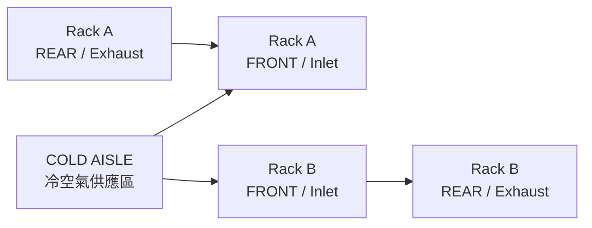
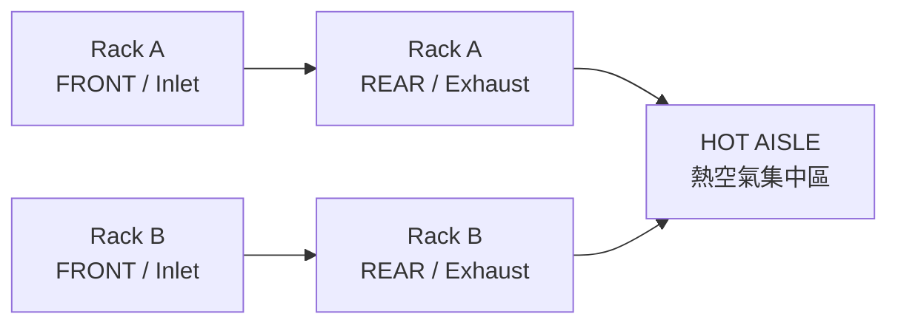
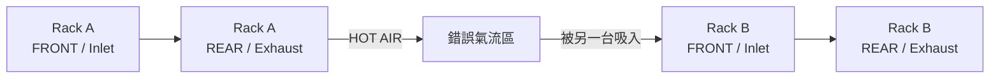
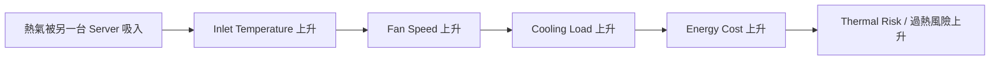
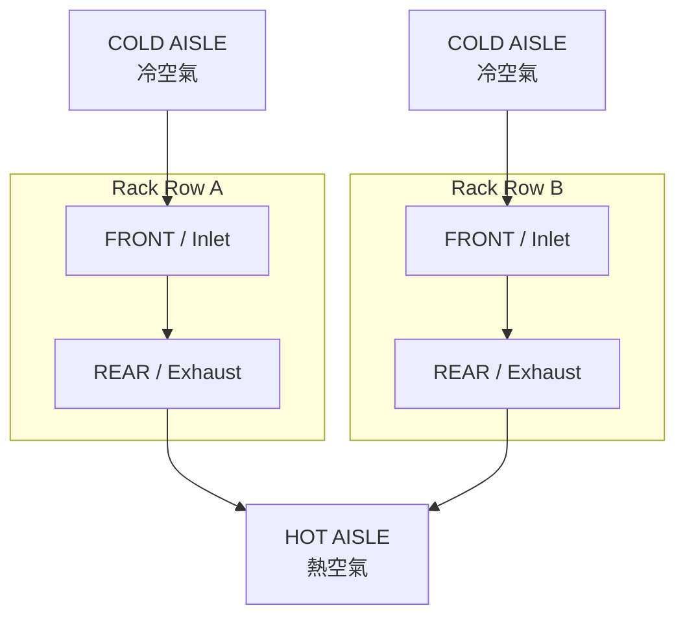

# CCSP D5 — Data Center Airflow Mermaid Notes

## 1. Server 基本 Airflow


### 記法

- **Front = Inlet = Cold**
- **Rear = Exhaust = Hot**

---

## 2. Front ↔ Front = Cold Aisle

兩排 Rack 的 **Front / Inlet 面對面**，中間形成 **Cold Aisle**。



### 俯視概念

```text
外側熱區   [ Rack A Rear | Rack A Front ]   COLD AISLE   [ Rack B Front | Rack B Rear ]   外側熱區
                排熱氣          吸冷氣                          吸冷氣          排熱氣
```

### Exam Rule

> **Front ↔ Front = Cold Aisle**

---

## 3. Rear ↔ Rear = Hot Aisle

兩排 Rack 的 **Rear / Exhaust 面對面**，中間形成 **Hot Aisle**。



### 俯視概念

```text
外側冷區   [ Rack A Front | Rack A Rear ]   HOT AISLE   [ Rack B Rear | Rack B Front ]   外側冷區
                吸冷氣          排熱氣                         排熱氣          吸冷氣
```

### Exam Rule

> **Rear ↔ Rear = Hot Aisle**

---

## 4. 錯誤配置：Exhaust → Inlet

最不希望看到的配置：



這會造成：

> **Hot-air Recirculation**

---

## 5. Hot-air Recirculation 後果



---

## 6. Cold Aisle / Hot Aisle 完整配置



---

## 7. 一秒記憶版

```text
F-F = Cold
R-R = Hot
Exhaust → Inlet = BAD
```

或：

> **Front = Cold / Rear = Hot**

---

# Flash Cards

## Card 1
**Q:** Front ↔ Front 是什麼？

**A:** **Cold Aisle**

---

## Card 2
**Q:** Rear ↔ Rear 是什麼？

**A:** **Hot Aisle**

---

## Card 3
**Q:** Server 一般 airflow 方向？

**A:** **Front / Inlet → Server → Rear / Exhaust**

---

## Card 4
**Q:** 為什麼 Exhaust → Inlet 是錯誤配置？

**A:** 會造成 **hot-air recirculation**，提高 inlet temperature、cooling load、energy cost 與 thermal risk。

---

## Card 5
**Q:** 最短考試口訣？

**A:**

> **F-F = Cold**  
> **R-R = Hot**  
> **Exhaust → Inlet = Bad**
