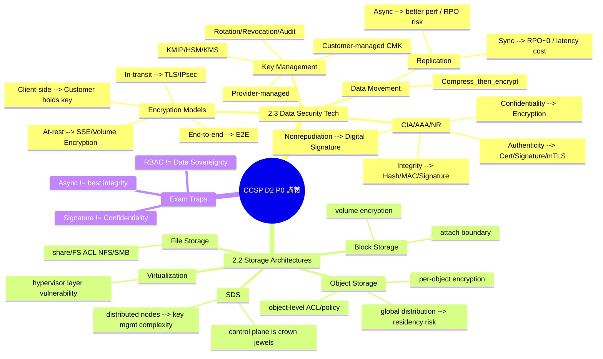
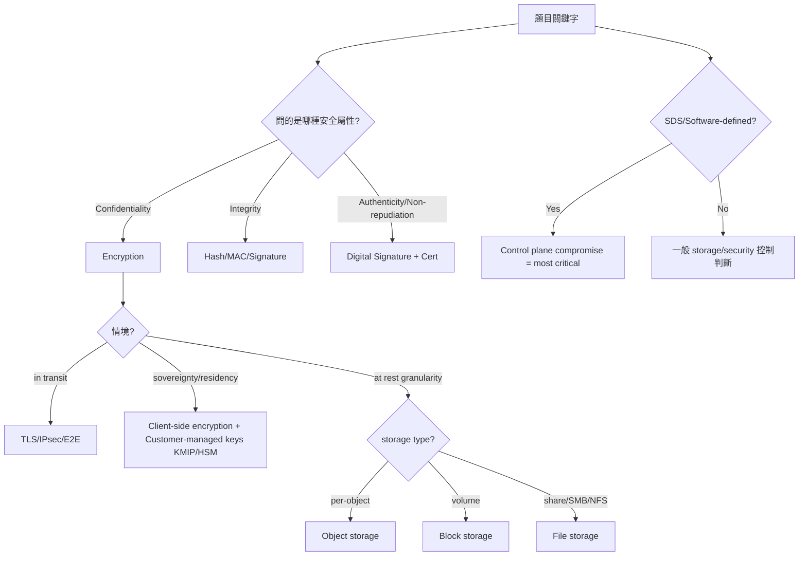

# CCSP Domain 2 快速速查表（第一輪）/ Quick Reference Round 1

> **重點範圍：** 2.3 Data Security Technologies + 2.2 Storage Architectures（P0 高優先補強）

本講義針對 Domain 2 高頻弱點，採一頁式重點、陷阱對照表、決策樹與考場速記形式。

**0) 常見誘答的兩條主軸**

1. **Crypto 功能邊界混淆**

**• Confidentiality vs Integrity vs Authenticity vs Non-repudiation**

2. **治理/存取控制 vs 密碼學控制混淆**

**• RBAC/ABAC（誰能做）≠ Encryption + Key ownership（就算拿到也看不懂）**

⸻

**1) P0-2.3：Data Security Tech & Strategy（Crypto / Key / Flow）**

**1.1 CIA + Authenticity / Non-repudiation：秒殺配對**

**需求** **對應控制** **常見錯選**

**Confidentiality（保密）** **Encryption（TLS、at-rest、E2E、client-side）** **Digital signature**

**Integrity（完整性）** **Hash / MAC / Digital signature** **Encryption**

**Authenticity（真偽）** **Digital signature / cert / mutual TLS** **Hash**

**Non-repudiation（不可否認）** **Digital signature + key mgmt + logs** **Encryption**

**考場口訣**

**• 「要保密」＝讓他看不懂 → encrypt**

**• 「要證明沒被改」＝能偵測變更 → hash/MAC/sign**

**• 「要證明行為者身份」＝綁身份 → signature/cert**

⸻

**1.2 Encryption 決策：E2E / Transport / At-rest / Client-side**

**典型題型 1：DR/跨站/跨雲傳輸保密**

**• 看關鍵字：“during transfer” / “in transit” / “site-to-site” / “DR replication”**

**• 優先答案：TLS / IPsec / End-to-end encryption**

**• 陷阱：digital signature（只保 integrity/NR）**

**典型題型 2：資料主權/Residency/多國合規**

**• 看關鍵字：“sovereignty / residency / multi-country / local control”**

**• 優先答案：Client-side encryption + customer-managed keys（KMIP/HSM/KMS）**

**• 陷阱：RBAC、access review（治理，但不保證 CSP 無法解密）**

**一句話版**

**要控制「誰能解密」→ 控制 Key（建議由組織自行持有）**

⸻

**1.3 Key Management：高頻錯誤與對應重點**

****Key 即權力。**考題涉及 sovereignty / compliance / distributed storage 時，核心在：「誰持有 key？key 如何輪替？如何吊銷？」**

**必背：**

**• Provider-managed keys：方便但控制力較弱**

**• Customer-managed keys（CMK）：組織掌握 key policy/rotation，控制更強**

**• Client-side encryption：CSP 僅見密文，主權最強（需承擔操作成本）**

**• KMIP：多系統 key 管理互通協定（題庫很愛拿來當關鍵字）**

⸻

**1.4 Compression vs Encryption：流程必考**

✅ **正確順序：Compress → Encrypt → Transmit/Store**

**原因：加密後資料接近 random，壓縮不了。**

⸻

**1.5 Replication：Sync vs Async（常考 trade-off）**

**類型** **優點** **缺點** **考場關鍵字**

**Synchronous** **強一致性、RPO≈0** **Latency / performance cost** **“strong consistency” “near-zero data loss”**

**Asynchronous** **效能好、距離彈性** **RPO risk（可能丟最後一段）** **“performance” “acceptable lag”**

⸻

**2) P0-2.2：Storage Architectures（Object/Block/File/SDS/Virtualization）**

**2.1 Object vs Block vs File：安全控制粒度（考點最常見）**

**Storage** **管理/存取粒度** **典型安全強項** **常見陷阱**

**Object** **object/bucket policy** **object-level ACL/policy、SSE、版本控管、WORM（視平台）** **說它「自動分類」**

**Block** **volume attach + OS FS** **volume encryption、snapshot controls** **說它有 object-level ACL**

**File** **share/FS permissions** **NFS/SMB ACL、檔案級權限** **忽略 share-level exposure**

**秒殺法**

**• 看到 “per object / granular options” → Object**

**• 看到 “volume” → Block**

**• 看到 “NFS/SMB/share” → File**

⸻

**2.2 SDS（Software-Defined Storage）：最致命攻擊面**

**Control plane compromise = catastrophe**

**因為控制面可以：建立 snapshot、複製、改 policy、掛載到別處 → 直接資料外洩/破壞。**

**考場關鍵字**

**• “SDS / separation of control & data plane” → control plane vulnerability**

**• “distributed nodes / encryption overhead” → key mgmt complexity**

⸻

**2.3 Storage Virtualization：最顯著 trade-off**

**抽象化/彈性↑ 但 hypervisor layer / isolation 成為單點爆炸半徑**

⸻

**2.4 Data Residency：global distribution 的最大痛點**

**• global replication / caching / edge distribution 會讓「資料落地位置」更難保證**

**• 合規題常見正解是：classification + residency rules + key control（必要時 client-side）**

⸻

**3) Mermaid：Domain 2（P0區）心智圖**

⸻

**4) Mermaid：10 秒決策樹（看到題目就走流程）**

⸻

**5) 考場速記（必記 6 條）**

1. **Confidentiality → Encryption（不是 signature）**

2. **Signature → Integrity/Authenticity/Non-repudiation**

3. **Sovereignty/residency → key ownership（最好 client-side）**

4. **Compress → Encrypt（順序必對）**

5. **Sync replication → RPO 強但 latency 代價**

6. **SDS / virtualization → control plane / hypervisor 是 crown jewels**

⸻

