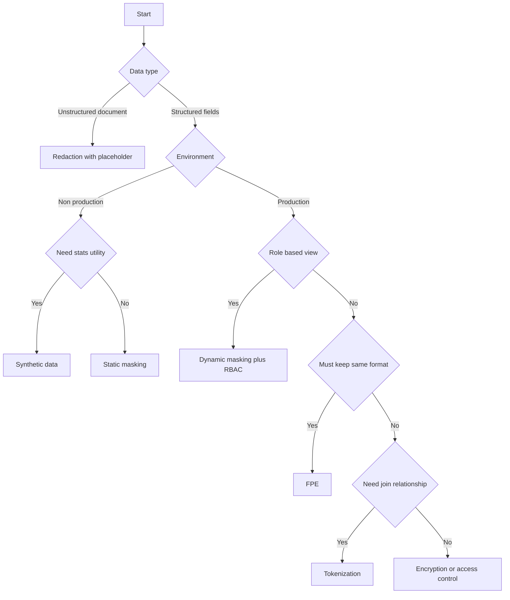
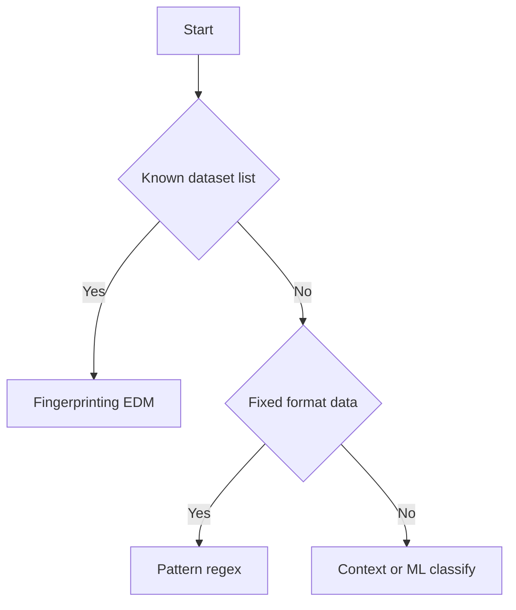
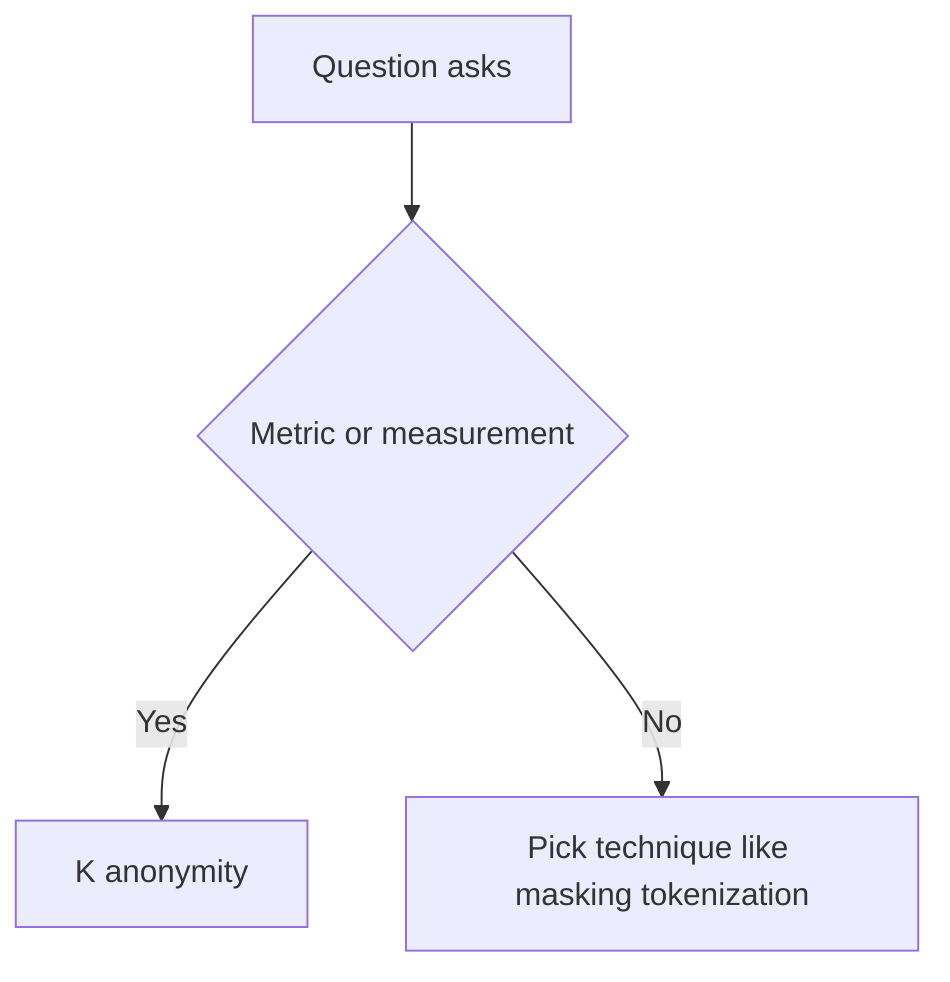

---

# CCSP Domain 2：雲端資料安全專題講義

## 1. 核心決策邏輯：該選擇哪種保護技術？

在 CCSP 考試中，區分加密 (Encryption)、遮罩 (Masking) 與代碼化 (Tokenization) 的應用場景是得分關鍵。

### 技術選擇決策樹 (Mermaid)

Code snippet

```
graph TD
    A[開始：資料保護需求] --> B{是結構化資料嗎?}
    B -- 否 (如法律文件) --> C[選擇性遮蓋 Selective Redaction]
    B -- 是 --> D{需要保留統計特性/測試用?}
    D -- 是 --> E[合成資料 Synthetic Data / 靜態遮罩 Static Masking]
    D -- 否 --> F{需要保留格式以利大規模資料分析?}
    F -- 是 --> G{資料庫結構可否變更?}
    G -- 能 --> H[代碼化 Tokenization]
    G -- 不能 --> I[格式保留加密 FPE/FFX]
    F -- 否 --> J[標準加密 AES/RSA]
```

---

## 2. 重點技術專題詳解

### A. 格式保留加密 (Format-Preserving Encryption, FPE)

- **技術定義**：加密後的密文與明文具有相同的格式與長度（例如：信用卡號加密後仍為 16 位數字）。
    
- **關鍵考點 (FFX 模式)**：這是 FPE 的標準模式。當題目提到「不希望更改現有應用程式/資料庫結構」且「需要維持分析功能」時，FFX 是最佳解。
    

### B. 代碼化 (Tokenization)

- **技術定義**：用非敏感的「代碼 (Token)」取代敏感數據，原始數據存存在安全的 Token Vault 中。
    
- **應用場景**：最適合雲端分析平台。它能隱藏數據值，但**保留數據間的關聯性 (Relationship)**。
    

### C. 遮罩技術 (Data Masking)

- **靜態遮罩 (Static)**：永久更改數據，主要用於**開發/測試環境 (Non-production)**。
    
- **動態遮罩 (Dynamic)**：在存取時即時遮蔽，通常結合 **RBAC (角色存取控制)**，最適合生產環境。
    
- **品質驗證**：必須使用「統計分佈測試」來確保遮罩後的數據仍具有分析價值。
    

---

## 3. 錯題深度解析 

以下是專業級的詳解與考點分析：

### 專題一：DLP 實施挑戰 (Section 2.5)

|**截圖編號**|**核心問題**|**詳解**|
|---|---|---|
|**IMG_0720**|醫藥研發環境挑戰|**解答**：平衡資料保護與研究員的**協作需求**。過嚴的 DLP 會阻礙資訊流動，導致創新停滯。|
|**IMG_0722**|混合雲架構關鍵|**解答**：實施**一致的資料分類**。若本地端與雲端的分類標準不同，DLP 策略將無法跨環境生效。|

### 專題二：隱私指標與量化 (Section 2.4)

|**截圖編號**|**核心問題**|**詳解**|
|---|---|---|
|**IMG_0723**|衡量隱私保護指標|**解答**：**K-anonymity**。它能確保數據集中每一筆紀錄至少與其他 $k-1$ 條紀錄無法區分，是去識別化的核心指標。|

### 專題三：資料混淆技術應用 (Section 2.3)

|**截圖編號**|**核心問題**|**詳解**|
|---|---|---|
|**IMG_0730**|分析平台最佳平衡|**解答**：**FFX 模式加密**。它能保持原始數據長度，對遺留系統友善且兼顧分析效能。|
|**IMG_0732**|測試數據品質挑戰|**解答**：**合成資料生成 (Synthetic Data)**。當遮罩可能破壞數據分佈時，合成資料能提供具備相同統計特性的偽數據。|
|**IMG_0733**|非結構化文件保護|**解答**：**選擇性遮蓋 (Selective Redaction)**。針對法律合約等文字，需遮蔽敏感詞彙並用佔位符替代以維持閱讀語境。|

---

## 4. 行動建議

建議採取以下步驟加強 Domain 2：

1. **複習 2.1 數據生命週期**：截圖中未出現這部分，但它是 Domain 2 的基礎（Create -> Store -> Use -> Share -> Archive -> Destroy）。
    
2. **熟記「場景關鍵字」**：
    
    - 看到「測試/非生產環境」 -> 聯想 **Static Masking**。
        
    - 看到「不更改資料庫結構/格式」 -> 聯想 **FPE/FFX**。
        
    - 看到「法律合約/非結構化」 -> 聯想 **Redaction**。
        
3. **實務連結**：利用軟體開發（Go, React）的經驗，想像這些技術如何在 Next.js 應用的後端 API 中實作。
    

---

- **Production 依角色顯示** → Dynamic masking + RBAC
    
- **Non-prod 測試資料** → Static masking（若要保留統計特性 → Synthetic data）
    
- **非結構化文件外部分享** → Redaction + placeholder
    
- **格式/長度不變（不改 schema）** → FPE
    
- **保留關聯做 join/分析** → Tokenization
    
- **DLP 偵測已知清單外流** → EDM/Fingerprinting
    
- **衡量去識別效果** → K-anonymity
---
# CCSP Domain 3 Cloud Data Security 講義
主題：DLP／Fingerprinting(EDM)／Masking／FPE／Tokenization／Synthetic Data／K-anonymity  

---

## 0) 10 秒選型：先問 3 個問題
1) **資料型態**：Structured（表格欄位）還是 Unstructured（文件/PDF）？  
2) **使用環境**：Production（真用戶）還是 Non-prod（Dev/Test）？  
3) **必須保留的功能**：  
   - 只要「看不懂」  
   - 還要 **角色看到不同**  
   - 還要 **可 Join/關聯分析**  
   - 還要 **格式不變**（例如 16 位數字不改）

---

## 1) DLP（Data Loss Prevention）
### 1.1 DLP 在考什麼
- 不是只考「工具名」：更常考 **偵測方式** + **部署點** + **業務平衡（保護 vs 協作）**
- 混合雲常見痛點：**分類與標籤不一致** → 規則難一致落地

### 1.2 偵測方式秒選
- **Pattern / Regex**：抓「格式固定」  
  例：信用卡格式、SSN
- **Fingerprinting / EDM（Exact Data Match）**：抓「我有一份已知名單，要找它有沒有外流」  
  例：病患名單 CSV、客戶名單
- **Context / ML**：較偏非結構化內容分類（題目若強調語意/上下文才會靠近這個）

**常見誘答**
- 題目問「已知名單外流」選了 Pattern  
- 題目問「固定格式」選了 EDM

---

## 2) Data Obfuscation / Protection（最常錯的那坨）
> 下面每個技術，只要記「最佳場景關鍵字」。

### 2.1 Dynamic Data Masking（動態遮罩）
- **何時最像最佳解**：Production + **依角色顯示不同**（RBAC）
- **關鍵字**：Production, role based, different view, do not change source
- **一句話**：原資料不變，顯示時遮

### 2.2 Static Masking（靜態遮罩）
- **何時最像最佳解**：Non-prod 測試資料（Dev/Test）  
- **關鍵字**：test environment, non production, permanent change copy
- **一句話**：做副本，副本被永久改

### 2.3 Redaction（選擇性遮蓋）
- **何時最像最佳解**：**非結構化文件**對外分享，只遮某些段落  
- **關鍵字**：PDF, contract, legal doc, unstructured, share externally, placeholder
- **一句話**：把文字片段塗黑或用占位符保留可讀性  
  例：`[REDACTED]`、黑條

### 2.4 Tokenization（代碼化）
- **何時最像最佳解**：要保護敏感值，但要保留 **關聯性 / 可 Join**（分析可用）  
- **關鍵字**：analytics, join, relationship, keep linkage, reduce compliance scope
- **一句話**：用 token 代替原值，分析還能對得起來  
- **考場陷阱**：題目若強調「格式一定要不變（16 位數字）」→ 先想到 FPE（除非題目明說 token 也是固定格式）

### 2.5 FPE（Format Preserving Encryption）
- **何時最像最佳解**：**格式/長度不能變**，不想改 DB schema 或驗證規則  
- **關鍵字**：same format, same length, 16 digits, cannot change schema
- **一句話**：加密後長度與字符集仍一樣

> 小補充（對剛問的 join）  
> 若題目需要 join，通常需要 **deterministic（同值同結果）**。FPE 在「同 key 與同設定」下可以做到用等值比對 join（題目若沒提，仍以格式關鍵字優先）。


### 2.6 Synthetic Data（合成資料）
- **何時最像最佳解**：測試/分析需要「像真的」且要保留 **統計分佈/可用性**  
- **關鍵字**：statistical distribution, utility, test quality
- **一句話**：生成新資料，不是直接遮原資料

---

## 3) K-anonymity（隱私度量）
- **考點**：它是「量化去識別化效果」的指標  
- **一句話**：每筆紀錄在準識別欄位上至少和 **k-1** 筆看起來一樣 → 不容易被連回個人  
- **常見題型**：題目問「衡量/指標」而不是「遮罩技術」

---

## 4) 10 秒決策樹（Mermaid，Flowchart 版，較不易報錯）

### 4.1 主要選型：Masking / Redaction / FPE / Token / Synthetic

## 4.2 DLP 偵測方式：Pattern vs EDM



## 4.3 K-anonymity 何時上場




#### 三句口訣」（

1. Production 依角色看不同 → **Dynamic masking + RBAC**
    
2. 非結構化文件對外分享遮段落 → **Redaction + placeholder**
    
3. 已知名單要抓外流 → DLP 用 **Fingerprinting / EDM**  
    
4. 格式不變（16 位）→ **FPE**
