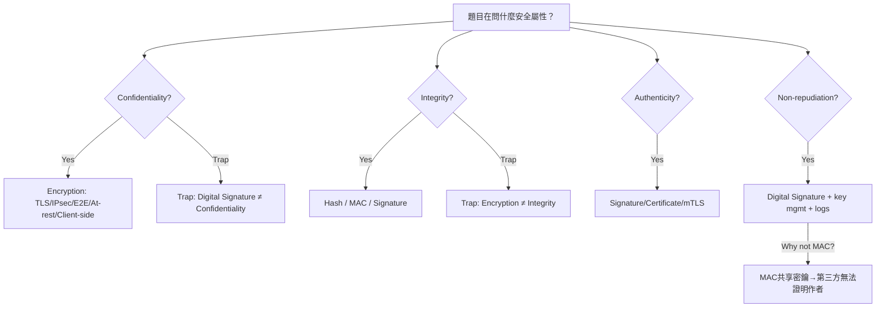
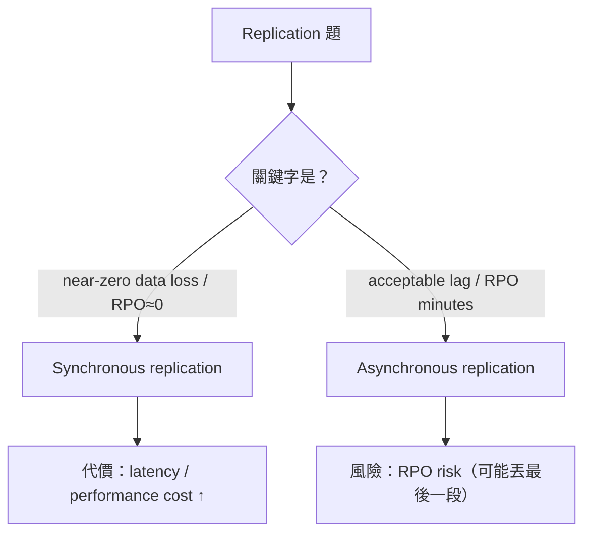
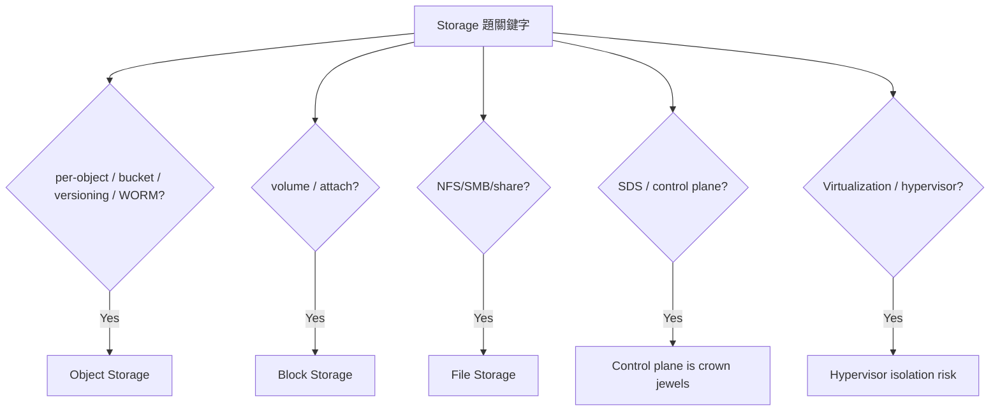

# 今日複習筆記（CCSP D2 + 模考錯題修正 + CISSP D2 補洞）  
  
> 核心目標：考場看到關鍵字，**10 秒選對控制**，避開常見誘答。  
  
---  
  
## 0) 今日抓到的「最常翻車點」  
1. **RBAC/ABAC ≠ 加密/Key ownership**  
   - RBAC：誰能做（access control）  
   - Encryption + Key ownership：誰能解密（confidentiality / sovereignty）  
  
2. **Signature / MAC / Hash 的邊界**  
   - Signature：可給第三方驗證（authenticity + integrity + non-repudiation）  
   - MAC：共享密鑰，第三方無法分辨作者 → **不夠 non-repudiation**  
   - Hash：無密鑰，僅檢測變更（容易被替換 hash 一起帶走，若無信任鏈）  
  
3. **Sync vs Async replication 被選反**  
   - **near-zero data loss / RPO≈0 → Sync**  
   - **acceptable lag / RPO minutes → Async**  
  
---  
  
## 1) CIA / Authenticity / Non-repudiation 秒殺配對（CCSP D2 2.3）  
| 需求 | 首選控制 | 常見錯選 |  
|---|---|---|  
| Confidentiality（保密） | Encryption（TLS、at-rest、E2E、client-side） | Digital signature |  
| Integrity（完整性） | Hash / MAC / Digital signature | Encryption |  
| Authenticity（真偽） | Digital signature / Cert / mTLS | Hash |  
| Non-repudiation（不可否認） | Digital signature + key mgmt + logs | Encryption / MAC |  
  
**口訣**  
- 要保密＝讓他看不懂 → **encrypt**  
- 要證明沒被改＝能偵測變更 → **hash/MAC/sign**  
- 要綁身份/不可否認 → **signature + cert**  
  
---  
  
## 2) Data 狀態（CISSP D2 補洞：rest / transit / use）  
- **Data at rest**：存在硬碟/儲存上  
- **Data in transit**：在網路上傳輸中  
- **Data in use**：在 **CPU/記憶體** 被運算/處理中  
  
### 考題常見對應  
- in transit → **TLS / IPsec / E2E**  
- at rest → **SSE / volume encryption / database encryption**  
- in use → 常見會看到 **RBAC**（控制誰能用）或 **homomorphic encryption**（在密文上運算的概念）  
  
> 今日修正重點：**TLS 不是 in use；Full disk encryption 不是 in transit。**  
  
---  
  
## 3) Encryption 決策（CCSP D2 2.3）  
### 3.1 典型題型：DR/跨站/跨雲「during transfer」  
**關鍵字**：during transfer / in transit / site-to-site / DR replication    
✅ 優先：**TLS / IPsec / E2E**    
❌ 陷阱：digital signature（不是保密）  
  
### 3.2 典型題型：Sovereignty / Residency / provider must not decrypt  
**關鍵字**：sovereignty / residency / customer holds the keys / provider must not decrypt    
✅ 優先：**Client-side encryption + customer-managed keys（KMIP/HSM/KMS）**    
❌ 陷阱：RBAC / access review（治理，不保證 CSP 無法解密）  
  
> 今日重要修正：**Client-side encryption 不會保證資料不離境**，它是「即使出去也看不懂」；    
> 真要管落地位置，通常是 **residency rules / region pinning / geo-fencing**（若選項有才選）。  
  
---  
  
## 4) Key Management（CCSP D2 2.3）  
**一句話：Key 即權力。**    
考到 sovereignty / compliance / distributed storage → 先問：  
- **誰持有 key？**  
- **如何 rotation / revocation？**  
- **如何 audit？**  
  
必背：  
- Provider-managed keys：方便，控制力較弱  
- Customer-managed keys（CMK）：組織掌握 policy/rotation  
- Client-side encryption：CSP 只見密文，主權最強（操作成本↑）  
- **KMIP**：多系統 key 管理互通協定（高頻關鍵字）  
  
---  
  
## 5) Compress vs Encrypt（必考流程）  
✅ 正確順序：**Compress → Encrypt → Transmit/Store**    
原因：加密後資料接近 random，**壓縮效果大幅下降/幾乎壓不動**  
  
---  
  
## 6) Replication：Sync vs Async（今日最大修正點）  
| 類型 | 優點 | 缺點 | 典型關鍵字 |  
|---|---|---|---|  
| **Synchronous** | 強一致性、**RPO≈0** | **Latency / performance cost** | strong consistency / near-zero data loss |  
| **Asynchronous** | 效能好、距離彈性 | **RPO risk（可能丟最後一段）** | performance / acceptable lag |  
  
**口訣（今天修正成功）**  
- near-zero data loss / RPO≈0 → **sync**  
- acceptable lag / RPO minutes → **async**  
  
---  
  
## 7) Storage Architectures（CCSP D2 2.2）  
### 7.1 Object vs Block vs File（顆粒度秒殺）  
| Storage | 管理/存取粒度 | 常見強項 | 常見陷阱 |  
|---|---|---|---|  
| Object | object/bucket policy | object-level ACL/policy、SSE、版本控管、WORM（視平台） | 說它「自動分類」 |  
| Block | volume attach + OS FS | volume encryption、snapshot controls | 說它有 object-level ACL |  
| File | share/FS permissions | NFS/SMB ACL、檔案級權限 | 忽略 share-level exposure |  
  
秒殺：  
- “per object / granular options” → **Object**  
- “volume” → **Block**  
- “NFS/SMB/share” → **File**  
  
### 7.2 SDS（Software-Defined Storage）  
**Control plane compromise = catastrophe**    
因為控制面可以：snapshot / copy / 改 policy / 掛載到別處 → 直接外洩/破壞  
  
關鍵字：  
- “SDS / separation of control & data plane” → 控制面是 crown jewels  
- “distributed nodes / encryption overhead” → key mgmt complexity  
  
### 7.3 Storage Virtualization  
抽象化/彈性↑，但 **hypervisor / isolation** 變單點爆炸半徑  
  
### 7.4 Data Residency（global distribution 痛點）  
global replication / caching / edge distribution → 更難保證落地位置    
常見組合解：  
- classification + residency rules + key control（必要時 client-side）  
  
---  
  
## 8) 今日額外補強（CISSP D2：Labeling/Marking、Classification/Categorization）  
### 8.1 Labeling vs Marking（已掌握）  
- **Labeling = machine-readable**（系統可讀，如 metadata 欄位 `classification=confidential`）  
- **Marking = human-readable**（人可讀，如頁首 “CONFIDENTIAL — Do not email outside company”）  
  
### 8.2 Classification vs Categorization（已修正）  
- **Classification**：建立/定義分類制度（例：Public/Internal/Confidential/Secret）  
- **Categorization**：把某資產套進某一類（例：把 HR 名單標成 Confidential）  
  
---  
  
## 9) Mermaid 圖表（可直接貼到支援 Mermaid 的筆記工具）  
  
### 9.1 Security 属性 → 控制（含陷阱）  

### 9.2 In transit / At rest / In use 快速對應
```mermaid 
mindmap
  root((Data State))
    At_rest
      "Volume/DB/SSE encryption"
      "Backup/Snapshot controls"
    In_transit
      "TLS"
      "IPsec"
      "End-to-end encryption"
    In_use
      "RBAC / least privilege (who can use)"
      "Homomorphic encryption (concept)"
```
### 9.3 Replication 決策（避免選反）

### 9.4 2.2 Storage 秒殺分流

---

## 10) 今日「6 條超速記」總結

1. Confidentiality → **Encryption**（不是 signature）
    
2. Signature → **Integrity + Authenticity + Non-repudiation**
    
3. Sovereignty/Residency → **Key ownership（最好 client-side）**
    
4. **Compress → Encrypt**（順序必對）
    
5. Sync replication → **RPO≈0** 但 **latency** 代價
    
6. SDS/Virtualization → **control plane / hypervisor** 是 crown jewels