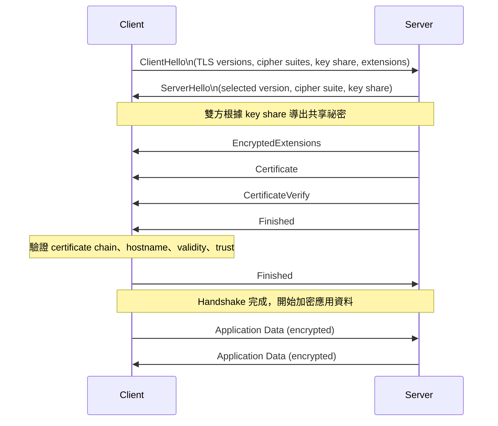

## 1. Threat Modeling：STRIDE / DREAD / PASTA 詳解

### 1.1 先記核心差別

- **STRIDE**：拿來**分威脅類型**
- **DREAD**：拿來**評估、排序風險**
- **PASTA**：拿來**走完整風險分析流程**

你這批錯題裡，最明顯就是把 **STRIDE 的分類** 和 **DREAD 的排序** 混掉；另外 TLS、XSS、MFA、DevSecOps 也是重點弱區。  
（你上傳的錯題分析也明確點出：**STRIDE = threat categories、DREAD = prioritization、Certificate validation = anti-MITM、XSS 主控制 = output encoding + input validation、Broken Authentication 主控制 = MFA、SQLi 根因常在 DevSecOps / SDLC**）

---

## 1.2 STRIDE 詳細解說

### STRIDE 是什麼

STRIDE 是微軟常見的 threat modeling 分類法。  
重點不是算分數，而是問：

**「系統可能遭遇哪些種類的威脅？」**

### 六大類

#### S — Spoofing

假冒別人身分。  
例子：

- 假冒使用者登入
- 假冒服務帳號
- 假冒 API client
- 偽造 session / token

你可以問自己：

- 攻擊者能不能冒充合法使用者或系統？

常見控制：

- MFA
- 強認證
- 憑證驗證
- 安全 session / token 管理

---

#### T — Tampering

資料被未授權修改。  
例子：

- 修改封包內容
- 改資料庫紀錄
- 改 API 請求參數
- 改 log

你可以問自己：

- 攻擊者能不能偷偷改資料？

常見控制：

- 完整性驗證
- 數位簽章
- MAC
- 權限控管
- 參數驗證

---

#### R — Repudiation

做了事卻否認。  
例子：

- 使用者刪了資料卻說不是他
- 管理員改設定卻無法追溯
- 金融交易沒有可驗證紀錄

你可以問自己：

- 事後能不能證明是誰做的？

常見控制：

- 不可否認性機制
- 完整 log
- 時間戳
- 稽核軌跡
- 簽章

---

#### I — Information Disclosure

機密資料外洩。  
例子：

- 個資外洩
- API 回傳過多資料
- 錯誤訊息洩漏系統資訊
- 傳輸未加密

你可以問自己：

- 不該看的人能不能看到資料？

常見控制：

- 存取控制
- 加密
- 遮罩
- 最小揭露
- 安全錯誤處理

---

#### D — Denial of Service

服務不可用。  
例子：

- 流量打爆
- 資源耗盡
- 惡意重試
- 鎖表、死循環、排程壅塞

你可以問自己：

- 攻擊者能不能讓服務變慢、掛掉、不可用？

常見控制：

- Rate limiting
- WAF / DDoS 防護
- 資源隔離
- 自動擴展
- 快取 / queue

---

#### E — Elevation of Privilege

權限提升。  
例子：

- 一般使用者變管理員
- 橫向移動拿到高權限
- 繞過授權檢查

你可以問自己：

- 攻擊者能不能拿到本來不該有的權限？

常見控制：

- Least privilege
- RBAC / ABAC
- 權限檢查
- 安全設計與測試

---

## 1.3 DREAD 詳細解說

### DREAD 是什麼

DREAD 用來做**風險評分**。  
不是問「這是哪一種威脅」，而是問：

**「哪個威脅比較值得先處理？」**

### 常見構面

- **D**amage potential：造成多大損害？
- **R**eproducibility：容易重現嗎？
- **E**xploitability：容易利用嗎？
- **A**ffected users：會影響多少人？
- **D**iscoverability：容易被發現與利用嗎？

### 例子

同樣是漏洞：

- 漏洞 A 可遠端利用、影響全部用戶、可穩定重現
- 漏洞 B 只能內網、影響少數人、利用條件高

那 A 通常優先。

### DREAD 的優點

- 方便排序
- 幫忙分配修補優先級
- 讓團隊可討論風險高低

### DREAD 的限制

- 主觀性高
- 不同評分者可能打分不同
- 現代很多團隊會改用更貼近業務的風險方法

所以你要記：

**STRIDE 問「是什麼威脅」**  
**DREAD 問「先修哪個」**

---

## 1.4 PASTA 詳細解說

### PASTA 是什麼

PASTA = **Process for Attack Simulation and Threat Analysis**

它不是單一分類表，也不是單一評分表。  
它是**以風險為核心的完整 threat modeling 方法**。

### 核心精神

從上往下看：

1. 先看業務目標
2. 再看技術範圍
3. 再看系統組成
4. 再看威脅
5. 再看弱點
6. 再看攻擊路徑 / 模擬
7. 最後做風險處理

### 常見 7 階段

1. 定義業務目標
2. 定義技術範圍
3. 應用程式分解
4. 威脅分析
5. 弱點與漏洞分析
6. 攻擊建模與模擬
7. 風險分析與管理

### 什麼時候用 PASTA

適合：

- 系統大
- 利害關係人多
- 要連到業務風險
- 要做較完整的 threat modeling

### 你要避免的誤解

PASTA **可能包含模擬與驗證**，  
但它**不是**「一個 DAST 工具」或「等於動態測試」。

---

## 1.5 三者比較表

|方法|核心用途|重點問題|適合場景|
|---|---|---|---|
|STRIDE|威脅分類|這是哪一類威脅？|快速找 threat types|
|DREAD|風險排序|哪個先修？|排優先級|
|PASTA|完整流程|業務到技術的整體風險是什麼？|複雜系統、正式 threat modeling|

---

## 1.6 考題陷阱

### 常見陷阱 1

題目問：  
**Which model categorizes threats?**  
你要先想到 **STRIDE**

### 常見陷阱 2

題目問：  
**Which model prioritizes threats?**  
你要先想到 **DREAD**

### 常見陷阱 3

題目問：  
**Which method is most comprehensive / risk-centric / business-driven?**  
你要先想到 **PASTA**

---

# 2. TLS 詳細解說（附 Mermaid）

---

## 2.1 TLS 在做什麼

TLS 的三大目標：

- **Authentication**：確認對方是誰
- **Confidentiality**：內容不被偷看
- **Integrity**：內容不被竄改

考題裡最容易錯的是：

**防 MITM 的核心不是「session key 產生」本身，  
而是「server certificate validation」**。

也就是：  
**先確認你連到的是對的伺服器，再建立安全通道。**

---

## 2.2 TLS 的核心元件

### 1. Certificate

伺服器拿來證明自己身分的憑證。

### 2. Public key / private key

- 公鑰可公開
- 私鑰只能由伺服器持有

### 3. Session key

真正用來加密大量資料的，通常是**對稱金鑰**

### 4. CA / Trust store

用來驗證憑證是否可信

---

## 2.3 為什麼不用非對稱加密一路加到底

因為非對稱加密比較慢。  
所以 TLS 會用：

- **非對稱機制**：做身分驗證、交換/協商祕密
- **對稱加密**：加密後續大量資料

也就是：  
**先驗身分，再協商金鑰，再用對稱金鑰保護傳輸。**

## 2.4 TLS 1.3 典型流程

## 2.5 每一步在做什麼

### Step 1: ClientHello

Client 告訴 server：

- 我支援哪些 TLS 版本
- 我支援哪些 cipher suites
- 我提供哪些 extensions
- 我這次的 key share 是什麼

重點：  
這一步是**提議能力與參數**，不是驗身分。

---

### Step 2: ServerHello

Server 回答：

- 我選哪個 TLS 版本
- 我選哪個 cipher suite
- 我用哪個 key share

重點：  
**ServerHello 是協商，不是身分驗證本體。**

---

### Step 3: 產生共享祕密

雙方根據 key exchange 資料導出共享祕密。  
之後再導出 handshake keys、application traffic keys。

重點：  
這讓雙方可建立後續加密通道。

但注意：  
**如果你還沒確認 server 是真的，單有共享祕密還是不夠防 MITM。**

---

### Step 4: Server 傳 Certificate

Server 給 client 看憑證。  
內容通常包含：

- 網域名稱資訊
- 公鑰
- 簽發者資訊
- 有效期限
- 簽章

---

### Step 5: Client 驗證 Certificate

這一步非常重要。

Client 會看：

- 憑證是不是可信 CA 簽的
- 憑證鏈是否完整
- 憑證有沒有過期
- 網域名稱是否相符
- 是否被撤銷（視情況）
- 簽章是否正確

### 這一步的意義

這一步在回答：

**「我現在連到的，真的是我要連的 server 嗎？」**

所以你錯題裡關於 TLS 的幾題，核心都在這一句：  
**Certificate validation 才是 anti-MITM 的關鍵。**

---

### Step 6: CertificateVerify

Server 用私鑰對某些握手資料做簽章。  
這是在證明：

**「我真的持有跟這張 certificate 對應的 private key。」**

---

### Step 7: Finished

雙方各自傳 Finished。  
代表：

- 握手資料一致
- 金鑰已建立
- 可以開始安全傳輸

---

## 2.6 TLS 1.2 和 1.3 的考點差別

你考試不一定要背到封包級，但要知道：

### TLS 1.2

- 常看到更傳統的 key exchange 流程
- 常會看到 `ChangeCipherSpec`
- 考題很愛問 `ServerHello`、certificate、key exchange

### TLS 1.3

- 流程更精簡
- 更強調前向保密
- 很多舊演算法被淘汰

### 不管哪一版，考試最穩的觀念都是：

- **ServerHello ≠ 真正驗證身分**
- **Certificate validation = 驗 server 身分**
- **Session key = 保護後續資料**
- **anti-MITM 的核心先在 authentication**

---

## 2.7 Kerckhoffs’s Principle

這也是 TLS / crypto 很愛混在一起考的記憶點。

### 原則

**系統即使公開，仍應安全；安全性應建立在 key 的保密上。**

不應依賴：

- 演算法藏起來
- 協定藏起來
- 實作細節沒人知道

應依賴：

- 金鑰保護
- 正確設計
- 正確實作

一句話記：  
**不要靠「沒人知道」來安全，要靠 key。**

---

## 2.8 Key Management 基本觀念

你錯題裡還有一個點是：

**金鑰在 cloud provider 基礎設施內生成、儲存、輪替**  
這種描述，重點在於：

- 金鑰生命週期由 provider 內部管理
- 不是外部 escrow
- 不是第三方代管

考試通常會看你能不能抓關鍵字：

- where the keys live
- who controls lifecycle
- who can access them
- provider-managed / customer-managed / external

---

# 3. XSS / MFA / OWASP 主控制 詳解

---

## 3.1 先抓這包的核心

你這包最需要補的是：

**primary control（主控制）**  
vs  
**defense-in-depth（加強防護）**

也就是：

- 題目問「最有效」「最直接」「主要」  
    你要先找第一線控制
- 題目問「額外強化」  
    才去想第二層控制

你這批題的分析也明確指出：  
你常把 **CSP 當 XSS 主控制**、把 **session management 當 Broken Authentication 最直接答案**、把 **單點輸入檢查當 SQLi 根因解法**；但題目更常要你回答 **output encoding + input validation、MFA、DevSecOps / SDLC integration**。

---

## 3.2 XSS 詳細解說

### XSS 是什麼

Cross-Site Scripting。  
攻擊者把惡意 script 注入到頁面，讓受害者瀏覽器執行。

### 常見種類

- Stored XSS
- Reflected XSS
- DOM-based XSS

---

### 為什麼會發生

本質上是：

**不可信輸入，進入了可執行的瀏覽器上下文。**

例如：

- 放進 HTML 內容
- 放進 attribute
- 放進 JavaScript 字串
- 放進 URL
- 放進 CSS

---

### XSS 的主控制為什麼是 output encoding + input validation

#### 1. Output encoding

最核心。  
因為 XSS 最後發生在「輸出到瀏覽器」那一刻。

你把資料輸出到不同位置時，要做對應編碼：

- HTML context
- HTML attribute context
- JavaScript context
- URL context
- CSS context

這叫 **context-aware output encoding**

#### 2. Input validation

也重要。  
它能減少惡意輸入進入系統。

但單靠 input validation 不夠，因為：

- 很難擋住所有 payload
- 合法輸入也可能在特定 context 變危險
- 不同輸出位置風險不同

### 所以最完整的考試答案常是：

**output encoding + input validation**

---

### CSP 為什麼不是第一線主答案

CSP（Content Security Policy）很好。  
它可以：

- 限制可載入腳本來源
- 降低 inline script 風險
- 幫你縮小 XSS 成功後的影響

但它通常是：

**defense-in-depth，不是主控制。**

因為：

- 不是所有環境都配置得好
- 容易誤設
- 不能取代安全輸出處理
- 有些 XSS 型態仍可能繞過或部分成功

### 考試思路

如果題目問：

- most effective
- primary mitigation
- core control

先想：  
**output encoding + input validation**

如果問：

- additional safeguard
- layered defense
- defense-in-depth

再想：  
**CSP**

---

## 3.3 Broken Authentication / MFA 詳解

### Broken Authentication 是什麼

使用者身分驗證流程有弱點，導致帳號被冒用、接管、濫用。

現在新版 OWASP 常叫：  
**Identification and Authentication Failures**

### 常見問題

- 弱密碼
- 密碼重用
- 暴力破解
- session 管理不佳
- credential stuffing
- 缺少 MFA

---

### 為什麼 MFA 是最直接主控制

因為就算密碼被偷：

- 攻擊者仍缺第二因素
- 單一憑證失守不等於直接入侵

所以題目問：  
**most effective / most direct mitigation**  
常常就是：  
**MFA**

---

### 那 session management 重不重要嗎

很重要。  
但它更像：

- 補強整體登入安全
- 保護 session 生命週期
- 防止 session hijacking

它不是在所有題目裡都比 MFA 更「直接」。

### 考試判斷法

- 題目問 **Broken Authentication 最有效** → 先想 **MFA**
- 題目問 **session hijacking / cookie / timeout / fixation** → 再想 **session management**

---

## 3.4 SQL Injection 為什麼一直存在

### SQLi 是什麼

把不可信輸入拼進 SQL 查詢，導致查詢語意被改掉。

### 直接技術控制

- Parameterized queries / prepared statements
- ORM 正確使用
- Input validation
- Least privilege
- 安全錯誤處理

---

### 但為什麼考題常不選「只做輸入檢查」

因為很多題目不是問：

**「眼前這一個點怎麼擋？」**

而是在問：

**「為什麼這類問題一直重複發生？最有效的根因解法是什麼？」**

那答案就會往：

- SDLC
- Secure coding standard
- Code review
- SAST / DAST / SCA
- Security gates
- 開發前移（shift left）
- DevSecOps

### 所以這題的層次要分清楚

- **技術層立即修補**：parameterized queries
- **組織層根因治理**：DevSecOps / Secure SDLC

---

## 3.5 你要建立的答題習慣

遇到安全控制題，先問自己：

### 第 1 步：題目在問哪一層？

- 威脅分類？
- 風險排序？
- 單點技術控制？
- 架構層治理？
- 流程層根因？

### 第 2 步：題目在問 primary 還是 secondary？

- primary / most effective / most direct
- 還是 defense-in-depth / additional / supporting

### 第 3 步：題目在問眼前症狀，還是根因？

- 單點漏洞修補
- 還是 SDLC / governance / architecture 問題

這三步一做，你的命中率會高很多。

---

# 4. 超濃縮考前版

## Threat Modeling

- **STRIDE** = 分類威脅
- **DREAD** = 排序風險
- **PASTA** = 完整風險導向流程

## TLS

- **ServerHello** = 協商
- **Certificate validation** = 驗 server 身分
- **anti-MITM 核心** = 先確認對方身分
- **Session key** = 保護後續資料
- **Kerckhoffs** = 安全靠 key，不靠藏系統

## OWASP / AppSec

- **XSS 主控制** = output encoding + input validation
- **CSP** = defense-in-depth
- **Broken Authentication 最直接主控制** = MFA
- **SQLi 根因治理** = Secure SDLC / DevSecOps
- **SQLi 直接技術控制** = parameterized queries