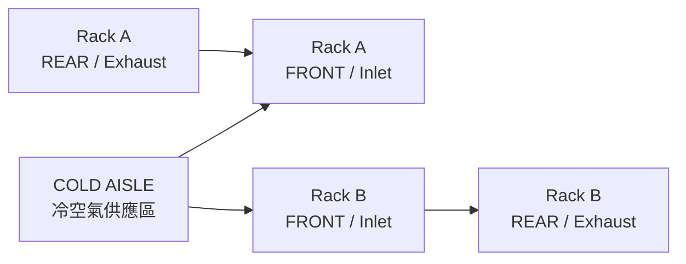
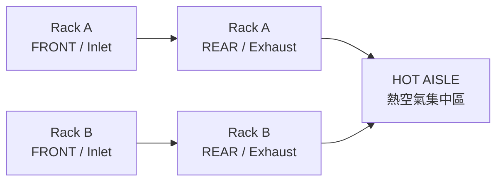
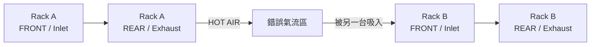
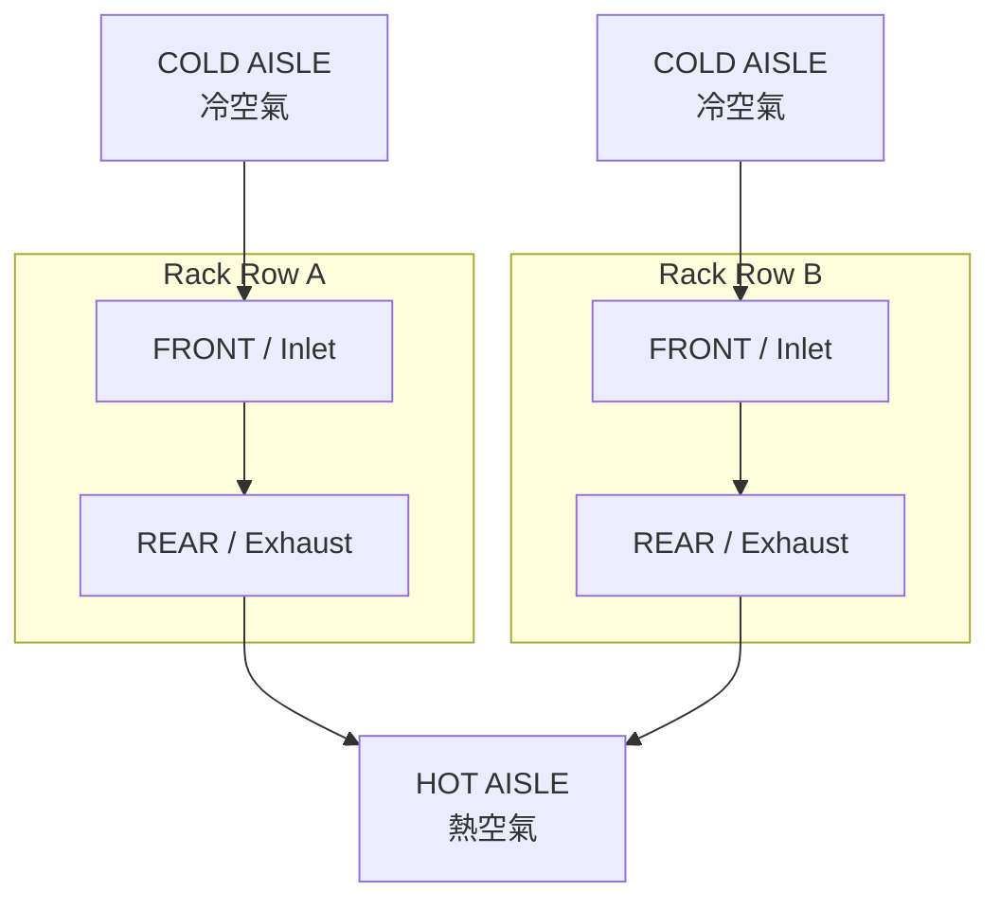

# CCSP Domain 3 補充：資料中心氣流圖解 / Data Center Airflow Diagrams

> **類型：** 圖解補充（Mermaid），供 [D3 §1.1 機房設施與環境控制](01-consolidated-lecture.md) 延伸閱讀
> **原始來源：** `CCSP_D5_Data_Center_Airflow_Mermaid.md`（2026-10-02，原標示 D5；主題為機房設施設計，歸入 D3）
> **文字版規則：** 已併入 `01-consolidated-lecture.md` §1.1；本檔補的是視覺化與後果鏈
> **閃卡：** 本檔的 5 張卡經與既有卡去重後，Card 3 與熱風回流後果鏈併入 `flash card/knowt-d3-infrastructure.tsv`

---

## 1. Server 基本 Airflow


### 記法

- **Front = Inlet = Cold**
- **Rear = Exhaust = Hot**

---

## 2. Front ↔ Front = Cold Aisle

兩排 Rack 的 **Front / Inlet 面對面**，中間形成 **Cold Aisle**。



### 俯視概念

```text
外側熱區   [ Rack A Rear | Rack A Front ]   COLD AISLE   [ Rack B Front | Rack B Rear ]   外側熱區
                排熱氣          吸冷氣                          吸冷氣          排熱氣
```

### Exam Rule

> **Front ↔ Front = Cold Aisle**

---

## 3. Rear ↔ Rear = Hot Aisle

兩排 Rack 的 **Rear / Exhaust 面對面**，中間形成 **Hot Aisle**。



### 俯視概念

```text
外側冷區   [ Rack A Front | Rack A Rear ]   HOT AISLE   [ Rack B Rear | Rack B Front ]   外側冷區
                吸冷氣          排熱氣                         排熱氣          吸冷氣
```

### Exam Rule

> **Rear ↔ Rear = Hot Aisle**

---

## 4. 錯誤配置：Exhaust → Inlet

最不希望看到的配置：



這會造成：

> **Hot-air Recirculation**

---

## 5. Hot-air Recirculation 後果鏈


```text
熱氣被吸入 → inlet temp ↑ → fan speed ↑ → cooling load ↑ → energy cost ↑ → thermal risk ↑
```

考試常見的錯誤選項是只答「溫度升高」。完整後果鏈同時涉及**能耗成本**與**過熱風險**，這也是「氣流管理屬於 availability 與成本議題」的理由。

---

## 6. Cold Aisle / Hot Aisle 完整配置



冷風來源與完整路徑（CRAC/CRAH → underfloor plenum → perforated tile → cold aisle → server inlet）見 [§1.1 冷風路徑](01-consolidated-lecture.md)。

---

## 7. 一秒記憶版

```text
F-F = Cold
R-R = Hot
Exhaust → Inlet = BAD
```

或：

> **Front = Cold / Rear = Hot**

---

## 本檔閃卡與既有卡的對應

| 原卡 | 內容 | 處理 |
|---|---|---|
| Card 1 | Front ↔ Front = Cold Aisle | 已由 `knowt-d3` 既有卡「Cold aisle 與 hot aisle 的機櫃擺法規則」覆蓋 |
| Card 2 | Rear ↔ Rear = Hot Aisle | 同上 |
| Card 3 | Server 一般 airflow 方向 | **新增**至 `knowt-d3` |
| Card 4 | 為什麼 Exhaust → Inlet 是錯誤配置 | 既有卡已覆蓋；**後果鏈另立新卡** |
| Card 5 | 最短考試口訣（F-F／R-R／Exhaust→Inlet） | 已由既有卡覆蓋 |
