# CCSP D1 / D2 / D4｜Closed-book 防守成果講義

這次的目的不是重新學 D1/D2/D4，而是確認已經學過的內容有沒有退化。補上你漏答的 D2 題後，我會把整體防守成果評為：

| Domain | 防守狀態 | 判讀 |
|---|---|---|
| **D1** | 約 80–85% | 穩定，2 個概念邊界需修 |
| **D2** | 約 75–80% | 基礎穩定，3 個邊界需修 |
| **D4** | 約 80% | 穩定，IAST/RASP 是唯一明顯遺忘 |
| **整體** | 約 **12/15** | **不需要重讀三個 Domain** |

所以這次 maintenance cycle 是成功的。

真正需要留下來的不是 15 題答案，而是以下 **8 個修復點**。

---

# D1｜Cloud Concepts

## 1. Private Cloud：`Private` 不等於「只對內」

你答：

> Private Cloud 可以 Internet-facing ✅  
> Private = management/config channel 只對內 ❌

問題就在第二句。

### 正確定義

> **Private Cloud = 供單一組織專用的雲端環境。**

它描述：

> **誰能使用這套雲端環境**

不是描述：

> 有沒有 Internet connectivity。

所以完全可以：

```text
Private Cloud
│
├─ Internet-facing Web ✅
├─ Public API ✅
├─ Remote VPN access ✅
│
└─ Management Plane
    └─ 嚴格限制存取 ✅
```

### 必背

> **Private = 單一組織專用**
>
> **Internet-facing = 網路暴露方式**

是兩個不同維度。

---

# 2. PaaS Sandbox vs IaaS Sandbox

這組你答得很穩。

### PaaS Sandbox

關鍵：

> Application / Code / Runtime

例如：

```text
Developer
↓
測試 application code
↓
不需要控制 OS
```

→ **PaaS**

### IaaS Sandbox

關鍵：

> VM / OS / Network / Infrastructure

例如 malware laboratory：

```text
Custom VM
Custom OS
Virtual Network
Packet capture
```

→ **IaaS**

### 防守口訣

> **App → PaaS**
>
> **OS / VM / Network → IaaS**

這題暫時不用補。

---

# 3. Virtualization vs Multitenancy

你的概念其實是對的，但 closed-book 時漏了完整的多租戶定義。

### 虛擬化

> 將實體 CPU、RAM、儲存、網路等資源抽象化為虛擬資源。

### 多租戶

> **多個邏輯隔離的租戶，共享同一服務、平台或基礎設施。**

兩者：

> **不是同義詞。**

例如你提到的單一公司 VMware：

```text
Physical Hosts
    ↓
Virtualization
    ↓
VMs / Containers
    ↓
全部只屬於同一組織
```

有虛擬化：

> ✅

但不一定有多租戶：

> ✅

### 必背

> **Virtualization = 資源抽象化**
>
> **Multitenancy = 多租戶共享且隔離**

---

# 4. Cloud Auditor 要修正成「獨立評估者」

你理解的：

> 第三方監督

方向正確。

但不要固定成：

> 政府監管機關。

### 雲端稽核者

核心：

> **獨立評估雲端服務、控制措施、安全性與合規性的角色。**

所以：

```text
Regulator ≠ Auditor 必然相同
```

監管機關可能要求 audit，但：

> **監管 ≠ 稽核本身。**

### D1 留下兩個修復點

```text
Private Cloud
= 單一組織專用

Cloud Auditor
= 獨立評估者
```

其他 D1 可以繼續 maintenance 即可。

---

# D2｜Cloud Data Security

## 5. TPI / SoD / Split Knowledge

你的理解大致存在，但 TPI 和 Split Knowledge 當時使用「防叛變／避免極權」作記憶法。

這可以當 mnemonic，不能當正式定義。

### 雙人完整性（TPI）

> **敏感操作必須由兩名授權人員共同參與或核准。**

記：

> **兩個人一起做**

---

### 職責分離（SoD）

> **把衝突或高風險的職權拆給不同角色。**

例如：

```text
Developer
≠
Production DB Administrator
```

記：

> **分權**

---

### 分割知識（Split Knowledge）

> **完整秘密被拆分，使單一人員無法知道或重建全部秘密。**

例如：

```text
5 shares
↓
需要 3 shares
↓
重建 master secret
```

記：

> **分秘密**

### 最短版

> **TPI = 兩人一起**
>
> **SoD = 分權**
>
> **Split Knowledge = 分秘密**

---

# 6. Block / File / Object Storage

這題防守成功。

### 區塊／磁碟型儲存

> 像一顆 disk。

例如：

> VM 的 `/dev/sda`

### 檔案型儲存

> 真正 filesystem hierarchy。

例如：

- NFS
- SMB
- NAS

### 物件型儲存

> Object + Key + Metadata

例如：

- S3
- MinIO

你也正確抓到：

> Object Storage 可以呈現類似 folder 的路徑，但不等於傳統 filesystem directory hierarchy。

因此：

> **共享 + 真正 directory hierarchy → File Storage**

這題可以降回 maintenance。

---

# 7. Transparent Encryption / TDE 是這次的重要修正

你原本：

> 加密引擎和 DB 在同一個 host。

這不是 TDE 的核心。

## 透明資料加密（TDE）

核心：

> **由資料庫／儲存層自動加密靜態資料，對 Application 透明。**

架構：

```text
Application
    ↓
正常 SQL / Data
    ↓
Database Engine
    ↓
TDE
    ↓
Encrypted Data Files
```

Application：

> 不需要自己呼叫 `encrypt()`。

而 key：

> 可以在外部 KMS / HSM。

所以「同一 host」不是判斷條件。

---

## 四層加密重新固定

| 題目 | 優先答案 |
|---|---|
| 特定 File | File-level |
| DB/storage 層自動加密 | **TDE** |
| 特定 table / column / field | **Application-level** |
| S3/MinIO object | Object-level |

### 今天最重要

> **TDE = 對 Application 透明**
>
> **特定欄位 = Application-level**

---

# 8. Data Masking：防守完全成功

你 8 個全部判對：

### 屬於 Masking

- Substitution
- Shuffling
- Nulling / Deletion
- Character Scrambling
- Number Variance
- Masking-out
- Algorithmic Transformation

### 不屬於

> **Conflation**

這一題可以從 repair list 移除。

---

# 9. Content / Metadata / Context / Inheritance

這是目前 D2 **最值得持續防守**的概念。

你把：

> Context Analysis

說成：

> 資料本身內容分析

這其實是：

> **Content Analysis**

---

## Content Analysis｜內容分析

問：

> **資料裡面是什麼？**

例如：

- keywords
- regex
- PAN
- SSN
- frequency
- entity detection

```text
讀取 payload
↓
看到 500 個 PAN
```

→ Content

---

## Metadata Analysis｜中繼資料分析

問：

> **有哪些描述這份資料的資訊？**

例如：

```text
owner
filename
created_time
last_modified_by
MIME type
classification tag
```

---

## Context Analysis｜情境／脈絡分析

問：

> **資料在哪裡、誰使用它、處於什麼環境？**

例如：

```text
/Finance/PCI/
ACL = Payment-Team
Tenant = Finance
Device = Managed
Location = Taiwan
```

→ Context

不是讀 payload。

---

## Inheritance｜繼承

問：

> **是否從 parent/container 繼承屬性？**

例如：

```text
Parent Folder
classification = Confidential

        ↓

Child File
classification = Confidential
```

沒有讀 child payload，也可能完成分類。

---

# 10. `PCI=true` 題：Representation ≠ Source

這是今天最值得固定的一個細節。

Scenario：

```text
Scanner
↓
讀取文件 payload
↓
找到大量信用卡號
↓
設定 PCI=true
```

最後：

```text
PCI=true
```

是：

> **Metadata**

但 classification 判斷的來源是：

> **Content Analysis**

所以：

> **結果存成 metadata，不代表判斷方法是 metadata analysis。**

最短記：

> **標籤是 Metadata；來源可能是 Content。**

---

# D4｜Cloud Application Security

## 11. SAST / SCA / DAST

你的主模型已經正確。

### SAST

> **靜態應用程式安全測試**

看自己的：

- source code
- bytecode
- binary

不需要執行程式。

---

### SCA

> **軟體組成分析**

核心：

> 分析第三方套件、函式庫與 dependencies。

例如：

```text
package.json
requirements.txt
pom.xml
SBOM
```

找：

- vulnerable packages
- known CVEs
- dependency risks

---

### DAST

> **動態應用程式安全測試**

對：

> 正在運行的 application

從外部發送測試請求。

---

# 12. SCA 不等於所有 IaC / Kubernetes 掃描

這是你的 D4 小修正。

你把：

> IaC / Kubernetes / SDN configuration

也全部放進 SCA。

不夠精確。

例如：

```text
Terraform:
public S3 bucket = true
```

這通常是：

> **IaC / Configuration Security Scanning**

不是典型 SCA。

### 最短區分

```text
第三方 library/dependency
→ SCA

Terraform/Kubernetes 設定錯誤
→ Configuration / IaC scanning
```

---

# 13. Security 進 SDLC：防守成功

你答：

> 最早從 Plan/Design 開始，之後每個階段都持續做。

正確。

最重要原則：

> **安全左移**

不是：

> 到 Testing 才做 Security。

例如：

```text
Requirements
→ Security requirements

Design
→ Threat modeling

Development
→ SAST / SCA

Testing
→ DAST / IAST

Deployment
→ Secure configuration

Operations
→ Monitoring / Patch
```

Threat Modeling：

> **Requirements / Design**

你答對。

---

# 14. IAST vs RASP：本次真正遺忘點

你直接標 `?`，這種處理是對的。

## IAST

> **互動式應用程式安全測試**

Application 在執行：

```text
Running Application
+
Instrumentation
+
Security Test
```

目的：

> **找漏洞**

所以：

> **IAST = Testing**

---

## RASP

> **執行階段應用程式自我保護**

Application 在執行時：

> 偵測甚至阻擋攻擊。

目的：

> **Protection**

---

### 最短口訣

> **IAST = 測**
>
> **RASP = 擋**

這就是下一次 D4 必考 repair point。

---

# 15. CI/CD 防守成果

你大致正確：

```text
Development
→ SAST

Development / Build
→ SCA

Build
→ Artifact / Image Scan

Test / Staging
→ DAST

Secrets
→ 不進 Source Repository
```

其中只修：

> DAST 最典型位置是 **Test / Staging**，不是 Implementation 本身。

---

# 最終防守清單

## 已經可以降回 Maintenance

### D1
- PaaS vs IaaS Sandbox
- Virtualization 基本概念
- IaaS/PaaS/SaaS responsibility
- Carrier/Broker 等 cloud actors 大方向

### D2
- Block / File / Object
- Data Masking
- 特定 table/column → Application-level encryption
- SoD / Split Knowledge 大方向

### D4
- SAST / DAST
- Security 左移
- Threat Modeling
- CI/CD 基本 placement

---

# 仍需要 Repair Recall

## P0

### D2
1. **Content vs Context**
2. **分類結果是 metadata ≠ 判斷來源是 metadata**

### D4
3. **IAST vs RASP**

## P1

### D1
4. **Private = 單一組織專用，不是 internal-only**
5. **Cloud Auditor = 獨立評估者，不等於監管機關**

### D2
6. **TDE = DB/storage layer，對 Application 透明**
7. **TPI = 兩人共同參與，而不只是「防叛變」**

### D4
8. **SCA ≠ IaC configuration scanning**

---

# 一張最終速查表

| 關鍵詞 | 秒答 |
|---|---|
| Private Cloud | 單一組織專用 |
| Cloud Auditor | 獨立評估者 |
| TPI | 兩名授權人共同參與 |
| TDE | DB/storage 加密，對 App 透明 |
| Content | 看 payload |
| Metadata | 描述資料的資料 |
| Context | 看環境/位置/使用者/關係 |
| Inheritance | 父層屬性傳給子層 |
| SCA | 第三方 dependencies |
| IaC Scanner | 設定錯誤 |
| IAST | 執行時測試 |
| RASP | 執行時保護 |

這 12 條就是這輪防守真正值得留下的內容。

點一下卡片查看答案。知道就標 **✓**，不知道就標 **×**，我會追蹤你的進度。


你可以在任何聊天中叫我複習這些閃卡、修改牌組，或設定每日複習。
___

IAST (Interactive Application Security Testing) and RASP (Runtime Application Self-Protection) both insert an agent inside an application's runtime (like the JVM, .NET CLR, or Node.js), but they are used for completely different purposes in the software lifecycle.
• IAST is a testing and vulnerability-finding tool used during development, QA, or staging.
• RASP is a live defense and protection tool used in production to block attacks in real time.
___

Key Differences

Feature / Aspect	IAST (Interactive Application Security Testing)	RASP (Runtime Application Self-Protection)
Primary Goal	Find and report security bugs	Block active attacks and exploitation
When It Runs	Testing, QA, staging, or CI/CD pipelines	Live production environments
Core Mechanism	Tracks data flow during functional tests to map vulnerabilities down to the code line	Inspects incoming requests/APIs at runtime and terminates or blocks malicious actions
Action Taken	Alerts developers / outputs vulnerability reports	Automatically blocks requests or virtually patches threats
Role in SDLC	Shifts security testing left	Acts as a runtime safety net/compensating control

How IAST Works

• Gray-box analysis: It blends static and dynamic testing by sitting inside the app while functional or automated tests run.
• Deep context: Because it watches data move from input to output inside the runtime, it pinpoints the exact line of code causing a flaw with very few false positives.
• Developer focus: It helps engineering teams fix vulnerabilities before code ever reaches production.

How RASP Works

• In-app firewall: It embeds directly into the application server or runtime to inspect execution context (such as HTTP requests, SQL queries, or system calls).
• Real-time mitigation: When it detects a sign of an attack (like an SQL injection or unauthorized command execution), it can block the specific request or shut down the session immediately.
• Not a replacement for patching: RASP protects against live exploits, but it does not fix the underlying vulnerable code; developers still need to patch flaws
＿＿＿

# CCSP D3 Targeted Remediation 講義
## BC/DR 時間指標 + 法務／資安／資料保護／合規角色

> 適用：CCSP Domain 3 targeted remediation  
> 目的：修復目前已確認的兩個弱點：
>
> 1. BC/DR 時間軸：RTO / RPO / WRT / MTD / MAO
> 2. 法務／資安／資料保護／合規角色：General Counsel / CLO / CISO / DPO / Compliance

---

# 目錄

1. [BC/DR 基本概念](#1-bcdr-基本概念)
2. [RPO：復原點目標](#2-rpo復原點目標)
3. [RTO：復原時間目標](#3-rto復原時間目標)
4. [WRT：工作恢復時間](#4-wrt工作恢復時間)
5. [MTD / MAO：最大可容忍中斷](#5-mtd--mao最大可容忍中斷)
6. [四個時間指標的完整時間線](#6-四個時間指標的完整時間線)
7. [RTO + WRT ≤ MTD / MAO](#7-rto--wrt--mtd--mao)
8. [BC/DR 考試判斷方法](#8-bcdr-考試判斷方法)
9. [角色總覽](#9-角色總覽)
10. [法務長／總法律顧問](#10-法務長總法律顧問)
11. [資訊安全長 CISO](#11-資訊安全長-ciso)
12. [資料保護官 DPO](#12-資料保護官-dpo)
13. [合規職能 Compliance](#13-合規職能-compliance)
14. [四角色邊界比較](#14-四角色邊界比較)
15. [典型 CCSP 情境題](#15-典型-ccsp-情境題)
16. [考前速查表](#16-考前速查表)
17. [Closed-book Recall 題目](#17-closed-book-recall-題目)

---

# 1. BC/DR 基本概念

BC/DR：

- **Business Continuity（營運持續）**
- **Disaster Recovery（災難復原）**

兩者不是完全相同。

## Business Continuity：營運持續

重點是：

> **重大事故發生後，重要業務如何繼續運作，或如何在可接受時間內恢復。**

關注的不只是 IT 系統，還包括：

- 人員
- 場地
- 供應商
- 通訊
- 業務流程
- 資料
- 系統
- 外部依賴

## Disaster Recovery：災難復原

重點通常更偏：

> **IT 基礎設施、資料、系統與服務如何恢復。**

例如：

- 備份
- 備援站點
- 系統切換
- 資料庫恢復
- VM 恢復
- 網路恢復

## BC 與 DR 的關係

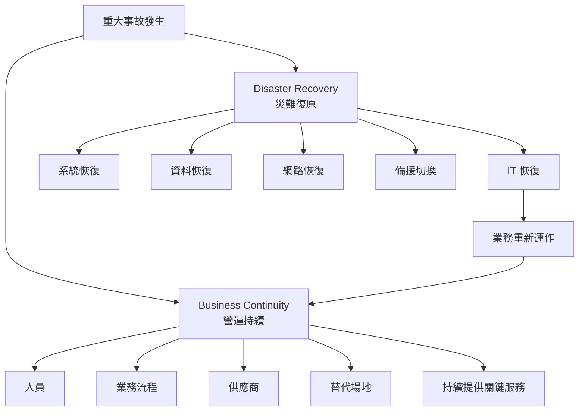

---

# 2. RPO：復原點目標

## 英文全稱
**Recovery Point Objective**

## 中文
**復原點目標**

## 核心定義

RPO 回答：

> **發生事故後，最多可以接受遺失多久的資料？**

RPO 看的是：

> **事故發生之前的資料時間點。**

因此：

> **RPO 往事故前看。**

## 範例

事故發生：

> 14:00

最近可用的備份：

> 13:45

則：

> 實際可能遺失 15 分鐘資料。

如果企業規定：

> 最多可以接受遺失 30 分鐘資料

那麼：

> RPO = 30 分鐘

這次實際恢復點造成 15 分鐘資料損失：

> 15 分鐘 ≤ 30 分鐘  
> 符合 RPO 要求。

## Mermaid 圖

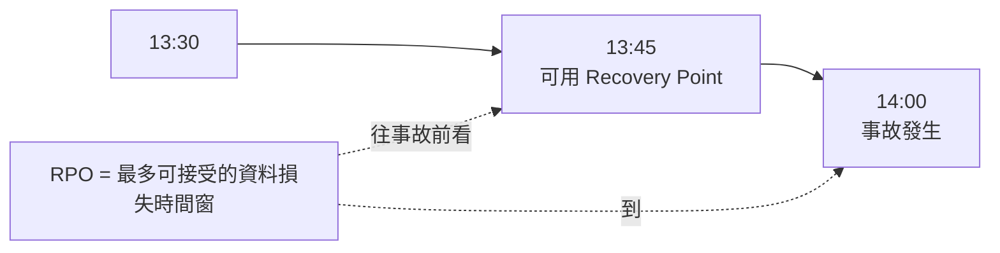

## RPO 常見觸發詞

- data loss
- transaction loss
- recovery point
- backup frequency
- replication lag
- how much data can be lost
- how far back can we restore

## RPO 不等於

- 系統多久恢復
- 業務多久恢復
- 最大停機時間
- 服務可接受停機多久

## 考試口訣

> **RPO = Point = 回到哪個資料時間點**

或：

> **RPO 看過去。**

---

# 3. RTO：復原時間目標

## 英文全稱
**Recovery Time Objective**

## 中文
**復原時間目標**

## 核心定義

RTO 回答：

> **發生事故後，IT 系統或服務必須在多久內恢復？**

它是：

> **恢復時間目標**

不是資料遺失目標。

## 範例

電商網站在 08:00 故障。

企業要求：

> 10:00 前必須恢復服務。

則：

> RTO = 2 小時

## Mermaid 圖

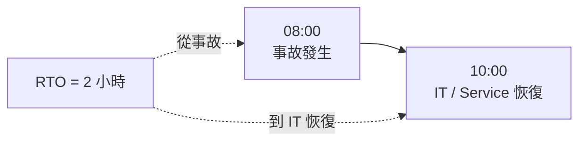

## RTO 常見觸發詞

- system recovery
- service restored
- application restored
- infrastructure available
- recovery time
- must be operational within X hours

## RTO 不等於

- 可接受資料損失
- 最大業務中斷時間
- IT 恢復後的業務重新整理時間
- 備份頻率

## 考試口訣

> **RTO = Time = IT 多久要恢復**

---

# 4. WRT：工作恢復時間

## 英文全稱
**Work Recovery Time**

## 中文
**工作恢復時間**

## 核心定義

WRT 回答：

> **IT 系統已經恢復後，業務還需要多久才能真正恢復正常運作？**

很多人會誤以為：

> IT 系統恢復 = 業務恢復

但實務上通常不是。

## 例子

- 08:00：事故
- 11:00：IT 系統恢復
- 11:00–12:30：
  - 驗證資料
  - 對帳
  - 重啟批次工作
  - 補送交易
  - 重新同步
  - 員工重新登入
- 12:30：業務真正恢復

那麼：

> 11:00 → 12:30 = WRT = 1.5 小時

## Mermaid 圖

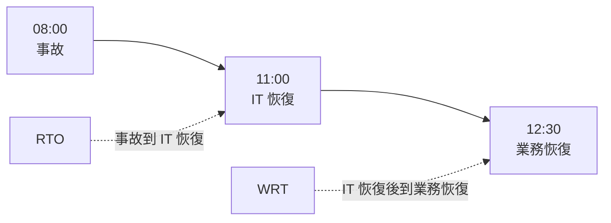

## WRT 常見活動

- 資料驗證
- 資料同步
- 對帳
- 補交易
- 工作流程重新啟動
- 使用者重新登入
- 應用程式重新連線
- 驗證業務流程
- 恢復 backlog

## WRT 常見陷阱

如果題目說：

> Database 已恢復，但 Finance team 還需要 2 小時確認交易與對帳

這 2 小時：

> **不是 RTO，而是 WRT。**

## 考試口訣

> **RTO = IT 恢復**  
> **WRT = 工作恢復**

---

# 5. MTD / MAO：最大可容忍中斷

## MTD 英文全稱
**Maximum Tolerable Downtime**

## MTD 中文
**最大可容忍停機時間**

## MAO 英文全稱
**Maximum Acceptable Outage**

## MAO 中文
**最大可接受中斷時間**

## 核心定義

MTD / MAO 回答：

> **某項業務功能最多可以中斷多久，再久就會造成不可接受的損害？**

它看的不是單純 IT，而是：

> **整個業務中斷的最大容忍上限。**

## 範例

如果某付款系統：

> 最多只能中斷 8 小時

那：

> MTD / MAO = 8 小時

## Mermaid 圖

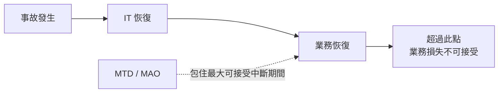

## MTD / MAO 常見觸發詞

- maximum tolerable
- maximum acceptable outage
- maximum downtime
- business cannot survive beyond
- unacceptable business impact after X hours

## MTD / MAO 不等於

- 備份多久做一次
- 資料能丟多少
- IT 恢復目標
- Recovery Point

---

# 6. 四個時間指標的完整時間線

這是整份講義最重要的圖。

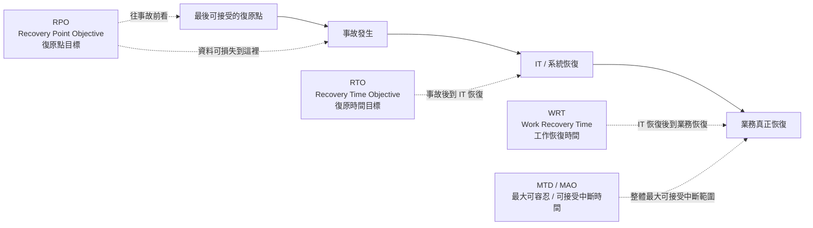

## 更直接的時間軸

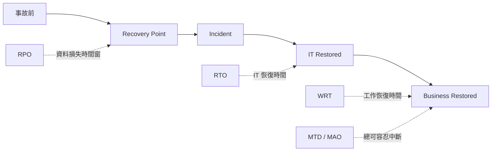

---

# 7. RTO + WRT ≤ MTD / MAO

這是 CCSP 很重要的關係。

## 公式

```text
RTO + WRT ≤ MTD / MAO
```

## 中文意思

> **IT 恢復所需時間 + 業務恢復所需時間**
>
> 不可以超過
>
> **業務最大可容忍中斷時間**

## 例子 1：符合

- RTO = 4 小時
- WRT = 2 小時
- MTD = 8 小時

```text
4 + 2 = 6
6 ≤ 8
```

符合。

## 例子 2：不符合

- RTO = 7 小時
- WRT = 2 小時
- MTD = 8 小時

```text
7 + 2 = 9
9 > 8
```

不符合。

## Mermaid 圖

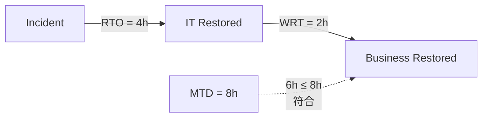

---

# 8. BC/DR 考試判斷方法

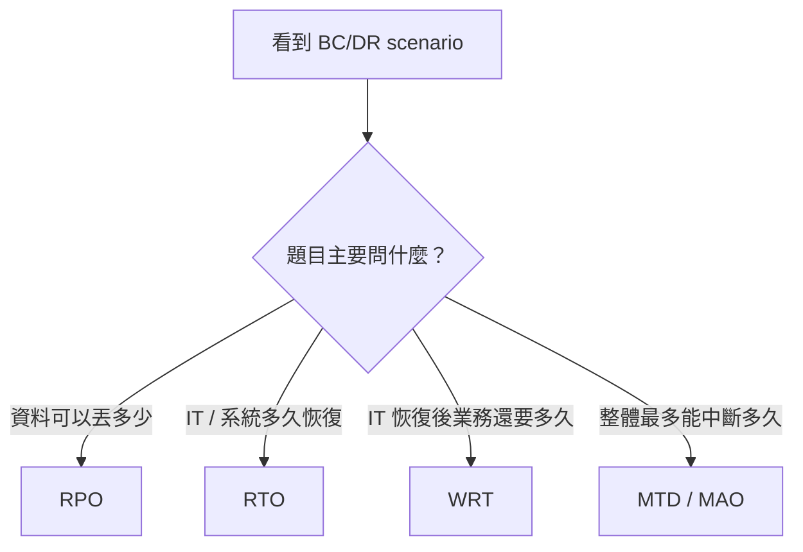

## 秒答規則

- **資料損失時間窗** → RPO
- **IT / Service 恢復** → RTO
- **IT 恢復後到業務恢復** → WRT
- **最大可容忍中斷** → MTD / MAO

---

# 9. 角色總覽

CCSP 常見角色：

- **General Counsel / CLO**
- **CISO**
- **DPO**
- **Compliance**

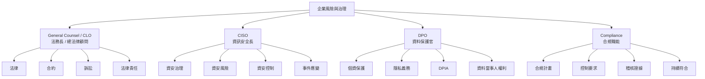

---

# 10. 法務長／總法律顧問

## 英文
**General Counsel**

或：

**Chief Legal Officer（CLO）**

## 中文

- 法務長
- 總法律顧問
- 首席法務長

## 核心責任

回答：

> **法律上怎麼解釋？合約怎麼寫？法律責任怎麼處理？**

典型職責：

- 法律解釋
- 合約談判
- 合約審查
- 訴訟
- 準據法
- 管轄法院
- 法律責任
- 法律風險
- 法規法律效果
- Breach notification 法律要求
- 供應商合約
- 退出條款

## 常見觸發詞

- contract
- litigation
- liability
- jurisdiction
- choice of law
- legal advice
- contractual obligation
- termination clause

## Mermaid

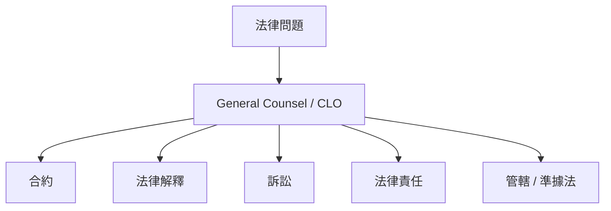

---

# 11. 資訊安全長 CISO

## 英文全稱
**Chief Information Security Officer**

## 中文
**資訊安全長**

## 核心責任

回答：

> **組織的資訊安全計畫、控制、事件與資安風險怎麼管理？**

典型職責：

- 資安治理
- 資安計畫
- 資安策略
- 資安風險管理
- 事件應變
- 安全控制
- Security Operations
- 安全架構方向
- 資安政策
- 資安成熟度

## 常見觸發詞

- security program
- security governance
- incident response
- security controls
- security risk
- security strategy
- security operations

## Mermaid

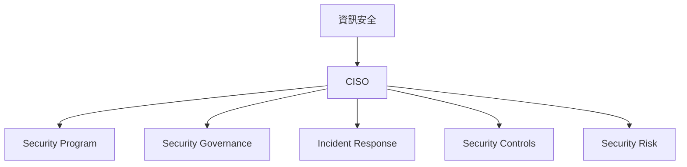

---

# 12. 資料保護官 DPO

## 英文全稱
**Data Protection Officer**

## 中文
**資料保護官**

## 核心責任

回答：

> **個人資料是否被合法、適當、符合隱私義務地處理？**

DPO 不等於一般「資料安全主管」。

它更偏：

> **Privacy / Data Protection**

典型職責：

- GDPR
- 個人資料處理
- 資料保護義務
- DPIA
- 資料當事人權利
- 隱私治理
- 監督資料處理活動
- 與資料保護監管機關互動

## DPIA

英文：

**Data Protection Impact Assessment**

中文：

**資料保護影響評估**

常見於：

- 大規模個資處理
- 高風險 profiling
- AI profiling
- 敏感個資處理
- 大規模監控

## 常見觸發詞

- GDPR
- personal data
- privacy
- DPIA
- data subject rights
- processing activities
- data protection obligations

## Mermaid

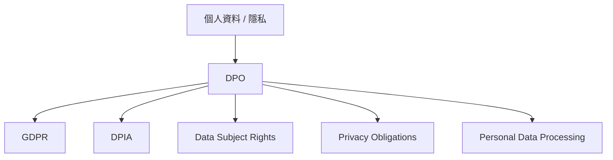

---

# 13. 合規職能 Compliance

## 英文

**Compliance Function**

或：

**Compliance Officer**

## 中文

- 合規職能
- 合規人員
- 合規主管

## 核心責任

回答：

> **組織是否持續符合適用的法規、標準、控制與政策要求？**

典型職責：

- 合規計畫
- 控制要求 mapping
- 法規 mapping
- 標準要求 mapping
- audit support
- audit evidence
- 持續監督
- PCI DSS compliance
- internal controls
- 合規證據

## 常見觸發詞

- control requirements
- ongoing compliance
- compliance program
- audit evidence
- regulatory mapping
- PCI DSS controls
- policy compliance

## Mermaid

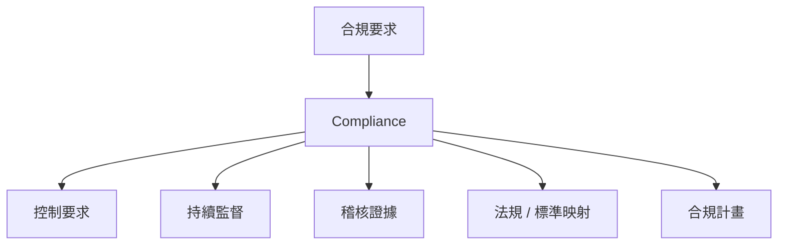

---

# 14. 四角色邊界比較

## CISO vs DPO

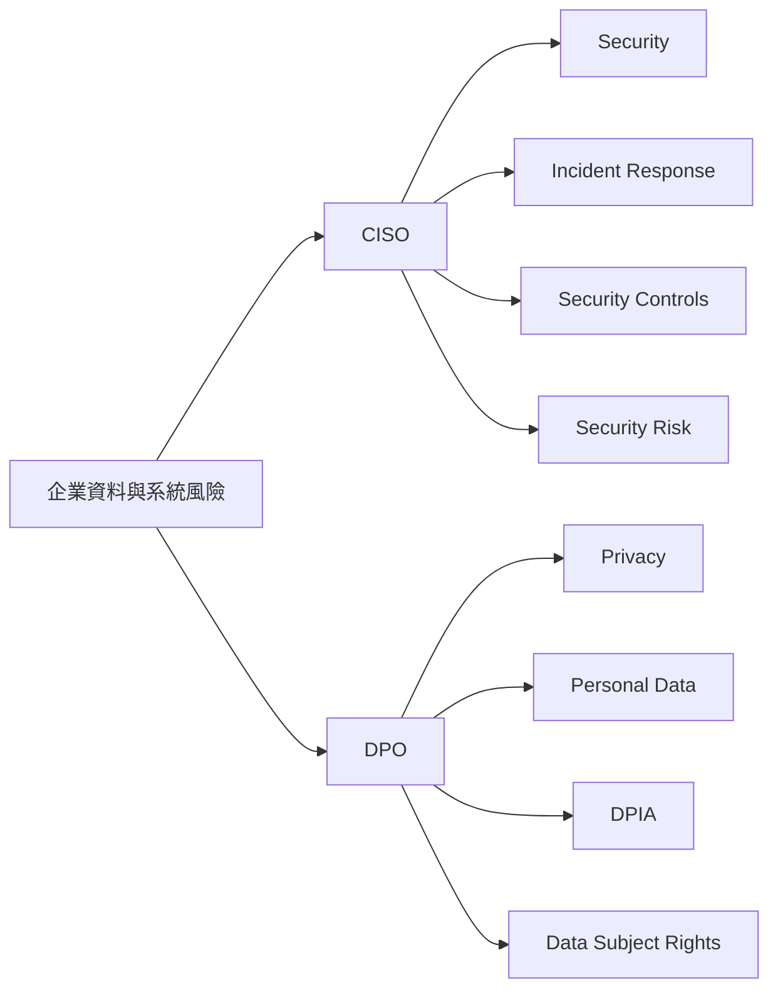

### 秒答

> **CISO = Security**  
> **DPO = Privacy**

---

## 法務 vs Compliance

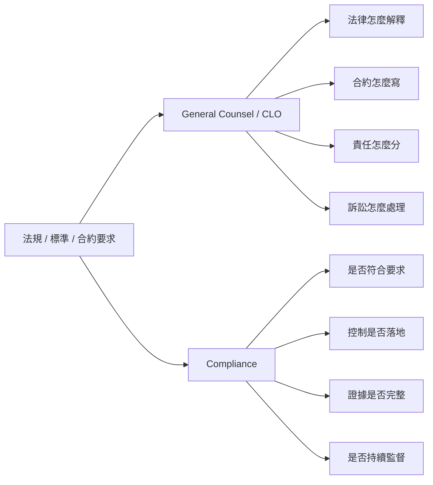

### 秒答

> **Legal = 法律怎麼解釋**  
> **Compliance = 有沒有做到**

---

# 15. 典型 CCSP 情境題

## 情境 1：供應商鎖定

需求：

- 資料匯出權
- 標準格式
- 退出費限制
- 轉移協助
- 終止後刪除

誰把要求寫入合約？

> **法務長／總法律顧問**

---

## 情境 2：勒索軟體

需求：

- Security Program
- Incident Response
- Security Controls
- Security Risk Treatment

主要角色：

> **CISO**

---

## 情境 3：EU AI Profiling

需求：

- GDPR
- DPIA
- Data Subject Rights
- Personal Data Processing

主要角色：

> **DPO**

如果題目改成：

> 某 GDPR 條文對契約責任產生什麼法律效果？

主要角色：

> **法務長／總法律顧問**

---

## 情境 4：PCI DSS 持續符合

需求：

- Control Requirements
- Audit Evidence
- 持續符合
- 稽核支援

主要角色：

> **Compliance**

---

## 情境判斷圖

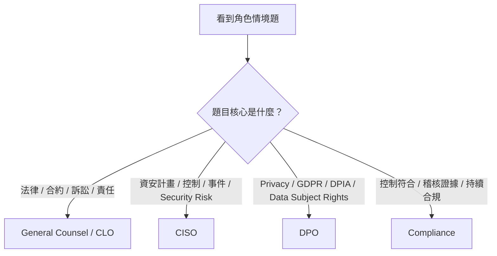

---

# 16. 考前速查表

## BC/DR

| 指標 | 英文全稱 | 中文 | 核心問題 |
|---|---|---|---|
| RPO | Recovery Point Objective | 復原點目標 | 最多能丟多久資料？ |
| RTO | Recovery Time Objective | 復原時間目標 | IT / 服務多久要恢復？ |
| WRT | Work Recovery Time | 工作恢復時間 | IT 恢復後，業務還要多久恢復？ |
| MTD | Maximum Tolerable Downtime | 最大可容忍停機時間 | 整體最多能中斷多久？ |
| MAO | Maximum Acceptable Outage | 最大可接受中斷時間 | 整體最多能中斷多久？ |

## BC/DR 超短口訣

```text
RPO = 往事故前看資料損失
RTO = 到 IT 恢復
WRT = IT 恢復後到業務恢復
MTD / MAO = 包住整段最大可接受中斷
```

---

## 角色

| 角色 | 英文全稱 | 中文 | 核心 |
|---|---|---|---|
| General Counsel / CLO | General Counsel / Chief Legal Officer | 法務長／總法律顧問 | 法律、合約、訴訟、責任 |
| CISO | Chief Information Security Officer | 資訊安全長 | Security Program、控制、事件、Security Risk |
| DPO | Data Protection Officer | 資料保護官 | Privacy、個資、DPIA、資料當事人權利 |
| Compliance | Compliance Function / Officer | 合規職能／合規人員 | 控制符合、持續監督、稽核證據 |

---

# 17. Closed-book Recall 題目

> 不看前文回答。

## BC/DR

### Q1
RPO 的中文與英文全稱是什麼？

### Q2
RTO 的中文與英文全稱是什麼？

### Q3
WRT 的中文與英文全稱是什麼？

### Q4
MTD / MAO 的中文與英文全稱是什麼？

### Q5
事故在 14:00，最近可用 Recovery Point 是 13:45。  
這 15 分鐘屬於哪個概念？

### Q6
事故後 2 小時內必須讓 Web Service 恢復。  
這是哪個指標？

### Q7
IT 於 10:00 恢復，但業務直到 11:30 才正常運作。  
10:00–11:30 是什麼？

### Q8
某服務最多只能中斷 8 小時。  
這是哪個指標？

### Q9
RTO = 5h，WRT = 2h，MTD = 6h。  
是否符合要求？

### Q10
四個時間指標中，哪一個往事故前看？

## 角色

### Q11
誰主要負責法律解釋、合約、訴訟與法律責任？

### Q12
誰主要負責 Security Program、Incident Response、Security Controls？

### Q13
誰主要負責 GDPR、DPIA、Data Subject Rights？

### Q14
誰主要負責確認 PCI DSS controls 是否持續符合要求？

### Q15
某企業準備建立 EU AI Profiling System，需要 DPIA。  
主要角色是誰？

### Q16
同一個 AI 專案若需要判斷 GDPR 條文對合約的法律效果，主要角色是誰？

### Q17
某公司遭勒索軟體攻擊，需要設計 Incident Response Capability。  
主要角色是誰？

### Q18
組織需要整理 Audit Evidence，證明 Controls 持續符合要求。  
主要角色是誰？

---

# 最終記憶框架

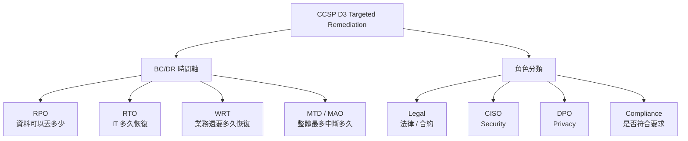

---

# 一頁式速記

```text
BC/DR
RPO = 最多能丟多久資料
RTO = IT / 系統多久要恢復
WRT = IT 恢復後，業務還要多久恢復
MTD / MAO = 整體最多能中斷多久

關係：
RTO + WRT ≤ MTD / MAO

方向：
RPO 往事故前看
RTO / WRT / MTD 往事故後看


角色
General Counsel / CLO = 法律、合約、訴訟、法律責任
CISO = Security Program、Controls、Incident、Security Risk
DPO = Privacy、Personal Data、DPIA、Data Subject Rights
Compliance = 持續符合、Control Requirements、Audit Evidence
```
