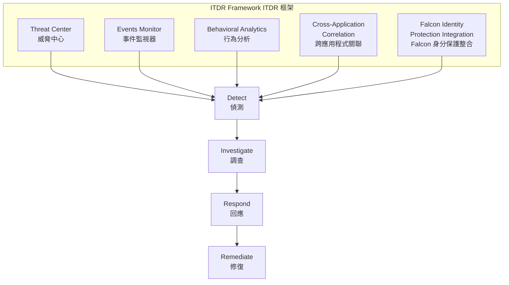
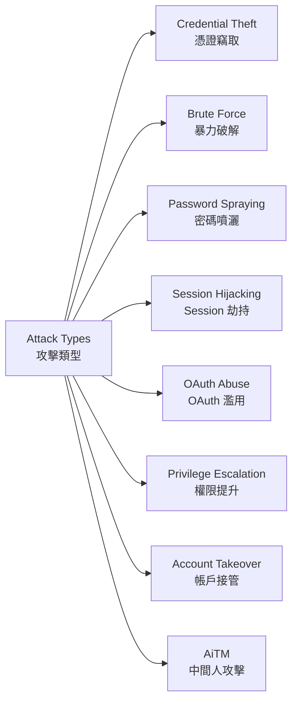
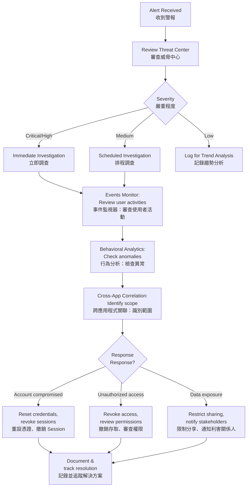
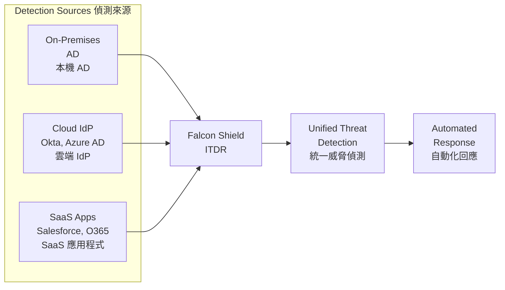

# Identity Threat Detection and Response (ITDR)
# 身分威脅偵測與回應（ITDR）

## Overview | 概述

Identity-based attacks are among the most common and effective methods for threat actors to gain unauthorized access. **ITDR** detects and responds to identity-related security threats by monitoring user authentication and access behaviors across integrated SaaS applications.

身分型攻擊是威脅行為者取得未授權存取最常見且最有效的方法之一。**ITDR** 透過監控整合 SaaS 應用程式中的使用者驗證和存取行為來偵測和回應身分相關的安全威脅。

---

## Identity-Based Attack Techniques | 身分型攻擊技術

| Technique | Description | 技術 | 說明 |
|-----------|-------------|------|------|
| Credential Theft | Stealing credentials via phishing, malware | 憑證竊取 | 透過網路釣魚、惡意軟體竊取憑證 |
| Brute Force | Automated password guessing | 暴力破解 | 自動化密碼猜測 |
| Password Spraying | Testing common passwords across accounts | 密碼噴灑 | 跨帳戶測試常用密碼 |
| Session Hijacking | Taking over authenticated sessions | Session 劫持 | 接管已驗證的 Session |
| OAuth Abuse | Exploiting OAuth grants for persistent access | OAuth 濫用 | 利用 OAuth 授予取得持久存取 |
| Privilege Escalation | Gaining higher access than authorized | 權限提升 | 取得超越授權的存取權 |
| Account Takeover | Completely compromising a user account | 帳戶接管 | 完全入侵使用者帳戶 |
| AiTM | Intercepting authentication flows | 中間人攻擊 | 攔截驗證流程 |

> **Key Insight | 關鍵洞察：** Identity threats often manifest as subtle anomalies rather than obvious attacks. Look for unusual patterns — logins from new locations, odd-hour access — not just failed login attempts.

> **關鍵洞察：** 身分威脅通常表現為微妙的異常而非明顯的攻擊。關注異常模式 — 來自新位置的登入、異常時間的存取 — 而不僅僅是失敗的登入嘗試。

---

## ITDR Detection Methods | ITDR 偵測方法

| Method | Description | 方法 | 說明 |
|--------|-------------|------|------|
| Behavioral Analysis | Identifies unusual login patterns and activities | 行為分析 | 識別異常的登入模式和活動 |
| Impossible Travel Detection | Flags logins from physically impossible locations | 不可能旅行偵測 | 標記來自物理上不可能位置的登入 |
| Brute Force & Password Spray Detection | Identifies authentication attacks | 暴力破解與密碼噴灑偵測 | 識別驗證攻擊 |
| AiTM Detection | Identifies sophisticated phishing campaigns | 中間人偵測 | 識別複雜的網路釣魚活動 |

---

## Threat Center | 威脅中心

The Threat Center serves as a dedicated hub for identity-based threats and IOCs detected across your SaaS ecosystem.

威脅中心是跨 SaaS 生態系統偵測到的身分型威脅和 IOC 的專屬中心。

### Threat Categorization | 威脅分類

Threats are categorized by **type**, **severity**, and **affected applications**.

威脅按**類型**、**嚴重程度**和**受影響應用程式**分類。

### Threat Details | 威脅詳情

Each threat includes: **affected users**, **detection time**, and **specific indicators** that triggered the detection.

每個威脅包括：**受影響使用者**、**偵測時間**和觸發偵測的**特定指標**。

### MITRE ATT&CK Mapping | MITRE ATT&CK 映射

Threats mapped to MITRE ATT&CK provide context about tactics and techniques being used, helping anticipate attacker next steps.

映射到 MITRE ATT&CK 的威脅提供關於正在使用的策略和技術的上下文，協助預測攻擊者的下一步。

### Recommended Actions | 建議行動

Guidance is provided on how to respond to each type of threat, tailored to the specific characteristics of each threat.

針對每種威脅的具體特徵提供回應指引。

### Historical Analysis | 歷史分析

View threat trends over time to identify patterns and persistent threats.

檢視威脅趨勢以識別模式和持續性威脅。

### How to Use the Threat Center | 如何使用威脅中心

| Step | Action | 步驟 | 操作 |
|------|--------|------|------|
| 1 | **Review** — Check for new threats regularly | 1 | **審查** — 定期檢查新威脅 |
| 2 | **Prioritize** — Focus on severity and affected users | 2 | **優先排序** — 關注嚴重程度和受影響使用者 |
| 3 | **Investigate** — Use threat details for high-priority items | 3 | **調查** — 使用威脅詳情處理高優先級項目 |
| 4 | **Review Recommendations** — Follow suggested actions | 4 | **審查建議** — 遵循建議的行動 |
| 5 | **Track** — Monitor trends over time | 5 | **追蹤** — 隨時間監控趨勢 |

---

## Events Monitor | 事件監視器

The Events Monitor helps you visualize, explore, and refine insights from actions and actors in your SaaS environment.

事件監視器協助視覺化、探索和優化對 SaaS 環境中操作和參與者的洞察。

### Key Features | 關鍵功能

| Feature | Description | 功能 | 說明 |
|---------|-------------|------|------|
| Unified Activity Log | Consolidated view across all apps | 統一活動日誌 | 跨所有應用程式的整合視圖 |
| Advanced Filtering | Focus on specific users, apps, time periods | 進階篩選 | 關注特定使用者、應用程式、時間段 |
| Contextual Information | User details, location, device data | 情境資訊 | 使用者詳情、位置、裝置資料 |
| Timeline Analysis | Chronological view of activities | 時間線分析 | 活動的時間順序視圖 |
| Anomaly Highlighting | Automatic detection of unusual activities | 異常高亮 | 自動偵測異常活動 |

---

## Configuring Alerts | 設定警報

Falcon Shield detects common identity attack patterns by continuously monitoring authentication and access behaviors.

Falcon Shield 透過持續監控驗證和存取行為來偵測常見的身分攻擊模式。

### Common Attack Patterns to Monitor | 需監控的常見攻擊模式

| Pattern | Scenario | Behaviors to Monitor | 模式 | 情境 | 需監控的行為 |
|---------|----------|---------------------|------|------|------------|
| Account Takeover | Phishing → stolen credentials → MFA bypass | Multiple failed logins → success from unusual location → password/MFA changes | 帳戶接管 | 網路釣魚 → 竊取憑證 → 繞過 MFA | 多次失敗登入 → 從異常位置成功 → 密碼/MFA 變更 |
| Privilege Escalation | Misconfigured role → creates admin account | Added to privileged roles → sudden permission increase → new admin accounts | 權限提升 | 被賦予特權角色 → 權限突然增加 → 建立新管理員帳戶 |
| Persistent Access | Compromised admin → creates hidden service account | OAuth apps with excessive permissions → secondary auth methods → long-lived credentials | 持久存取 | 管理員被入侵 → 建立隱藏服務帳戶 → 建立帶有過度權限的 OAuth 應用程式 |
| Data Exfiltration | Compromised account → auto-copies docs externally | Mass downloads → unusual external sharing → data export → access outside job function | 資料外洩 | 帳戶被入侵 → 自動複製文件到外部 → 大量下載 → 異常外部分享 |
| Anomaly Highlighting | Impossible travel → automated response | Logins from impossible locations → account suspension → investigation | 異常高亮 | 不可能旅行 → 自動回應 → 從不可能的位置登入 |

---

## Threat Investigation Flow | 威脅調查流程

---

## Integration with Falcon Identity Protection | 與 Falcon 身分保護整合

When deployed alongside Falcon Identity Protection, enhanced detection capabilities span:

與 Falcon 身分保護一起部署時，增強的偵測能力涵蓋：

- **On-premises directories** (Active Directory)
- **Cloud identity providers** (Okta, Azure AD)
- **SaaS applications** (Salesforce, Office 365, Google Workspace)

- **本機目錄**（Active Directory）
- **雲端身分提供者**（Okta、Azure AD）
- **SaaS 應用程式**（Salesforce、Office 365、Google Workspace）

---

## Related Modules | 相關模組

| Module | Description | 關聯模組 | 說明 |
|--------|-------------|----------|------|
| [User Inventory](Identity%20Visibility%20and%20Risk%20Assessment%20with%20Falcon%20Shield.md) | Identity risk assessment | [使用者清單](Identity%20Visibility%20and%20Risk%20Assessment%20with%20Falcon%20Shield.md) | 身分風險評估 |
| [Identity Governance](Identity%20governance%20and%20compliance.md) | Governance and compliance framework | [身分治理](Identity%20governance%20and%20compliance.md) | 治理與法規遵循框架 |
| [Permissions Governance](SaaS%20Permissions%20Governance.md) | Least privilege enforcement | [權限治理](SaaS%20Permissions%20Governance.md) | 最小權限實施 |
| [Devices Inventory](Monitoring%20SaaS-Connected%20Devices.md) | Device-based access control | [裝置清單](Monitoring%20SaaS-Connected%20Devices.md) | 基於裝置的存取控制 |
