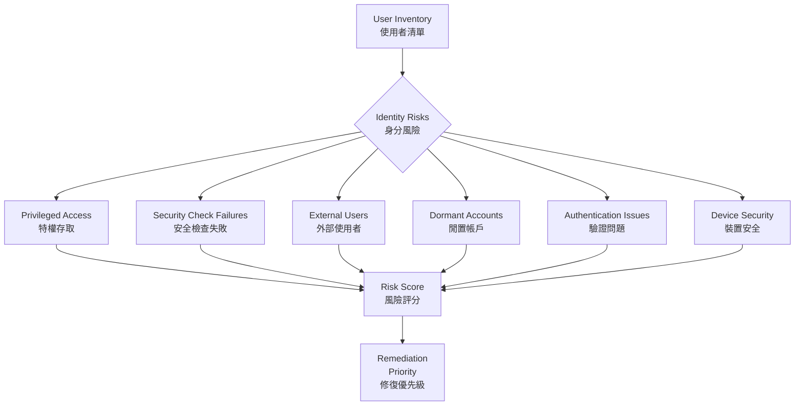
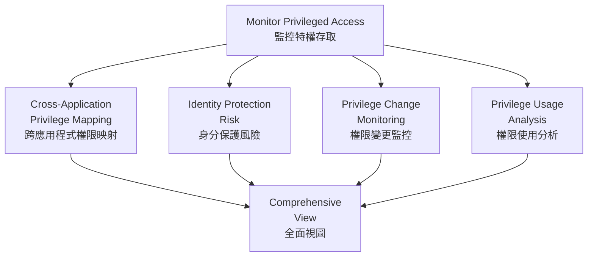

# Identity Visibility and Risk Assessment with Falcon Shield
# Falcon Shield 身分可見性與風險評估

## Overview | 概述

Falcon Shield's **User Inventory** provides comprehensive visibility into identities across your SaaS ecosystem. It helps you understand who has access to what, identify risky permissions, and prioritize security efforts.

Falcon Shield 的**使用者清單**提供對 SaaS 生態系統中身分的全面可見性。協助瞭解誰有權存取什麼、識別高風險權限，並優先處理安全工作。

---

## User Inventory Capabilities | 使用者清單能力

### See All Applications a User Has Access To | 查看使用者可存取的所有應用程式

Gain a comprehensive view of all applications a user can access within your organization. This visibility helps ensure appropriate access levels.

全面檢視使用者可在組織內存取的所有應用程式。此可見性有助於確保存取層級適當。

> **Example | 範例：** A user has integrations with Snowflake, Slack, Asana, Data Dog, and more. Click to see all integrations.

### Identify Users with Privileged Roles | 識別擁有特權角色的使用者

Quickly determine which users hold privileged roles. Privileged roles often come with elevated permissions, making monitoring crucial.

快速判斷哪些使用者持有特權角色。特權角色通常伴隨提升的權限，使得監控至關重要。

> **Example | 範例：** A user has 24 privileged roles, including Admin and Super Admin level. Determine if this access is needed.

### Detect Security Check Failures | 偵測安全檢查失敗

Identify users who have failed critical security checks (MFA, password compliance). These failures indicate potential vulnerabilities.

識別未通過關鍵安全檢查（MFA、密碼合規）的使用者。這些失敗表示潛在漏洞。

### Find External Users | 發現外部使用者

Discover external users with access to your applications. External access poses unique security challenges.

發現有權存取您應用程式的外部使用者。外部存取帶來獨特的安全挑戰。

> **Tip | 技巧：** Filter by **Domain Type > Not available and Unverified** to find external users.

### Discover Dormant Accounts | 發現閒置帳戶

Locate accounts that have been inactive for extended periods. Dormant accounts become security liabilities.

定位長期不活躍的帳戶。閒置帳戶成為安全隱患。

---

## Key User Inventory Attributes | 關鍵使用者清單屬性

| Attribute | Description | 屬性 | 說明 |
|-----------|-------------|------|------|
| Email | Primary user identifier | 電子郵件 | 主要使用者識別碼 |
| Name | User's full name | 名稱 | 使用者全名 |
| Department | Organizational unit | 部門 | 組織單位 |
| Company | Organization affiliation | 公司 | 組織所屬 |
| Domain | Email domain | 網域 | 電子郵件網域 |
| Enabled/Disabled Status | Account active or inactive | 啟用/停用狀態 | 帳戶活動或非活動 |
| Last Seen | Most recent activity | 最後活動 | 最近活動時間 |
| Creation Time | Account creation date | 建立時間 | 帳戶建立日期 |
| Failed Security Checks | Number of failures | 安全檢查失敗 | 失敗次數 |
| Privileged Roles | Assigned elevated roles | 特權角色 | 已分配的提升角色 |
| Reported By | Source applications | 回報者 | 來源應用程式 |

---

## Risk Factors | 風險因素

Falcon Shield aggregates multiple risk factors to create a comprehensive risk assessment for each user.

Falcon Shield 聚合多個風險因素，為每位使用者建立全面的風險評估。

### Privileged Access | 特權存取

Users with administrative or privileged roles are prime targets for malicious actors. Regularly review and limit privileged access.

擁有管理或特權角色的使用者是惡意行為者的主要目標。定期審查和限制特權存取。

### Security Check Failures | 安全檢查失敗

Users affected by failed security checks may indicate vulnerabilities. Ensure security checks are consistently applied.

受安全檢查失敗影響的使用者可能表示漏洞。確保安全檢查一致應用。

### External Status | 外部狀態

Users from outside managed domains pose unique challenges. Establish clear guidelines for external user activities.

來自管理網域外部的使用者帶來獨特挑戰。為外部使用者活動建立明確指南。

### Authentication Methods | 驗證方法

Users without proper authentication controls (e.g., MFA) are more susceptible to compromise. Implement strong authentication protocols.

沒有適當驗證控制（如 MFA）的使用者更容易被入侵。實施強驗證協定。

### Device Security | 裝置安全

Users accessing applications from unmanaged or non-compliant devices introduce security risks. Enforce device compliance policies.

從未管理或不合規的裝置存取應用程式的使用者帶來安全風險。強制裝置合規策略。

### Unusual Activity | 異常活動

Users exhibiting suspicious behaviors (odd hours, unauthorized actions) may indicate threats. Monitor and analyze these activities.

表現出可疑行為（異常時間、未授權操作）的使用者可能表示威脅。監控和分析這些活動。

---

## Monitor Privileged Access | 監控特權存取

### Step-by-Step | 逐步操作

| Step | Action | 步驟 | 操作 |
|------|--------|------|------|
| 1 | Use User Inventory filter for Privileged Roles | 1 | 使用使用者清單篩選特權角色 |
| 2 | Create custom presets (e.g., all Salesforce admins) | 2 | 建立自訂預設（如所有 Salesforce 管理員） |
| 3 | Create custom security checks for new privileged role grants | 3 | 為新的特權角色授予建立自訂安全檢查 |
| 4 | Conduct regular reviews of privileged access | 4 | 定期審查特權存取 |

---

## Common Use Cases | 常見使用情境

### Partially Deprovisioned Users | 部分停用的使用者

**Problem | 問題：** Users disabled in IdP but still active in certain applications.

**問題：** 在 IdP 中被停用但在某些應用程式中仍然活動的使用者。

**Solution | 解決方案：** Implement automated checks and deprovision workflows.

**解決方案：** 實施自動化檢查和停用工作流程。

### Critical SaaS Admins with Security Issues | 有安全問題的關鍵 SaaS 管理員

**Problem | 問題：** Admins responsible for essential applications have security check failures.

**Problem | 問題：** 負責關鍵應用程式的管理員有安全檢查失敗。

**Solution | 解決方案：** Conduct regular audits and enforce strict security protocols for admin accounts.

**解決方案：** 定期稽核並對管理員帳戶實施嚴格安全協定。

### External Users with Privileged Roles | 擁有特權角色的外部使用者

**Problem | 問題：** External collaborators with administrative access can introduce threats.

**問題：** 擁有管理存取權的外部合作者可能帶來威脅。

**Solution | 解決方案：** Review and adjust permissions regularly, limiting access to what is strictly necessary.

**解決方案：** 定期審查和調整權限，將存取限制在嚴格必要的範圍內。

### Users Not Managed by IdP | 未由 IdP 管理的使用者

**Problem | 問題：** Users in SaaS apps but not managed by central IdP create security gaps.

**Problem | 問題：** 在 SaaS 應用程式中但未由中央 IdP 管理的使用者造成安全缺口。

**Solution | 解決方案:** Integrate all accounts into IdP and conduct regular audits.

**解決方案：** 將所有帳戶整合到 IdP 並定期稽核。

---

## Device-Identity Correlation Use Cases | 裝置-身分關聯使用情境

| Use Case | Description | 使用情境 | 說明 |
|----------|-------------|----------|------|
| Critical Vulnerabilities | Admins using devices with critical security issues | 嚴重漏洞 | 管理員使用有嚴重安全問題的裝置 |
| Non-Compliant Devices | Admins using devices that fail compliance requirements | 不合規裝置 | 管理員使用不符合要求的裝置 |
| Unmanaged Devices | Admins using personal or unmanaged devices | 未管理裝置 | 管理員使用個人或未管理的裝置 |

---

## Related Modules | 相關模組

| Module | Description | 關聯模組 | 說明 |
|--------|-------------|----------|------|
| [Identity Governance](Identity%20governance%20and%20compliance.md) | Governance framework and policies | [身分治理](Identity%20governance%20and%20compliance.md) | 治理框架與策略 |
| [Permissions Governance](SaaS%20Permissions%20Governance.md) | Enforce least privilege | [權限治理](SaaS%20Permissions%20Governance.md) | 實施最小權限 |
| [Devices Inventory](Monitoring%20SaaS-Connected%20Devices.md) | Device hygiene and compliance | [裝置清單](Monitoring%20SaaS-Connected%20Devices.md) | 裝置健全度與合規 |
| [ITDR](ITD%20-%20Identity%20Threat%20Detection%20and%20Response.md) | Detect identity threats | [ITDR](ITD%20-%20Identity%20Threat%20Detection%20and%20Response.md) | 偵測身分威脅 |
| [Applications Inventory](managing-saas-inventories.md) | Track connected apps | [應用程式清單](managing-saas-inventories.md) | 追蹤連線的應用程式 |
