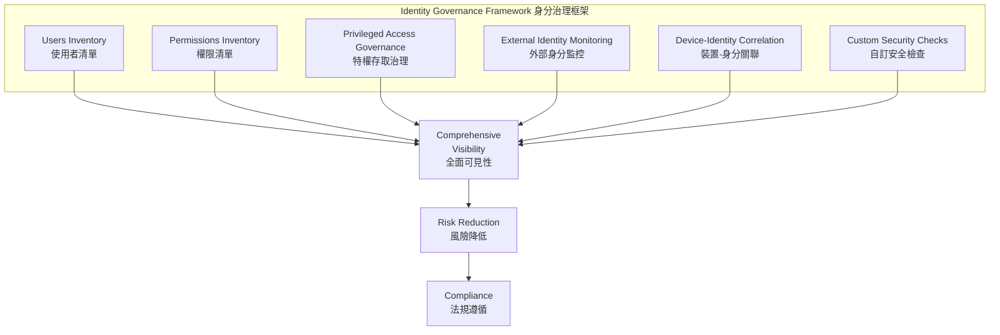
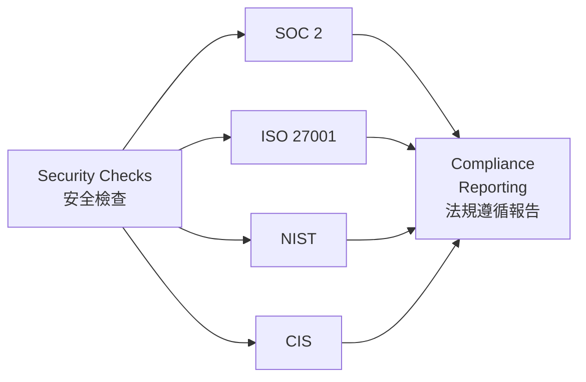
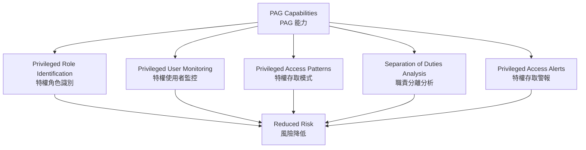

# Identity Governance and Compliance
# 身分治理與法規遵循

## Overview | 概述

Effective identity governance ensures the **right users** have the **right access** to the **right resources** for the **right reasons**. Falcon Shield strengthens identity governance by providing visibility across 180+ SaaS applications through consolidated inventories.

有效的身分治理確保**適當的使用者**出於**適當的理由**存取**適當的資源**。Falcon Shield 透過整合清單提供對 180+ SaaS 應用程式的可見性，強化身分治理。

---

## Key Principles | 關鍵原則

| Principle | Description | 原則 | 說明 |
|-----------|-------------|------|------|
| **Least Privilege** | Users have only the minimum access needed | **最小權限** | 使用者僅拥有所需的最低存取權 |
| **Segregation of Duties** | Critical functions divided among users | **職責分離** | 關鍵功能由不同使用者分工 |
| **Access Certification** | Regular reviews of access rights | **存取認證** | 定期審查存取權限 |
| **Centralized Policy Management** | Consistent policy application across systems | **集中化策略管理** | 跨系統一致的策略應用 |
| **Comprehensive Auditing** | Detailed records of changes and exceptions | **全面稽核** | 變更和例外的詳細記錄 |

---

## Falcon Shield Governance Capabilities | Falcon Shield 治理能力

### Users Inventory | 使用者清單

Provides a consolidated view of all identities with risk scoring to identify potential vulnerabilities.

提供所有身分的整合視圖和風險評分，以識別潛在漏洞。

### Permissions Inventory | 權限清單

Maps all permissions and roles across applications to prevent unauthorized access.

跨應用程式映射所有權限和角色，以防止未授權存取。

### Privileged Access Governance (PAG) | 特權存取治理

Monitors sensitive permissions and enforces separation of duties to reduce misuse risk.

監控敏感權限並強制職責分離，以降低濫用風險。

### External Identity Monitoring | 外部身分監控

Tracks third-party access to ensure adherence to security policies.

追蹤第三方存取以確保遵守安全策略。

### Device-to-Identity Correlation | 裝置-身分關聯

Ensures users access SaaS only from secure devices.

確保使用者僅從安全裝置存取 SaaS。

### Custom Security Checks | 自訂安全檢查

Aligns with your organization's specific identity policies.

與您組織的特定身分政策保持一致。

---

## Managing Access Rights | 管理存取權限

### Permissions Inventory Features | 權限清單功能

| Feature | Description | 功能 | 說明 |
|---------|-------------|------|------|
| Unified Permissions View | Consolidated overview across all apps | 統一權限視圖 | 跨所有應用程式的整合概覽 |
| Role Details | Insights into each role and assigned users | 角色詳情 | 每個角色和已分配使用者的洞察 |
| Permission Usage Analysis | How often specific permissions are used | 權限使用分析 | 特定權限的使用頻率 |
| Custom Filtering | Focus on specific apps, types, or groups | 自訂篩選 | 關注特定應用程式、類型或群組 |
| Historical Tracking | Permission changes over time | 歷史追蹤 | 隨時間變化的權限變更 |

---

## Compliance Monitoring and Reporting | 法規遵循監控與報告

### Framework Mapping | 框架映射

Security checks are aligned with major compliance frameworks:

安全檢查與主要法規遵循框架保持一致：

### Compliance Features | 法規遵循功能

| Feature | Description | 功能 | 說明 |
|---------|-------------|------|------|
| Compliance Dashboards | Visual compliance status across frameworks | 法規遵循儀表板 | 跨框架的視覺化遵循狀態 |
| Control Evidence | Documentation of control implementation | 控制證據 | 控制措施實施的文件記錄 |
| Compliance Reporting | Automated reports for auditors and stakeholders | 法規遵循報告 | 為稽核者和利害關係人自動化報告 |

---

## Privileged Access Governance (PAG) | 特權存取治理

PAG focuses on managing and securing privileged access — the highest-risk accounts.

PAG 專注於管理和保護特權存取 — 最高風險的帳戶。

### PAG Capabilities | PAG 能力

### PAG Implementation Steps | PAG 實施步驟

1. **Identify** all privileged roles across applications
2. **Limit** privileged access to only those who require it
3. **Implement** time-limited privileged access where possible
4. **Review** privileged access assignments regularly
5. **Monitor** privileged user activities for suspicious behavior

1. **識別**跨應用程式的所有特權角色
2. **限制**特權存取僅限需要的使用者
3. **盡可能實施**限時特權存取
4. **定期審查**特權存取分配
5. **監控**特權使用者活動以偵測可疑行為

### PAG Use Cases by Application | 各應用程式的 PAG 使用情境

| Application | Monitored Permissions | 應用程式 | 監控的權限 |
|-------------|----------------------|----------|------------|
| Salesforce | View All Data, Modify All Data, admin capabilities | Salesforce | 檢視所有資料、修改所有資料、管理功能 |
| NetSuite | Financial control permissions, administrative access | NetSuite | 財務控制權限、管理存取 |
| Office 365 | Exchange, Azure AD, O365 admin roles | Office 365 | Exchange、Azure AD、O365 管理角色 |
| Google Workspace | Super admin access, sensitive API permissions | Google Workspace | 超級管理員存取、敏感 API 權限 |
| Workday | HR data, financial info, system configurations | Workday | HR 資料、財務資訊、系統設定 |

---

## Custom Security Checks for Identity Governance | 身分治理的自訂安全檢查

| Check | Description | 檢查 | 說明 |
|-------|-------------|------|------|
| External users with privileged roles | External collaborators with admin access pose security risks | 擁有特權角色的外部使用者 | 擁有管理存取權的外部合作者帶來安全風險 |
| Segregation of duties violations | Users assigned conflicting roles | 職責分離違規 | 被分配衝突角色的使用者 |
| Dormant privileged accounts | Inactive accounts with elevated permissions | 閒置特權帳戶 | 具提升權限的非活動帳戶 |
| Excessive permission accumulation | Users with unusually high number of permissions | 過度權限累積 | 擁有異常多權限的使用者 |
| Unmanaged accounts with sensitive access | Accounts not managed by IdP with sensitive data access | 未管理的敏感存取帳戶 | 未由 IdP 管理但有敏感資料存取權的帳戶 |

### Best Practices for Custom Checks | 自訂檢查的最佳實踐

1. **Use clear naming conventions** — Ensure clarity and searchability
2. **Organize with tags or groups** — Categorize by team or framework
3. **Document custom check logic** — Maintain transparency for audits
4. **Review checks periodically** — Keep checks relevant as environment evolves

1. **使用清晰的命名規則** — 確保清晰度和可搜尋性
2. **使用標籤或群組組織** — 按團隊或框架分類
3. **記錄自訂檢查邏輯** — 維護稽核的透明度
4. **定期審查檢查** — 隨環境演進保持檢查的相關性

---

## Extending Governance with APIs | 透過 API 擴展治理

Falcon Shield APIs enable programmatic access to identity data and governance capabilities:

Falcon Shield API 提供對身分資料和治理能力的程式化存取：

| API Capability | Description | API 能力 | 說明 |
|----------------|-------------|----------|------|
| Monitor Security Checks | Manage checks across SaaS apps | 監控安全檢查 | 跨 SaaS 應用程式管理檢查 |
| Respond to Alerts | Track and respond to security alerts | 回應警報 | 追蹤並回應安全警報 |
| Monitor Inventories | Access user and device data | 監控清單 | 存取使用者和裝置資料 |
| Manage Integrations | Ensure secure data exchange | 管理整合 | 確保安全的資料交換 |
| Access Compliance Info | Verify regulatory adherence | 存取法規資訊 | 驗證法規遵循 |
| Monitor System Logs | Track activity and detect anomalies | 監控系統日誌 | 追蹤活動並偵測異常 |

**Prerequisites | 前置條件：**

1. Valid API credentials with appropriate scopes
2. Access to the CrowdStrike Falcon platform
3. Proper network access to API endpoints

1. 具有適當範圍的有效 API 憑證
2. 存取 CrowdStrike Falcon 平台
3. 對 API 端點的正確網路存取

---

## Related Modules | 相關模組

| Module | Description | 關聯模組 | 說明 |
|--------|-------------|----------|------|
| [User Inventory](Identity%20Visibility%20and%20Risk%20Assessment%20with%20Falcon%20Shield.md) | Identity visibility and risk assessment | [使用者清單](Identity%20Visibility%20and%20Risk%20Assessment%20with%20Falcon%20Shield.md) | 身分可見性與風險評估 |
| [Permissions Governance](SaaS%20Permissions%20Governance.md) | Enforce least privilege | [權限治理](SaaS%20Permissions%20Governance.md) | 實施最小權限 |
| [ITDR](ITD%20-%20Identity%20Threat%20Detection%20and%20Response.md) | Detect identity-based threats | [ITDR](ITD%20-%20Identity%20Threat%20Detection%20and%20Response.md) | 偵測身分型威脅 |
| [Devices Inventory](Monitoring%20SaaS-Connected%20Devices.md) | Device-identity correlation | [裝置清單](Monitoring%20SaaS-Connected%20Devices.md) | 裝置-身分關聯 |
