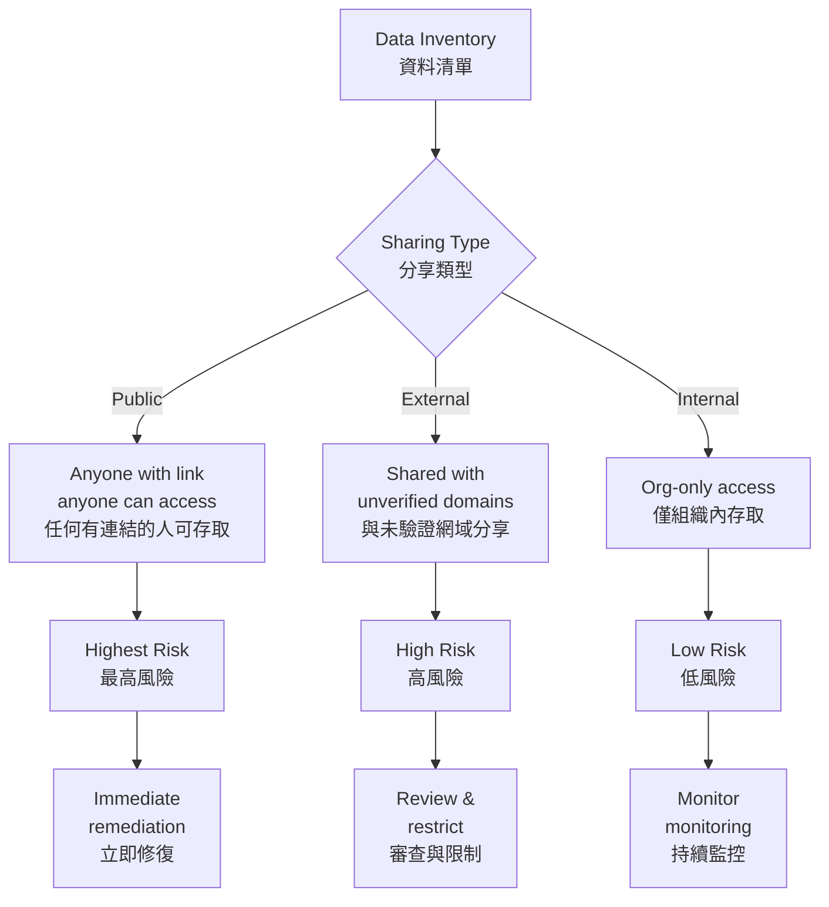
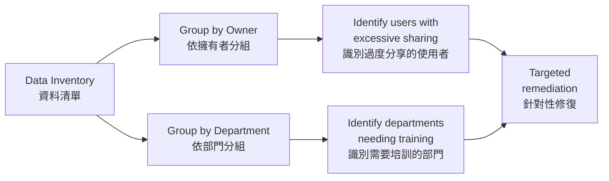

# Managing Sensitive Data in SaaS Environments
# 管理 SaaS 環境中的敏感資料

## Overview | 概述

The rise of SaaS and generative AI has amplified the risks of unintentional data exposure. Falcon Shield's **Data Inventory** helps you detect publicly shared documents, prevent unauthorized data transfers to AI tools, and enforce policies that limit sensitive data movement.

SaaS 和生成式 AI 的興起放大了非故意資料外洩的風險。Falcon Shield 的**資料清單**協助偵測公開分享的文件、防止未授權的資料傳輸至 AI 工具，並執行限制敏感資料移動的策略。

---

## Public vs. External Sharing | 公開 vs. 外部分享

| Type | Description | 風險等級 | 說明 |
|------|-------------|----------|------|
| **Public** | Anyone with the sharing link can access the file. URLs can be guessed or shared by mistake. | **Critical** | 任何有分享連結的人可存取檔案。URL 可能被猜中或誤分享。 |
| **External** | Shared with unverified domains not approved by the organization. Corporate IP could be exposed. | **High** | 與組織未批准的未驗證網域分享。企業智慧財產可能被暴露。 |

> To view unverified domains, go to **Settings > Domains** in Falcon Shield (owner access required).

> 要檢視未驗證網域，請前往 Falcon Shield 的 **Settings > Domains**（需要擁有者權限）。

---

## Data Inventory Fields | 資料清單欄位

### Main Columns | 主要欄位

| Column | Description | 欄位 | 說明 |
|--------|-------------|------|------|
| Name | File or resource name | 名稱 | 檔案或資源名稱 |
| Type | Calendar, File, Document, PDF, Repository | 類型 | 日曆、檔案、文件、PDF、儲存庫 |
| Integration | Source SaaS app | 整合 | 來源 SaaS 應用程式 |
| Owner | User who shared the resource | 擁有者 | 分享資源的使用者 |
| Access Level | Public or External | 存取層級 | 公開或外部 |
| Last Accessed | Most recent access date | 最後存取 | 最近存取日期 |
| Password Protected | Whether file is password-protected | 密碼保護 | 檔案是否受密碼保護 |
| Owner Department | Owner's department | 擁有者部門 | 擁有者的部門 |

### Data Side Bar | 資料側邊欄

Clicking any row opens a side bar with:

點擊任何一列會開啟側邊欄，顯示：

- **User Enabled** — The user who shared the resource
- **Resource ID** — Unique identifier
- **Link(s)** — Internal and/or external sharing links
- **Times Viewed** — Exposure gauge for unauthorized sharing
- **Shared users** — Grouped by domain

- **使用者** — 分享資源的使用者
- **資源 ID** — 唯一識別碼
- **連結** — 內部和/或外部分享連結
- **檢視次數** — 未授權分享的暴露指標
- **已分享使用者** — 按網域分組

---

## Filters | 篩選器

| Filter | Purpose | 篩選器 | 用途 |
|--------|---------|--------|------|
| Integration | Narrow to specific SaaS app | 整合 | 篩選至特定 SaaS 應用程式 |
| Owner | Find files by specific user | 擁有者 | 按特定使用者尋找檔案 |
| Access Level | Separate public from external | 存取層級 | 區分公開與外部 |
| Owner Department | Identify risky departments | 擁有者部門 | 識別高風險部門 |
| Unmanaged Domain | Find external shares to unknown orgs | 未管理網域 | 發現與未知組織的外部分享 |

---

## Grouping | 分組

Group results by **Owner** or **Owner Department** to detect users or departments with higher numbers of mismanaged files.

依**擁有者**或**擁有者部門**分組結果，以發現有較多管理不當檔案的使用者或部門。

---

## Key Risk Use Cases | 關鍵風險使用情境

### Abandoned Files | 遺棄檔案

**Problem | 問題：** Documents left accessible after their owners' accounts are disabled. Without an active owner, these files remain in circulation with no oversight.

**問題：** 擁有者帳戶被停用後，文件仍然可存取。沒有活動的擁有者，這些檔案會在無監督的情況下持續流通。

**Solution | 解決方案：**

1. Use Data Inventory to identify files owned by disabled users
2. Reassign ownership or delete the files
3. Implement policies to audit file ownership when accounts are disabled

**解決方案：**

1. 使用資料清單識別由停用使用者擁有的檔案
2. 重新分配所有權或刪除檔案
3. 實施帳戶停用時稽核檔案所有權的策略

### High-Sharing Users/Departments | 高分享使用者/部門

**Problem | 問題：** Some users or departments consistently create public links without passwords or expiration dates.

**問題：** 某些使用者或部門持續建立無密碼或無到期日的公開連結。

**Solution | 解決方案：** Group by Owner or Department, identify outliers, and provide targeted training on secure file-sharing practices.

**解決方案：** 按擁有者或部門分組，識別異常者，並針對安全檔案分享實踐提供針對性培訓。

---

## Mitigation Checklist | 緩解清單

- [ ] Review Data Inventory weekly for new public/external shares
- [ ] Verify file sharing policy status via Security Checks page
- [ ] Group by department to identify training gaps
- [ ] Implement expiration dates on external shares
- [ ] Audit abandoned files when employees leave
- [ ] Monitor for sensitive data being shared to AI tools

- [ ] 每週審查資料清單中的新公開/外部分享
- [ ] 透過安全檢查頁面驗證檔案分享策略狀態
- [ ] 按部門分組以識別培訓缺口
- [ ] 對外部分享實施到期日
- [ ] 員工離職時稽核遺棄檔案
- [ ] 監控敏感資料是否被分享至 AI 工具

---

## Related Modules | 相關模組

| Module | Description | 關聯模組 | 說明 |
|--------|-------------|----------|------|
| [Applications Inventory](managing-saas-inventories.md) | Track apps with data access | [應用程式清單](managing-saas-inventories.md) | 追蹤有資料存取權的應用程式 |
| [User Inventory](Identity%20Visibility%20and%20Risk%20Assessment%20with%20Falcon%20Shield.md) | Identify users sharing data | [使用者清單](Identity%20Visibility%20and%20Risk%20Assessment%20with%20Falcon%20Shield.md) | 識別分享資料的使用者 |
| [Identity Governance](Identity%20governance%20and%20compliance.md) | Enforce data access policies | [身分治理](Identity%20governance%20and%20compliance.md) | 執行資料存取策略 |
| [Permissions Governance](SaaS%20Permissions%20Governance.md) | Control sharing permissions | [權限治理](SaaS%20Permissions%20Governance.md) | 控制分享權限 |
