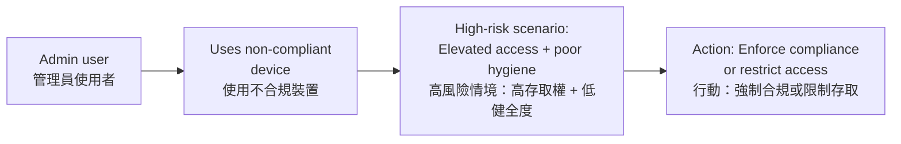

# Monitoring SaaS-Connected Devices
# 監控 SaaS 連線裝置

## Overview | 概述

Devices are the gateway to your SaaS data. The **Devices Inventory** in Falcon Shield connects the dots between **devices**, **users**, and **SaaS access** — turning fragmented device data into actionable security intelligence.

裝置是存取 SaaS 資料的入口。Falcon Shield 中的**裝置清單**串連了**裝置**、**使用者**和**SaaS 存取權**之間的關聯，將零散的裝置資料轉化為可操作的安全情報。

```mermaid
flowchart TD
    subgraph Devices["Devices Inventory 裝置清單"]
        A["Laptops\n筆電"]
        B["Desktops\n桌上型電腦"]
        C["Mobile Devices\n行動裝置"]
    end
    A --> D{"Risk Correlation\n風險關聯"}
    B --> D
    C --> D
    D --> E["User Privilege\n使用者權限"]
    D --> F["Device Hygiene\n裝置健全度"]
    D --> G["Compliance Status\n法規遵循狀態"]
    E --> H{"High-Risk\nScenario?"]
    F --> H
    G --> H
    H -->|"Yes"| I["Enforce Policy\n/ Restrict Access\n執行策略 / 限制存取"]
    H -->|"No"| J["Continue\nMonitoring\n持續監控"]
```

---

## Why Device Visibility Matters | 為什麼裝置可見性很重要

| Benefit | Description | 好處 | 說明 |
|---------|-------------|------|------|
| Immediate Security Impact | Identify privileged users on compromised devices | 即時安全影響 | 發現特權使用者使用被入侵的裝置 |
| Operational Excellence | Map device-to-user relationships in seconds | 營運卓越 | 幾秒內建立裝置與使用者的關聯 |
| Risk-Based Approach | Prioritize device risks based on user privileges | 基於風險的方法 | 依使用者權限優先處理裝置風險 |
| Strategic Value | Support secure hybrid work at scale | 策略價值 | 大規模支援安全的混合辦公 |

---

## Device Identification & Merging | 裝置識別與合併

Falcon Shield merges devices based on:

Falcon Shield 根據以下條件合併裝置：

- **User email address** (reported by the SaaS app)
- **Device ID / Serial Number**
- **Device type** (mobile, laptop, desktop)
- **Device name**

- **使用者電子郵件地址**（由 SaaS 應用程式回報）
- **裝置 ID / 序號**
- **裝置類型**（行動裝置、筆電、桌上型電腦）
- **裝置名稱**

> If the same device is reported for two different email addresses, it appears as two separate rows — preventing devices from being lost during user migrations.

> 如果同一裝置以兩個不同的電子郵件地址回報，它會顯示為兩筆獨立的紀錄 — 避免裝置在使用者遷移過程中遺失。

---

## Available Columns | 可用欄位

| Column | Description | 欄位 | 說明 |
|--------|-------------|------|------|
| Name | Device name | 名稱 | 裝置名稱 |
| User | Associated user | 使用者 | 關聯的使用者 |
| Platform | Device platform | 平台 | 裝置平台 |
| OS | Operating system | 作業系統 | 作業系統 |
| OS Version | OS version number | 作業系統版本 | 作業系統版本編號 |
| Managed | Organization-managed? | 受管理 | 是否由組織管理 |
| Compliant | Meets compliance policies? | 合規 | 是否符合法規要求 |
| Ownership | Org-owned or personal? | 所有權 | 組織所有或個人所有 |
| Last Seen | Most recent activity date | 最後活動 | 最近活動日期 |
| Integrations | Reporting SaaS apps | 整合 | 回報的 SaaS 應用程式 |
| Device Checks | Security check results | 裝置檢查 | 安全檢查結果 |
| Vulnerabilities | Known CVEs | 漏洞 | 已知 CVE |

---

## Filters and Grouping | 篩選與分組

### Key Filters | 關鍵篩選器

| Filter | Use Case | 篩選器 | 使用情境 |
|--------|----------|--------|----------|
| Privileged Roles | Find admin users on risky devices | 特權角色 | 發現高風險裝置上的管理員使用者 |
| Vulnerabilities | Identify devices with known CVEs | 漏洞 | 發現有已知 CVE 的裝置 |
| Encrypted | Check encryption status across apps | 加密 | 跨應用程式檢查加密狀態 |
| Managed | Distinguish org-owned vs. personal | 受管理 | 區分組織所有與個人裝置 |
| Compliant | Filter non-compliant devices | 合規 | 篩選不符合規範的裝置 |

### Grouping | 分組

Group results by **Platform**, **OS**, or **OS Version** to identify patterns across your device fleet.

依**平台**、**作業系統**或**作業系統版本**分組結果，以識別裝置群組中的模式。

> Multiple filters within the same filter = OR logic. Filters across different filter types = AND logic.

> 同一篩選器內的多個篩選條件 = OR 邏輯。不同篩選器類型之間 = AND 邏輯。

---

## Device Inventory Templates | 裝置清單範本

### Privileged Users with Non-Compliant Devices | 特權使用者使用不合规裝置



**Why it matters | 為什麼重要：** Privileged users accessing SaaS from devices with critical vulnerabilities create a dangerous attack surface. These users have elevated permissions that could be exploited if their device is compromised.

**說明：** 特權使用者從有嚴重漏洞的裝置存取 SaaS 會造成危險的攻擊面。如果他們的裝置被入侵，這些使用者的高權限可能被利用。

### Stale Devices | 閒置裝置

**Description | 說明：** Devices that appear functional but may be compromised in ways that don't trigger alerts. Attackers design malware to operate stealthily on such systems.

**說明：** 外觀正常但可能已被入侵且未觸發警報的裝置。攻擊者設計惡意軟體在此類系統上隱密運作。

### Devices with Critical Vulnerabilities | 有嚴重漏洞的裝置

**Description | 說明：** High-severity flaws that can be exploited to gain unauthorized access, elevate privileges, or execute malicious code. Unpatched vulnerabilities create entry points for attackers.

**說明：** 可被利用來取得未授權存取、提升權限或執行惡意程式碼的嚴重漏洞。未修補的漏洞為攻擊者創造入口。

### Unencrypted Devices | 未加密裝置

**Description | 說明：** Devices lacking data protection mechanisms. In the event of loss or theft, all stored data becomes readily accessible, violating many compliance requirements.

**說明：** 缺乏資料保護機制的裝置。在裝置遺失或被竊時，所有儲存的資料將變得容易存取，違反許多法規要求。

---

## Related Modules | 相關模組

| Module | Description | 關聯模組 | 說明 |
|--------|-------------|----------|------|
| [User Inventory](Identity%20Visibility%20and%20Risk%20Assessment%20with%20Falcon%20Shield.md) | Correlate device data with user identity | [使用者清單](Identity%20Visibility%20and%20Risk%20Assessment%20with%20Falcon%20Shield.md) | 將裝置資料與使用者身分關聯 |
| [Applications Inventory](managing-saas-inventories.md) | Track apps connected to your SaaS | [應用程式清單](managing-saas-inventories.md) | 追蹤連接到 SaaS 的應用程式 |
| [Identity Governance](Identity%20governance%20and%20compliance.md) | Enforce access policies based on device trust | [身分治理](Identity%20governance%20and%20compliance.md) | 根據裝置信任度執行存取策略 |
| [DCU Matrix](the%20%22DCU%22%20matrix.md) | Prioritize risk based on device context | [DCU 矩陣](the%20%22DCU%22%20matrix.md) | 根據裝置情境優先處理風險 |
