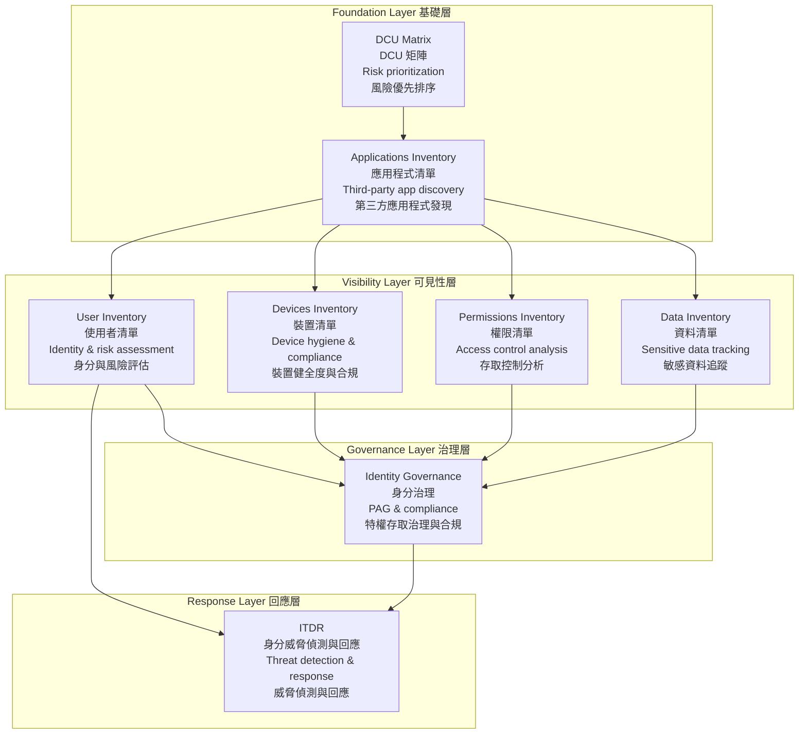
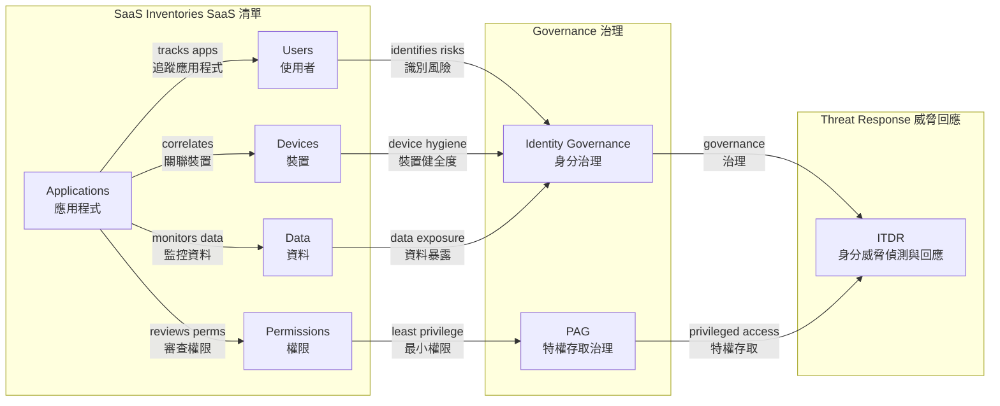
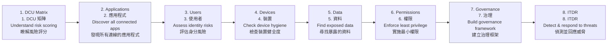

# CrowdStrike Falcon Shield — SaaS Security Module Guide
# CrowdStrike Falcon Shield — SaaS 安全模組指南

## Overview | 概述

This repository contains documentation for CrowdStrike Falcon Shield's SaaS security capabilities. Each module covers a specific domain of SaaS security, from application discovery to identity threat detection.

本儲存庫包含 CrowdStrike Falcon Shield SaaS 安全能力的文件。每個模組涵蓋 SaaS 安全的特定領域，從應用程式發現到身分威脅偵測。

---

## Module Architecture | 模組架構

---

## Module Cross-References | 模組交叉參考

---

## Module Index | 模組索引

| # | Module | Focus Area | File | # | 模組 | 重點領域 | 檔案 |
|---|--------|------------|------|---|------|----------|------|
| 1 | [DCU Matrix](the%20%22DCU%22%20matrix.md) | Risk prioritization scoring | the "DCU" matrix.md | 1 | [DCU 矩陣](the%20%22DCU%22%20matrix.md) | 風險優先排序評分 | the "DCU" matrix.md |
| 2 | [Applications Inventory](managing-saas-inventories.md) | OAuth, AI Agents, API Tokens, Extensions | managing-saas-inventories.md | 2 | [應用程式清單](managing-saas-inventories.md) | OAuth、AI 代理、API 令牌、擴充功能 | managing-saas-inventories.md |
| 3 | [Devices Inventory](Monitoring%20SaaS-Connected%20Devices.md) | Device hygiene & compliance | Monitoring SaaS-Connected Devices.md | 3 | [裝置清單](Monitoring%20SaaS-Connected%20Devices.md) | 裝置健全度與合規 | Monitoring SaaS-Connected Devices.md |
| 4 | [Data Inventory](Managing%20Sensitive%20Data%20in%20SaaS%20Environments.md) | Public/external data exposure | Managing Sensitive Data in SaaS Environments.md | 4 | [資料清單](Managing%20Sensitive%20Data%20in%20SaaS%20Environments.md) | 公開/外部資料暴露 | Managing Sensitive Data in SaaS Environments.md |
| 5 | [Permissions Inventory](SaaS%20Permissions%20Governance.md) | Least privilege enforcement | SaaS Permissions Governance.md | 5 | [權限清單](SaaS%20Permissions%20Governance.md) | 最小權限實施 | SaaS Permissions Governance.md |
| 6 | [User Inventory](Identity%20Visibility%20and%20Risk%20Assessment%20with%20Falcon%20Shield.md) | Identity risk assessment | Identity Visibility and Risk Assessment with Falcon Shield.md | 6 | [使用者清單](Identity%20Visibility%20and%20Risk%20Assessment%20with%20Falcon%20Shield.md) | 身分風險評估 | Identity Visibility and Risk Assessment with Falcon Shield.md |
| 7 | [Identity Governance](Identity%20governance%20and%20compliance.md) | PAG & compliance frameworks | Identity governance and compliance.md | 7 | [身分治理](Identity%20governance%20and%20compliance.md) | 特權存取治理與法規框架 | Identity governance and compliance.md |
| 8 | [ITDR](ITD%20-%20Identity%20Threat%20Detection%20and%20Response.md) | Threat detection & response | ITD - Identity Threat Detection and Response.md | 8 | [ITDR](ITD%20-%20Identity%20Threat%20Detection%20and%20Response.md) | 威脅偵測與回應 | ITD - Identity Threat Detection and Response.md |

---

## Reading Order | 閱讀順序

For new users, we recommend the following learning path:

對於新使用者，建議以下學習路徑：

---

## Key Concepts Glossary | 關鍵概念詞彙

| Term | Definition | 術語 | 定義 |
|------|------------|------|------|
| PoLP | Principle of Least Privilege — users get only the minimum access needed | PoLP | 最小權限原則 — 使用者僅獲得所需的最低存取權 |
| PAG | Privileged Access Governance — managing high-risk privileged accounts | PAG | 特權存取治理 — 管理高風險特權帳戶 |
| ITDR | Identity Threat Detection and Response — detecting identity-based attacks | ITDR | 身分威脅偵測與回應 — 偵測身分型攻擊 |
| SOD | Segregation of Duties — dividing critical functions among users | SOD | 職責分離 — 將關鍵功能分配給不同使用者 |
| SaaS Security Posture Management | Monitoring and enforcing security configurations across SaaS apps | SaaS 安全態勢管理 | 監控和執行跨 SaaS 應用程式的安全設定 |
| DCU | Data Sensitivity + Configuration Complexity + Number of Users | DCU | 資料敏感度 + 設定複雜度 + 使用者數量 |
| IOC | Indicator of Compromise — forensic signs of a breach | IOC | 入侵指標 — 違規的法證跡象 |
| MITRE ATT&CK | Framework mapping attacker tactics and techniques | MITRE ATT&CK | 映射攻擊者策略和技術的框架 |
| RBAC | Role-Based Access Control | RBAC | 角色型存取控制 |
| MFA | Multi-Factor Authentication | MFA | 多因素驗證 |

---

## Quick Reference: Risk Priorities | 快速參考：風險優先級

| Priority | Focus | Frequency | 優先級 | 重點 | 頻率 |
|----------|-------|-----------|--------|------|------|
| Critical | Enterprise-wide apps with regulated data | Weekly | 極高 | 全企業應用程式含受管制資料 | 每週 |
| High | Department-wide apps with sensitive data | Monthly | 高 | 部門級應用程式含敏感資料 | 每月 |
| Medium | Multi-team apps with basic permissions | Quarterly | 中 | 多團隊應用程式含基本權限 | 每季 |
| Low | Limited-use apps with public data | Annually | 低 | 有限使用應用程式含公開資料 | 每年 |

---

## Getting Started | 開始使用

1. **Start with the DCU Matrix** — Score your top 10 SaaS apps
2. **Connect your SaaS integrations** — Falcon Shield supports 180+ apps
3. **Review the Applications Inventory** — Identify all third-party access
4. **Work through each module** — Follow the reading order above

1. **從 DCU 矩陣開始** — 為您前 10 個 SaaS 應用程式評分
2. **連接您的 SaaS 整合** — Falcon Shield 支援 180+ 應用程式
3. **審查應用程式清單** — 識別所有第三方存取
4. **逐一學習每個模組** — 遵循上述閱讀順序
