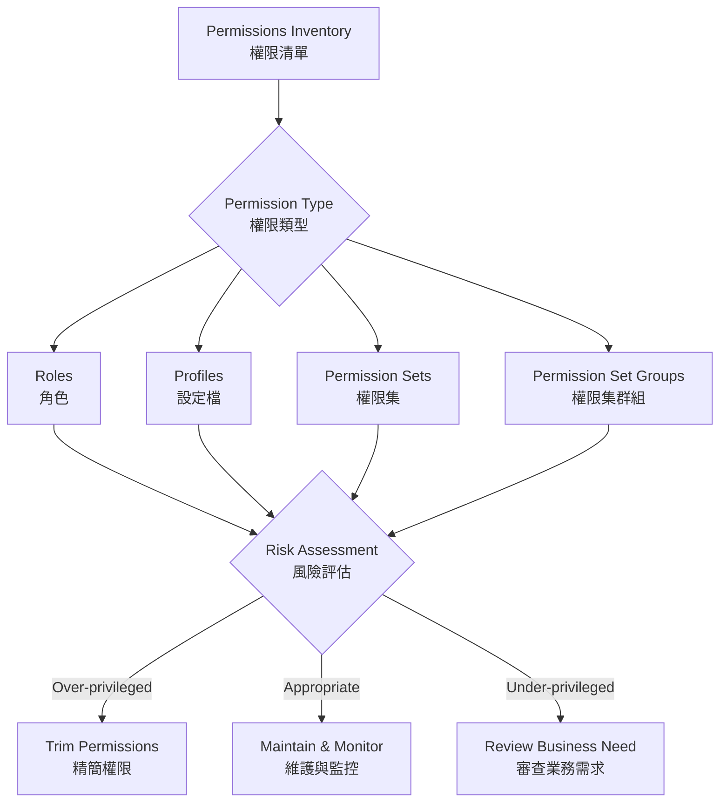
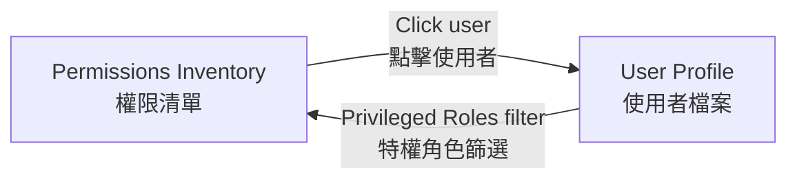
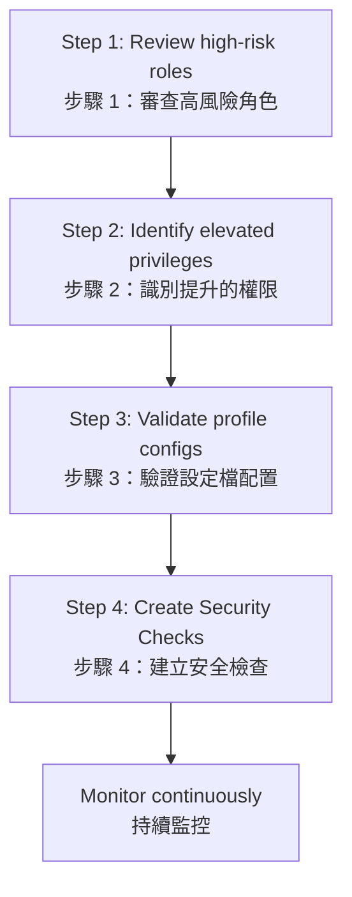

# SaaS Permissions Governance
# SaaS 權限治理

## Overview | 概述

SaaS apps often grant far more privileges than users actually need, creating opportunities for abuse or accidental data exposure. This module covers how to use Falcon Shield to implement the **Principle of Least Privilege (PoLP)**, detect permission drift, and enforce trimming policies.

SaaS 應用程式通常賦予使用者超過實際需要的權限，造成濫用或意外資料外洩的機會。本模組介紹如何使用 Falcon Shield 實施**最小權限原則（PoLP）**、偵測權限偏移，並執行權限精簡策略。

---

## Understanding the Permissions Inventory | 瞭解權限清單

Every SaaS application has a unique permissions model and uses different terminology. Falcon Shield **normalizes** these different models into a unified view.

每個 SaaS 應用程式都有獨特的權限模型並使用不同的術語。Falcon Shield 將這些不同的模型**標準化**為統一的視圖。

### Inventory Structure | 清單結構

Each row represents a **role, profile, permission set**, or **security group** reported by a SaaS integration.

每一列代表 SaaS 整合回報的**角色、設定檔、權限集**或**安全群組**。

| Type | Description | 類型 | 說明 |
|------|-------------|------|------|
| Roles | Role, role group, exchange role group, eligible role, default role | 角色 | 角色、角色群組、Exchange 角色群組、合格角色、預設角色 |
| Profiles | User profiles with object-level permissions (CRUD) | 設定檔 | 具有物件級權限（CRUD）的使用者設定檔 |
| Permission Sets | Additional permissions beyond default profile | 權限集 | 超出預設設定檔的附加權限 |
| Permission Set Groups | Combined permission sets for streamlined assignment | 權限集群組 | 用於精簡分配的組合權限集 |

### Permissions Side Bar | 權限側邊欄

Clicking any row opens the side bar with full details:

點擊任何一列會開啟側邊欄，顯示完整詳情：

- **ID, Created On, Last Modified, Created By** — Metadata for each item
- **Users** — List of users granted the permission
- **Permissions** — Detailed breakdown of what the permission allows
- **Object Permissions** — Application-specific object-level access (where available)

- **ID、建立日期、最後修改、建立者** — 每個項目的中繼資料
- **使用者** — 被賦予權限的使用者清單
- **權限** — 權限允許的詳細分類
- **物件權限** — 應用程式特定的物件級存取（如適用）

---

## Filters and Grouping | 篩選與分組

### Filters | 篩選器

| Filter | Purpose | 篩選器 | 用途 |
|--------|---------|--------|------|
| Integration | Narrow to specific SaaS app | 整合 | 篩選至特定 SaaS 應用程式 |
| Permissions | Filter by specific permissions | 權限 | 按特定權限篩選 |
| Users Count | Find roles with many users | 使用者數量 | 尋找有大量使用者的角色 |
| Type | Filter by role type | 類型 | 按角色類型篩選 |
| Origin | Filter by permission origin | 來源 | 按權限來源篩選 |

### Grouping | 分組

Group by **Type**, **Sub Type**, or **Origin** to analyze permission patterns across your environment.

依**類型**、**子類型**或**來源**分組，以分析環境中的權限模式。

---

## Cross-Reference: Permissions ↔ Users | 交叉參考：權限 ↔ 使用者

The Permissions Inventory links to the Users Inventory. For example:

權限清單與使用者清單互相連結。例如：

1. Find the M365 security group **Compliance Management (Exchange)** in the Permissions Inventory — it reports 2 users.
2. Go to the Users Inventory, filter by **Privileged Roles > M365 > Compliance Management** — the same two users appear.

1. 在權限清單中找到 M365 安全群組 **Compliance Management (Exchange)** — 回報 2 位使用者。
2. 前往使用者清單，篩選 **Privileged Roles > M365 > Compliance Management** — 相同的兩位使用者會出現。

---

## Scenario: Salesforce Permissions Review | 情境：Salesforce 權限審查

### Step-by-Step | 逐步操作

**Step 1 | 步驟 1:** Review high-risk roles — Examine roles with many associated users. Do all assigned users genuinely need these permissions?

**步驟 1：** 審查高風險角色 — 檢視有大量關聯使用者的角色。所有被分配的使用者是否真正需要這些權限？

**Step 2 | 步驟 2:** Identify elevated privileges — Analyze custom profiles with elevated permissions. Verify if all assigned permissions are necessary.

**步驟 2：** 識別提升的權限 — 分析具有提升權限的自訂設定檔。驗證所有已分配的權限是否必要。

**Step 3 | 步驟 3:** Validate profile configurations — Ensure custom profiles comply with company policy.

**步驟 3：** 驗證設定檔配置 — 確保自訂設定檔符合公司政策。

**Step 4 | 步驟 4:** Create Security Checks — Monitor for new admin role assignments, changes to system permissions, custom profile creation, and permission set modifications.

**步驟 4：** 建立安全檢查 — 監控新的管理員角色分配、系統權限變更、自訂設定檔建立和權限集修改。

---

## Scenario: Workday Segregation of Duties | 情境：Workday 職責分離

For organizations using Workday as a central HR system, Segregation of Duties (SOD) is essential for:

對於使用 Workday 作為中央人力資源系統的組織，職責分離（SOD）對於以下方面至關重要：

| Risk | Consequence | 風險 | 後果 |
|------|-------------|------|------|
| No SOD | One person controls multiple financial processes | 無 SOD | 一人控制多個財務流程 |
| Single approver | Increased fraud opportunity | 單一審核者 | 增加欺詐機會 |
| No SOD | Financial misstatements can be concealed | 無 SOD | 財務報表錯誤可被隱藏 |
| Inadequate SOD | Audit failures and qualified opinions | SOD 不足 | 稽核失敗和保留意見 |

---

## Best Practices | 最佳實踐

1. **Apply Principle of Least Privilege** — Users should have only the minimum access needed for their job.
2. **Review permissions quarterly** — Regularly audit roles, profiles, and permission sets.
3. **Monitor permission changes** — Create security checks for new admin assignments and permission modifications.
4. **Enforce SOD** — Ensure critical functions are divided among different users.
5. **Track eligible roles (PIM)** — Monitor time-based and approval-based role activation.

1. **實施最小權限原則** — 使用者僅應拥有工作所需的最低存取權。
2. **每季審查權限** — 定期稽核角色、設定檔和權限集。
3. **監控權限變更** — 為新的管理員分配和權限修改建立安全檢查。
4. **強制職責分離** — 確保關鍵功能由不同使用者分工。
5. **追蹤合格角色（PIM）** — 監控基於時間和審批的角色啟用。

---

## Related Modules | 相關模組

| Module | Description | 關聯模組 | 說明 |
|--------|-------------|----------|------|
| [User Inventory](Identity%20Visibility%20and%20Risk%20Assessment%20with%20Falcon%20Shield.md) | Review user privilege profiles | [使用者清單](Identity%20Visibility%20and%20Risk%20Assessment%20with%20Falcon%20Shield.md) | 審查使用者權限檔案 |
| [Identity Governance](Identity%20governance%20and%20compliance.md) | Enforce governance policies | [身分治理](Identity%20governance%20and%20compliance.md) | 執行治理策略 |
| [Applications Inventory](managing-saas-inventories.md) | Track app permissions | [應用程式清單](managing-saas-inventories.md) | 追蹤應用程式權限 |
| [DCU Matrix](the%20%22DCU%22%20matrix.md) | Prioritize apps by risk | [DCU 矩陣](the%20%22DCU%22%20matrix.md) | 依風險優先排序應用程式 |
