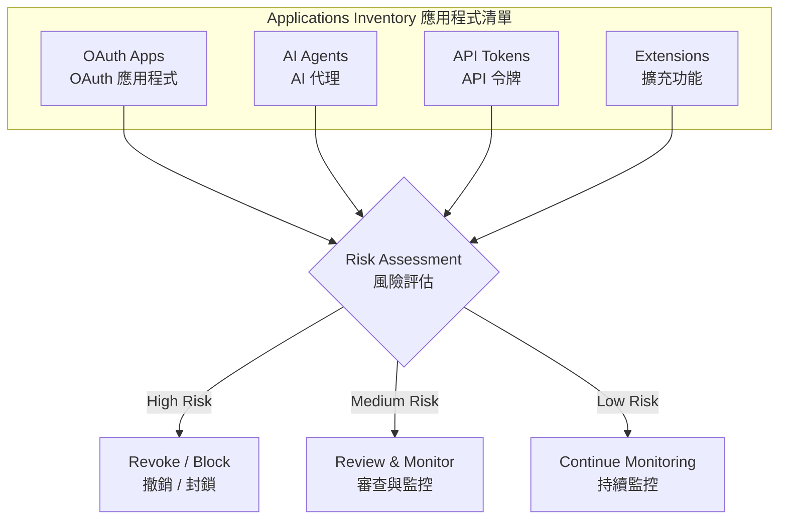
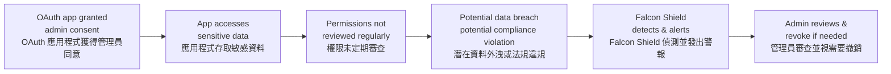

# Managing SaaS Application Inventories
# 管理 SaaS 應用程式清單

## Overview | 概述

Organizations often don't realize how many third-party applications have access to their SaaS environments. Dormant apps, excessive OAuth permissions, and unvetted AI agents create hidden attack surfaces. The **Applications Inventory** in Falcon Shield provides a centralized view to discover, monitor, and control these connections.

組織通常不清楚有多少第三方應用程式擁有其 SaaS 環境的存取權。閒置的應用程式、過度的 OAuth 權限和未經審核的 AI 代理會造成隱藏的攻擊面。Falcon Shield 中的**應用程式清單**提供集中化視圖，用以發現、監控和控制這些連結。

---

## Why It Matters | 為什麼重要

Inactive or unvetted applications create four key risks:

閒置或未經審核的應用程式會造成四個主要風險：

1. **Unmonitored backdoors** — Attackers exploit forgotten app connections to bypass security controls.
2. **Sensitive data exposure** — Outdated permissions expose data to unauthorized users.
3. **Compliance violations** — Untracked apps can violate SOC 2, ISO 27001, and other frameworks.
4. **Lateral movement** — Obsolete integrations serve as pathways for attackers to move within your network.

1. **無人監控的後門** — 攻擊者利用被遺忘的應用程式連結繞過安全控制。
2. **敏感資料外洩** — 過時的權限將資料暴露給未授權使用者。
3. **法規違規** — 未被追蹤的應用程式可能違反 SOC 2、ISO 27001 等框架。
4. **橫向移動** — 過時的整合成為攻擊者在網路中移動的路徑。

---

## Application Types | 應用程式類型

### OAuth Apps | OAuth 應用程式

OAuth apps use the Open Authorization protocol to access resources without sharing user credentials. They pose risks when granted excessive permissions.

OAuth 應用程式使用開放授權協定存取資源，無需分享使用者憑證。當被賦予過度權限時，它們會帶來風險。

**Key fields | 關鍵欄位：**

| Field | Description | 欄位 | 說明 |
|-------|-------------|------|------|
| Permission Type | Application or delegated | 權限類型 | 應用程式或委派 |
| Client ID | Unique app identifier | Client ID | 應用程式唯一識別碼 |
| Last Activity | Most recent usage date | 最後活動 | 最近使用日期 |
| Sign In Audience | Supported account types | 登入受眾 | 支援的帳戶類型 |
| Reply URLs | Auth response endpoints | 回覆 URL | 驗證回應端點 |

**Remediation | 修復措施：** For M365 and GWS integrations, Falcon Shield can revoke OAuth consent for specific users. Owner and Admin users can execute this from the app sidebar. Rate limit: 1 action every 5 minutes.

對於 M365 和 GWS 整合，Falcon Shield 可以撤銷特定使用者的 OAuth 同意。擁有者和管理員使用者可從應用程式側邊欄執行此操作。頻率限制：每 5 分鐘 1 次操作。

### AI Agents | AI 代理

AI agents leverage LLMs and machine learning to perform tasks, generate content, or analyze data. They often access sensitive data and present unique security challenges.

AI 代理利用大型語言模型和機器學習來執行任務、產生內容或分析資料。它們通常存取敏感資料，帶來獨特的安全挑戰。

**Types include | 類型包括：**

- Generative AI tools (ChatGPT, Claude, Gemini)
- AI-powered productivity applications
- Custom AI solutions built on OpenAI platforms
- AI features embedded within existing SaaS apps

- 生成式 AI 工具（ChatGPT、Claude、Gemini）
- AI 驅動的生產力應用程式
- 基於 OpenAI 平台建構的自訂 AI 解決方案
- 嵌入現有 SaaS 應用程式的 AI 功能

### API Tokens | API 令牌

API tokens use unique authentication tokens to access APIs and perform actions. They are easy to share and difficult to track, making them a common source of credential leakage.

API 令牌使用唯一驗證令牌來存取 API 並執行操作。它們易於分享且難以追蹤，是憑證洩漏的常見來源。

**Key fields | 關鍵欄位：** Token type, Created On, Expiration Date

**關鍵欄位：** 令牌類型、建立日期、到期日期

### Extensions | 擴充功能

Browser extensions extend application functionality but can require access to network and browser settings. They have been linked to major data leaks.

瀏覽器擴充功能擴展應用程式功能，但可能需要存取網路和瀏覽器設定。它們與重大資料洩漏事件有關。

**Key fields | 關鍵欄位：** Type, Client ID, Browser, Marketplace Listing

**關鍵欄位：** 類型、Client ID、瀏覽器、市集列表

**Remediation | 修復措施：** For Chrome extensions, Falcon Shield can block extensions at the root OU. Only Owner and Admin users can execute this action. Rate limit: 1 action every 5 minutes.

對於 Chrome 擴充功能，Falcon Shield 可以在根 OU 層級封鎖擴充功能。僅擁有者和管理員使用者可執行此操作。頻率限制：每 5 分鐘 1 次操作。

---

## High-Risk OAuth Scenario | 高風險 OAuth 情境

**Risks | 風險：**

- Delegated permissions to sensitive data
- Administrative access rights
- API access to core services
- Difficult to discover unmonitored OAuth applications

- 委派敏感資料的權限
- 管理存取權限
- 核心服務的 API 存取
- 難以發現未被監控的 OAuth 應用程式

---

## Related Modules | 相關模組

| Module | Description | 關聯模組 | 說明 |
|--------|-------------|----------|------|
| [DCU Matrix](the%20%22DCU%22%20matrix.md) | Prioritize apps by risk score | [DCU 矩陣](the%20%22DCU%22%20matrix.md) | 依風險評分優先排序應用程式 |
| [Devices Inventory](Monitoring%20SaaS-Connected%20Devices.md) | Monitor devices accessing SaaS | [裝置清單](Monitoring%20SaaS-Connected%20Devices.md) | 監控存取 SaaS 的裝置 |
| [User Inventory](Identity%20Visibility%20and%20Risk%20Assessment%20with%20Falcon%20Shield.md) | Identity visibility and risk | [使用者清單](Identity%20Visibility%20and%20Risk%20Assessment%20with%20Falcon%20Shield.md) | 身分可見性與風險 |
| [Permissions Governance](SaaS%20Permissions%20Governance.md) | Enforce least privilege | [權限治理](SaaS%20Permissions%20Governance.md) | 實施最小權限 |
