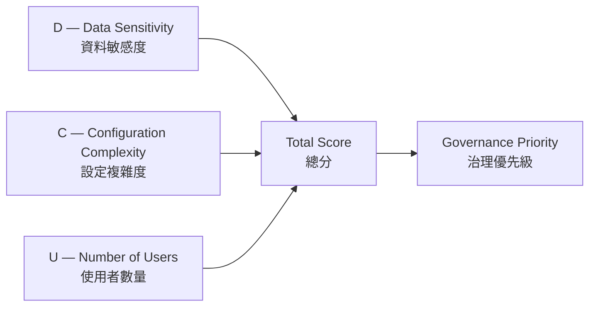
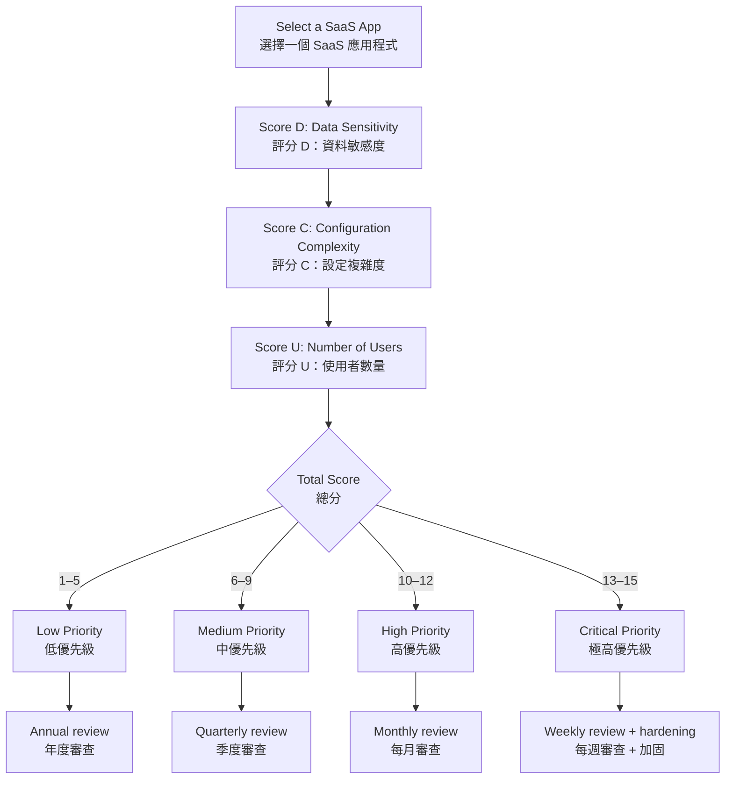

# DCU Matrix — SaaS App Risk Prioritization
# DCU 矩陣 — SaaS 應用程式風險優先排序

## Overview | 概述

The **DCU Matrix** helps security teams prioritize which SaaS applications need the most attention. Score each app on three dimensions — **D**ata Sensitivity, **C**onfiguration Complexity, and **N**umber of **U**sers — then combine the scores to decide your governance focus.

**DCU 矩陣** 協助安全團隊決定哪些 SaaS 應用程式需要最優先關注。針對每個應用程式，從三個維度評分 — **D**（資料敏感度）、**C**（設定複雜度）、**U**（使用者數量）— 再將分數加總以決定治理重點。

---

## Scoring Scale | 評分標準

Each dimension is rated **1 (lowest)** to **5 (highest)**.

每個維度的評分為 **1（最低）** 到 **5（最高）**。

### D — Data Sensitivity | 資料敏感度

| Score | Level | Description | 分數 | 等級 | 說明 |
|-------|-------|-------------|------|------|------|
| 1 | Minimal | Public information only, no sensitive data | 1 | 最低 | 僅公開資訊，無敏感資料 |
| 2 | Low | General business info, marketing materials | 2 | 低 | 一般業務資訊、行銷素材 |
| 3 | Moderate | Operational data, internal comms, non-sensitive customer data | 3 | 中等 | 運營資料、內部溝通、非敏感客戶資料 |
| 4 | High | Business-critical data, financial info, strategic docs | 4 | 高 | 業務關鍵資料、財務資訊、策略文件 |
| 5 | Critical | Regulated data (PII, PHI, PCI), IP/trade secrets, legal/HR records | 5 | 極高 | 受法規管制的資料（PII、PHI、PCI）、智慧財產、法務/人資紀錄 |

### C — Configuration Complexity | 設定複雜度

| Score | Level | Description | 分數 | 等級 | 說明 |
|-------|-------|-------------|------|------|------|
| 1 | Minimal | Fewer than 5 security settings, no complex permissions | 1 | 最低 | 少於 5 個安全設定，無複雜權限 |
| 2 | Simple | 5–15 settings, basic permissions and sharing | 2 | 簡單 | 5–15 個設定，基本權限與分享 |
| 3 | Moderate | 15–30 settings, standard RBAC, limited integrations | 3 | 中等 | 15–30 個設定，標準角色型存取控制，有限整合 |
| 4 | Complex | 30–50 settings, multiple sharing options, API integrations | 4 | 複雜 | 30–50 個設定，多種分享選項，API 整合 |
| 5 | Very Complex | 50+ settings, complex permission models, multiple auth methods | 5 | 極複雜 | 50+ 個設定，複雜權限模型，多種驗證方式 |

### U — Number of Users | 使用者數量

| Score | Level | Description | 分數 | 等級 | 說明 |
|-------|-------|-------------|------|------|------|
| 1 | Limited | Less than 10% of org, individual use | 1 | 極少 | 低於 10% 組織使用，個人使用 |
| 2 | Single Team | 10–24% of org, one department | 2 | 單一團隊 | 10–24% 組織使用，單一部門 |
| 3 | Multi-Team | 25–49% of org, several departments | 3 | 多團隊 | 25–49% 組織使用，跨多部門 |
| 4 | Department-Wide | 50–79% of org, critical for multiple depts | 4 | 部門級 | 50–79% 組織使用，多部門關鍵應用 |
| 5 | Enterprise-Wide | 80–100% of org, mission-critical | 5 | 全企業 | 80–100% 組織使用，營運核心 |

---

## How to Use | 使用方式

**Steps | 步驟：**

1. **List your SaaS apps** — Start with the Applications Inventory in Falcon Shield.
2. **Score each dimension** — Use the tables above to rate D, C, and U.
3. **Calculate total** — Add D + C + U (range: 3–15).
4. **Assign priority** — Use the flowchart to determine review frequency and governance actions.
5. **Document and review** — Re-score apps periodically as usage and data change.

1. **列出你的 SaaS 應用程式** — 從 Falcon Shield 的應用程式清單開始。
2. **為每個維度評分** — 使用上方表格為 D、C、U 打分。
3. **計算總分** — 將 D + C + U 相加（範圍：3–15）。
4. **決定優先級** — 使用流程圖決定審查頻率和治理行動。
5. **記錄並定期審查** — 隨著使用和資料變化，定期重新評分。

---

## Priority Actions by Score | 依分數採取的行動

| Total Score | Priority | Recommended Actions | 總分 | 優先級 | 建議行動 |
|-------------|----------|---------------------|------|--------|----------|
| 3–5 | Low | Annual review, basic monitoring | 3–5 | 低 | 年度審查，基本監控 |
| 6–9 | Medium | Quarterly review, enable MFA, review permissions | 6–9 | 中 | 季度審查，啟用 MFA，審查權限 |
| 10–12 | High | Monthly review, enforce least privilege, audit sharing | 10–12 | 高 | 每月審查，實施最小權限，稽核分享設定 |
| 13–15 | Critical | Weekly review, encrypt data, restrict access, full compliance audit | 13–15 | 極高 | 每週審查，資料加密，限制存取，完整法規稽核 |

---

## Related Modules | 相關模組

| Module | Description | 關聯模組 | 說明 |
|--------|-------------|----------|------|
| [Applications Inventory](managing-saas-inventories.md) | Discover and inventory all third-party apps | [應用程式清單](managing-saas-inventories.md) | 發現並盤點所有第三方應用程式 |
| [User Inventory](Identity%20Visibility%20and%20Risk%20Assessment%20with%20Falcon%20Shield.md) | Identity visibility and risk assessment | [使用者清單](Identity%20Visibility%20and%20Risk%20Assessment%20with%20Falcon%20Shield.md) | 身分可見性與風險評估 |
| [Permissions Governance](SaaS%20Permissions%20Governance.md) | Enforce least privilege across SaaS | [權限治理](SaaS%20Permissions%20Governance.md) | 跨 SaaS 實施最小權限 |
