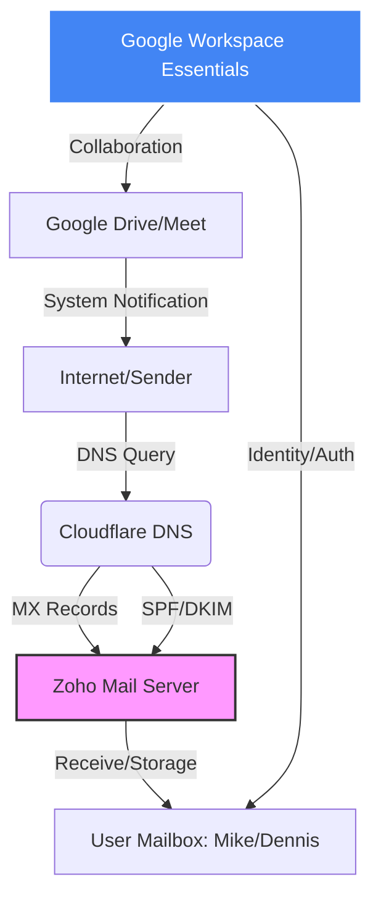
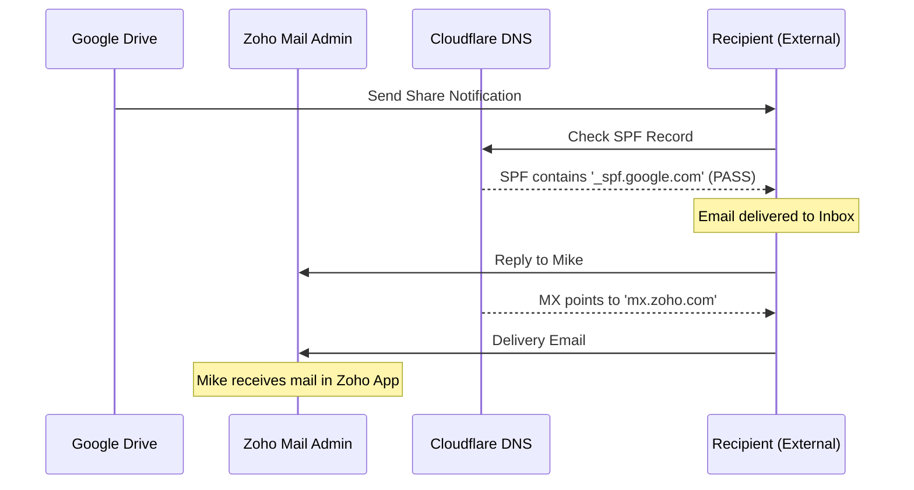

# 技術總結報告：Google Workspace Essentials 與 Zoho Mail 整合方案

**Technical Summary: Google Workspace Essentials & Zoho Mail Integration**

## 1. 專案概述 (Project Overview)

本方案旨在為 `dennisleehappy.org` 建立一個零預算的企業級協作系統。利用 **Cloudflare** 管理 DNS，將 **Zoho Mail** 作為郵件代管伺服器，並結合 **Google Workspace Essentials** 作為團隊協作與身份認證 (SSO) 中心。

This solution establishes a zero-budget enterprise collaboration system for `dennisleehappy.org`. It utilizes **Cloudflare** for DNS management, **Zoho Mail** for email hosting, and **Google Workspace Essentials** for team collaboration and Identity (SSO).

### 📦 專案結構 (Project Structure)

Plaintext

```
sentinel-rs/
├── Cargo.toml          # 依賴設定檔
├── README.md           # 專案說明與快速入門
└── src/
    └── main.rs         # 核心比對邏輯代碼
```

---

## 2. 系統架構 (System Architecture)



---

## 3. DNS 設定清單 (DNS Configuration List)

為了達成此架構，我在 Cloudflare 完成了以下設定：
To achieve this architecture, the following configurations were completed in Cloudflare:

| 類型 (Type) | 名稱 (Name) | 內容 (Value) | 目的 (Purpose) |
| --- | --- | --- | --- |
| **MX** | `@` | `mx.zoho.com` (Prio: 10) | 將信件導向 Zoho 收信。 (Route mail to Zoho) |
| **MX** | `@` | `mx2.zoho.com` (Prio: 20) | 備援郵件伺服器 1。 (Backup Mail Server 1) |
| **MX** | `@` | `mx3.zoho.com` (Prio: 50) | 備援郵件伺服器 2。 (Backup Mail Server 2) |
| **TXT (SPF)** | `@` | `v=spf1 include:zoho.com include:_spf.google.com ~all` | **核心關鍵**：授權 Zoho 與 Google 發信。 (Authorize both Zoho and Google) |
| **TXT (DKIM)** | `zmail._domainkey` | `v=DKIM1; k=rsa; p=...` | 郵件數位簽章，防止進垃圾桶。 (Digital signature to prevent spam) |

---

## 4. 關鍵技術細節 (Key Technical Insights)

### A. 身份驗證邏輯 (Identity Logic)

* **Google 側**：採用「電子郵件驗證 (Email-verified)」模式，而非「網域驗證 (Domain-verified)」。這避開了 Google Workspace 強迫升級至付費 Enterprise 版本的陷阱。
* **Zoho 側**：利用 Zoho 的「社交登入」功能連結 Google 帳號，實現免密碼登入的 SSO 體驗。
* **Google Side**: Utilizes "Email-verified" mode instead of "Domain-verified" to bypass the forced upgrade to the paid Enterprise version.
* **Zoho Side**: Uses Zoho’s Social Login feature to link Google accounts, achieving a password-less SSO experience.

### B. 使用者授權差異 (User License Handling)

* **Zoho Free**: 提供 5 個永久免費郵箱授權。
* **Google Essentials**: 提供最多 100 個免費協作授權。
* **配置策略**：只有前 5 位核心成員擁有收信功能，其餘成員僅能使用 Google Drive 協作。
* **Zoho Free**: Provides 5 "Forever Free" mailbox licenses.
* **Google Essentials**: Provides up to 100 free collaboration licenses.
* **Strategy**: Only the top 5 core members have email functionality; others use Google Drive for collaboration only.

---

## 5. 郵件發送流程 (Email Delivery Sequence)



---

## 6. 後續維護建議 (Maintenance Recommendations)

1. **使用者核准 (Approval)**：在 Google Admin 邀請新成員後，請確保他們在 **Zoho 郵箱** 點擊確認信，身分才會從「待核准」轉為「有效」。
2. **避免驗證網域**：在 Google 端請勿點擊「驗證網域擁有權」，除非您準備好支付 Enterprise 版本的費用。
3. **App 使用**：由於 Zoho 免費版無 IMAP，請所有成員安裝 **Zoho Mail App** 進行收信。
4. **User Approval**: After inviting members in Google Admin, ensure they click the confirmation link in their **Zoho mailbox** to change status from "Pending" to "Active".
5. **Avoid Domain Verification**: Do not click "Verify Domain Ownership" on the Google side unless you are ready to pay for the Enterprise version.
6. **App Usage**: Since Zoho Free lacks IMAP, all members should install the **Zoho Mail App** for mobile access.


