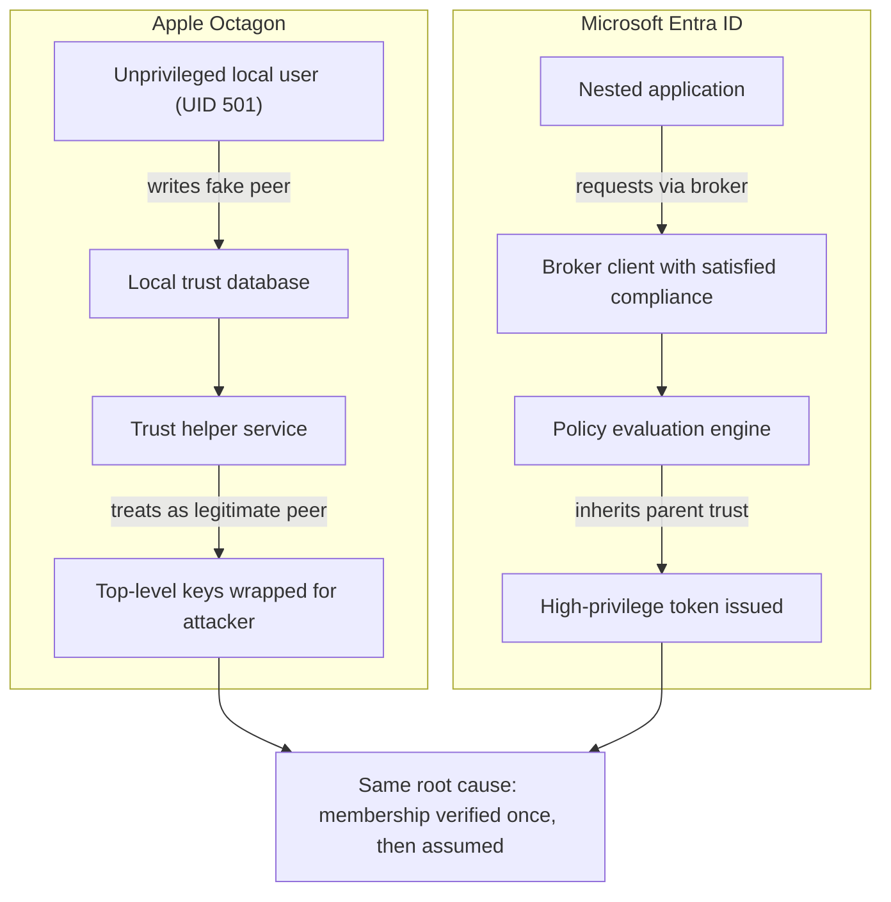
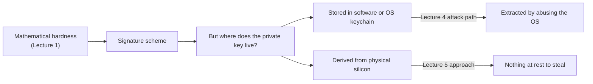
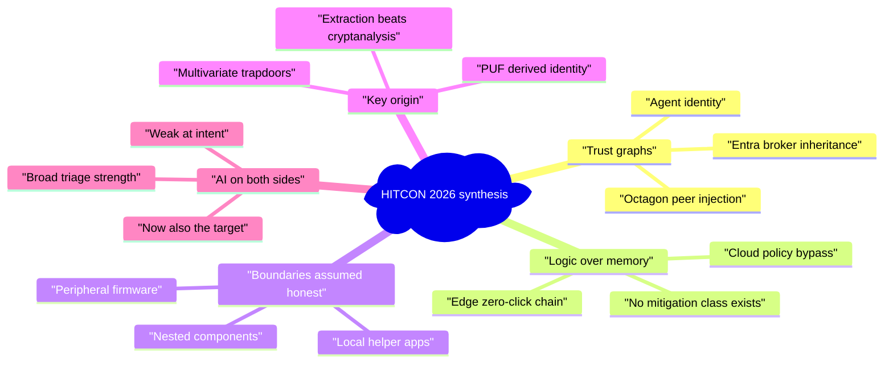

# Future Possible Implementation Visions

# 未來可能的實作與研究願景

> Cross-cutting synthesis of every talk and exercise in this collection.
> 本文件綜合本專案所有講次與實戰內容，提出可延伸的研究與實作方向。

---

## How to read this file / 如何閱讀本文件

**English —** The nine HITCON 2026 lectures and the five cyber-range tracks look
unrelated on the surface: post-quantum mathematics, surveillance cameras, Wi-Fi
firmware, Apple's keychain, silicon fingerprints, cloud identity, a browser
sandbox. Read together, they keep circling the same small set of failures. This
file names those recurring patterns, then turns each into concrete things somebody
could actually build or research — with an honest note on how hard each would be.

Nothing here is a claim about what the speakers are doing next. These are the
author's own extrapolations, written to be argued with.

**繁體中文 —** 本專案的九場講次與五個實戰賽道，表面上毫無關聯：後量子數學、監視
攝影機、Wi-Fi 韌體、Apple 鑰匙圈、晶片指紋、雲端身分、瀏覽器沙箱。但若合併閱讀，
會發現它們反覆繞回同一組核心失效模式。本文件先歸納這些跨領域的共通模式，再將每個
模式轉化為可實際著手的研究或實作構想，並誠實標註可行性。

以下內容純屬筆記作者個人的延伸推論，並非任何講者的後續計畫。

---

## Part I — The patterns underneath / 第一部：底層的共通模式

### Pattern 1: Trust graphs fail identically, whoever builds them

**English —** Lecture 4 (Apple's Octagon) and Lecture 8 (Microsoft Entra ID) were
written by different companies, in different decades, for different platforms. They
broke the same way. In both, a *low-privilege local actor injects a node into a
trust structure, and the structure then treats that node as a peer.* On macOS an
unprivileged user writes a fake device into a local database and the OS obligingly
wraps top-level keys for it. On Entra ID a nested app inherits a broker's already-
satisfied compliance state and receives tokens the policy engine would never have
issued directly.

The shared mistake is not cryptographic. Both systems verify *that a request is
well-formed* far more carefully than they verify *how the requester came to be in
the graph at all.* Membership is checked once, at join time, and thereafter treated
as a fact.

**繁體中文 —** 第四講（Apple Octagon）與第八講（Microsoft Entra ID）分屬不同公司、
不同年代、不同平台，卻以完全相同的方式失效：**低權限的本地行為者向信任結構中注入
一個節點，該結構隨即將此節點視為對等成員。** 在 macOS 上，未授權使用者將偽造的裝置
寫入本地資料庫，作業系統便為其包裝頂層金鑰；在 Entra ID 上，巢狀應用程式繼承代理端
既有的合規狀態，取得原本絕不會直接核發的 Token。

共通的錯誤不在密碼學。兩套系統對「請求格式是否正確」的驗證，遠比對「請求者當初如何
進入這張圖」的驗證嚴謹得多。成員資格只在加入時檢查一次，此後便被當成既成事實。

*The same structural failure in two unrelated ecosystems / 兩個互不相關的生態系中的相同結構性失效*

---

### Pattern 2: The industry hardened memory, so attackers moved to logic

**English —** Lecture 9 is the clearest statement of this. Four chained bugs, zero
memory corruption, zero AI assistance — the first Chromium full-chain success at
Pwn2Own in a decade, built entirely out of reasoning about what the browser
*intends* to do. Lecture 8's cloud bypass is the same shape at a different layer.
So is Lecture 4's identity swap.

Two decades of ASLR, stack cookies, CFI, sandboxing and memory-safe languages have
made memory corruption genuinely expensive. None of that defends a component that
is asked to do something harmful *through its documented interface*. Logic bugs
have no mitigation class, no compiler flag, and — crucially — no fuzzer that finds
them reliably.

**繁體中文 —** 第九講最能說明這一點：四個串聯漏洞、零記憶體破壞、零 AI 輔助，純粹
透過推理瀏覽器「意圖」達成的行為，成為十年來 Pwn2Own 首次成功的 Chromium 完整鏈。
第八講的雲端繞過是同樣形狀，只是層級不同；第四講的身分交換亦然。

二十年的 ASLR、堆疊金絲雀、CFI、沙箱與記憶體安全語言，確實讓記憶體破壞的成本大幅
提高。但這些防護完全無法保護一個「透過其正式介面被要求做有害之事」的元件。邏輯漏洞
沒有對應的緩解機制類別、沒有編譯器旗標，更關鍵的是——沒有能穩定找出它們的 Fuzzer。

---

### Pattern 3: Every boundary assumes the other side is honest

**English —** Lecture 3 is the sharpest version: a Wi-Fi chip's processor is not
supposed to be an attacker, so the Windows driver trusts the values it reports.
Once the firmware is under control, a parameter arrives that the kernel never
thought to bound-check. Lecture 2's surveillance stack repeats it — a local helper
application assumes the browser talking to it is friendly. Lecture 9's Edge chain
repeats it again between browser components.

Peripheral, plugin, add-in, nested app, co-processor: different words for *a thing
on the other side of a boundary that the trusting side never modelled as hostile.*

**繁體中文 —** 第三講是最鮮明的版本：Wi-Fi 晶片的處理器「不應該」是攻擊者，因此
Windows 驅動程式信任它回報的數值；一旦韌體被控制，核心從未設想需要邊界檢查的參數
便長驅直入。第二講的監控軟體堆疊重演此事——本機輔助程式假設與它通訊的瀏覽器是善意的；
第九講的 Edge 漏洞鏈則在瀏覽器元件之間再次重演。

周邊裝置、外掛、增益集、巢狀應用、共處理器：這些不同的詞彙指向同一件事——**邊界另一側
那個「信任方從未將其建模為敵意」的東西。**

---

### Pattern 4: Cryptography is strong; key origin is the soft spot

**English —** Lecture 1 spends its length on whether a multivariate trapdoor
survives algebraic attack — genuinely hard mathematics, actively contested in the
literature. Lecture 4 then walks around all of it: the keys were extracted by
convincing the operating system to hand them over. Lecture 5 is the interesting
counterpoint, because it attacks the problem from the other end — deriving identity
from physical silicon variation, so there is no stored key to steal.

**繁體中文 —** 第一講以全部篇幅探討多變數陷門能否抵禦代數攻擊——這是紮實且在學術界
active 爭論中的困難數學。第四講卻直接繞過這一切：金鑰是透過「說服作業系統交出來」而
取得的。第五講則是有趣的對照，因為它從另一端切入——由物理矽晶變異推導身分，因此根本
不存在可被竊取的儲存金鑰。

*Strong mathematics does not help if the key can be asked for / 若金鑰可被「索取」，再強的數學也無濟於事*

---

### Pattern 5: AI is now on both sides, and unevenly

**English —** Lecture 2 asks whether an automated pipeline could have rediscovered
its findings, and the honest answer is *partly*. Lecture 9's author points out he
used no AI at all, because the bugs required understanding intent rather than
enumerating states. Meanwhile CTF Tracks 3–5 treat AI systems as the *target*:
jailbreaking a deployed assistant, hardening an agent under adversarial conditions,
and reversing a token-metering protocol.

The pattern is that AI has become excellent at breadth (triage, decompilation
cleanup, surface enumeration) and remains weak at the depth where the interesting
bugs live. Defensively, the exposure is inverted: AI systems are being deployed
into privileged positions faster than anyone is threat-modelling them.

**繁體中文 —** 第二講自問「自動化流程能否重現這些發現」，誠實的答案是**部分可以**。
第九講的講者則明言完全未使用 AI，因為這些漏洞需要理解「意圖」，而非枚舉狀態。與此
同時，CTF 第三至五賽道把 AI 系統當作**攻擊標的**：越獄已部署的助理、在對抗條件下強化
代理程式、逆向 Token 計量協定。

模式很清楚：AI 已在「廣度」上表現優異（分類篩選、反編譯結果整理、攻擊面枚舉），但在
真正有趣的漏洞所處的「深度」上依然薄弱。而防禦面的曝險恰好相反——AI 系統被部署到特權
位置的速度，遠快於任何人為它們建立威脅模型的速度。

---

## Part II — Things somebody could build / 第二部：可著手的構想

Each idea below names what it is, why this collection motivates it, roughly how
you would start, and how hard it honestly looks.

### Idea 1 — A trust-graph differ for identity systems

| | |
| :--- | :--- |
| **What** | A tool that snapshots the membership of a trust structure (device peers, broker relationships, group memberships) and diffs it over time, alerting on any node that gained peer status without a corresponding interactive authentication event. |
| **Why** | Pattern 1. Both the Octagon and Entra failures are invisible in normal logs because each individual operation is authorised. The anomaly is only visible in the *shape of the graph over time*. |
| **How to start** | On the cloud side, Entra sign-in and audit logs already carry enough to reconstruct broker→nested relationships; build the graph, then flag edges whose creation has no matching interactive sign-in. On the endpoint side, periodically snapshot local trust databases and alert on unexplained peer additions. |
| **Difficulty** | Moderate for the cloud half — the data exists. Harder on endpoints, where the relevant state is undocumented and version-fragile. |

### Idea 2 — A "logic bug" corpus and taxonomy

| | |
| :--- | :--- |
| **What** | A structured, open corpus of logic-flaw exploit chains — each decomposed into the assumption violated, the boundary crossed, and the intended behaviour abused — across browsers, cloud identity, and OS services. |
| **Why** | Pattern 2. Memory-safety bugs have CWE classes, mitigations, and benchmark suites. Logic bugs have anecdotes. You cannot build detection for a class you have not characterised. |
| **How to start** | The chains in Lectures 4, 8 and 9 are three well-documented starting entries. Encode each as (component, assumed invariant, mechanism of violation, privilege delta) and look for structural repeats. |
| **Difficulty** | Low to start, high to make genuinely useful. The value is entirely in whether the taxonomy predicts anything rather than just describing the past. |

### Idea 3 — Post-quantum signatures rooted in physical identity

| | |
| :--- | :--- |
| **What** | Combine Lecture 5's engineless PUF with Lecture 1's multivariate signature family: derive the signing key from silicon variation at time of use, so no private key is ever stored, and use a signature scheme chosen for cheap verification on constrained devices. |
| **Why** | Pattern 4. It attacks the actual observed failure — key extraction — rather than the one the literature focuses on. |
| **How to start** | Characterise the PUF's error rate and the fuzzy-extractor overhead needed for stable key derivation, then measure whether the reconstructed key material meets the signature scheme's entropy and format requirements on real constrained hardware. |
| **Difficulty** | High, and genuinely research-grade. Note the honest caveat: multivariate schemes have large public keys, and Lecture 1's own cryptanalysis thread shows the parameter sets are still moving. Pairing an unsettled scheme with an unsettled key source compounds risk. |

### Idea 4 — Peripheral-firmware threat modelling as a first-class discipline

| | |
| :--- | :--- |
| **What** | A systematic audit method for host drivers: enumerate every value a peripheral can supply, and check which ones reach a length, index, or pointer computation without validation. |
| **Why** | Pattern 3, and Lecture 3 explicitly notes that firmware-based Windows privilege escalation "remains largely overlooked" compared to the equivalent work on Android. |
| **How to start** | Driver-side static analysis that treats the device-to-host channel as a taint source — deliberately the inverse of conventional driver analysis, which taints userspace input. Existing kernel static-analysis tooling can be repointed at this with modest effort. |
| **Difficulty** | Moderate and unusually high-yield, precisely because the area is under-examined. Requires no exotic hardware to begin — the driver binaries are the artefact. |

### Idea 5 — Attestation that survives a compromised attester

| | |
| :--- | :--- |
| **What** | Device-compliance attestation whose freshness and binding cannot be inherited, delegated, or replayed by a nested component — every privileged token bound to a live proof from the specific hardware root, not to a parent's cached state. |
| **Why** | Directly targets the Entra bypass in Lecture 8, where a nested app inherits a broker's compliance state, and connects to Lecture 5's chip-level identity as a candidate root. |
| **How to start** | Study the existing token-binding and continuous-evaluation mechanisms, and specifically test whether their guarantees hold across a nesting boundary — that is the exact gap the talk exploited. |
| **Difficulty** | High. The hard part is not cryptographic but ecosystem-shaped: nesting exists because it improves user experience, and any fix has to survive that pressure. |

### Idea 6 — An AI-assisted triage harness with an honest evaluation

| | |
| :--- | :--- |
| **What** | A reverse-engineering assistant that measures its own hit rate: given a corpus of already-disclosed vulnerabilities, what fraction does the automated pipeline surface, and — more informatively — which ones does it structurally miss? |
| **Why** | Pattern 5, and Lecture 2 poses precisely this question rather than assuming the answer. The field is short on published negative results about automated discovery. |
| **How to start** | Take a vendor's disclosed advisory set with the patched binaries as ground truth, run the pipeline blind, and publish both numbers. The misses are the contribution. |
| **Difficulty** | Moderate technically, low-glamour, and unusually valuable — the honest denominator is the thing nobody publishes. |

### Idea 7 — Threat modelling for agentic AI in privileged positions

| | |
| :--- | :--- |
| **What** | A structured framework for AI agents that hold real credentials: what a compromised or manipulated agent can reach, how its actions are attributed and audited, and what the blast radius looks like when its instructions come from untrusted content. |
| **Why** | This is the CTF scenario's entire premise — a compromised AI coding assistant as a supply-chain vector — and it matches HITCON 2026's own theme, *"When AI Acts."* Tracks 3 and 4 are early practical probes at it. |
| **How to start** | Treat the agent as an identity in the Pattern-1 sense: it is a node that gained trust. Ask the Idea-1 question of it — did anything interactive authorise this agent's current privileges, and can that be revoked at the granularity of a single action? |
| **Difficulty** | Conceptually moderate, organisationally hard. The technology is being deployed faster than the modelling. |

### Idea 8 — Range exercises that teach the access model, not just the exploit

| | |
| :--- | :--- |
| **What** | Cyber-range design where the environmental constraints — network allowlists, ephemeral labs, rate limits — are themselves part of the learning objective, and are documented rather than incidental. |
| **Why** | Honest lesson from the CTF: two of the three incomplete tracks were blocked by *access*, not by difficulty. That is realistic — real incident response is full of it — but only educational if it is deliberate and visible. |
| **How to start** | Publish the platform's access model up front, and score reconnaissance of the environment as a scoring objective in its own right. |
| **Difficulty** | Low. Mostly a design and documentation decision. |

---

## Part III — The through-line / 第三部：貫穿主線

*A concept map of the recurring themes / 反覆出現主題的概念圖*

**English —** If this collection has one argument, it is that **the interesting
attacks of 2026 are about relationships, not about code.** Who is a peer. What was
inherited. Which side of a boundary is assumed friendly. Where a key came from.
Which component is allowed to speak for another.

That is an uncomfortable place for the defensive toolchain to be, because almost
all of it — compilers, fuzzers, sanitisers, scanners — is built to reason about
code in isolation. The gap these nine talks collectively point at is the absence of
tooling that reasons about *trust relationships over time*. Ideas 1, 2 and 5 above
are all, in different clothing, attempts at that same missing tool.

**繁體中文 —** 若本專案有一個核心論點，那便是：**2026 年真正有趣的攻擊關乎「關係」，
而非「程式碼」。** 誰是對等節點、什麼被繼承了、邊界的哪一側被預設為善意、金鑰從何而來、
哪個元件被允許代表另一個元件發言。

這對防禦方的工具鏈而言是個尷尬的處境，因為幾乎所有工具——編譯器、Fuzzer、
Sanitizer、掃描器——都是為了「孤立地推理程式碼」而建構的。這九場講次共同指向的缺口，
正是**能夠推理「信任關係如何隨時間演變」的工具之闕如**。上述構想一、二、五，其實都是
同一件缺失工具的不同外衣。

---

## Caveats / 注意事項

**English —** Everything in Part II is speculative extrapolation by the note-taker,
not a proposal from any speaker, and not a claim that these approaches are novel —
several likely have prior art that a proper literature search would surface. The
difficulty ratings are judgement calls. Where an idea depends on a technical detail
from a lecture, check that lecture's Resources section first: several details in
these notes were transcribed live and have since been corrected against the public
record.

**繁體中文 —** 第二部的所有內容皆為筆記作者的推測性延伸，並非任何講者的提案，也不宣稱
這些方向具有原創性——其中數項很可能已有既有研究，需經完整文獻回顧確認。難度評級屬主觀
判斷。若某項構想依賴講次中的技術細節，請先查閱該講次的「Resources」章節：本專案部分
細節為現場聽記，事後已對照公開資料進行校訂。

---

## Related reading in this collection / 本專案相關閱讀

| Theme | Lectures |
| :--- | :--- |
| Trust graphs and identity | [Lecture 4](./lecture-4-macos-trust/lecture-4-macos-trust.md) · [Lecture 8](./lecture-8-nested-app-auth/lecture-8-nested-app-auth.md) |
| Logic-driven exploitation | [Lecture 9](./lecture-9-browser-jailbreak/lecture-9-browser-jailbreak.md) · [Lecture 8](./lecture-8-nested-app-auth/lecture-8-nested-app-auth.md) |
| Hardware and firmware boundaries | [Lecture 3](./lecture-3-firmware-hijack/lecture-3-firmware-hijack.md) · [Lecture 2](./lecture-2-surveillance-ai/lecture-2-surveillance-ai.md) |
| Cryptography and key origin | [Lecture 1](./lecture-1-multivariate-cryptography/lecture-1-multivariate-cryptography.md) · [Lecture 5](./lecture-5-physical-cyber-authentication/lecture-5-physical-cyber-authentication.md) |
| AI as tool and as target | [Lecture 2](./lecture-2-surveillance-ai/lecture-2-surveillance-ai.md) · [CTF tracks](./CTF/index.md) |

---
