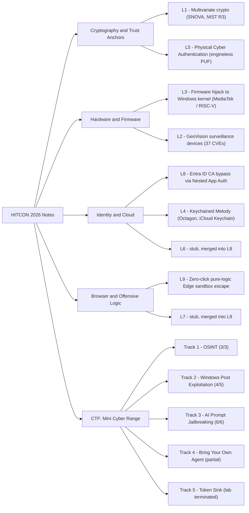

# HITCON 2026 — Field Notes & Cyber Range Writeups
# HITCON 2026 — 現場筆記與網路靶場實戰紀錄

**Theme / 大會主題:** *When AI Acts: Hacking the Age of Agentic Systems*
**Dates / 日期:** 2026-08-21 – 2026-08-22
**Venue / 地點:** Academia Sinica, Taipei / 中央研究院，台北

---

## About this collection / 關於本專案

### English

This is a personal, bilingual (EN / 繁體中文) note collection taken live at **HITCON 2026**. It contains **nine lecture folders — seven of them substantive write-ups** — plus a full set of writeups from the **HITCON Mini Cyber Range** (TRAPA CYBER ZONE) that ran alongside the conference.

The talks span the whole width of the 2026 programme: post-quantum multivariate signatures heading into NIST Round 3, embedded surveillance-device vulnerability research, peripheral firmware reaching all the way into the Windows kernel, Apple's iCloud trust graph, engineless hardware PUFs, Entra ID Conditional Access bypasses, and a zero-click pure-logic Microsoft Edge sandbox escape. The conference theme — *When AI Acts* — runs through most of them: AI as the attacker's tooling (MCP-driven reverse engineering), AI as the thing being attacked (prompt jailbreaking, agent supply chains), and human logic as the thing AI still cannot replace (Orange Tsai's chain).

A reader gets: a structured, deeply detailed record of each talk in two languages; the technical mechanism behind each attack rather than just its headline; honest, self-critical writeups of five live cyber-range tracks including the ones that were not fully solved; and explicit flags wherever a live-noted detail could not be verified against the public record.

### 繁體中文

本專案為 **HITCON 2026** 現場所作的個人雙語（英文／繁體中文）筆記合輯，收錄 **九個講次資料夾——其中七篇為完整詳述**，以及大會同期舉辦之 **HITCON Mini Cyber Range**（TRAPA CYBER ZONE）五條賽道的完整實戰紀錄。

內容橫跨 2026 議程的全部光譜：即將進入 NIST 第三輪的後量子多變數簽章、嵌入式監控設備漏洞研究、由周邊韌體一路打進 Windows 核心的攻擊鏈、Apple iCloud 信任圖譜、無引擎硬體 PUF、Entra ID 條件式存取繞過，以及一條純邏輯的 Microsoft Edge 零點擊沙箱逃逸鏈。大會主題「當 AI 開始行動」貫穿其中：AI 作為攻擊者的工具（MCP 驅動的逆向工程）、AI 作為被攻擊的對象（提示詞越獄、代理供應鏈），以及 AI 目前仍無法取代的人類邏輯推理。

讀者可以獲得：每場演講的雙語結構化深度紀錄、每個攻擊背後的實際機制而非僅止於標題、五條實戰賽道誠實而不美化的成果紀錄（包含未能完成的部分），以及所有無法對照公開紀錄查證之處的明確標註。

---

## How to use this repository / 如何閱讀本專案

### Layout / 目錄結構

| Path / 路徑 | Contents / 內容 |
|---|---|
| `lecture-N-<slug>/` | One folder per talk, holding a single bilingual markdown file of the same name / 每場演講一個資料夾，內含一份同名雙語 markdown |
| [`CTF/`](./CTF) | Mini Cyber Range writeups, platform architecture notes, and helper scripts / 網路靶場實戰紀錄、平台架構分析與輔助腳本 |
| [`CTF/scripts/`](./CTF/scripts) | Six helper scripts + a wordlist used during the range / 靶場期間使用的六支輔助腳本與一份字典檔 |
| [`assets/`](./assets) | Screenshots and images referenced from the notes / 筆記引用之截圖與圖片 |
| [`future-possible-implementation-visions.md`](./future-possible-implementation-visions.md) | Cross-cutting synthesis — ideas that span more than one talk / 跨講次綜合整理：橫跨多場演講的延伸構想 |

### Shared internal structure / 各講次的共同結構

Every lecture file follows the same skeleton, so you can jump straight to the depth you want:

每一份講次筆記都採用相同骨架，可依需要直接跳到對應深度：

1. **Speaker Information & Topic / 講者資訊與演講主題** — who spoke, affiliation, background.
2. **Quick Summary / 內容簡要** — one dense paragraph per language; read this first if you are triaging.
3. **Structured Lecture Context / 結構化演講內容** — the bulk of the file, section by section.
4. **Conclusion / 結論** and **Possible Implementation & Extension / 延伸實作與未來方向**.
5. **Bilingual Transcript / 雙語對照逐字稿** where one was captured.
6. **Resources & contacts / 參考資源與聯絡方式** at the end, which separates **verified** links (checked against the public record) from **unverified** pointers (as-heard, kept for traceability).

### Conventions / 體例

- **Bilingual throughout.** Headings use the `English Title / 中文標題` form; body sections are given in English first, then 繁體中文. Neither language is a machine translation of the other — both were written from the same notes.
- **Mermaid diagrams.** Several lecture files embed mermaid flowcharts for attack chains and trust models. These render natively on GitHub and in MkDocs (with the mermaid plugin); no build step is needed to read them on GitHub.
- **Correction callouts.** Where a live-noted detail was later checked and found wrong, the file opens with a `> **Note / 校訂**` block explaining exactly what changed and why.

---

## Lecture index / 講次索引

| # | Talk (EN) | 講題（中文） | Speaker / 講者 | Theme / 領域 | Link |
|---|---|---|---|---|---|
| 1 | Multivariate Cryptography and Digital Signatures | 多變數密碼學與數位簽章 | Lih-Chung Wang 王立中 (NDHU / 鴻海研究院) | Post-quantum cryptography, SNOVA (NIST Round 3) | [lecture-1](./lecture-1-multivariate-cryptography/lecture-1-multivariate-cryptography.md) |
| 2 | When Your Surveillance System Is Watching You: Breaking Into GeoVision Devices in the Age of AI | 當你的監視系統在監視你：在 AI 時代侵入 GeoVision 設備 | Philippe Laulheret (Cisco Talos) | Embedded / IoT vulnerability research, AI-assisted RE (14 advisories, 37 CVEs) | [lecture-2](./lecture-2-surveillance-ai/lecture-2-surveillance-ai.md) |
| 3 | Hijacking a Firmware to Attack the Windows Kernel | 劫持韌體以攻擊 Windows 核心 | Nicolas | Peripheral firmware → OS kernel; MediaTek Wi-Fi/BT on Andes RISC-V | [lecture-3](./lecture-3-firmware-hijack/lecture-3-firmware-hijack.md) |
| 4 | Keychained Melody — Grabbing the Keys to the iCloud Kingdom | Keychained Melody — 奪取 iCloud 王國的鑰匙 | Jaron Bradley (Jamf Threat Labs) with Alex Radocea | Apple "Octagon" trust graph, iCloud Keychain escrow | [lecture-4](./lecture-4-macos-trust/lecture-4-macos-trust.md) |
| 5 | Physical Cyber Authentication (PCA): Engineless PUF and Blockchain of Chips | 物理網路認證技術：無引擎 PUF 與晶片區塊鏈 | H. Watanabe (SDC) | Hardware root of trust, PUF, supply-chain integrity | [lecture-5](./lecture-5-physical-cyber-authentication/lecture-5-physical-cyber-authentication.md) |
| 6 | *(merged stub → Lecture 8)* | *（已併入第八講，僅留指向）* | — | Entra ID Conditional Access bypass | [lecture-6](./lecture-6-ca-bypass/lecture-6-ca-bypass.md) |
| 7 | *(merged stub → Lecture 9)* | *（已併入第九講，僅留指向）* | — | Microsoft Edge exploit chain | [lecture-7](./lecture-7-edge-rce/lecture-7-edge-rce.md) |
| 8 | CA Bypass Model & Nested App Authentication (NAA) | 條件式存取繞過模型與巢狀應用程式認證 | Presented as "DeCraft" *(attribution unverified)* | Enterprise identity, Entra ID, OAuth delegation | [lecture-8](./lecture-8-nested-app-auth/lecture-8-nested-app-auth.md) |
| 9 | ↖乂古法挖洞乂↘ — a pure-logic zero-click Microsoft Edge sandbox escape chain | `↖乂古法挖洞乂↘ ~~ 純邏輯 Microsoft Edge 零點擊沙箱逃逸鏈 ~~` | Orange Tsai 蔡政達 (DEVCORE) | Browser security, logic-bug chaining, Pwn2Own Berlin 2026 | [lecture-9](./lecture-9-browser-jailbreak/lecture-9-browser-jailbreak.md) |

### Notes on the index / 索引說明

- **Lectures 6 and 7 are pointer stubs.** Two talks were originally taken down twice under different working titles. The duplicates have been merged: **6 → 8** (Conditional Access / NAA) and **7 → 9** (Microsoft Edge). Both folders still exist and both links resolve; each stub simply points to the merged file. Read **8** and **9**, not 6 and 7.
- **Lecture 9's title was wrong in the first draft.** The talk is **not** "One Click to Rule Them All: Handcrafted Microsoft Edge Browser RCE" — no such title exists. It is 「`↖乂古法挖洞乂↘ ~~ 純邏輯 Microsoft Edge 零點擊沙箱逃逸鏈 ~~`」, a **zero-click (零點擊) pure-logic sandbox escape chain** demonstrated at **Pwn2Own Berlin 2026**: four chained logic bugs, **US$175,000**, **Master of Pwn**, and the first full-chain Chromium success at Pwn2Own in ten years. It was not a Black Hat USA talk.
- **Lecture 4's original label was mine, not the speaker's.** "Vulnerability Assessment of macOS Trust Systems" was the note-taker's working label; the real agenda title is "Keychained Melody — Grabbing the Keys to the iCloud Kingdom."

### Suggested reading paths / 建議閱讀路徑

**Cryptography / 密碼學** — **1 → 5**
Start with multivariate signatures and SNOVA for the mathematics of post-quantum authentication, then read PCA to see the same problem — proving identity — solved in silicon instead of in algebra. Together they frame "trust anchored in hard maths" against "trust anchored in physics."

**Hardware & firmware / 硬體與韌體** — **3 → 2 → 5**
Lecture 3 is the deepest: RISC-V firmware, PMP bypass, kernel heap overflow, side-channel address leak. Lecture 2 then shows the same class of bugs at product scale across a real vendor's line. Lecture 5 closes the loop with the defensive proposal — a hardware root of trust cheap enough to actually ship on commodity IoT.

**Identity & cloud / 身分與雲端** — **8 → 4**
Lecture 8 is the enterprise-side story: Conditional Access, broker clients, token delegation, and how a UX-optimisation framework dissolves a zero-trust boundary. Lecture 4 is the consumer-side mirror: Apple's own delegation and escrow graph, and what happens when a device can quietly rewrite trust state.

**Browser & offensive tradecraft / 瀏覽器與攻擊實務** — **9 → 3**
Read 9 first as a masterclass in logic-bug chaining with no memory corruption at all, then 3 for the contrast — the same goal (code execution on the host) reached through classic memory-safety exploitation.

**AI security / AI 安全** — **[CTF AI tracks](./CTF/ai-prompt-jailbreaking.md) → 2 → 9 → [BYO Agent](./CTF/byo-agent.md)**
The prompt-jailbreaking track is AI as the target; lecture 2 is AI as the researcher's tooling (an MCP server driving IDA Pro, Playwright, and payload synthesis); lecture 9 is the counter-argument that AI still cannot chain logic bugs; and the Bring-Your-Own-Agent track is AI on the defensive side, doing live incident remediation.

---

## Achievements / 實戰成果

### HITCON Mini Cyber Range — TRAPA CYBER ZONE™

The conference ran a live blue-team cyber range on the **TRAPA CYBER ZONE** platform (`hitcon2026.trapa.zone`). The scenario: a domestic security-solutions vendor with government and financial clients is hit by a foreign APT — leaked credentials, convincing phishing, a compromised AI coding assistant, and probing of the company's own AI systems. Players join the IR team, trace the alerts, reconstruct the chain, and execute incident response. Five tracks, 201 participants.

大會同期舉辦以 **TRAPA CYBER ZONE** 平台建置的藍隊實戰靶場。情境設定為一家服務政府與金融客戶的資安廠商遭受境外 APT 攻擊——憑證外洩、精準釣魚、AI 編碼助手供應鏈污染，以及對該公司自身 AI 系統的探測。參賽者加入 IR 團隊，追蹤告警、還原攻擊鏈並執行應變。共五條賽道、201 名參賽者。

*Scoreboard, HITCON Mini Cyber Range — account **HIT26030** (marked **YOU**), **rank #10** with **800 points**, **5 tracks active**, **40% overall progress**, out of **201 participants**; last activity Fri 21 Aug, 1:48 PM. The rows immediately above sit at 1,400 and 1,200 points.*
*記分板：帳號 **HIT26030**（標記為 **YOU**），於 **201 名參賽者**中排名 **第 10**，**800 分**，**5 條賽道進行中**，整體進度 **40%**；最後活動時間為 8 月 21 日（五）下午 1:48。上方名次分別為 1,400 與 1,200 分。*

*Sign-in to **TRAPA CYBER ZONE™ — Blue Team Training** at `hitcon2026.trapa.zone`, using the registered account **`HIT26030@trapa.training`**, with the Cloudflare Turnstile check passed ("Success!"). **This screenshot is included for provenance:** it shows that the scoreboard result above belongs to a properly credentialed, authorised participant working from their own registered HITCON account — not someone reposting another player's results.*
*登入 **TRAPA CYBER ZONE™ — Blue Team Training**（`hitcon2026.trapa.zone`），使用本人註冊帳號 **`HIT26030@trapa.training`**，Cloudflare Turnstile 驗證已通過（「Success!」）。**此截圖用於佐證來源：** 上方記分板成績確實屬於一名經正式註冊、具備合法憑證的參賽者，由本人帳號實際操作取得，而非轉貼他人成績。*

### Track results / 各賽道成果

| # | Track / 賽道 | Points | Result / 結果 |
|---|---|---|---|
| 1 | Open Source Intelligence | 300 | ✅ **3/3 solved** |
| 2 | Windows Post Exploitation (Operation SILKTHREAD) | 600 | 🟡 **4/5 answers**; final task unresolved — host unreachable |
| 3 | AI — Prompt Jailbreaking | 500 | ✅ **6/6 solved** |
| 4 | AI — Bring Your Own Agent | 1000 | 🟡 Partial — **8/19 findings remediated**, **12/12 business functions restored** |
| 5 | AI — The Token Sink | 800 | 🟠 Protocol **fully reverse-engineered**; lab auto-terminated before the solve could land |

**Honestly stated:** two tracks fully solved (OSINT, Prompt Jailbreaking), one at 4/5, one partial, one blocked at the platform rather than at the puzzle. Two structural blockers shaped the outcome, and both are worth recording:

- **The live labs were IP-allowlisted to on-site HITCON Wi-Fi only.** The platform and API (`hitcon2026.trapa.zone`) were reachable from anywhere, but the lab hosts (`lab.trapa.zone`) rejected any off-site address with `Client ip not in allowlist` — which also froze browser automation. Flag *submission* was not IP-gated, but the machines you needed to touch were.
- **One lab terminated permanently.** The Token Sink lab auto-terminated on a timer and could not be restarted, so a fully reversed protocol and a working solver never got the chance to submit. The reverse-engineering work is preserved in [`CTF/token-sink.md`](./CTF/token-sink.md) and [`CTF/scripts/tokensink_solver.py`](./CTF/scripts/tokensink_solver.py).

**誠實記錄：** 兩條賽道完全解出（OSINT、提示詞越獄），一條 4/5，一條部分完成，一條卡在平台限制而非題目本身。兩項結構性阻礙值得一併記下：其一，實驗環境（`lab.trapa.zone`）僅允許 HITCON 現場 Wi-Fi 的 IP 連線，場外連線一律遭拒；其二，Token Sink 實驗環境依計時器自動終止且無法重啟，導致已完成的協定逆向與求解器再無提交機會。

Full writeups, including the failed and partial attempts, are in [`CTF/README.md`](./CTF/README.md).

---

## At a glance / 數字一覽

| Metric / 項目 | Value / 數值 |
|---|---|
| Conference days / 大會天數 | 2 (2026-08-21 – 08-22) |
| Lecture folders / 講次資料夾 | 9 (7 substantive + 2 merged stubs) |
| Lecture note lines / 講次筆記行數 | ~2,480 |
| CTF markdown documents / 靶場文件 | 8 (README, index, 5 track writeups, 1 architecture note) |
| CTF helper scripts / 輔助腳本 | 6 (`.sh` ×4, `.py` ×1, `.js` ×1) + 1 wordlist |
| Cyber range tracks / 靶場賽道 | 5 |
| Tracks fully solved / 完全解出 | 2 |
| Final rank / 最終名次 | #10 of 201 — 800 points |
| Screenshots in `assets/` / 截圖 | 2 |
| Languages per file / 每份文件語言 | 2 (EN / 繁體中文) |

---

## Map of the collection / 專案地圖

---

## Conventions & caveats / 體例與注意事項

### English

- **These are live notes.** Everything here was written while listening, then cleaned up afterwards. Speaker names, affiliations, CVE numbers, talk titles, and numeric figures are recorded **as heard**, and some of them were misheard. Treat any specific number in these files as a claim to check, not a citation.
- **Several details have been corrected against the public record**, and every correction is declared in-file with a `> **Note / 校訂**` callout at the top of the affected lecture — stating what the original draft said, what the correct value is, and why. See lecture 4 (a CVE ID, the research attribution, and the talk title) and lecture 8 (speaker attribution and a broker-app count) for worked examples.
- **Unverified material is kept, not deleted.** Where a claim could not be confirmed, it is retained and labelled *(as heard; unverified)* rather than silently dropped — so the note stays traceable back to what was actually said in the room.
- **Resources sections mark their own confidence.** Each lecture's closing resources list separates links that were verified against primary sources from pointers that are unverified leads.
- **Nothing here is an official HITCON transcript.** No affiliation with HITCON, the speakers, or their employers is claimed or implied. All original research belongs to the named researchers.
- **No secrets are committed.** The cyber-range writeups deliberately omit session tokens; the scripts read the platform JWT from `$TRAPA_JWT` at runtime.

### 繁體中文

- **本文為現場即時筆記。** 所有內容皆為聆聽當下記錄、事後整理而成。講者姓名、所屬機構、CVE 編號、演講標題與各項數字均為**現場聽記**，其中部分確有聽錯。文中任何具體數字均應視為待查證的說法，而非可引用的來源。
- **部分細節已對照公開紀錄修訂**，且每一處修訂都在該講次檔案開頭以 `> **Note / 校訂**` 區塊明確聲明，說明原稿寫法、正確內容與修訂理由。可參見第四講（CVE 編號、研究歸屬、演講標題）與第八講（講者歸屬、Broker 應用程式數量）。
- **無法查證的內容予以保留而非刪除**，並標註為「現場聽記，未經查證」，以確保筆記可回溯至現場實際所述。
- **參考資源區段自行標示可信度**，將已對照第一手來源查證的連結與尚未查證的線索分開列示。
- **本文並非 HITCON 官方逐字稿**，與 HITCON、講者及其所屬機構無任何關聯。所有原創研究成果均歸屬於文中具名之研究者。
- **未提交任何機敏資訊。** 靶場紀錄刻意省略 session token，腳本於執行時自環境變數 `$TRAPA_JWT` 讀取平台憑證。
