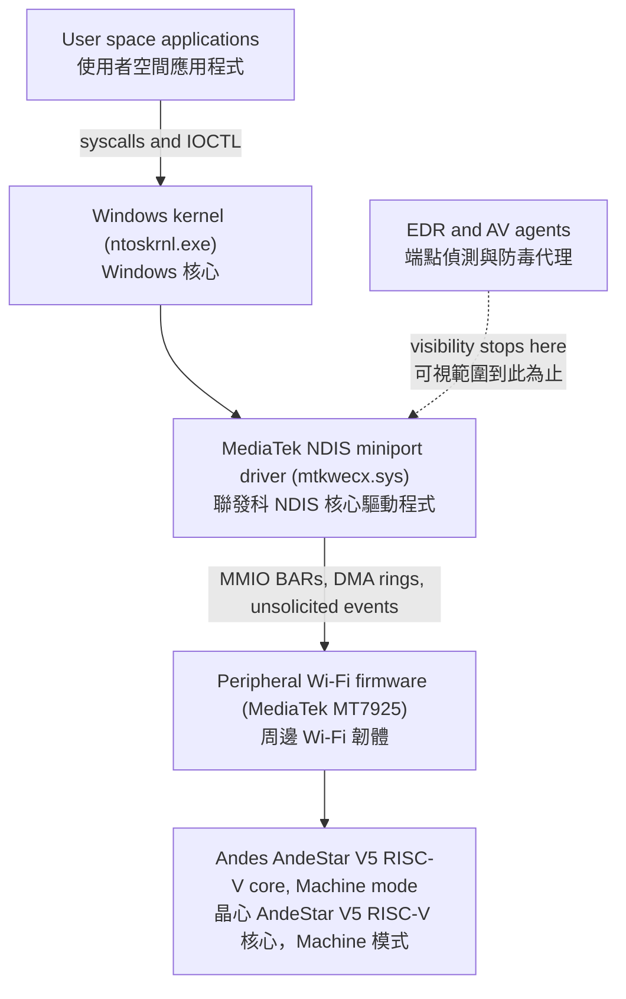
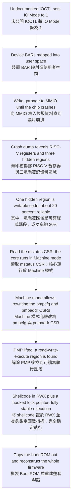
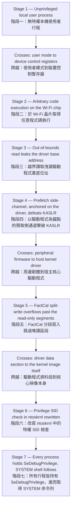
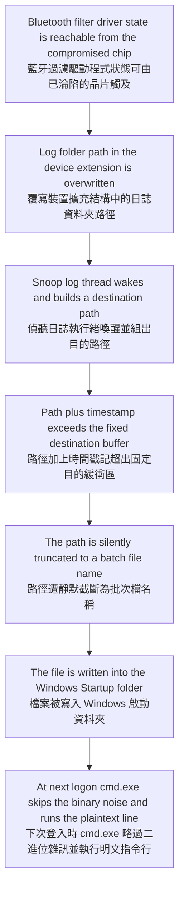
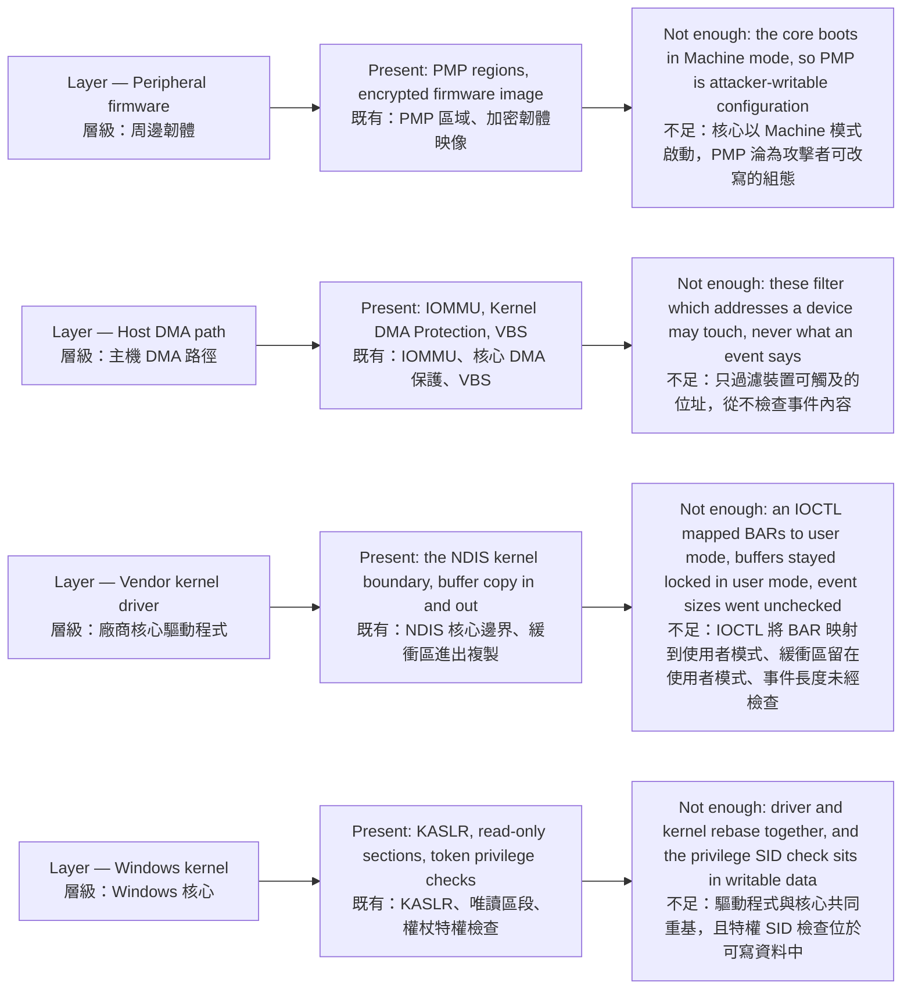

# Lecture 3: Hijacking a Firmware to Attack the Windows Kernel

# 第三講：劫持韌體以攻擊 Windows 核心

> **Note / 校訂：** Three as-heard details in these notes have been reconciled against the public record after the talk.
> (1) The speaker's name is **Nicola Stauffer** (ZHAW Institute of Computer Science, Winterthur), presenting joint work with his supervisor **Gürkan Gür**; the notes' "Nicholas/Nicolas" was a mishearing. The session's full agenda title is **"Overkill: Hijacking a Firmware to Attack the Windows Kernel"**.
> (2) The `FactCal` bug is a **bounds-check failure in the driver's global `.data` section** (the calibration array is a global, not a heap allocation). The notes' phrase "kernel heap overflow" is retained below where it appears as spoken, but the mechanism is a data-section overflow — which is precisely why the linear-overflow / split-write problem described in §3.4 arises at all.
> (3) The "JPEG ID" heard in §3.3 is the **JEDEC vendor ID**, read from the RISC-V `mvendorid` CSR.
> 本節校訂三處聽寫細節：(1) 講者為 **Nicola Stauffer**（瑞士 ZHAW 電腦科學研究所），與其指導教授 **Gürkan Gür** 共同發表；議程完整標題為 **"Overkill: Hijacking a Firmware to Attack the Windows Kernel"**。(2) `FactCal` 漏洞屬於驅動程式全域 **`.data` 資料段**的邊界檢查缺失（校準陣列為全域變數，並非堆積配置），故本文保留「核心堆疊溢位」之口述用語，惟實際機制為資料段溢位。(3) §3.3 所稱之「JPEG ID」實為自 RISC-V `mvendorid` CSR 讀出的 **JEDEC 廠商識別碼**。

---

## 1. Speaker Information & Topic / 講者資訊與演講主題

### English
* **Speaker:** **Nicola Stauffer** (recorded in these notes as "Nicholas/Nicolas")
  * **Background:** Security researcher at the Zurich University of Applied Sciences (ZHAW), Institute of Computer Science (InIT), Winterthur, Switzerland, specializing in Windows kernel boundaries, low-level hardware security, and peripheral firmware exploitation. He conducted this work under the guidance of his senior lecturer and academic supervisor, **Gürkan Gür** (ZHAW InIT), who is co-author of the accompanying white paper.
* **Topic:** **Overkill: Hijacking a Firmware to Attack the Windows Kernel** (劫持韌體以攻擊 Windows 核心)
* **Lecture Duration:** 40-minute deep-dive presentation delivered at HITCON 2026 (Room R2, 12:50–13:30). The same research was also presented as "Overkill: Hijacking a Wi-Fi 7 Chip for SYSTEM Privileges" at Black Hat Asia 2026 and is listed for TyphoonCon 2026.

### 繁體中文
* **講者：** **Nicola Stauffer**（本筆記原記為「Nicholas / Nicolas」）
  * **專業背景：** 瑞士蘇黎世應用科技大學（ZHAW）電腦科學研究所（InIT，位於溫特圖爾）資安研究員，專精於 Windows 核心安全邊界、底層硬體安全以及周邊設備韌體漏洞利用。他在其高級講師與學術指導教授 **Gürkan Gür**（ZHAW InIT）的帶領下完成此項研究，Gür 亦為隨附白皮書之共同作者。
* **主題：** **Overkill：劫持韌體以攻擊 Windows 核心** (Overkill: Hijacking a Firmware to Attack the Windows Kernel)
* **演講性質：** 於 HITCON 2026 發表之 40 分鐘深度技術演講（R2 會議室，12:50–13:30）。同一份研究亦以 "Overkill: Hijacking a Wi-Fi 7 Chip for SYSTEM Privileges" 為題於 Black Hat Asia 2026 發表，並列入 TyphoonCon 2026 議程。

---

## 2. Quick Summary / 內容簡要

### English
This lecture details an end-to-end exploit chain that targets the security boundaries between peripheral firmware and the Windows kernel. Nicolas explores how vulnerabilities in MediaTek Wi-Fi and Bluetooth chipsets can be leveraged to fully compromise the host Windows operating system. He demonstrates how to break into encrypted MediaTek Wi-Fi firmware running on an Andes Technology RISC-V processor (AndeStar V5 architecture), bypass Physical Memory Protection (PMP), and achieve 100% stable shellcode execution. Leveraging this control, he launches a kernel heap overflow attack via unsolicited MediaTek calibration events (`FactCal`), leaks kernel addresses through a modified prefetch side-channel optimized for AMD CPUs, and overrides system-level privileges (`SeDebugPrivilege`) in `ntoskrnl` to spawn a SYSTEM shell on Windows. Finally, he outlines an unauthenticated, data-only Bluetooth file-write truncation attack using `asprintf` buffer limits to write malicious batch files directly into the Windows Startup folder.

### 繁體中文
本演講詳細剖析了一條針對周邊硬體韌體與 Windows 核心之間安全邊界的完整漏洞利用鏈（Exploit Chain）。Nicolas 展示了如何利用聯發科（MediaTek）Wi-Fi 與藍牙晶片韌體中的安全漏洞，進一步徹底攻破宿主 Windows 作業系統。他介紹了如何入侵運行於晶心科技（Andes Technology）RISC-V 處理器（AndeStar V5 架構）上的加密聯發科 Wi-Fi 韌體，繞過物理記憶體保護（PMP），並實現 100% 穩定的 shellcode 執行。以此為控制點，他透過聯發科的主動式校準事件（`FactCal`）發動核心堆疊溢位（Kernel Heap Overflow）攻擊，透過針對 AMD CPU 優化後的自訂預取側通道（Prefetch Side-channel）洩漏核心位址，並覆寫 `ntoskrnl` 中的系統級權限（`SeDebugPrivilege`）以在 Windows 上直接取得 SYSTEM 權限命令列。最後，他提出了一種新型、無須身份驗證的「僅限數據」藍牙檔案寫入截斷攻擊，利用 `asprintf` 的緩衝區限制，將惡意批次檔直接寫入 Windows 的「啟動」資料夾中。

---

## 3. Structured Lecture Context (Extremely Detailed) / 結構化演講內容（極致詳細）

### 3.1 Background of Firmware Exploitation on Windows / Windows 系統下韌體漏洞利用之背景與動機

#### English
* **Redefining the Firmware Attack Surface:** In the context of modern personal computing, "firmware" refers to the low-level execution code running on independent peripheral microcontrollers and co-processors, such as those on GPUs, NPUs, Wi-Fi modules, and Bluetooth chipsets. These peripherals run on their own Application-Specific Integrated Circuits (ASICs) and distinct processor architectures, operating entirely separate from the host OS.
* **A Security Unicorn and Blind Spot:** Firmware-level exploits are often considered the "unicorns" of security research—extremely powerful, rarely observed, and heavily under-researched. While firmware target research is highly popular on Android systems, modern Windows systems represent a virtual vacuum. This lack of research makes firmware a dangerous blind spot: no endpoint detection and response (EDR) agents or antivirus (AV) software can monitor memory, register state, or execution context inside peripheral microprocessors.
* **The Paradigm Shift:** As modern OS kernels harden their core defenses, attackers are forced to pivot downstream. Hijacking peripheral firmware allows attackers to achieve persistent execution, evade EDR/AV monitors, and execute post-exploitation activities like stealthy user tracking (via background SSID scanning) and kernel-level backstabbing.

#### 繁體中文
* **重新定義韌體攻擊面：** 在現代個人電腦系統中，「韌體」是指運行在獨立周邊微控制器和協處理器上的底層執行代碼，例如 GPU、NPU、Wi-Fi 模組和藍牙晶片上的代碼。這些周邊設備在自己專屬的特殊應用積體電路（ASIC）和處理器架構上運行，與宿主作業系統完全獨立。
* **資安的獨角獸與盲區：** 韌體級漏洞利用常被視為資安研究中的「獨角獸」——極其強大、罕見且研究嚴重不足。雖然針對韌體的攻擊在 Android 系統上非常熱門，但在現代 Windows 系統上幾乎是個空白。這使韌體成為一個危險的防禦盲區：沒有任何端點偵測與回應（EDR）代理或防毒（AV）軟體能夠監控周邊微處理器內部的記憶體、暫存器狀態或執行上下文。
* **範式轉移：** 隨著現代作業系統核心不斷加強其核心防禦，攻擊者被迫將目光投向「下游」。劫持周邊設備韌體能讓攻擊者實現持久化執行、繞過 EDR/AV 監控，並進行後滲透攻擊（Post-exploitation），例如隱蔽地進行使用者追蹤（透過背景 SSID 掃描）和核心級反噬攻擊。

#### Diagram 3.1 — Where the boundary is supposed to sit / 圖 3.1：安全邊界應該落在哪裡

**Caption / 圖說:** The peripheral is a second computer with its own CPU and its own highest privilege level. Everything below the driver is outside the reach of host endpoint security — the firmware-to-driver link is a trust boundary in practice but is designed as if it were a trusted internal channel.
周邊設備本身即為一台擁有獨立 CPU 與最高權限級別的第二台電腦。驅動程式以下的一切都超出宿主端點安全產品的可視範圍——韌體與驅動程式之間實為安全邊界，設計上卻被當作可信任的內部通道。

---

### 3.2 PCIe Architecture and Memory-Mapped IO (MMIO) Basics / PCIe 架構與記憶體映射輸入輸出（MMIO）基礎

#### English
* **PCIe Communication Channels:** When a host Windows operating system communicates with a PCIe peripheral, it operates across two logical planes:
  * **Data Plane:** Consists of Direct Memory Access (DMA) ring buffers. These are shared memory buffers where data is rapidly exchanged between the host RAM and the device.
  * **Configuration Plane:** Composed of Base Address Registers (BARs) used by the kernel to configure device parameters, register DMA address spaces, and manage message-signaled interrupts (MSIs) that alert the kernel when a device completes processing.
* **MMIO Mapping in the Kernel:** To allow a device driver to interact with the device's configuration plane:
  1. The hardware BAR register is mapped to physical address space by the Windows Kernel.
  2. The device driver calls kernel APIs such as `MmMapIoSpace` or `MmMapIoSpaceEx`.
  3. These functions return a virtual address mapping directly to the BAR registers, granting the device driver full write and read capabilities over the device's control registers.
* **MediaTek Wi-Fi Driver DMA Architecture:** The MediaTek Wi-Fi driver implements three primary DMA ring buffers:
  * **Transmit (Tx) Ring:** Outbound data transfer.
  * **Receive (Rx) Ring:** Inbound data transfer.
  * **Control & Event Rings:** Exchanging command inputs and status events (such as signal status changes) between the firmware and the kernel.

#### 繁體中文
* **PCIe 通訊管道：** 當 Windows 宿主作業系統與 PCIe 周邊設備通訊時，它在兩個邏輯平面上運作：
  * **數據平面 (Data Plane)：** 由直接記憶體存取（DMA）環形緩衝區組成。這是主機 RAM 與設備之間快速交換數據的共享記憶體緩衝區。
  * **配置平面 (Configuration Plane)：** 由基底位址暫存器（BAR）組成，核心利用它配置設備參數、註冊 DMA 位址空間，並管理訊息訊號中斷（MSI），以便在設備完成處理時通知核心。
* **核心中的 MMIO 映射：** 為了讓設備驅動程式能與設備的配置平面互動：
  1. 硬體 BAR 暫存器被 Windows 核心映射到實體位址空間。
  2. 設備驅動程式調用核心 API（如 `MmMapIoSpace` 或 `MmMapIoSpaceEx`）。
  3. 這些函數返回直接映射到 BAR 暫存器的虛擬位址，從而賦予設備驅動程式對設備控制暫存器的完全讀寫能力。
* **聯發科 Wi-Fi 驅動程式 DMA 架構：** 聯發科 Wi-Fi 驅動程式實作了三個主要的 DMA 環形緩衝區：
  * **發送 (Tx) 環：** 用於外發數據傳輸。
  * **接收 (Rx) 環：** 用於傳入數據傳輸。
  * **控制與事件環 (Control & Event Rings)：** 用於在韌體與核心之間交換命令輸入和狀態事件（例如訊號狀態變化）。

---

### 3.3 Penetrating the MediaTek Wi-Fi Firmware and Bypassing Physical Memory Protection (PMP) / 攻破聯發科 Wi-Fi 韌體與繞過實體記憶體保護（PMP）

#### English
* **Undocumented IOCTL backdoor:** MediaTek's proprietary Windows driver exposes an undocumented Input/Output Control (IOCTL) command that sets the driver's "IO Mode" parameter to `1`. This critical security flaw maps the device's physical Base Address Registers (BARs) directly into user-mode address space, completely bypassing the Network Driver Interface Specification (NDIS) kernel boundary. Any unprivileged local user can write directly to the device's MMIO control registers.
* **Confirming the RISC-V Architecture:** By writing random garbage data into the exposed MMIO space, the researchers triggered a physical peripheral crash. Analyzing the resulting kernel dump revealed two critical elements:
  * RISC-V CPU registers (confirming that the Wi-Fi chip runs a RISC-V microprocessor).
  * A stack trace containing three undocumented memory regions utilized by the dump function.
* **Finding the Code Write Backdoor:** Cross-referencing the core dump addresses with the stack trace revealed that the `0xE` memory region was a writable code section. Although writing directly to this code section triggered an immediate hardware assert (resulting in a low execution success rate of ~20%), it proved that user-mode code could directly overwrite execution code on the Wi-Fi chip.
* **RISC-V Control and Status Registers (CSRs):** In RISC-V, CSRs are dedicated registers that configure hardware behaviors. By examining the `mstatus` register, the researchers confirmed the CPU was executing in **Machine Mode** (the highest possible privilege level, superior to Supervisor and User modes), granting them complete authority over the chip's internal states.
* **The 20-Byte Reconnaissance Shellcode:** To evaluate the execution environment within the constraints of the 20-value hardware assert limits, Nicolas wrote a 20-byte shellcode that:
  1. Extracted the JEDEC vendor ID of the microprocessor (heard in the talk as "JPEG ID"; it is read from the RISC-V `mvendorid` CSR), resolving to **Andes Technology (晶心科技)**, a prominent Taiwanese vendor.
  2. Retrieved the Instruction Set Architecture (ISA) support register, revealing compatibility with the **AndeStar V5** instruction set.
* **Bypassing Physical Memory Protection (PMP):** AndeStar V5 implements Physical Memory Protection (PMP) as a secure alternative to an MMU for embedded devices. PMP configures permissions (Read, Write, Execute) for physical memory zones using the `pmpcfg` (PMP config) and `pmpaddr` (PMP address) CSRs.
  * *Exploitation:* By writing shellcode to modify the `pmpcfg` configuration, the researchers bypassed PMP constraints and discovered a fully executable Read-Write-Execute (RWX) memory region.
  * *Stable Code Execution:* By writing shellcode to this RWX region and overwriting a key OS lock function pointer, they bypassed the hardware assert limits entirely, achieving **100% stable, reliable shellcode execution** on the Wi-Fi chip.
  * *ROM Extraction:* A small shellcode was then executed to copy the chip's internal, encrypted boot ROM into the core dump region, allowing the researchers to fully reconstruct and analyze the entire firmware.

#### 繁體中文
* **未公開的 IOCTL 後門：** 聯發科專有的 Windows 驅動程式暴露了一個未公開的輸入/輸出控制（IOCTL）命令，可將驅動程式的「IO Mode」參數設置為 `1`。這個嚴重的安全缺陷將設備的實體基底位址暫存器（BAR）直接映射到用戶模式位址空間，完全繞過了網絡驅動程式介面規範（NDIS）的核心邊界。任何未經授權的本地用戶皆可直接寫入設備的 MMIO 控制暫存器。
* **確認 RISC-V 架構：** 藉由向暴露的 MMIO 空間寫入隨機垃圾數據，研究團隊引發了實體周邊設備崩潰。分析隨之產生的核心傾印檔案（Kernel Dump）發現了兩個關鍵要素：
  * RISC-V CPU 暫存器（證實該 Wi-Fi 晶片運行一個 RISC-V 微處理器）。
  * 包含三個未公開記憶體區域的堆疊軌跡（Stack Trace），這些區域被傾印功能所使用。
* **尋找程式碼寫入後門：** 將核心傾印位址與堆疊軌跡進行交叉比對，發現 `0xE` 記憶體區域是一個可寫的程式碼段（Code Section）。雖然直接向該程式碼段寫入會引發硬體斷言（Assert）導致執行成功率僅約 20%，但這證明了用戶模式代碼可以直接覆寫 Wi-Fi 晶片上的執行代碼。
* **RISC-V 控制與狀態暫存器 (CSR)：** 在 RISC-V 架構中，CSR 是配置硬體行為的專用暫存器。藉由分析 `mstatus` 暫存器，研究人員確認 CPU 當時正運行於 **Machine Mode**（最高權限級別，高於 Supervisor 和 User 模式），這賦予了他們對晶片內部狀態的絕對控制權。
* **20 位元組探路 Shellcode：** 為了在 20 個數值的硬體斷言限制下評估執行環境，Nicolas 編寫了一個 20 位元組的 shellcode，其主要功能為：
  1. 提取微處理器廠商的 JEDEC 廠商識別碼（演講中聽為「JPEG ID」，實際係自 RISC-V `mvendorid` CSR 讀出），解析為台灣知名的晶片設計廠商——**晶心科技 (Andes Technology)**。
  2. 讀取指令集架構（ISA）支援暫存器，揭示其與 **AndeStar V5** 指令集的相容性。
* **繞過實體記憶體保護 (PMP)：** AndeStar V5 實作了實體記憶體保護（PMP），作為嵌入式設備替代 MMU 的安全方案。PMP 使用 `pmpcfg`（PMP 配置）與 `pmpaddr`（PMP 位址）控制和狀態暫存器（CSR）來配置實體記憶體區域的權限（讀、寫、執行）。
  * *漏洞利用：* 藉由編寫 shellcode 修改 `pmpcfg` 配置，研究人員繞過了 PMP 限制，並在晶片上發現了一個完全可執行的可讀寫執行（RWX）記憶體區域。
  * *穩定代碼執行：* 透過將 shellcode 寫入該 RWX 區域並覆寫關鍵的系統鎖（Lock）函數指標，他們完全繞過了硬體斷言限制，在 Wi-Fi 晶片上實現了 **100% 穩定且可靠的 shellcode 執行**。
  * *提取唯讀記憶體 (ROM)：* 隨後執行一段小型 shellcode，將晶片內部的加密啟動唯讀記憶體（Boot ROM）複製到核心傾印區域，使研究人員能夠完全重構並深入分析整套韌體。

#### Diagram 3.3 — Getting a foothold inside the chip / 圖 3.3：在晶片內部取得立足點

**Caption / 圖說:** The chip's own memory protection was never the obstacle. Because the core executes in RISC-V Machine mode, PMP is configuration the attacker can rewrite rather than a barrier the attacker must break — the encryption of the firmware image becomes irrelevant once the boot ROM can be read out.
晶片自身的記憶體保護從來不是真正的阻礙。由於核心運行於 RISC-V Machine 模式，PMP 對攻擊者而言只是可被改寫的組態，而非必須攻破的屏障——一旦能讀出 Boot ROM，韌體映像是否加密便無關緊要。

---

### 3.4 Backstabbing the Windows Kernel: Kernel Heap Overflow via FactCal Event / 反噬 Windows 核心：透過 FactCal 事件發動核心堆疊溢位

#### English
* **The Limitation of IOMMU Mitigations:** The host OS implements IOMMU to restrict a PCIe device's memory access strictly to its assigned DMA buffers, preventing raw memory dumping attacks (like those using PCI Leeches). However, IOMMU only filters physical memory addresses; it cannot inspect the logical contents of data processed by drivers. As peripheral firmware grows increasingly complex, drivers must implement extensive parsing logic to handle incoming device data, making these parsers an attractive target.
* **Unsolicited Driver Events:** While the Linux MediaTek driver implements only 8 "unsolicited events" (events sent from the device to the kernel without prior host action, such as Wi-Fi signal loss notifications), the Windows driver implements 34 distinct events.
* **The FactCal Vulnerability:** Among these, the `FactCal` (Factory Calibration) event handler, which passes calibration data from the firmware to the kernel, was found to be vulnerable. The Windows driver accepts a data size parameter directly from the firmware during this process and copies it via `memcpy` without validating the bounds. This creates a classic **Kernel Heap Overflow** — as described from the stage; per the published white paper the target is more precisely the driver's global `.data` section (`factCalAddData`, reached from `nicUniEventFactCal`), which is what makes the linear-overflow problem described next unavoidable. Publicly tracked as **CVE-2026-20436**.
* **Bypassing Linear Memory Protections with Split-Write & Offset Skip:** Windows drivers are organized linearly in memory: `Read-Only Data -> Executable Code -> Read-Write Data -> Read-Only Data`. The target `FactCal` calibration array resides at the very end of the Read-Write data segment. Performing a traditional linear overflow instantly triggers a page fault (Security Fault / Access Violation) against the adjacent Read-Only data. To overcome this, Nicolas designed a multi-event "Split-Write" technique:
  * *Setup:* At OS startup, Windows automatically executes 3 default calibration events, placing the current array iterator index at `4`.
  * *Event 1 (Size 0x900):* Writes payload data just in front of the middle of the `calibration_data[4]` buffer.
  * *Event 2:* Fills the remainder of the `calibration_data[4]` space.
  * *Event 3:* Overflows the metadata boundaries to overwrite the size parameter of the adjacent `calibration_data[5]` buffer while incrementing the array iterator.
  * *Event 4:* Triggered from `calibration_data[5]`. Because its size was enlarged during Event 3, this write "jumps" entirely over the adjacent Read-Only driver boundaries, skipping the protected segments to write directly into `ntoskrnl`.
* **Privilege Escalation Target (`SeDebugPrivilege`):** In Windows, the `SeDebugPrivilege` is a high-privilege token that permits a process to bypass Access Control Lists (ACLs) to debug and access system processes. An unprivileged process with `SeDebugPrivilege` can open a handle to `winlogon.exe` and spawn a child process running with `NT AUTHORITY\SYSTEM` privileges.
  * *Exploitation:* As discovered by researcher Angelboy at Hexacon 2024, the security identifier (SID) check offset inside `ntoskrnl` is writable. By targeting this offset using Event 4, the researchers overwrote the SID requirement with a common privilege SID present in every unprivileged process (such as `SeChangeNotifyPrivilege` / bypass traverse checking). Consequently, every standard process on the system gained full `SeDebugPrivilege` capabilities.

#### 繁體中文
* **IOMMU 防禦之局限性：** 宿主作業系統實作了 IOMMU，將 PCIe 設備的記憶體存取嚴格限制在其分配的 DMA 緩衝區內，防止了原始記憶體傾印攻擊（如 PCI Leech 攻擊）。然而，IOMMU 僅過濾實體記憶體位址，無法檢查驅動程式處理之數據的邏輯內容。隨著周邊設備韌體變得越來越複雜，驅動程式必須實作大量的解析邏輯來處理傳入的設備數據，使得這些解析器成為極具吸引力的攻擊目標。
* **主動式驅動程式事件 (Unsolicited Events)：** 聯發科的 Linux 驅動程式僅實作了 8 個「主動式事件」（即在主機沒有主動要求的情況下，由設備發送給核心的事件，例如 Wi-Fi 訊號丟失通知），而 Windows 驅動程式則實作了多達 34 個不同的事件。
* **FactCal 漏洞詳情：** 在這些事件中，負責將校準數據從韌體傳遞給核心的 `FactCal`（工廠校準）事件處理器被發現存在安全漏洞。Windows 驅動程式在此過程中直接接受來自韌體的數據長度（Size）參數，並直接透過 `memcpy` 進行複製，而未對其邊界進行任何驗證。這引發了經典的**核心堆疊溢位（Kernel Heap Overflow）**——此為現場口述用語；依已發表之白皮書，實際目標為驅動程式全域 `.data` 資料段（`factCalAddData`，由 `nicUniEventFactCal` 呼叫），這正是下述線性溢位難題無可迴避的原因。此漏洞公開編號為 **CVE-2026-20436**。
* **使用「分段寫入與位移跳躍」繞過線性記憶體保護：** Windows 驅動程式在記憶體中呈線性排列：`唯讀數據 -> 可執行代碼 -> 可讀寫數據 -> 唯讀數據`。目標 `FactCal` 校準陣列位於可讀寫數據段的最末端。進行傳統的線性溢位會立即觸發針對相鄰唯讀數據的頁面錯誤（Security Fault / 記憶體非法存取）。為了解決此問題，Nicolas 設計了一種多事件「分段寫入」技術：
  * *初始狀態：* 系統啟動時，Windows 會自動執行 3 個預設的校準事件，使目前的陣列疊代器索引停留在 `4`。
  * *事件 1 (長度 0x900)：* 將 payload 寫入 `calibration_data[4]` 緩衝區中間偏前的位置。
  * *事件 2：* 填滿 `calibration_data[4]` 的剩餘空間。
  * *事件 3：* 溢位並覆寫相鄰 `calibration_data[5]` 緩衝區的長度參數，同時遞增陣列疊代器。
  * *事件 4：* 從 `calibration_data[5]` 觸發。由於其長度在事件 3 中被改大，本次寫入會完全「跳過」驅動程式相鄰的唯讀邊界，跨越受保護的網段，直接寫入核心大腦 `ntoskrnl`。
* **權限提升目標 (`SeDebugPrivilege`)：** 在 Windows 系統中，`SeDebugPrivilege` 是一個高權限特權，允許程序繞過存取控制清單（ACL）以偵錯並存取任何系統程序。擁有該特權的低權限程序可以開啟指向 `winlogon.exe` 的控制代碼（Handle），並繁衍出一個具備 `NT AUTHORITY\SYSTEM` 權限的子程序。
  * *漏洞利用：* 正如研究員 Angelboy 在 Hexacon 2024 上發表的成果，`ntoskrnl` 內部的安全性識別碼（SID）檢查偏移量是可寫的。藉由利用事件 4 鎖定該偏移量，研究人員將 SID 要求覆寫為每個低權限程序都擁有的通用特權 SID（例如 `SeChangeNotifyPrivilege` / 繞過周遊檢查）。如此一來，系統上的每個標準程序都瞬間擁有了完整的 `SeDebugPrivilege` 偵錯特權。

---

### 3.5 Leak Channels and Search Space Reduction via Prefetch Side-Channel / 洩漏管道與透過預取側通道縮減搜尋空間

#### English
* **Leaking the MediaTek Driver Base Address:** The MediaTek Windows driver locks its input buffers in user-mode rather than copying them to kernel space. This design flaw introduces a race condition: a user-mode process can rapidly increment the buffer's array iterator from user-space, resulting in an Out-of-Bounds (OOB) read. Due to the driver's memory proximity, this OOB read reliably leaks the base load address of the MediaTek driver.
* **Leaking the Kernel Base Address (`ntoskrnl`):** To execute the write against `ntoskrnl`, the researchers needed to bypass Kernel Address Space Layout Randomization (KASLR) by finding the kernel's randomized base address. They utilized a **Prefetch Side-Channel** attack:
  * The x86 instructions `prefetcht0` and `prefetcht1` load data from target memory addresses into cache.
  * *The Timing Difference:* Loading a valid virtual memory address is significantly faster than loading an invalid, unmapped virtual memory address.
* **Solving the AMD CPU Inconsistency:** Prefetch side-channels are notorious for being noisy and unreliable on AMD CPUs, making KASLR bypass difficult.
* **Low-Entropy Search Space Reduction:** To resolve this, Nicolas executed a "low-entropy" statistical analysis:
  1. The host machine was rebooted 200 consecutive times.
  2. The exact load offsets between the MediaTek driver and `ntoskrnl` were logged after each boot.
  3. *The Discovery:* The address distance between the MediaTek driver and the kernel is not randomized; they are rebased together.
  4. By using the leaked driver address as an anchor, the prefetch search space was reduced from over **8,000 potential addresses** down to just **200 addresses**. This 64-fold reduction allowed the prefetch side-channel to reliably bypass KASLR on both Intel and AMD CPUs in seconds.

#### 繁體中文
* **洩漏聯發科驅動程式基底位址：** 聯發科的 Windows 驅動程式將其輸入緩衝區鎖定在用戶模式，而非複製到核心空間。此設計缺陷引入了競態條件（Race Condition）：用戶模式程序可以從用戶空間快速遞增緩衝區的陣列疊代器，從而導致越界讀取（Out-of-Bounds Read）。由於驅動程式在記憶體中的鄰近性，此越界讀取能極其穩定地洩漏聯發科驅動程式的記憶體載入基底位址。
* **洩漏 Windows 核心基底位址 (`ntoskrnl`)：** 為了對 `ntoskrnl` 進行精準寫入，研究人員需要找到核心的隨機載入位址，以繞過核心位址空間配置隨機化（KASLR）。他們利用了**預取側通道（Prefetch Side-Channel）**攻擊：
  * x86 指令 `prefetcht0` 和 `prefetcht1` 會將目標記憶體位址的數據載入到快取中。
  * *時間差效應：* 載入一個有效的虛擬記憶體位址的速度，明顯快於載入一個無效、未映射的虛擬記憶體位址。
* **解決 AMD CPU 不穩定問題：** 預取側通道在 AMD CPU 上的雜訊極大且極不穩定，導致 KASLR 繞過變得困難。
* **低熵搜尋空間縮減：** 為了解決此問題，Nicolas 進行了「低熵」統計分析：
  1. 將宿主主機連續重開機 200 次。
  2. 記錄每次重開機後聯發科驅動程式與 `ntoskrnl` 之間的確切載入偏移量。
  3. *重要發現：* 聯發科驅動程式與核心之間的位址距離並非隨機，而是共同重基（Rebased）。
  4. 透過將洩漏的驅動程式位址作為錨點，預取搜尋空間從原本的 **8,000 多個潛在位址**驟減至僅 **200 個位址**。這種 64 倍的搜尋空間縮減使預取側通道能在數秒內，在 Intel 與 AMD CPU 上皆 100% 穩定地繞過 KASLR。

#### Diagram 3.5 — The full chain and the boundary each stage crosses / 圖 3.5：完整攻擊鏈與各階段跨越的權限邊界

**Caption / 圖說:** Three privilege boundaries are crossed, and none of them fails on its own — the exposed IOCTL supplies the first, the unvalidated event size supplies the second, and the shared rebasing of driver and kernel supplies the third. The information leaks in stages 3 and 4 are what make the final write land where it is aimed.
全鏈共跨越三道權限邊界，且沒有任何一道是獨自失守：暴露的 IOCTL 促成第一道，未經驗證的事件長度促成第二道，驅動程式與核心共同重基則促成第三道。階段三與階段四的資訊洩漏，正是讓最後一次寫入能精準命中目標的關鍵。

---

### 3.6 Data-Only Bluetooth File-Write Truncation Attack / 藍牙僅限數據之檔案寫入截斷攻擊

#### English
* **Data-Only Attacks:** If a firmware is compromised, directly executing shellcode in the kernel can be difficult due to strict kernel protections. To solve this, Nicolas researched a data-only alternative targeting the MediaTek Bluetooth filter driver (`Btbmp.sys`).
* **The Bluetooth Snoop Lock Thread:** The Bluetooth filter driver implements a background thread that executes every 3 seconds to check for incoming data if the Bluetooth is disconnected. When data is received, a subfunction creates a "Snoop Log" containing cleartext packets.
* **The File Open Path Flow:**
  1. The snoop log routine attempts to open a file handle.
  2. It retrieves the log folder path from the Device Extension structure (which resides in the same writable heap allocation as the driver, allowing its pointer to be leaked).
  3. It generates a filename by appending the current date and timestamp.
  4. It calls `asprintf` to concatenate the log folder path and the filename, outputting it into a destination buffer.
* **The Truncation Flaw:** The driver allocates a fixed buffer of `0x100` bytes for the destination path. There is no bounds validation during the string copy.
  * *Exploitation:* By overwriting the folder path in the device extension with a custom string of `0x102` bytes (directing it to the Windows Startup folder), the timestamp and extension appended by the driver overflow the fixed buffer.
  * The `asprintf` function strictly truncates the resulting path.
  * A folder named `aa.batch.11` is created, but the filename itself is truncated down to **`aa.bat`** (or `aa.cmd`), dropping the trailing bytes and placing it directly into the Windows Startup folder.
* **Achieving unprivileged RCE:** While the snoop log will write raw Bluetooth binary packet headers into this file (making it "ugly"), the Windows command interpreter (`cmd.exe`) is highly tolerant. When processing a batch file, it parses it line-by-line, silently skipping binary garbage that fails to execute until it encounters a valid plaintext command payload. Thus, the next time any user logs into the system, the batch file executes, granting the attacker unprivileged Remote Code Execution (RCE).

#### 繁體中文
* **僅限數據之漏洞利用 (Data-Only Attack)：** 一旦周邊韌體遭到劫持，由於核心保護機制的限制，直接在核心中執行 shellcode 可能會遇到重重阻礙。為了解決這個問題，Nicolas 研究了一種針對聯發科藍牙過濾驅動程式（`Btbmp.sys`）的僅限數據替代方案。
* **藍牙偵聽日誌執行緒 (Bluetooth Snoop Lock Thread)：** 藍牙過濾驅動程式實作了一個背景執行緒，當藍牙未連線時，它會每 3 秒執行一次以檢查是否有傳入數據。一旦接收到數據，子函數會創建一個包含明文數據包的「偵聽日誌」（Snoop Log）。
* **檔案開啟與寫入流程：**
  1. 偵聽日誌常式試圖開啟一個檔案控制代碼（File Handle）。
  2. 它從設備副檔名（Device Extension）結構中讀取日誌資料夾路徑（該結構與驅動程式位於同一個可寫的堆積空間中，其指標可被洩漏）。
  3. 它透過附加目前的日期與時間戳記生成一個檔案名稱。
  4. 它調用 `asprintf` 將日誌資料夾路徑與檔案名稱拼接在一起，並輸出到目標緩衝區中。
* **路徑截斷缺陷：** 驅動程式為目標路徑分配了一個固定的 `0x100` 位元組緩衝區。在字串複製過程中，並未對邊界進行長度驗證。
  * *漏洞利用：* 藉由將設備副檔名中的資料夾路徑覆寫為一個長度為 `0x102` 位元組的自訂字串（將其指向 Windows 的「啟動」資料夾），驅動程式附加的時間戳記與副檔名會使固定緩衝區溢位。
  * `asprintf` 函數會將結果路徑進行強制截斷。
  * 系統會先創建一個名為 `aa.batch.11` 的資料夾，但隨後檔案名稱本身會被截斷為 **`aa.bat`**（或 `aa.cmd`），丟棄末尾的位元組並將其直接寫入 Windows 的「啟動」資料夾中。
* **取得無特權的 RCE：** 雖然偵聽日誌會將原始藍牙二進位數據包標頭寫入該檔案（使其外觀呈亂碼），但 Windows 的命令解釋器（`cmd.exe`）具備極高的容錯能力。當執行批次檔時，它會逐行解析，自動忽略無法執行的二進位垃圾數據，直到遇到有效的明文命令 payload。因此，下一次任何使用者登入系統時，該批次檔便會被執行，賦予攻擊者無特權的遠端程式碼執行（RCE）能力。

#### Diagram 3.6 — The data-only path, no kernel shellcode required / 圖 3.6：無須核心 shellcode 的「僅限數據」路徑

**Caption / 圖說:** No instruction pointer is ever hijacked here. The attack only changes data the driver trusts — a path string — and lets the driver's own perfectly ordinary logging code place a file where Windows will execute it. Control-flow integrity mitigations have nothing to act on.
此路徑全程未劫持任何指令指標。攻擊僅改動驅動程式所信任的資料（一個路徑字串），再讓驅動程式自身完全正常的日誌程式碼把檔案放到 Windows 會自動執行的位置。控制流完整性類的防禦在此無從發揮作用。

---

## 4. Conclusion / 結論

### English
1. **The Firmware-Kernel Boundary is a Critical Security Border:** Peripheral devices are becoming increasingly complex, packing their own advanced microprocessors. However, developers still treat the firmware-kernel boundary as a trust zone rather than a security boundary.
2. **EDR and AV Blind Spots:** Because endpoint security products run entirely within the host operating system, they have zero visibility into the code running on peripheral microcontrollers. Once an attacker hijacks a firmware, they can maintain persistent, invisible access.
3. **The Downstream Migration:** As host operating systems implement stricter kernel-level protections, attackers will inevitably follow the Android model and migrate downstream to compromise physical peripheral firmware.

### 繁體中文
1. **韌體與核心邊界是關鍵的安全邊界：** 周邊設備正變得越來越複雜，並搭載了自己先進的微處理器。然而，開發人員仍將韌體與核心邊界視為「信任區域」，而非「安全邊界」。
2. **EDR 與防毒軟體的盲區：** 由於端點安全產品完全運行在宿主作業系統內，它們對周邊微控制器上運行的代碼毫無監控能力。一旦攻擊者劫持了韌體，即可實現持久、無形的潛伏。
3. **向「下游」遷移的趨勢：** 隨著宿主作業系統實作更嚴格的核心級保護，攻擊者勢必會借鑒 Android 系統的歷史路徑，向「下游」遷移以攻破實體周邊設備的韌體。

#### Diagram 4 — Defences present at each layer, and why each was not enough / 圖 4：各層既有防禦，以及它們為何不足

**Caption / 圖說:** Every layer already shipped a mitigation, and the chain still completed. The recurring pattern is that each mitigation guards a channel (addresses, memory permissions, code pages) while the attack travels through content (an event's declared length, a path string, a rebasing relationship). Defending the boundary means validating what crosses it, not only where it may land.
每一層都已部署防禦措施，攻擊鏈仍舊完成。反覆出現的模式是：各項防禦守的是「通道」（位址、記憶體權限、程式碼頁），而攻擊走的是「內容」（事件自述的長度、一個路徑字串、重基關係）。要守住邊界，就必須驗證跨越邊界的內容，而不僅是限制它能落在何處。

---

## 5. Possible Implementation Directions or Extension Ways / 可能之實作方向與延伸

### English
1. **Automated Emulator-Based Fuzzing:** Implement a security testing pipeline that runs peripheral firmware inside specialized emulators (such as QEMU or Unicorn). By fuzzing the interfaces and simulating corrupted MMIO responses, organizations can discover firmware-kernel parsing flaws in driver code before production.
2. **Strict IOMMU Configuration and Secure Boot:** Ensure that IOMMU is strictly configured on all endpoints to limit peripheral memory access. Hardware manufacturers must enforce secure cryptographic signatures on all peripheral firmware updates (Secure Boot for peripherals) to prevent arbitrary firmware modification.
3. **Kernel-Level Sanitization of Unsolicited Events:** Redesign driver event handlers to strictly validate all length and data structure bounds before passing them to internal copy functions, treating all unsolicited incoming peripheral events as untrusted external inputs.

### 繁體中文
1. **基於模擬器的自動化模糊測試 (Fuzzing)：** 建立一個安全測試管道，在專用模擬器（如 QEMU 或 Unicorn）中運行周邊設備韌體。透過對介面進行模糊測試並模擬損壞的 MMIO 回應，企業可以在產品上市前發現驅動程式代碼中的韌體核心解析漏洞。
2. **嚴格的 IOMMU 配置與安全啟動 (Secure Boot)：** 確保在所有端點上嚴格配置 IOMMU，以限制周邊設備的記憶體存取。硬體製造商必須對所有周邊韌體更新實施嚴格的加密簽章驗證（周邊設備安全啟動），以防韌體遭到任意竄改。
3. **主動式事件的核心級淨化：** 重新設計驅動程式事件處理器，在將其傳遞給內部複製函數之前，嚴格驗證所有長度和數據結構邊界，將所有主動傳入的核心事件視為不可信的外部輸入。

---

## 6. Precise Transcript (Bilingual) / 精確雙語對照逐字稿

*The following transcript is recorded and translated directly from Nicolas's technical presentation at HITCON 2026 (新錄音 44.mp3):*

| Timeline / Chinese (Original) | English Translation |
| :--- | :--- |
| **[00:01]**  大家下午好。我們今天的主題是「劫持韌體以攻擊 Windows 核心」。我們將討論周邊設備與主機系統之間的邊界安全。 | **[00:01]**  Greetings everyone. The system over here, "Hijacking a Firmware to Attack the Windows Kernel", will begin. We will discuss the boundary security between peripherals and the host system. |
| **[01:15]**  首先，我們需要定義「韌體」這個詞。在本次演講中，當我談到韌體時，它是指在 PC 周邊設備上運行的底層代碼，例如 GPU、NPU、Wi-Fi 晶片和藍牙晶片上的底層代碼，因為它們都有自己的處理器、自己的 ASIC，與主作業系統完全獨立。 | **[01:15]**  First, we have to define the word "firmware". Basically, for this talk, when I talk about firmware, it's the low-level code running on your peripherals in your PC, for example, on your GPU, NPU, the Wi-Fi chip, and so on, because they all have their own processor, their own ASICs, and are separate from the main operating system. |
| **[02:30]**  為什麼我想要深入研究 Windows 上的韌體漏洞利用？因為我一直認為韌體漏洞就像獨角獸。它們非常罕見，幾乎沒有相關研究，特別是針對現代 Windows 系統，基本上是一片空白。所以我決定一探究竟。 | **[02:30]**  Why on earth did I want to deep dive into firmware exploitation on Windows? Basically, I always thought firmware exploits are kind of like a unicorn. They're quite rare. There's not that much research about it. So, I was pretty interested in it and wanted to find one myself. For modern Windows operating systems, there's basically nothing. So I decided to have a look. |
| **[03:45]**  在深入研究利用鏈之前，我們首先要了解 PCIe 的基本原理。當你的 PC 想要與 PCIe 設備通信時，通常通過系統實體位址空間進行。主要有兩個邏輯平面：數據平面（即用於與設備交換數據的 DMA 環形緩衝區）和配置平面（即 BAR 暫存器，用於配置如何與設備進行交互、設置 DMA 緩衝區等），另外還有消息訊號中斷（MSI），用於設備通知核心其已完成處理。 | **[03:45]**  Before we deep dive into exploit chains, we first have to understand the basics of how PCIe works. If your PC wants to communicate with a PCIe device, normally it goes over the system physical address space. There are mainly two logical planes: the data plane (those are basically the DMA buffers over which you exchange data with the device) and the configuration plane (that's the BARs, where you configure how you can interact with the device, set up DMA buffers, and so on). Also, you have message signaled interrupts (MSIs) for the device to tell the kernel that it finished processing. |
| **[05:20]**  記憶體映射 IO（MMIO）是如何映射的？驅動程式如何與之交互？當你插上卡時，核心會將 BAR 暫存器映射到實體位址空間。然後驅動程式調用 `MmMapIoSpace`，從而獲得指向 BAR 暫存器映射位址的虛擬位址。然後你的驅動程式就可以配置設備了。我們發現聯發科驅動程式使用了三個 DMA 緩衝區：發送環、接收環和事件環。 | **[05:20]**  How are the memory mapped IOs mapped? How can a device driver interact with it? Basically, if you plug in a card, then the BAR register gets mapped by the kernel to a physical address space. Then the device driver calls `MmMapIoSpace` or `MmMapIoSpaceEx` and through that, it will obtain a virtual address to the address where the BAR register is mapped. So then your device driver can actually configure the device. For that MediaTek driver, we found there are three DMA buffers it uses: a transmit ring, a receive ring, and an event ring. |
| **[07:10]**  現在我們要找出如何破解韌體，因為聯發科的韌體通常是加密的。我們研究了如何與核心驅動程式交互。基本上有兩種方法：你可以直接調用它，獲取設備句柄並調用 `ioctl`，或者通過 NDIS（每個網絡驅動程式都必須註冊它）。唯一的區別是，如果你通過 NDIS 調用，記憶體總是會被複製到核心並返回。但有趣的是，聯發科驅動程式直接將其鎖定在用戶模式中。 | **[07:10]**  Now we have to find out how we can crack into the firmware, because the firmware of MediaTek is normally encrypted. So first we looked at how we can interact with the kernel driver, because if we want to interact with the device itself, we always have to go over the kernel driver. There are basically two ways: you can directly call it, get a handle to the device and call `ioctl`, or you go over NDIS, which every network driver has to register to. The only difference is if you call the OID ioctl over NDIS, the memory will always be copied to the kernel and back. Interestingly enough, the MediaTek driver just locks it in user mode. |
| **[09:05]**  我們研究了暴露的不同 IOCTL，發現了一個特別令人感興趣的。它設置了一個 IO Mode。如果這個 IO Mode 是 1，你突然可以從用戶模式直接訪問 MediaTek Wi-Fi 設備的 MMIO。這對我們來說太棒了，但對安全性來說卻是個災難。 | **[09:05]**  We had a look at the different IOCTLs which are exposed, and we found one which piqued our interest. It sets an IO mode. If IO mode is 1, you suddenly have direct access from user mode to the MMIO of the MediaTek Wi-Fi device. Of course, that's great for us, but it's not that great for security. |
| **[10:45]**  我們用了一個高度複雜的技術：我們只是向 MMIO 寫入垃圾數據，直到觸發崩潰並產生傾印。在傾印中我們發現了兩件非常重要的事情：我們發現了 RISC-V 暫存器和一個堆疊軌跡。感謝這些暫存器，我們現在知道 Wi-Fi 晶片上必然有一個 RISC-V 處理器。 | **[10:45]**  We used a highly sophisticated technique: we just overwrote the MMIO until a crash dump is produced. We just wrote garbage into it and triggered a crash dump. We found two things which were really important for us: we found out there were RISC-V registers and we have a stack trace. Thanks to that, we now knew on the Wi-Fi chip must be a RISC-V processor. |
| **[12:30]**  我們進一步發現傾印函數中讀寫了三個隱蔽的、未公開的記憶體區域。如果我們將其與堆疊軌跡進行比對，可以看到 0x2E 區域（應為 0xE）基本上是代碼段。這意味著我們可以寫入代碼段！這真的很棒，我們突然可以通過寫入 MMIO 並調用 IOCTL 在 Wi-Fi 晶片上執行代碼。但是寫入代碼段會觸發斷言，成功率只有 20%，只能寫入 20 個值。 | **[12:30]**  We found three hidden, undocumented memory regions which were read and write to by the dump function. If you compare those core dump addresses with the stack trace, you can see the 0x2E (0xE) region is basically code. That basically means we can write into a code section! That really felt great, we suddenly had code execution on the Wi-Fi chip just by accessing MMIO and flipping a bit over an IOCTL. But writing into the code region triggers an assert; the code execution reliability was about 20%, and we could only write small code snippets of about 20 values. |
| **[14:15]**  所以我們必須找到一種方法來繞過這項限制以穩定我們的代碼執行。我們研究了 RISC-V，發現有一個叫 CSR（控制與狀態暫存器）的東西。它們用於配置 CPU。例如 `mstatus` 暫存器會告訴你 CPU 處於哪種執行模式。在 RISC-V 中有三個權限級別：Machine 模式、Supervisor 模式和 User 模式。幸運的是，我們運行在 Machine 模式下。 | **[14:15]**  So we had to find a way to stabilize our code execution. We had a look at RISC-V and there's a thing called CSR. CSRs are control and status registers, and they're basically used to configure the CPU itself. For example, we had an `mstatus` register, which tells you in which execution mode your CPU is, because you have three privilege modes in a RISC-V CPU: Machine mode, Supervisor mode, and User mode. Luckily, we were running in Machine mode. |
| **[16:00]**  我們編寫了一個大約 20 位元組的小型 shellcode，首先獲取廠商的 JPEG ID，解析為晶心科技（Andes Technology），這是一家台灣本土的微處理器廠商。接著我們獲取其支援的指令集架構（ISA），發現它包含多種自訂擴展，比如 AndeStar V5 特有的代碼緊湊指令、GP 相對載入和自訂跳轉，以及 PMP（實體記憶體保護）。 | **[16:00]**  So we wrote a tiny little shellcode of about 20 bytes. First it gets the JPEG ID of the vendor, and it resolved to Andes Technology, which is a nice vendor from here in Taiwan actually. And we found the ISA it supported multiple different instruction sets. Interestingly enough, there was also a non-standard extension, which is AndeStar V5. It supports code dense instructions, GP relative loading, custom jumps, and also Physical Memory Protection (PMP). |
| **[18:10]**  什麼是 PMP？它是實體記憶體保護，是 RISC-V 的一項功能。它允許你為每個實體記憶體區域設置讀、寫、執行權限。它直接在實體記憶體上運作，不需要 MMU。這對於 Wi-Fi 晶片等嵌入式或小型設備來說是一個非常酷的擴充功能。所有配置都是通過 CSR 完成的，例如 `pmpcfg`。 | **[18:10]**  What on earth is PMP? Well, PMP is Physical Memory Protection. It's a feature of RISC-V. It allows you to set read, write, and execute permissions per memory region, basically on physical memory instead. You don't need an MMU for that. So it's a pretty cool extension for embedded or small devices like Wi-Fi. Every configuration is made over CSRs, basically, like `pmpcfg`. |
| **[20:15]**  經過無數次重啟，我們讀取了所有的 PMP 配置和記憶體區域。我們找到了一個可讀寫執行的 RWX 記憶體區域。我們向其寫入 shellcode，覆寫了鎖定函數指標，這讓原本 20% 的執行可靠性瞬間提升到了 100%！接著我們執行 shellcode 將加密的 ROM 拷貝到傾印區，成功提取了完整的 ROM 並還原了整套韌體。 | **[20:15]**  After a lot of reboots, we could dump the entire memory region of the chip because now we could just read all the PMP configs and we have all the memory regions. And if you find a Read-Write-Execute region, it's always great. We could now stabilize our code injection. We write the shellcode to the RWX region, override a lock function pointer, and we have 100% reliable code execution on that chip. We then dumped the ROM because the ROM is readable from the firmware itself, allowing us to assemble the entire firmware. |
| **[22:30]**  有了晶片上的代碼執行權限，你可以做三件事：偷偷掃描周邊 SSID 來追蹤用戶、在晶片中潛伏來逃避 EDR/AV 的檢測，或者嘗試「反噬核心」。顯然最後一件事是最令人興奮的，所以我們決定嘗試反噬核心。 | **[22:30]**  With code execution on the firmware, there are basically three things you can do: you can track users by scanning SSIDs, you can use it for evasion because no EDR or AV will ever see what's going on on that chip, or of course, you can try to backstab the kernel. And of course, that's the most exciting thing to do. So we tried to backstab the kernel. |
| **[24:50]**  核心防禦方面有 IOMMU，它會限制設備只能存取自己的 DMA 緩衝區。但 IOMMU 只是過濾實體位址存取，驅動程式仍然需要解析來自設備的數據。我們對比了 Linux 和 Windows 的驅動程式，發現 Windows 驅動程式中有多達 34 個主動式事件（Unsolicited Events），而 Linux 只有 8 個。這意味著 Windows 驅動程式包含更為複雜的解析器。 | **[24:50]**  On the host side, there's a mitigation called IOMMU. It basically allows the device only to access its DMA buffers. The problem is IOMMU just filters address access. The data from the firmware still needs to be parsed, and there are a lot of parsers now inside the drivers. We compared the Linux and Windows drivers, and we found that the Windows kernel driver has 34 different unsolicited events, while the Linux kernel has only 8. |
| **[27:00]**  我們發現了 `FactCal`（工廠校準）事件。這些校準數據是直接從韌體發送到核心的，完全由韌體控制。Windows 驅動程式直接接受韌體提供的長度參數進行 `memcpy`，這導致了核心堆疊溢位（Kernel Heap Overflow）。然而，校準數組位於可讀寫數據段的最末端，傳統的線性溢位會觸發頁面錯誤導致系統立即崩潰。 | **[27:00]**  We looked through all the parsers and we found the one which was really interesting to us: `FactCal`. It's calibration data sent from the firmware to the kernel, and those events are fully from the firmware. That means `memcpy` has a size check, but the size check is supplied by the firmware, leading to a heap overflow. But our calibration data array is right at the end of the Read-Write data. So if we linearly overflow, it will instantly trigger a segfault. |
| **[29:15]**  為了解決崩潰問題，我們設計了一種「分段寫入與位移跳躍」技術。由於系統啟動時會自動執行 3 個預設事件，我們的起點是校準數組的索引 4。事件 1 和事件 2 填滿緩衝區，事件 3 溢位覆寫相鄰校準數組 5 的長度限制。事件 4 則藉由這個被改大的長度限制，直接「跳過」了驅動程式的唯讀防禦邊界，精準地向載入於驅動程式後方的 `ntoskrnl` 進行覆寫。 | **[29:15]**  We had to find another way. The calibration data array is a bit special. At startup, Windows will send three events by default. So when you are in the exploitation stage, you're already at calibration data 4. We can send Event 1 to write data in front of the middle of calibration data 4, and Event 2 to write towards the end. Then we send Event 3 which will overflow to overwrite the size of calibration data 5 and increment the iterator. Event 4 will then overwrite and jump far enough to reach `ntoskrnl` because `ntoskrnl` is always loaded behind the drivers. |
| **[31:40]**  我們的覆寫目標是核心中的 `SeDebugPrivilege` 特權。正如 Angelboy 在 Hexacon 2024 所展示的，`ntoskrnl` 中的特權 SID 檢查偏移量是可寫的。我們將其覆寫為幾乎每個無特權程序都擁有的通用 SID（例如 `SeChangeNotifyPrivilege`），這樣一來，任何普通的用戶進程都能瞬間獲得偵錯任何進程並繁衍 SYSTEM 權限 shell 的能力！ | **[31:40]**  Well, what's our overwrite target? In Windows, there's something called `SeDebugPrivilege`, which allows you to bypass ACLs. If you have it, you can open a handle to `winlogon` and spawn a child process, giving you privilege escalation. As Angelboy found out in Hexacon 2024, that offset inside `ntoskrnl` is writable. We can overwrite it with a privilege SID which almost every process has, like bypass traverse checking (`SeChangeNotifyPrivilege`). Then every process suddenly has `SeDebugPrivilege`. |
| **[33:55]**  為了使覆寫成功，我們需要兩個關鍵的記憶體位址洩漏：聯發科驅動程式的基底位址和核心的基底位址。由於聯發科驅動程式將輸入緩衝區鎖定在用戶模式，這導致了競態條件，使我們能透過越界讀取輕鬆獲得驅動程式的位址。對於核心位址，我們原本打算使用預取側通道（Prefetch Side-Channel）攻擊，但它在 AMD CPU 上的雜訊極大，非常不穩定。 | **[33:55]**  To get that to work, we need leaks. We need the base address of the MediaTek driver and the base address of `ntoskrnl`. For the MediaTek driver, it was easy because they locked their buffer in user mode, creating a race condition which allows an out-of-bounds read to leak the address. For the `ntoskrnl` base, we used a prefetch side-channel, but it's not reliable on AMD CPUs. |
| **[36:00]**  為了解決 AMD CPU 的不穩定問題，我們重啟了測試機 200 次，記錄每次開機驅動程式與核心的位址偏移。我們發現它們之間的距離是固定的，並未隨機化。透過這種方式，我們將預取的搜尋空間從 8,000 多個位址縮減到了 200 個。這使得預取側通道攻擊能在 AMD CPU 上達到 100% 的成功率。最終我們成功串聯了整條利用鏈，取得 Windows 系統的最高權限命令列。 | **[36:00]**  So we rebooted the machine 200 times and locked the addresses of the driver and the kernel. We found out that actually, the distance between the driver and the kernel is rebased, not randomized. With this search space reduction, we only had to probe 200 different addresses instead of 8,000. This made the entire side-channel attack reliable again. Finally, we put together the entire exploit chain and we can spawn a system shell as an unprivileged user. |
| **[38:20]**  此外，如果直接執行核心 shellcode 的防禦太嚴格，我們也可以使用「僅限數據」的藍牙檔案寫入截斷攻擊。藍牙驅動程式中的偵聽日誌（Snoop Log）會將數據寫入日誌資料夾，該路徑是從設備副檔名中讀取的。驅動程式調用 `asprintf` 將其與時間戳記拼接，並輸出到固定的 `0x100` 位元組緩衝區中。 | **[38:20]**  Also, we can use a data-only attack. I analyzed the MediaTek Bluetooth filter driver (`Btbmp.sys`). Inside, there's a lock functionality and a snoop log. This snoop log will try to open a file handle. It passes in the log folder path from the device extension, and generates a filename with the current timestamp. It appends the filename with `asprintf`. But because it uses `asprintf`, the size is restricted to `0x100` bytes. |
| **[39:50]**  如果我們將日誌資料夾路徑覆寫為長度大約 `0x102` 位元組的自訂路徑（指向 Windows 啟動目錄），`asprintf` 會因為緩衝區溢位將路徑強制截斷，最終在啟動目錄下寫入一個名為 `aa.bat` 的檔案。雖然檔案中夾雜著藍牙驅動程式寫入的二進位日誌數據，但 Windows 批次檔對亂碼的容錯率極高。它會自動忽略這些二進位噪聲，直到執行到我們植入的明文惡意命令。當任何使用者下次登入時，該批次檔便會執行，我們即可在不依賴核心代碼執行的情況下攻破 Windows 系統。周邊設備與核心的邊界是個巨大的盲區，必須引起開發人員的高度重視。謝謝大家。 | **[39:50]**  We can overwrite the folder path with a string of `0x102` bytes. Because it uses `asprintf`, the size will be truncated. If you're now in the startup folder, a folder will be created called `aa.batch.11`, and then `asprintf` will truncate the filename to `aa.bat`. So basically, we can write a batch file in the startup folder. Batch is super tolerant; it will just go line by line, skip binary garbage until it finds a line it can execute, giving us command execution on next log on. Firmware attacks are real on Windows, a complete blind spot for EDR/AV, and the boundary should be treated as a security boundary. Thank you. |

---

## Resources, Repositories & Contacts / 資源、程式碼庫與聯絡方式

*All links below were retrieved and checked in August 2026. Items that could not be confirmed against a primary source are marked `(unverified)`.*
*以下連結皆於 2026 年 8 月實際擷取並查核；無法對照原始來源確認者標註為 `(unverified)`。*

### Speaker & Contact / 講者與聯絡方式

The speaker recorded in these notes as "Nicholas/Nicolas" is **Nicola Stauffer**, confirmed from the HITCON 2026 agenda entry and from the title page of the accompanying Black Hat Asia 2026 white paper. The work is joint with his supervisor **Gürkan Gür**. Both are at the Institute of Computer Science (InIT), Zurich University of Applied Sciences (ZHAW), Winterthur, Switzerland. Only institutional and conference profiles are listed here.

本筆記中記為「Nicholas / Nicolas」的講者，經 HITCON 2026 議程頁面與隨附之 Black Hat Asia 2026 白皮書標題頁交叉確認，實為 **Nicola Stauffer**；該研究係與其指導教授 **Gürkan Gür** 共同完成。兩人皆隸屬瑞士蘇黎世應用科技大學（ZHAW）電腦科學研究所（InIT，溫特圖爾）。此處僅列出機構與研討會之公開資料頁。

| Person / 人員 | Role / 角色 | Public profile / 公開頁面 |
| :--- | :--- | :--- |
| Nicola Stauffer | Speaker; lead author / 講者、第一作者 | [HITCON 2026 session page](https://hitcon.org/2026/en-US/agenda/31e67cf9-6187-4e43-a223-f622c59aaeec/) |
| Gürkan Gür | Senior lecturer, supervisor, co-author / 高級講師、指導教授、共同作者 | [ZHAW staff profile](https://www.zhaw.ch/en/about-us/person/gueu/) |
| Institution / 所屬機構 | ZHAW InIT, Winterthur, Switzerland | [zhaw.ch](https://www.zhaw.ch/en/about-us/person/gueu/) |

### Code & Repositories / 程式碼庫

No exploit code from this research has been published, and none is reproduced in these notes. The repositories below are the public, third-party components the white paper cites as background or prior tooling.

本研究之漏洞利用程式碼並未公開，本筆記亦未收錄任何相關程式碼。下列為白皮書所引用之公開第三方元件，僅供背景參考。

| Repository / 程式碼庫 | Relevance / 關聯性 | Link / 連結 |
| :--- | :--- | :--- |
| `exploits-forsale/prefetch-tool` | Public proof-of-concept for the Windows KASLR prefetch side-channel referenced in §3.5 / §3.5 所述 Windows KASLR 預取側通道之公開概念驗證工具 | [github.com/exploits-forsale/prefetch-tool](https://github.com/exploits-forsale/prefetch-tool) |
| Linux `mt76` / `mt7925` driver | The open-source counterpart driver used for comparison against the Windows driver in §3.4 / §3.4 中用以與 Windows 驅動程式對照的開源對應驅動程式 | [torvalds/linux · mt7925](https://github.com/torvalds/linux/tree/master/drivers/net/wireless/mediatek/mt76/mt7925) |
| Andes Technology on GitHub | Vendor's public repositories for AndeStar / RISC-V tooling / 晶心科技 AndeStar 與 RISC-V 工具鏈之公開程式碼庫 | [github.com/andestech](https://github.com/andestech) |

### Papers, Advisories & CVEs / 論文、公告與 CVE

Three CVEs were assigned for this chain. All are patched and announced in the corresponding MediaTek Product Security Bulletins; the severity ratings below are those printed in the white paper's vulnerability table, and the bulletin descriptions were confirmed directly on MediaTek's site.

本攻擊鏈共取得三個 CVE 編號，皆已修補並公告於對應之聯發科產品安全公告。下列嚴重性評分取自白皮書之漏洞彙整表，公告描述則於聯發科官網逐一查核確認。

| CVE | Issue / 問題類型 | Severity / 嚴重性 | MediaTek bulletin / 聯發科公告 | Record / 紀錄 |
| :--- | :--- | :--- | :--- | :--- |
| CVE-2025-20740 | Race condition leading to out-of-bounds read in the WLAN STA driver — the driver base-address leak of §3.5 / WLAN STA 驅動程式競態條件導致越界讀取，即 §3.5 之驅動程式基址洩漏 | 4.7 (Medium) | [November 2025](https://www.mediatek.com/product-security-bulletin/November-2025) | [NVD](https://nvd.nist.gov/vuln/detail/CVE-2025-20740) |
| CVE-2026-20423 | Exposed dangerous function / out-of-bounds write — the IOCTL that maps device BARs to user mode, §3.3 / 危險函數暴露與越界寫入，即 §3.3 將裝置 BAR 映射至使用者模式之 IOCTL | 7.9 (High) | [March 2026](https://www.mediatek.com/product-security-bulletin/March-2026) | [NVD](https://nvd.nist.gov/vuln/detail/CVE-2026-20423) |
| CVE-2026-20436 | Classic buffer overflow from a missing bounds check — the `FactCal` event overflow of §3.4 / 缺少邊界檢查導致經典緩衝區溢位，即 §3.4 之 `FactCal` 事件溢位 | 6.7 (Medium) | [March 2026](https://www.mediatek.com/product-security-bulletin/March-2026) | [NVD](https://nvd.nist.gov/vuln/detail/CVE-2026-20436) |

**MediaTek Product Security Bulletin index / 聯發科產品安全公告總覽:** MediaTek publishes these monthly — [corp.mediatek.com/product-security-bulletin](https://www.mediatek.com/product-security-bulletin/March-2026) (individual months are addressed by name, e.g. `.../November-2025`).

**Architecture and platform background / 架構與平台背景:**

| Document / 文件 | Why it matters here / 於本講之意義 | Link / 連結 |
| :--- | :--- | :--- |
| *The RISC-V Instruction Set Manual, Volume II: Privileged Architecture* | The normative definition of Machine mode, the CSRs, and the PMP `pmpcfg` / `pmpaddr` scheme discussed in §3.3 / §3.3 所述 Machine 模式、CSR 及 PMP `pmpcfg`／`pmpaddr` 機制之規範性定義 | [riscv-privileged.pdf](https://www.scs.stanford.edu/~zyedidia/docs/riscv/riscv-privileged.pdf) |
| RISC-V ratified specifications index | Current authoritative versions of the above / 上述規格之最新權威版本索引 | [riscv.org/specifications](https://riscv.org/specifications/) |
| Andes Technology — AndeStar architecture | Vendor documentation for the AndeStar V5 core identified inside the Wi-Fi chip / Wi-Fi 晶片內部 AndeStar V5 核心之原廠架構說明 | [andestech.com](https://www.andestech.com/en/products-solutions/andestar-architecture/) |
| Microsoft — Driver security checklist | Microsoft's own guidance on validating driver input, the control that was missing in §3.4 / 微軟關於驗證驅動程式輸入之官方指引，正是 §3.4 所缺失的控制措施 | [learn.microsoft.com](https://learn.microsoft.com/en-us/windows-hardware/drivers/driversecurity/driver-security-checklist) |
| Microsoft — Privilege constants (`SeDebugPrivilege`) | Reference definition of the privilege targeted in §3.4 / §3.4 所鎖定之特權的官方定義 | [learn.microsoft.com](https://learn.microsoft.com/en-us/windows/win32/secauthz/privilege-constants) |
| Microsoft — NDIS miniport drivers | The kernel boundary the exposed IOCTL bypassed / 被暴露之 IOCTL 所繞過的核心邊界 | [learn.microsoft.com](https://learn.microsoft.com/en-us/windows-hardware/drivers/network/ndis-miniport-drivers2) |
| Microsoft — WiFiCx class extension | The modern Windows Wi-Fi driver model this driver sits within / 本驅動程式所屬之現代 Windows Wi-Fi 驅動程式模型 | [learn.microsoft.com](https://learn.microsoft.com/en-us/windows-hardware/drivers/netcx/wifi-wdf-class-extension-wificx) |
| Microsoft — DMA remapping for device drivers | The IOMMU-backed mitigation discussed at the start of §3.4 / §3.4 開頭所討論、以 IOMMU 為基礎的防禦措施 | [learn.microsoft.com](https://learn.microsoft.com/en-us/windows-hardware/drivers/pci/enabling-dma-remapping-for-device-drivers) |

*Note on KASLR: Microsoft does not publish a single normative reference page for kernel address space layout randomization; the prefetch papers below are the standard technical citations for how it is attacked.*
*關於 KASLR：微軟並未針對核心位址空間配置隨機化提供單一規範性說明頁面；下列預取側通道論文為攻擊手法之標準學術引用來源。*

### Talk & Slides / 演講資料

| Item / 項目 | Link / 連結 |
| :--- | :--- |
| HITCON 2026 agenda entry — "Overkill: Hijacking a Firmware to Attack the Windows Kernel", Nicola Stauffer, Room R2, 12:50–13:30 / HITCON 2026 議程頁面 | [hitcon.org](https://hitcon.org/2026/en-US/agenda/31e67cf9-6187-4e43-a223-f622c59aaeec/) |
| HITCON 2026 full agenda / HITCON 2026 完整議程 | [hitcon.org/2026/en-US/agenda](https://hitcon.org/2026/en-US/agenda/) |
| Black Hat Asia 2026 white paper — "Overkill: Hijacking a Wi-Fi 7 Chip for SYSTEM Privileges", N. Stauffer and G. Gür (ZHAW). The most complete written account of this research, including the vulnerability table and test setup. / Black Hat Asia 2026 白皮書，本研究最完整之書面紀錄，含漏洞彙整表與測試環境 | [i.blackhat.com (PDF)](https://i.blackhat.com/Asia-26/Presentations/BHAS26-Stauffer-Gur-Overkill.pdf) |
| TyphoonCon 2026 — the same research announced in the speaker lineup / TyphoonCon 2026 講者陣容公告 | [TyphoonCon announcement](https://x.com/typhooncon/status/2033591113286652120) |
| HITCON 2026 session recording / HITCON 2026 演講錄影 | `(unverified)` — not published at the time of writing; check the HITCON YouTube channel and the agenda page above. / 撰稿時尚未釋出，請留意 HITCON YouTube 頻道與上方議程頁面。 |
| Black Hat Asia 2026 slide deck (as distinct from the white paper) / Black Hat Asia 2026 簡報檔（有別於白皮書） | `(unverified)` — search the Black Hat Asia 2026 presentations archive at `i.blackhat.com/Asia-26/`. / 請於 Black Hat Asia 2026 簡報存檔中查找。 |

**Test platform reported in the white paper / 白皮書所載測試平台:** Lenovo IdeaPad Flex 5 14ALC7, AMD Ryzen 7 5700U, Windows 25H2 with all mitigations enabled (VBS, Kernel DMA Protection), MediaTek `mtkwecx.sys` 5.6.0.3906, Wi-Fi card MT7925B22M. This is the source of the AMD-specific prefetch difficulty described in §3.5.

### Further Reading / 延伸閱讀

**Prefetch side-channels and KASLR / 預取側通道與 KASLR**

* D. Gruss, C. Maurice, A. Fogh, M. Lipp, S. Mangard, "Prefetch Side-Channel Attacks: Bypassing SMAP and Kernel ASLR", ACM CCS 2016 — the originating paper for the technique in §3.5. / §3.5 所用技術之原始論文。 [doi:10.1145/2976749.2978356](https://dl.acm.org/doi/10.1145/2976749.2978356)
* W. Liu, J. Ravichandran, M. Yan, "EntryBleed: A Universal KASLR Bypass Against KPTI on Linux", HASP 2023 — the Linux analogue that inspired the Windows tooling. / 啟發 Windows 版工具之 Linux 對應研究。 [doi:10.1145/3623652.3623669](https://dl.acm.org/doi/10.1145/3623652.3623669)

**Peripheral-to-host and firmware attacks / 周邊設備對主機之韌體攻擊**

* A. T. Markettos et al., "Thunderclap: Exploring Vulnerabilities in Operating System IOMMU Protection via DMA from Untrustworthy Peripherals", NDSS 2019 — the reference work on why IOMMU alone does not make a peripheral trustworthy, directly relevant to the opening of §3.4. / 說明「僅有 IOMMU 不足以使周邊設備可信」之代表性研究，與 §3.4 開頭直接相關。 [ndss-symposium.org](https://www.ndss-symposium.org/ndss-paper/thunderclap-exploring-vulnerabilities-in-operating-system-iommu-protection-via-dma-from-untrustworthy-peripherals/)
* N. Artenstein, "Broadpwn: Remotely Compromising Android and iOS via a Bug in Broadcom's Wi-Fi Chipsets", Black Hat USA 2017 — the canonical prior art for Wi-Fi chipset firmware compromise, and the Android-side research the speaker contrasts Windows against. / Wi-Fi 晶片韌體淪陷之經典先例，亦即講者用以對照 Windows 現況的 Android 端研究。 [blackhat.com (white paper PDF)](https://blackhat.com/docs/us-17/thursday/us-17-Artenstein-Broadpwn-Remotely-Compromising-Android-And-iOS-Via-A-Bug-In-Broadcoms-Wifi-Chipsets-wp.pdf)
* J. Classen et al., "Attacks on Wireless Coexistence: Exploiting Cross-Technology Performance Features for Inter-Chip Privilege Escalation" — inter-chip escalation between Wi-Fi and Bluetooth cores, a useful companion to §3.6. / Wi-Fi 與藍牙核心之間的跨晶片權限提升，可與 §3.6 對照閱讀。 [arxiv.org/abs/2112.05719](https://arxiv.org/pdf/2112.05719)
* E. Nissim, "Don't Trust the NIC: Attacking Windows NDIS Drivers", Ekoparty 14 (2018) — earlier work on the same Windows NDIS boundary, cited by the white paper. / 針對同一 Windows NDIS 邊界之早期研究，白皮書引用。 `(unverified)` — no stable canonical URL located; search the Ekoparty 14 archive or IOActive's resources. / 未能找到穩定的權威連結，請於 Ekoparty 14 存檔或 IOActive 資源庫查找。

**Windows kernel exploitation background / Windows 核心漏洞利用背景**

* Angelboy (An-Jie Yang, DEVCORE), "Proxying to Kernel", HEXACON 2024 — the source of the writable privilege-SID observation used in §3.4. / §3.4 所引用「特權 SID 檢查可寫」發現之出處。 [Slides (PDF)](https://2024.hexacon.fr/slides/Yang-proxytokernel.pdf) · [DEVCORE write-up](https://devco.re/blog/2024/10/05/streaming-vulnerabilities-from-windows-kernel-proxying-to-kernel-part2-en/)
* carrot_c4k3, "Exploiting the NT Kernel in 24H2: New Bugs in Old Code & Side Channels Against KASLR" — background on the modern Windows KASLR situation, cited by the white paper. / 現代 Windows KASLR 現況之背景說明，白皮書引用。 [exploits.forsale](https://exploits.forsale/24h2-nt-exploit/)

---
