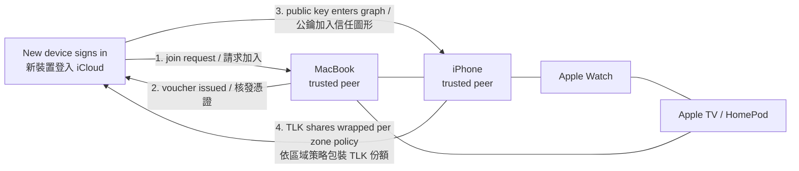
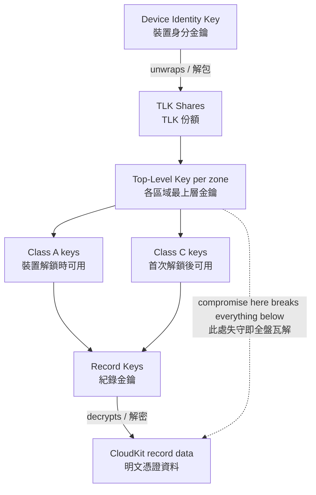
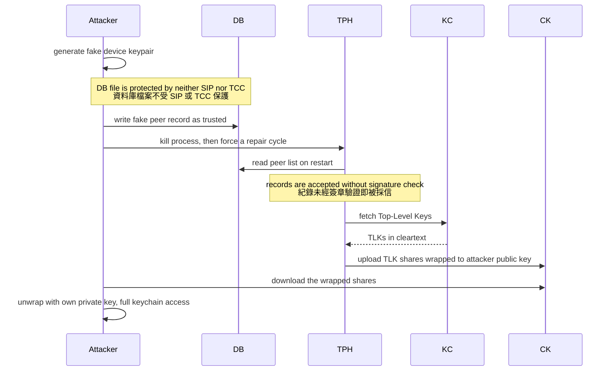
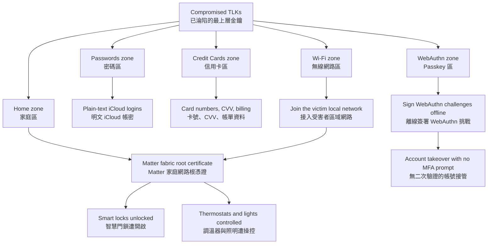

# Lecture 4: Keychained Melody — Grabbing the Keys to the iCloud Kingdom
# 第四講：Keychained Melody — 奪取 iCloud 王國的鑰匙

> **Note / 校訂：** These notes have been corrected against the public record. Four points differ from the original draft.
>
> 1. **CVE ID.** The notes originally wrote `CVE-2026-2860`. That ID is real but belongs to an unrelated Java ERP authorization bug. The vulnerability described here is **`CVE-2026-28860`** — "A local attacker may be able to modify the state of the Keychain" (CWE-20), fixed in macOS Sonoma 14.8.5 / Sequoia 15.7.5 / Tahoe 26.4. All references below have been updated.
> 2. **Authorship.** This research is led by **Alex Radocea** (Supernetworks; formerly Apple Product Security; co-founder of Longterm Security), with **Jaron Bradley** as co-presenter. The original draft framed Bradley as lead and "Alex" as an assistant — that framing is reversed here. `CVE-2026-28864` is credited by Apple to **Alex Radocea**, not to Bradley.
> 3. **Talk title.** The working title "Vulnerability Assessment of macOS Trust Systems" appears nowhere in the public record. The HITCON 2026 agenda lists **"Keychained Melody – Grabbing the Keys to the iCloud Kingdom," presented by Jaron Bradley**; the same title appears in the DEF CON 34 speaker listing under Alex Radocea. The title above has been corrected accordingly.
> 4. **"Octagon" is an internal name.** Apple's public *Platform Security Guide* never uses the terms "Octagon", "bottles", or "Cloud Key Vault". These are internal or reverse-engineered names, visible in Apple's open-source Security code and in `TrustedPeersHelper` header dumps. Treat them as community terminology, not Apple documentation.
>
> **校訂說明：** 本文已對照公開紀錄修訂，共四處與原稿不同。（1）**CVE 編號**：原稿寫作 `CVE-2026-2860`，該編號確實存在，但對應的是一個無關的 Java ERP 授權漏洞；本文所述漏洞應為 **`CVE-2026-28860`**（「本地攻擊者可能得以修改鑰匙圈狀態」，CWE-20），已於 macOS Sonoma 14.8.5 / Sequoia 15.7.5 / Tahoe 26.4 修補，全文引用均已更正。（2）**研究歸屬**：本研究由 **Alex Radocea**（Supernetworks；前 Apple 產品安全團隊；Longterm Security 共同創辦人）主導，**Jaron Bradley** 為共同發表者；原稿將 Bradley 描述為主導者、「Alex」為協助者，此處已對調。`CVE-2026-28864` 經蘋果官方致謝者為 **Alex Radocea**，並非 Bradley。（3）**演講標題**：原稿標題「macOS 信任體系安全評估」查無公開出處；HITCON 2026 議程所列為 **「Keychained Melody – Grabbing the Keys to the iCloud Kingdom」，講者 Jaron Bradley**，DEF CON 34 講者頁亦以同名列於 Alex Radocea 名下，標題已據此更正。（4）**「Octagon」屬內部代號**：蘋果公開的《Platform Security Guide》從未使用「Octagon」、「bottles」或「Cloud Key Vault」等詞，這些是內部或逆向工程得出的名稱，僅見於蘋果開源 Security 程式碼與 `TrustedPeersHelper` 標頭檔傾印中，應視為社群術語而非官方文件用語。

---

## 1. Speaker Information & Topic / 講者資訊與演講主題

### English
* **Lead researcher:** **Alex Radocea**
  * **Affiliations:** Supernetworks; formerly Apple Product Security; co-founder of Longterm Security.
  * **Role & Background:** Radocea has a decade-long track record of attacking iCloud Keychain's synchronization layer — he presented "Intercepting iCloud Keychain" at Black Hat USA 2017 and an OTR signature-verification bypass at HITCON CMT 2017. He discovered the vulnerabilities described here; Apple credits **CVE-2026-28864** to him by name.
* **Co-presenter:** **Jaron Bradley**
  * **Affiliations:** **Director of Jamf Threat Labs**; author of *Threat Hunting macOS: Mastering Endpoint Security* (self-published, 2025) and *OS X Incident Response* (Syngress, 2016); publisher of themittenmac.com.
  * **Role & Background:** Bradley is a specialist in macOS internals, forensics, and detection engineering, focused on macOS-specific malware and info-stealers. Radocea brought him in for a second set of eyes and to assess the real-world security impact of these cryptographic and logical trust boundaries — the detection and threat-hunting half of the talk is his.
* **Topic:** **Keychained Melody — Grabbing the Keys to the iCloud Kingdom** — dissecting Apple's "Octagon" trust architecture, CVE-2026-28860 (Identity Swap vulnerability), and CVE-2026-28864 (iCloud Escrow Leak).
* **Lecture Duration:** 40-minute deep-dive presentation delivered at HITCON 2026. The HITCON agenda lists Jaron Bradley as the presenting speaker for this session.

### 繁體中文
* **主導研究者：** **Alex Radocea**
  * **現職與機構：** Supernetworks；前 Apple 產品安全（Product Security）團隊成員；Longterm Security 共同創辦人。
  * **專業領域：** Radocea 針對 iCloud 鑰匙圈同步層的攻擊研究已有十年累積——他曾於 Black Hat USA 2017 發表〈Intercepting iCloud Keychain〉，並在 HITCON CMT 2017 發表 OTR 簽章驗證繞過技術。本次所述漏洞由他發現，蘋果官方亦具名致謝其發現 **CVE-2026-28864**。
* **共同發表者：** **Jaron Bradley**
  * **現職與機構：** **Jamf Threat Labs 總監**；著有《Threat Hunting macOS: Mastering Endpoint Security》（自行出版，2025）與《OS X Incident Response》（Syngress，2016）；themittenmac.com 站長。
  * **專業領域：** Bradley 專精於 macOS 內部架構、數位鑑識與偵測工程，研究聚焦於 macOS 特有的惡意軟體與竊資軟體（Info-stealers）。Radocea 邀請他加入以進行第二輪審查與真實世界安全影響評估；本演講中偵測與威脅狩獵的部分即由他負責。
* **主題：** **Keychained Melody — 奪取 iCloud 王國的鑰匙** — 深度剖析蘋果的「Octagon」信任架構、CVE-2026-28860（身分交換漏洞）以及 CVE-2026-28864（iCloud 託管洩漏漏洞）。
* **演講性質：** 於 HITCON 2026 發表之 40 分鐘深度技術演講。HITCON 議程上列名之發表講者為 Jaron Bradley。

---

## 2. Quick Summary / 內容簡要

### English
This lecture exposes deep logical vulnerabilities within Apple’s end-to-end encrypted iCloud keychain synchronization engine, specifically targeting the modern **Octagon** trust graph. Radocea and Bradley walk through how macOS manages user identity and cryptographic secrets across devices. They detail **CVE-2026-28860**, an "Identity Swap" vulnerability where the local `trustedpeershelper` XPC service blindly trusts and accepts fake device identities injected directly into its local SQLite database. By exploiting this flaw, a local, unprivileged attacker (UID 501, with no root or TCC entitlements) can hijack the keychain's automated repair process. The operating system is tricked into encrypting and uploading **Top-Level Keys (TLKs)** to Apple's CloudKit servers, encrypted with the attacker's public key. 

Through live demonstrations, the researchers show the catastrophic real-world impact of this compromise: decrypting plain-text iCloud passwords, extracting stored credit cards, sniffing Wi-Fi credentials, hijacking smart home smart locks and thermostats via the **Matter (CHIP)** home automation fabric root certificate, and bypassing **Passkeys** by signing WebAuthn challenges. They also explain **CVE-2026-28864**, a separate vulnerability that leaked UID-wrapped escrow secrets into iCloud backups, allowing attackers to reconstruct and unseal encrypted iCloud "bottles" without a device passcode.

### 繁體中文
本演講揭露了蘋果端到端加密（End-to-End Encrypted）iCloud 鑰匙圈同步引擎中存在的深層邏輯漏洞，特別針對現代的 **Octagon** 信任圖形架構。Radocea 與 Bradley 詳細解析了 macOS 如何在多個裝置間管理使用者身分與加密私鑰。演講核心在於剖析 **CVE-2026-28860**「身分交換攻擊」漏洞：macOS 本地的 `trustedpeershelper` XPC 服務會盲目信任並接受直接注入到其本地 SQLite 資料庫中的偽造裝置身分。

透過利用此漏洞，本地無特權的使用者（UID 501，無需 Root 或 TCC 權限）即可劫持鑰匙圈的自動修復流程，欺騙作業系統將關鍵的**最上層金鑰（Top-Level Keys, TLKs）**使用攻擊者的公鑰進行加密，並上傳至蘋果的 CloudKit 伺服器。

研究團隊透過多場震撼的實機展示呈現了此漏洞的毀滅性影響：包括直接解密並讀取明文 iCloud 密碼、信用卡資訊、Wi-Fi 密碼、透過 **Matter (CHIP)** 智慧家庭架構根憑證接管並遠端開啟智慧門鎖與調溫器，以及透過腳本簽署 WebAuthn 挑戰來繞過 **Passkeys** 生物識別防護。最後，演講亦解析了 **CVE-2026-28864**，該漏洞將 UID 包裝的託管密鑰洩漏至 iCloud 備份中，使攻擊者得以在不知道裝置密碼的情況下，重構並解封加密的 iCloud 備份「玻璃瓶」（Bottle）。

---

## 3. Structured Lecture Context (Extremely Detailed) / 結構化演講內容（極致詳細）

### 3.1 The Evolution of Apple's Trust Architecture / 蘋果信任架構之演進歷程

#### English
* **The Era of "Circle of Trust":** Historically, Apple implemented end-to-end encryption for iCloud syncing using a linear "Circle of Trust" model. 
  * Under this model, device synchronization relied on the **OTR (Off-the-Record)** messaging protocol.
  * OTR was synchronous, requiring both devices to be online and active at the same time to perform key exchanges and validate device additions.
* **The Shift to Octagon (Trusted Graph):** As Apple's ecosystem expanded to include devices like HomePods, Apple Watches, and Apple TVs, synchronous OTR proved too restrictive. Apple replaced OTR with **Octagon**, a highly complex, asynchronous, multi-layered "Trusted Graph" architecture.
* **Asynchronous Secret Sharing:** Octagon allows a new device to join the circle and access shared secrets asynchronously. This is achieved using **Top-Level Keys (TLKs)**.
* **Cloud Security Paradigm:** Apple's security premise is that all end-to-end encrypted user data remains completely encrypted on its servers. Apple claims that its systems are cryptographically incapable of reading user secrets in transit or at rest on iCloud servers because Apple does not possess the user's private keys.

#### 繁體中文
* **「信任圈」時代：** 歷史上，蘋果在進行 iCloud 跨裝置同步與端到端加密時，採用的是線性「信任圈」（Circle of Trust）模型。
  * 在此模型下，裝置間的同步主要依賴 **OTR (Off-the-Record)** 通訊協定。
  * OTR 屬於同步機制，要求兩個裝置必須同時在線且處於活動狀態，才能進行金鑰交換與驗證新裝置的加入。
* **過渡至 Octagon（信任圖形）：** 隨著蘋果生態系擴展到 HomePod、Apple Watch 和 Apple TV 等多樣化設備，同步的 OTR 協議限制過多。蘋果因此推出 **Octagon** 架構取代 OTR，這是一個高度複雜、異步運作且多層次的「信任圖形」（Trusted Graph）架構。
* **非同步私鑰共享：** Octagon 允許新裝置在不要求現有裝置同時在線的情況下，非同步地加入信任網路並共享私鑰。這是透過**最上層金鑰（Top-Level Keys, TLKs）**來實現的。
* **雲端安全承諾：** 蘋果的安全假設是：所有端到端加密的使用者資料在雲端伺服器上皆維持加密狀態。蘋果聲稱其伺服器與員工在技術上完全無法解密使用者的 iCloud 鑰匙圈，因為蘋果並不持有使用者的私鑰。

#### Diagram / 圖解



*Caption / 圖說: How a device joins the Octagon trust graph — an existing trusted peer issues a voucher, the newcomer's public key is admitted, and TLK shares are wrapped to it according to per-zone device policy. / 裝置加入 Octagon 信任圖形的流程：由既有的受信任同儕核發憑證（voucher），新裝置公鑰獲准加入圖形，系統再依各區域的裝置策略將 TLK 份額包裝給該裝置。*

---

### 3.2 Secure Enclave and Key Hierarchy / 安全隔離區與金鑰層級

#### English
* **Secure Enclave Processor (SEP):** Built into modern M-series (Apple Silicon) chips (and previously the T2 chip on Intel Macs), the SEP is a dedicated, physical co-processor running its own secure operating system called **sepOS**.
* **Hardware-Fused UID:** Every SEP contains a unique 256-bit AES Hardware Unique ID (UID) fused into the silicon during manufacturing. This UID is completely invisible to the host operating system (macOS/iOS) and cannot be directly read or dumped.
* **Secrets at Rest:** The SEP uses this hardware UID to generate and wrap cryptographic keys. This ensures that credential secrets inside the keychain remain highly secure when the system is powered off (at rest).
* **Secrets in Memory:** Once a Mac boots up and the user logs in, the security paradigm changes. Cryptographic keys must be loaded into system memory (RAM) to decrypt passwords and credentials for active use.
* **Octagon Key Hierarchy & Zones:** Octagon organizes iCloud data into functional **Zones** (e.g., Passwords, Credit Cards, Wi-Fi, Home, Health).
  * **Top-Level Key (TLK):** Each zone is secured by a unique 256-bit symmetric AES key called the TLK. TLKs are shared and synchronized among all trusted devices.
  * **Device Policy Restrictions:** Not all devices access all zones. For example, a MacBook does not need access to the `Health` zone, so under Octagon policy, Apple restricts the MacBook from receiving the TLK for the Health zone, whereas an iPhone gets full access.
  * **Key Wrapping Chain:** 
    1. The device’s **Identity Key** unwraps the synchronized **TLK shares**.
    2. The **TLK** is used to unwrap **Class A** keys (accessible only while the device is unlocked) and **Class C** keys (accessible after the first user unlock post-boot).
    3. **Class A & C keys** unwrap the individual **Record Keys** inside each zone.
    4. **Record Keys** decrypt the actual **CloudKit record data** containing plain-text credentials.
  * **The Core Cryptographic Bottleneck:** If an attacker can decrypt or compromise the **TLK shares**, they can decrypt the entire iCloud keychain database.

#### 繁體中文
* **安全隔離區處理器 (SEP)：** 內建於現代 M 系列（Apple Silicon）晶片（以及舊款 Intel Mac 的 T2 晶片）中。SEP 是一個獨立的實體協處理器，執行其專屬的微型作業系統 **sepOS**。
* **硬體熔斷唯一識別碼 (UID)：** 每個 SEP 在製造時都會在硬體晶片中熔斷一組獨一無二的 256 位元 AES 硬體唯一識別碼（UID）。這組 UID 對主作業系統（macOS/iOS）完全隱形，無法被讀取或匯出。
* **靜態資料加密：** SEP 利用這組硬體 UID 來產生並包裝密碼學金鑰，確保鑰匙圈中的機密憑證在系統關機（靜態置放）時獲得極高強度的實體保護。
* **記憶體中的機密：** 當 Mac 開機且使用者成功登入後，安全邊界便發生改變。為了供系統即時調用，加密金鑰必須被載入到系統記憶體（RAM）中，以解密密碼和憑證。
* **Octagon 金鑰層級與區域 (Zones)：** Octagon 將 iCloud 資料分類為多個功能**區域**（例如：密碼區、信用卡區、Wi-Fi 區、家庭區、健康區）。
  * **最上層金鑰 (TLK)：** 每個區域皆由一組獨特的 256 位元對稱式 AES 金鑰（即 TLK）進行保護。TLK 會在所有受信任的裝置之間進行同步與共享。
  * **裝置策略限制：** 並非所有裝置都能存取所有區域。例如，MacBook 不需要存取「健康資料」區域，因此依據 Octagon 的安全策略，系統會限制 MacBook 取得該區域的 TLK，而 iPhone 則能完整獲取。
  * **金鑰包裝鏈 (Key Wrapping Chain)：**
    1. 裝置的**身分金鑰 (Identity Key)** 解包同步的 **TLK 分享份額 (TLK Shares)**。
    2. **TLK** 用於解包 **Class A 金鑰**（僅在裝置解鎖時可用）與 **Class C 金鑰**（開機後使用者首次解鎖即可持續使用）。
    3. **Class A 與 Class C 金鑰** 解包各個區域內部的 **紀錄金鑰 (Record Keys)**。
    4. **紀錄金鑰** 解密實際的 **CloudKit 紀錄資料**，從中還原出明文憑證。
  * **核心密碼學瓶頸：** 只要攻擊者能夠成功獲取並解密 **TLK 分享份額**，就能徹底破譯整個 iCloud 鑰匙圈資料庫。

#### Diagram / 圖解



*Caption / 圖說: The Octagon key-wrapping chain. The TLK is the cryptographic bottleneck — an attacker who recovers TLK shares can unwrap every layer beneath them and read the whole keychain. / Octagon 的金鑰包裝鏈。TLK 是整條鏈的密碼學瓶頸：攻擊者一旦取得並解開 TLK 份額，即可逐層解包其下所有金鑰，讀取整個鑰匙圈。*

---

### 3.3 The Local Management Architecture / 本地端管理架構

#### English
* **Trusted Peers Helper (`trustedpeershelper`):** This is a critical background XPC service responsible for keeping the host Mac updated about the active status of all other trusted peers in the user’s iCloud account.
  * **XPC Inter-Process Communication:** macOS uses XPC for secure communication between system services.
  * **Database Storage:** The state of all trusted peers is recorded in a local SQLite database named `TrustedPeersHelper.db` (located inside private system paths).
* **Securityd:** A classic macOS security daemon that manages system keychains and acts as a subsystem of the broader Octagon cryptographic umbrella.
* **Access Control & Entitlements:** Apple protects keychain data from malware using strict **Entitlements**. Processes must be cryptographically signed with specific Apple-approved entitlements (e.g., `com.apple.private.octagon.trustedpeers`) to read or write to Octagon services.
* **The Fatal Database Oversight:** While Apple implemented robust entitlements to block direct API access to the `trustedpeershelper` XPC service, they neglected to apply similar access control restrictions (such as SIP or TCC path protections) to the physical SQLite database file `TrustedPeersHelper.db`. 

#### 繁體中文
* **受信任同儕助手 (`trustedpeershelper`)：** 這是 macOS 中極其關鍵的背景 XPC 服務，負責確保主機隨時掌握使用者 iCloud 帳號中所有受信任裝置（同儕）的最新狀態。
  * **XPC 進程間通訊：** macOS 使用 XPC 機制在各個系統服務之間進行安全通訊。
  * **資料庫儲存：** 所有受信任同儕的狀態都被記錄在名為 `TrustedPeersHelper.db` 的本地 SQLite 資料庫中（位於系統的私有路徑下）。
* **Securityd：** 傳統的 macOS 安全守護進程，負責管理系統鑰匙圈，並作為更廣泛的 Octagon 密碼學架構之下的子系統運作。
* **存取控制與權限標記 (Entitlements)：** 蘋果透過嚴格的 **Entitlements** 機制保護鑰匙圈資料免受惡意軟體侵害。任何進程必須經過密碼學簽章，且具備特定的蘋果特許權限（例如 `com.apple.private.octagon.trustedpeers`），才能讀取或寫入 Octagon 服務。
* **致命的資料庫防禦疏漏：** 雖然蘋果設計了強大的 Entitlements 來阻斷非經授權進程直接向 `trustedpeershelper` XPC 服務進行 API 呼叫，但他們卻忽略了對本地實體 SQLite 資料庫檔案 `TrustedPeersHelper.db` 套用等同強度的存取限制（如 SIP 系統整合保護或 TCC 隱私控制）。

---

### 3.4 Identity Swap Attack (CVE-2026-28860) / 身分交換攻擊 (CVE-2026-28860)

#### English
* **The Root Cause:** Because the physical `TrustedPeersHelper.db` database is not protected by SIP or TCC, any local process executing code (even as an unprivileged user, UID 501, without root privileges) can directly read and write to this database file.
* **Cryptographic Blind Trust:** When the `trustedpeershelper` XPC process queries its local database, it blindly accepts the device keys and peer records written to the database. It does not perform signature verification on the database records themselves.
* **The Exploit Chain Mechanics:**
  1. **Device Identity Generation:** The attacker generates a brand new, malicious cryptographic device identity (public/private key pair) on the victim's Mac.
  2. **Database Injection:** The attacker directly writes this fake device identity as a new "trusted peer record" into the local `TrustedPeersHelper.db` SQLite file.
  3. **Triggering Repair Process:** The attacker terminates the local `trustedpeershelper` process and runs `cksctl fetch` (CloudKit Status Control) or `cksctl status`. This forces Octagon into a synchronization repair cycle.
  4. **The Cryptographic Trapdoor:** Seeing a "new" local peer ID that is marked as active in the database, the OS assumes an out-of-sync state. 
  5. **TLK Exfiltration:** The system retrieves the symmetric Top-Level Keys (TLKs) from the secure `keychain2` database in RAM, **encrypts each TLK with the newly injected fake device's public key**, and uploads these wrapped shares directly to Apple's CloudKit servers (**Cuttlefish**).
  6. **Private Key Recovery:** Because the attacker generated the fake device identity, they possess the corresponding private key. They can download the newly wrapped TLK shares from the database or CloudKit and decrypt them in user space, gaining complete access to the symmetric keys for all keychain zones.
* **Privilege Requirements:** This attack is extremely stealthy. It requires **no root privileges**, **no TCC prompts**, and **no user-visible warnings**. It executes entirely in the background as a standard user.

#### 繁體中文
* **漏洞根本原因：** 由於實體 `TrustedPeersHelper.db` 資料庫檔案不受 SIP 或 TCC 機制保護，本地運行的任何程式（即使僅具有無特權的標準使用者權限 UID 501，無需 Root 權限）皆可直接對該資料庫進行讀寫。
* **密碼學盲目信任：** 當 `trustedpeershelper` XPC 進程查詢其本地資料庫時，它會盲目接受寫入其中的裝置金鑰與同儕紀錄，而不會對資料庫檔案內部的紀錄進行任何密碼學簽章驗證。
* **漏洞利用鏈運作機制：**
  1. **產生虛擬裝置身分：** 攻擊者在受害者 Mac 上產生一組全新的惡意裝置密碼學身分（即一對公鑰與私鑰）。
  2. **資料庫注入：** 攻擊者直接將這組偽造的裝置身分作為新的「受信任同儕紀錄」寫入本地的 `TrustedPeersHelper.db` SQLite 資料庫檔案。
  3. **觸發修復程序：** 攻擊者終止本地的 `trustedpeershelper` 進程，並執行 `cksctl fetch`（CloudKit 狀態控制）或 `cksctl status`。這會強制 Octagon 進入同步修復循環。
  4. **密碼學陷阱門：** 作業系統在本地資料庫中偵測到一個被標記為活動狀態的「全新」同儕 ID，會判定系統處於不同步狀態並啟動修復。
  5. **TLK 機密外洩：** 系統從記憶體中安全的 `keychain2` 資料庫取出對稱式最上層金鑰 (TLK)，**將每組 TLK 使用攻擊者所產生的虛擬公鑰進行加密**，並將這些包裝好的分享份額直接上傳至蘋果的 CloudKit 伺服器（名為 **Cuttlefish** 的後端服務）。
  6. **私鑰還原：** 由於這組虛擬裝置身分是由攻擊者創建，攻擊者持有對應的私鑰。他們可以直接從本地鑰匙圈複製件或雲端下載這些包裝好的 TLK 份額，並在使用者空間內將其解密，進而取得所有鑰匙圈區域的對稱加密金鑰。
* **特權需求：** 此攻擊極具隱蔽性。它 **無需 Root 特權**、**無需 TCC 隱私授權彈窗**，且 **不會顯示任何使用者可見的警告**，完全在背景以標準使用者身分靜默執行。

> **Note / 校訂：** The tool name `cksctl` used in these notes could not be confirmed in any public source — no man page, no Apple documentation, no open-source reference. `otctl(1)` **is** documented. Treat every `cksctl` invocation below as an unverified transcription; the trigger step is real, but the exact command name may be wrong. / 本文所述的 `cksctl` 指令名稱查無任何公開出處——沒有 man page、沒有蘋果官方文件、亦無開源專案引用；相對地，`otctl(1)` 確有文件記載。以下所有 `cksctl` 指令請視為**未經查證的聽打結果**：觸發修復的步驟本身為真，但確切的指令名稱可能有誤。

#### Diagram / 圖解



Participants / 參與者： **Attacker** = unprivileged process at UID 501 / UID 501 無特權程序 · **DB** = `TrustedPeersHelper.db` local SQLite / 本地 SQLite 資料庫 · **TPH** = `trustedpeershelper` XPC service / XPC 服務 · **KC** = `keychain2` keys in memory / 記憶體中的鑰匙圈金鑰 · **CK** = Apple CloudKit, Cuttlefish backend / 蘋果 CloudKit 之 Cuttlefish 後端

*Caption / 圖說: The Identity Swap attack (CVE-2026-28860), step by step. No root, no TCC prompt, no user-visible warning — the OS itself performs the exfiltration on the attacker's behalf. / 身分交換攻擊（CVE-2026-28860）逐步流程。全程無需 Root、不觸發 TCC 授權彈窗、不顯示任何使用者可見警告——實際執行外洩動作的是作業系統本身。*

---

### 3.5 High-Impact Live Demonstrations / 漏洞利用高影響力實機展示

#### English
The researchers demonstrated the vast scope of the compromise through four real-world targets:

##### A. Decrypting Plain-text Passwords & Credit Cards
* The exfiltrated and decrypted TLK database files are structured as nested Property List (`.plist`) files.
* While they initially appear as encoded structures, the researchers showed that the credential payload is stored within a specific `<key>vdata</key>` tag.
* Base64 decoding this `vdata` string directly reconstructs the original nested plist, exposing the username, plain-text password (e.g., a real credentials dump of website entries like `rover.com`), credit card numbers, CVV codes, and billing details.

##### B. Smart Home Takeover (Matter/CHIP Fabric Hack)
* Under the `Home` zone, Octagon stores a plist labeled with "CHIP" (Connected Home over IP, now globally known as **Matter**).
* Inside, they extracted the **Fabric Root Certificate**, which serves as the cryptographic master key for the user's entire smart home fabric.
* Since the attacker also exfiltrated all local Wi-Fi plain-text passwords from the keychain dump, gaining access to the local smart home network was trivial.
* The team built a custom Swift application named **Smart Tinker** that loads this stolen fabric certificate. 
* Running Smart Tinker on an untrusted laptop allowed him to:
  1. Scan and brute-force commands to Matter-enabled IoT devices.
  2. Turn off the home lights.
  3. Turn off a Matter-enabled Smart Thermostat (which was highly dangerous during Michigan's sub-zero $-7^{\circ}\text{F}$ winter).
  4. Arbitrarily send unauthenticated unlock commands to Matter Smart Locks, opening physical home doors instantly.

##### C. Passkey Bypass Attack
* Passkeys are public/private key pairs designed to eliminate passwords. They are stored inside the keychain under the `webauthn` attribute.
* Because passkeys are synchronized across all devices in Octagon, the attacker was able to dump passkey private keys from the Mac even if they were originally created on an iPhone.
* To log in as the victim:
  1. The browser initiates a login attempt to a web service, generating a cryptographic Challenge JWT.
  2. They used a small browser debug function to intercept the Challenge JWT.
  3. He fed the challenge and the stolen private key into a Python script, which signed the challenge and outputted the valid authentication variables.
  4. Pasting these signed variables back into the browser console completed the login handshake, bypassing biometric Touch ID prompt entirely.
  5. Because passkeys are cryptographically secure, most sites do not prompt for secondary multi-factor authentication (MFA), allowing immediate, full account takeover.

#### 繁體中文
研究團隊透過四個真實的物理與數位目標展示了此漏洞的深遠威脅：

##### A. 解密明文密碼與信用卡
* 匯出並成功解密後的 TLK 資料庫檔案採用嵌套的屬性列表（`.plist`）格式。
* 雖然這些資料起初看似經過編碼，但研究團隊揭露了核心憑證內容其實儲存在名為 `<key>vdata</key>` 的特定標籤中。
* 只要對此 `vdata` 字串進行 Base64 解碼，即可直接重構出原始的嵌套 Plist，進而洩漏使用者名稱、明文密碼（例如 `rover.com` 寵物照顧網等真實網站憑證）、信用卡號、CVV 安全碼以及帳單細節。

##### B. 智慧家庭接管（Matter/CHIP 網路劫持）
* 在「家庭」(Home) 區域下，Octagon 儲存了標記有「CHIP」（即 Connected Home over IP，現今通稱為 **Matter** 智慧家庭標準）的 Plist。
* 研究團隊從中提取出了 **Fabric 根憑證**，這是整個智慧家庭控制網路（Fabric）的密碼學主金鑰。
* 由於攻擊者同時也從解密後的鑰匙圈中竊取了所有本地 Wi-Fi 的明文密碼，因此接入該智慧家庭所在的本地網路變得易如反掌。
* 研究團隊撰寫了一個名為 **Smart Tinker** 的自訂 Swift 應用程式，並將竊得的 Fabric 根憑證載入其中。
* 在非受信任的筆電上執行 Smart Tinker，讓他得以：
  1. 掃描本地網路並暴力發送指令給支援 Matter 的物聯網（IoT）設備。
  2. 遠端關閉室內的所有電燈。
  3. 關閉支援 Matter 的智慧調溫器（在密西根州零下 $-7^{\circ}\text{F}$ 的嚴寒冬季中極具人身安全威脅）。
  4. 隨意向 Matter 智慧門鎖發送未經授權的解鎖指令，瞬間將實體大門開啟。

##### C. Passkey 繞過攻擊
* Passkey 是一種旨在取代密碼的公私鑰對技術，其私鑰儲存在鑰匙圈的 `webauthn` 屬性下。
* 由於 Passkey 透過 Octagon 在所有裝置間同步，即使受害者是在 iPhone 上建立的 Passkey，攻擊者依然能從 Mac 鑰匙圈中將其導出。
* 為了偽裝成受害者進行登入：
  1. 瀏覽器對目標網站發起登入，產生一組密碼學挑戰 JWT（Challenge JWT）。
  2. 研究團隊在瀏覽器中加入一個簡單的偵錯函數，攔截該挑戰 JWT。
  3. 他將挑戰 JWT 與導出的 Passkey 私鑰輸入至一組 Python 腳本中進行密碼學簽署，產生合法的驗證變數。
  4. 將這些簽署好的變數貼回瀏覽器主控台，即可完美完成登入握手，全程完全繞過了實體 Touch ID 指紋輸入提示。
  5. 由於 Passkey 被視為強固的雙重驗證，絕大多數網站登入時不會再要求額外的簡訊或郵件二次驗證 (MFA)，實現了直接、完全的帳號接管。

#### Diagram / 圖解



*Caption / 圖說: Blast radius of a compromised keychain. The Wi-Fi credentials and the Matter fabric root certificate compound each other — network access plus the fabric's master key turns a software compromise into physical control of the victim's front door. / 鑰匙圈淪陷後的影響範圍。Wi-Fi 憑證與 Matter 根憑證彼此加乘：取得區域網路存取權，再加上家庭網路的主金鑰，便讓一次軟體層面的入侵升級為對受害者實體大門的控制權。*

---

### 3.6 Escrow Leak Vulnerability (CVE-2026-28864) / 託管洩漏漏洞 (CVE-2026-28864)

#### English
* **iCloud Escrow Mechanics:** When a user loses access to all of their physical devices, Apple allows data recovery via an "Escrow" backup.
  * Secrets are sealed inside an encrypted container called a **Bottle** and stored with Cuttlefish/CloudKit.
  * The keys to unseal the Bottle are kept in a Hardware Security Module (HSM) on Apple's servers.
  * The HSM enforces a strict rate limit. If someone attempts to brute-force the escrow keys, the HSM automatically destroys/melts down the escrow key, preventing internal Apple administrators or external hackers from decrypting the Bottle.
  * Under secure design, a user provides their personal device passcode. Using secure remote password (**SRP**) protocols, the device passcode is verified in a zero-knowledge proof manner to retrieve and unseal the Bottle.
* **The Vulnerability (CVE-2026-28864):** The researchers discovered a design leak in Apple's backup logic where the symmetric escrow secret keys were serialized and written as a UID-wrapped escrow record directly into standard **iCloud Backups**.
* **Exploit Requirements:**
  1. The victim must have active iCloud Backups enabled.
  2. The attacker must gain access to a stolen physical device or intercept the victim's iCloud backup files.
  3. The attacker performs a SIM-swapping attack to intercept SMS two-factor authentication or uses a compromised iCloud password to pull down the backup.
* **The Security Violation:** Once the backup is acquired, the attacker extracts the leaked UID-wrapped escrow record. This bypasses the HSM's rate-limiting protections entirely. The attacker can decrypt and unseal the backup Bottle in user-space, reconstructing the device identity private key and decrypting the TLK shares **without ever needing the user's physical device passcode**.

#### 繁體中文
* **iCloud 託管機制：** 當使用者遺失了所有實體裝置時，蘋果提供了一種透過「託管」（Escrow）進行資料還原的機制。
  * 鑰匙圈機密被封裝在一個名為 **Bottle（玻璃瓶）** 的加密容器中，並儲存於 Cuttlefish/CloudKit。
  * 解封 Bottle 的密鑰則保存在蘋果伺服器端的硬體安全模組（HSM）中。
  * HSM 執行嚴格的次數限制保護。如果有人試圖暴力破解託管密鑰，HSM 會自動銷毀/熔斷該金鑰，阻止任何蘋果內部員工或外部駭客解密 Bottle。
  * 在安全設計下，使用者輸入其裝置密碼，透過安全遠端密碼（**SRP**）協定以零知識證明（Zero-Knowledge Proof）方式向 HSM 驗證，進而取出並解封 Bottle。
* **漏洞成因 (CVE-2026-28864)：** 研究團隊發現了蘋果備份邏輯中的一個嚴重設計缺陷：用於託管的對稱式金鑰在序列化後，會作為經由 UID 包裝的託管紀錄，直接被寫入到標準的 **iCloud 備份**檔案中。
* **漏洞利用條件：**
  1. 受害者必須啟用了 iCloud 自動備份。
  2. 攻擊者必須取得受害者的實體裝置，或以其他方式攔截到其 iCloud 備份檔。
  3. 攻擊者透過 SIM 卡劫持（SIM-swapping）攔截簡訊雙重驗證碼，或使用已外洩的 iCloud 密碼來拉取該備份。
* **安全威脅：** 一旦取得備份檔，攻擊者即可直接從中提取出洩漏的 UID 包裝託管紀錄。這完全繞過了 HSM 的嘗試次數限制防護。攻擊者可以在使用者空間中直接對備份 Bottle 進行本地解密與解封，還原出裝置身分私鑰並解密所有 TLK 分享份額，**全程完全不需要知道使用者的實體裝置密碼**。

---

## 4. Conclusion / 結論

### English
In conclusion, the talk highlights the complex battle between **convenience** and **security** in consumer software design. Apple built an incredibly robust hardware-backed cryptographic environment (the Secure Enclave Processor) to protect user credentials at rest. However, because modern users demand seamless synchronization of their credentials across multiple, varied devices, Apple had to build highly complex software synchronization layers like Octagon and automated repair daemons. 

This synchronization layer bypassed the physical hardware security boundaries. By focusing on logical flaws—such as unauthenticated local write permissions to the trusted peers database and serialized leaks in backup files—attackers successfully defeated the entire end-to-end encryption chain. While Apple has fully patched both CVE-2026-28860 and CVE-2026-28864, the researchers warn that info-stealer malware developers are increasingly turning to similar logic-bypass strategies on macOS.

### 繁體中文
總結而言，講者指出這是一場在消費級軟體設計中**便利性**與**安全性**之間的典型拉鋸戰。蘋果構建了極其強大且由實體硬體防護的密碼學環境（安全隔離區處理器，SEP）來保護靜態的憑證。然而，為滿足現代使用者在多種不同裝置之間無痛同步憑證的需求，蘋果不得不開發高度複雜的軟體同步層（如 Octagon）以及自動化修復守護進程。

正是這個同步層繞過了底層硬體的實體安全防護。藉由聚焦於邏輯缺陷——例如本地對同儕資料庫未經授權的寫入權限，以及備份檔案中序列化金鑰的洩漏——攻擊者成功瓦解了整個端到端加密鏈。儘管蘋果目前已完整修復了 CVE-2026-28860 與 CVE-2026-28864 兩項漏洞，但研究團隊警告，竊資軟體（Info-stealers）開發者正越來越頻繁地將目光投向 macOS 上的此類邏輯繞過策略。

---

## 5. Possible Implementation & Threat Hunting Directions / 延伸實作與威脅狩獵方向

### English
To detect or proactively hunt for signs of this attack or similar trust graph manipulation, security teams can implement several detection methods:

#### A. Diagnostic Command Audits
Engineers can programmatically query macOS's built-in cryptographic command-line tools to verify trust graph integrity:
* **`otctl status --json`:** This undocumented Apple utility outputs the active status of the local Octagon trust graph in JSON format. Defensive agents should continuously monitor this output and alert if the number of trusted peers unexpectedly increases or if unknown device identities appear.
* **`cksctl status`:** Verifies the status of CloudKit synchronization. Sudden spikes in `cksctl fetch` commands or repair actions can indicate an active injection or repair hijacking attempt.

#### B. Database Integrity Monitoring
Since the vulnerability involved direct manipulation of `TrustedPeersHelper.db`, detection engineers should:
* Establish File Integrity Monitoring (FIM) or Endpoint Detection and Response (EDR) rules to monitor write events on `TrustedPeersHelper.db`.
* On macOS, only official Apple signed processes (possessing appropriate system entitlements) should write to this SQLite file. Any third-party process attempting to modify this file should be flagged immediately as malicious behavior.

#### C. Cryptographic Reset Remediation
In extreme scenarios where an administrator suspects that a device's trust graph or active cryptographic keys have been fully compromised, they can execute the following undocumented command to purge and reset all local and cloud keys:
```bash
cksctl cloudkitreset
```
* *Warning:* This command will completely wipe out the active Octagon keys, forcing a clean re-initialization of the device's trust circle.

#### 繁體中文
資安團隊與防禦工程師若要在企業內部偵測、主動狩獵此類攻擊或類似的信任圖形篡改跡象，可實施以下防禦機制：

#### A. 系統診斷指令審計
防禦人員可以透過排程或代理程式執行 macOS 內建的密碼學命令列工具，以核對信任圖形的完整性：
* **`otctl status --json`：** 這是蘋果未公開的文件化工具，能以 JSON 格式輸出本地 Octagon 信任圖形的活動狀態。偵測代理程式應定期監控此輸出，一旦發現受信任的同儕數量（Peers Count）異常增加，或出現未知的設備識別碼，應立即發出警報。
* **`cksctl status`：** 用於驗證 CloudKit 同步狀態。若系統突然頻繁調用 `cksctl fetch` 指令或觸發修復動作，可能代表有惡意程式正在進行注入或試圖劫持修復流程。

#### B. 資料庫完整性監控
由於此攻擊核心在於直接篡改 `TrustedPeersHelper.db`，防禦工程師應：
* 設定檔案完整性監控 (FIM) 或端點偵測與回應 (EDR) 規則，嚴格監視針對 `TrustedPeersHelper.db` 的寫入（Write）事件。
* 在 macOS 機制下，僅有獲得蘋果官方特許簽章的系統進程才能對該 SQLite 檔案進行修改。任何第三方未授權程式試圖修改此檔案的行為，皆應被判定為高風險的惡意入侵行為。

#### C. 密碼學金鑰強制重設
在懷疑裝置的信任圖形或密碼學金鑰已遭到完全劫持的極端情況下，管理員可以執行以下未公開指令，以在本地與雲端徹底清除並重設所有金鑰：
```bash
cksctl cloudkitreset
```
* *警告：* 此指令會完全清除當前活動的 Octagon 金鑰，強制該裝置重新初始化其安全信任圈。

---

## 6. Bilingual Precise Transcript / 雙語精確對照逐字稿

### English
* **[00:00]** "Roughly a year back or so, Alex was doing vulnerability research and brought me in to get a second set of eyes and impact assessment on what turned out to be CVE-2026-28860. The reason this actually intrigued me so much is because info-stealers on the macOS side are wildly popular right now. Instead of attackers getting on systems, hiding, and waiting, a lot of info-stealers are just grabbing as many secrets as possible and stealing as much data as they can as soon as they execute. Around the same time, Apple had implemented some of the security features we'll be talking about, so the timing was very good."
* **[05:30]** "To first grasp this vulnerability itself, we first have to understand a bit about keychain data. We're going to talk about this trust system that has evolved over time to become very expansive. It begins when we get our first Apple device. When we sign in for the first time, in the background, your device is creating what Apple calls this 'circle of trust.' It's a well-thought-out process for end-to-end encryption. The idea is that secrets in the iCloud keychain should always be protected and only revealed by other devices inside this trusted circle."
* **[12:15]** "Taking this a step further, Apple has made it that the keys are only in memory and can't be pulled off of disk. But once the system is booted up and logged in, the intricacies of why that is gets a little more complicated. My first computer establishes my circle of trust. It generates a public-private key pair for iCloud sync. The key is seeded by a cryptographic random number generator from the Secure Enclave. Keep in mind the private key is never shared with Apple or backed up in plain text in iCloud. That's crucial. Apple can then claim that your data cannot be decrypted by them."
* **[18:45]** "When we sign into our new iCloud account on an iPhone, the original device approves the addition of that new device. You give what's called a voucher. The Mac approves it, takes that public key, and adds it to the circle of trust. Now, behind the scenes, this has been built upon to create more of a trusted graph rather than a circle. The new version is called Octagon. Octagon allows for asynchronous secret sharing using something called top-level keys, or TLKs. There is a TLK per zone. The TLKs are synchronized keys shared between trusted devices based on policy. For example, a MacBook doesn't need access to health data, so Apple restricts Macs from needing that TLK."
* **[25:10]** "If you can manage to decrypt the TLK shares, you can decrypt the keychain itself. This is ultimately where the vulnerability that we discovered lies. Much of the management of keeping track of these trusted peers on your MacBook is handled by a process called trustedpeershelper. This is an XPC process. Trustedpeershelper looks up the Mac's octagon public encryption key from the trustedpeershelper database, fetches the TLKs from the keychain2 database on your Mac, and decrypts them into memory. But what we noticed is that the database file, `TrustedPeersHelper.db`, is not protected in any way by SIP or TCC. The vulnerability itself comes down to the fact that the trustedpeershelper XPC process will blindly accept keys that are written to this local database. We call this an identity swap attack."
* **[31:20]** "From a demo perspective, this particular exploit doesn't require root. It doesn't require TCC permissions. It doesn't throw up any prompts. I am just standard user 501. I inject our fake identity into the database. I kill the trustedpeershelper process and run `cksctl fetch` to force a repair. The system detects a new peer, fetches those TLKs from the keychain2 database, encrypts each TLK with our injected fake device's public key, and uploads them to Cuttlefish in CloudKit. Because we generated that identity, we have the private key to decrypt the TLK shares. Now we can extract raw credentials from every decrypted zone plist. Look at passwords: we have Base64 encoded `vdata`. We decode it, and we get every single plain text password, like this one for rover.com. We also got stored credit cards, applications, and Wi-Fi secrets."
* **[36:00]** "Let's move to something even more interesting: the home zone. We found plists containing CHIP or Matter smart home standards. We extracted the Fabric Root Certificate—the master key for the entire smart home. I wrote a swift app called 'Smart Tinker.' By loading this certificate onto an untrusted laptop on the same Wi-Fi, we could send commands to smart devices. We turned off the lights. We accidentally turned off a Matter-enabled thermostat in the freezing Michigan winter. And we unlocked the physical smart lock of the front door automatically. Since we also exfiltrated the Wi-Fi passwords, getting on the local network was trivial."
* **[38:15]** "Finally, passkeys. Passkeys are private-public key pairs stored in the keychain under webauthn. Because passkeys sync across devices, we dumped them off the Mac even if created on an iPhone. When a website prompts for biometric fingerprint Touch ID, it generates a challenge. We set up a browser debug script to catch that challenge JWT, signed it with our stolen private key using a Python script, pasted the authentication variables back into the console, and bypassed Touch ID entirely to log into the account. There's no secondary MFA for passkeys, so this gave us immediate access."
* **[39:45]** "We also discovered CVE-2026-28864. This is an escrow leak. When you lose all devices, Apple recovers your data using a 'bottle' in CloudKit. The unsealing key is in an HSM. The HSM destroys keys on brute-force attempts. SRP is used so Apple has zero knowledge of your passcode. However, the escrow secret keys had a path that leaked the UID-wrapped escrow directly into the iCloud backup. If an attacker gets a copy of your iCloud backup and resets your account via SIM swapping, they can extract the escrow, decrypt the bottle in user-space, and bypass the HSM rate limits and the device passcode entirely. It's a very difficult problem: convenience and privacy must work together, but one small leak leads to a huge violation. Thank you."

### 繁體中文
* **[00:00]** 「大約一年前，Alex 正在進行漏洞研究，並邀請我加入，對後來被命名為 CVE-2026-28860 的漏洞進行第二次審查與安全影響評估。這項研究之所以如此吸引我，是因為 macOS 平台上的竊資軟體（Info-stealers）目前非常猖獗。攻擊者進入系統後不再像以前那樣潛伏等待，許多竊資軟體一旦執行，就會立即搜刮盡可能多的機密並竊取資料。大約在同一時間，蘋果正好實裝了我們即將討論的一些安全機制，因此研究的時機非常完美。」
* **[05:30]** 「在深入探討這個漏洞之前，我們必須先了解鑰匙圈資料的基本運作原理。我們將討論這個隨著時間推移而變得非常龐大的信任系統。一切都始於我們購買第一台蘋果設備。當我們首次登入時，系統會在背景建立一個蘋果稱為『信任圈』（Circle of Trust）的機制。這是一個設計精妙的端到端加密流程。其核心概念是，iCloud 鑰匙圈中的所有機密必須始於、且僅能被受信任圈子內部的裝置解密與顯現。」
* **[12:15]** 「為了更進一步，蘋果設計讓這些金鑰僅存在於記憶體中，無法從硬碟直接提取。然而，一旦系統開機並登入後，其記憶體調用的複雜度就變得更高了。第一台電腦建立起我的信任圈，並為 iCloud 同步產生一對公私鑰。該金鑰是由安全隔離區（Secure Enclave）的密碼學隨機變數產生器生成。請記住，私鑰絕不會與蘋果共享，也不會以明文備份到 iCloud 中。這是極其關鍵的。如此一來，蘋果才能聲稱他們完全無法解密使用者的資料。」
* **[18:45]** 「當我們在新 iPhone 上登入同一個 iCloud 帳號時，原有的裝置會批准該新裝置的加入。你會獲得一個名為『憑證憑證』（Voucher）的數據。Mac 批准後，會將新設備的公鑰加入信任圈。如今在幕後，這個機制已被擴展，構建出一個『信任圖形』（Trusted Graph）而非單純的圈子。這個新版本被稱為 Octagon。Octagon 允許使用名為『最上層金鑰（Top-Level Keys, TLKs）』的機制進行非同步的機密共享。每個分區區域（Zone）都有一組 TLK。TLK 屬於同步金鑰，會根據安全策略在受信任裝置間共享。例如，MacBook 不需要存取健康資料，因此蘋果會限制 Mac 取得該分區的 TLK。」
* **[25:10]** 「只要你能夠成功解密 TLK 份額，你就能解密整個鑰匙圈。這正是我們發現的漏洞所在。在你的 MacBook 上，追蹤與管理這些受信任同儕的主要進程名為 `trustedpeershelper`。這是一個 XPC 服務。它會從 `trustedpeershelper` 資料庫尋找 Mac 的 Octagon 公開加密金鑰，並從 Mac 本地的 `keychain2` 資料庫取出 TLK，再將其解密載入記憶體。然而我們注意到，該資料庫檔案 `TrustedPeersHelper.db` 完全沒有受到 SIP 或 TCC 機制的任何防禦。漏洞本質在於，`trustedpeershelper` XPC 進程會盲目接受寫入本地資料庫的金鑰。我們稱之為身分交換攻擊。」
* **[31:20]** 「從展示的角度來看，這個特定的漏洞利用不需要 Root 特權、不需要 TCC 隱私授權彈窗，也不會顯示任何警報。我只是無特權的標準使用者 501。我將偽造的身分寫入該 SQLite 資料庫，終止 `trustedpeershelper` 進程，並執行 `cksctl fetch` 強制觸發修復。系統檢測到新同儕，從 `keychain2` 讀取 TLKs，使用我們寫入的虛擬公鑰加密每組 TLK，然後上傳至 CloudKit 的 Cuttlefish 後端。因為這組身分是我們產生的，我們持有對應的私鑰來解密 TLK。現在我們可以從每個解密的分區 Plist 中還原明文憑證。看密碼區：我們有 Base64 編碼的 `vdata`，一經解碼，即洩漏了 rover.com 網站的明文使用者名稱與密碼，我們也以此拿到了信用卡資訊、應用程式機密和 Wi-Fi 密碼。」
* **[36:00]** 「接下來是更有趣的：家庭（Home）區域。我們發現了包含 CHIP 或 Matter 智慧家庭標準的 Plist。我們提取出了 Fabric 根憑證——整個智慧家庭的密碼學主金鑰。我寫了一個名為『Smart Tinker』的 Swift 應用程式。將此根憑證載入到處於相同 Wi-Fi 的非受信任筆電上，我們即可向智慧設備發送控制指令。我們關閉了電燈，甚至在嚴寒的密西根冬季裡不小心關閉了智慧調溫器。接著，我們自動開啟了實體大門的智慧門鎖。由於我們同時也拿到了 Wi-Fi 密碼，進入本地網路根本不是問題。」
* **[38:15]** 「最後是 Passkey。Passkey 是儲存在鑰匙圈 `webauthn` 屬性下的公私鑰對。由於 Passkey 在 Octagon 裝置間同步，即使是在 iPhone 上建立的 Passkey，我們也能從 Mac 上導出。當網站提示 Touch ID 生物識別時，它會產生挑戰。我們在瀏覽器主控台中置入簡單的偵錯代碼攔截該挑戰 JWT，使用 Python 腳本並以竊得的私鑰對其進行密碼學簽署，將驗證變數貼回主控台，即可完全繞過 Touch ID 指紋輸入成功登入。Passkey 本身被視為強固驗證，因此網站不會再要求二次 MFA，帳號直接被接管。」
* **[39:45]** 「我們也發現了 CVE-2026-28864。這是一個託管洩漏漏洞。當你遺失所有裝置時，蘋果會利用 CloudKit 中的『備份瓶』（Bottle）來還原資料。解封 Bottle 的密鑰儲存於 HSM。HSM 會熔斷以防範暴力破解。系統使用 SRP 協議確保蘋果對你的密碼零知識。然而，託管的金鑰存在一個邏輯路徑，會將 UID 包裝的託管憑證直接洩漏到 iCloud 備份中。如果攻擊者拿到你的 iCloud 備份拷貝，並透過 SIM 卡劫持重置帳號，他們就能提取託管憑證、在使用者空間解密 Bottle，徹底繞過 HSM 限制與裝置密碼。這是一個艱難的挑戰：便利性與隱私必須並存，然而一個微小的邏輯漏洞，就會導致巨大的隱私瓦解。謝謝大家。」

---

## Resources, Repositories & Contacts / 資源、程式碼庫與聯絡方式

> All links below were fetched or returned by search at the time of writing. Anything that could not be confirmed is marked **(unverified)** and framed as a search pointer rather than a citation. / 以下連結均為撰稿當時實際抓取或由搜尋結果返回。無法確認者一律標註 **(unverified)**，並以「查詢方向」而非「引用來源」的形式呈現。

### Speaker & Contact / 講者與聯絡方式

**Alex Radocea — lead researcher / 主導研究者**

| Item / 項目 | Link / 連結 |
| :--- | :--- |
| DEF CON 34 speaker listing (Keychained Melody) / DEF CON 34 講者頁 | https://defcon.org/html/defcon-34/dc-34-speakers.html |
| Apple credit for CVE-2026-28864 / 蘋果對 CVE-2026-28864 之致謝 | https://support.apple.com/en-us/126794 |

Affiliations / 所屬機構: Supernetworks; formerly Apple Product Security; co-founder of Longterm Security. / Supernetworks；前 Apple 產品安全團隊；Longterm Security 共同創辦人。

**Jaron Bradley — co-presenter / 共同發表者**

| Item / 項目 | Link / 連結 |
| :--- | :--- |
| Personal site / 個人網站 | https://themittenmac.com/ |
| Author archive / 作者文章列表 | https://themittenmac.com/author/jaron-bradley/ |
| GitHub | https://github.com/themittenmac |
| X | https://x.com/jbradley89 |
| LinkedIn | https://www.linkedin.com/in/jaron-bradley/ |
| Employer — Jamf Threat Labs / 任職單位 | https://www.jamf.com/threat-labs/ |
| Example Jamf post crediting him / 具名引用其研究的 Jamf 文章範例 | https://www.jamf.com/blog/infostealers-pose-threat-to-macos/ |

**Note / 注意:** Bradley is **Director of Jamf Threat Labs** — an affiliation the original notes omitted entirely. Jamf has **no author page** for him (that URL pattern 404s); he is credited inside individual blog posts instead. / Bradley 現任 **Jamf Threat Labs 總監**，此一任職資訊在原稿中完全未提及。Jamf 官網**並無**其作者專頁（該類網址回傳 404），其署名僅出現在個別部落格文章內文中。

### Code & Repositories / 程式碼庫

| Repository / 專案 | Link / 連結 | Notes / 說明 |
| :--- | :--- | :--- |
| **TrueTree** | https://github.com/themittenmac/TrueTree | Swift; a `pstree`-like process-lineage tool for macOS, useful for the threat-hunting half of this talk. / Swift 撰寫；macOS 上類似 `pstree` 的行程血緣分析工具，對應本演講的威脅狩獵部分。 |
| **threat-hunting-macos-book** | https://github.com/themittenmac | Companion repository to Bradley's book, under the same account. / Bradley 著作的配套程式碼庫，位於同一帳號下。 |
| Apple open-source `Security` (Octagon source) / 蘋果開源 Security 程式碼 | https://git.saurik.com/apple/security.git | Where the name "Octagon" actually appears in Apple's own code. / 「Octagon」一詞真正出現在蘋果自家程式碼中的位置。 |
| `TrustedPeersHelper.h` header dump / 標頭檔傾印 | https://github.com/lechium/tvOS130Headers/blob/master/System/Library/Frameworks/Security.framework/XPCServices/TrustedPeersHelper.xpc/TrustedPeersHelper.h | Reverse-engineered interface for the XPC service at the centre of CVE-2026-28860. / CVE-2026-28860 核心 XPC 服務的逆向工程介面定義。 |
| Matter / Project CHIP reference implementation / Matter 參考實作 | https://github.com/project-chip/connectedhomeip | The fabric and ACL code behind the smart-home demo. / 智慧家庭展示所涉及的 fabric 與 ACL 實作。 |

**No OSQuery repository exists under Bradley's GitHub account** — if the notes implied one, that is a transcription error. **No open-source `TrustedPeersHelper.db` parser exists** in public. / **Bradley 的 GitHub 帳號下並無 OSQuery 相關專案**——原稿若有此暗示，應為聽打錯誤。公開領域中亦**不存在** `TrustedPeersHelper.db` 的開源解析工具。

### Papers, Patents & Standards / 論文、專利與標準

**CVEs**

| ID | Description / 說明 | Link / 連結 |
| :--- | :--- | :--- |
| **CVE-2026-28860** | "A local attacker may be able to modify the state of the Keychain" — CWE-20. Fixed in macOS Sonoma 14.8.5 / Sequoia 15.7.5 / Tahoe 26.4. This is the Identity Swap issue. / 「本地攻擊者可能得以修改鑰匙圈狀態」，CWE-20，已於 macOS Sonoma 14.8.5 / Sequoia 15.7.5 / Tahoe 26.4 修補；即身分交換漏洞。 | https://nvd.nist.gov/vuln/detail/CVE-2026-28860 |
| **CVE-2026-28864** | Security component — "A local attacker may gain access to user's Keychain items", CWE-863, "addressed with improved permissions checking". Credited to **Alex Radocea**. / Security 元件——「本地攻擊者可能取得使用者鑰匙圈項目」，CWE-863，「藉由改善權限檢查修補」。致謝對象為 **Alex Radocea**。 | https://nvd.nist.gov/vuln/detail/CVE-2026-28864 |
| ~~CVE-2026-2860~~ | **Not this talk.** A real but unrelated Java ERP authorization bug. Listed here only so the mis-transcription is not repeated. / **與本演講無關。** 該編號確實存在，但對應的是一個無關的 Java ERP 授權漏洞；此處列出僅為避免錯誤編號被再次沿用。 | https://nvd.nist.gov/vuln/detail/CVE-2026-2860 |

**Apple advisories / 蘋果安全公告**

* https://support.apple.com/en-us/126794
* https://support.apple.com/en-us/126792
* Full Disclosure mailing list posting / Full Disclosure 郵件論壇公告: https://seclists.org/fulldisclosure/2026/Mar/23

**Prior art by Alex Radocea / Radocea 的先前研究**

* *Intercepting iCloud Keychain* — Black Hat USA 2017 slides / 簡報: https://blackhat.com/docs/us-17/wednesday/us-17-Radocea-Intercepting-iCloud-Keychain.pdf
* *Bypassing OTR signature verification to steal iCloud Keychain secrets* / 繞過 OTR 簽章驗證竊取 iCloud 鑰匙圈機密: https://medium.com/@longtermsec/bypassing-otr-signature-verification-to-steal-icloud-keychain-secrets-9e92ab55b605
* HITCON CMT 2017 slides / HITCON CMT 2017 簡報: https://hitcon.org/2017/CMT/slide-files/d1_s2_r2.pdf

**Apple Platform Security documentation / 蘋果平台安全官方文件**

* iCloud Keychain security overview / iCloud 鑰匙圈安全概觀: https://support.apple.com/guide/security/icloud-keychain-security-overview-sec1c89c6f3b/web
* Secure iCloud Keychain recovery / iCloud 鑰匙圈安全復原: https://support.apple.com/guide/security/secure-icloud-keychain-recovery-secdeb202947/web
* Escrow security for iCloud Keychain / iCloud 鑰匙圈託管安全: https://support.apple.com/guide/security/escrow-security-for-icloud-keychain-sec3e341e75d/web
* The Secure Enclave / 安全隔離區: https://support.apple.com/guide/security/the-secure-enclave-sec59b0b31ff/web
* Keychain data protection / 鑰匙圈資料保護: https://support.apple.com/guide/security/keychain-data-protection-secb0694df1a/web
* Keybags for data protection / 資料保護金鑰包: https://support.apple.com/guide/security/keybags-for-data-protection-sec6483d5760/web

**Standards / 標準規格**

* Matter specifications (request form) / Matter 規格書（申請下載）: https://csa-iot.org/developer-resource/specifications-download-request/ — the fabric and ACL model lives **inside the Core specification**; there is no standalone "fabric spec". / fabric 與 ACL 模型定義於 **Core 規格書內部**，並不存在獨立的「fabric 規格書」。
* W3C Web Authentication Level 3 / W3C WebAuthn L3: https://www.w3.org/TR/webauthn-3/

### Talk & Slides / 演講資料

| Item / 項目 | Link / 連結 |
| :--- | :--- |
| HITCON 2026 session page — "Keychained Melody - Grabbing the Keys to the iCloud Kingdom", Jaron Bradley / HITCON 2026 議程頁 | https://hitcon.org/2026/en-US/agenda/5d1e2daf-df63-4767-836d-8cf517903953/ |
| HITCON 2026 full agenda / HITCON 2026 完整議程 | https://hitcon.org/2026/en-US/agenda/ |
| DEF CON 34 speakers page / DEF CON 34 講者頁 | https://defcon.org/html/defcon-34/dc-34-speakers.html |

**Slide deck / 簡報檔 (unverified):** No published slides or recording for either the HITCON or DEF CON 34 presentation could be located. Check the HITCON session page above and the DEF CON media server after the conference. / 目前查無 HITCON 或 DEF CON 34 場次的公開簡報或錄影。建議會後再查閱上述議程頁與 DEF CON 媒體伺服器。

**Note / 注意:** `hitcon.org` returns HTTP 403 to most automated fetchers. The `r.jina.ai` text proxy retrieves it successfully. / `hitcon.org` 對多數自動抓取工具回傳 HTTP 403；透過 `r.jina.ai` 文字代理則可正常取得內容。

### Further Reading / 延伸閱讀

**Books by Jaron Bradley / Bradley 的著作**

* *Threat Hunting macOS: Mastering Endpoint Security* — **self-published**, 11 Oct 2025, foreword by Patrick Wardle. / **自行出版**，2025 年 10 月 11 日，Patrick Wardle 作序。
  * Book page / 書籍介紹頁: https://themittenmac.com/threat-hunting-book/
  * Apple Books: https://books.apple.com/us/book/threat-hunting-macos/id6747059533
* *OS X Incident Response: Scripting and Analysis* — Syngress, 2016, ISBN 9780128044568.

**Tooling / 工具**

* `otctl(1)` man page — the **documented** Octagon control utility: https://keith.github.io/xcode-man-pages/otctl.1.html
* `cksctl` **(unverified)** — no man page, Apple documentation, or open-source reference could be found for this command name. Verify against a live system before relying on it. / **(unverified)** 查無此指令的 man page、蘋果官方文件或開源專案引用；引用前請先在實機上驗證。

**Terminology caveat / 術語校訂**

Apple's public *Platform Security Guide* uses **none** of the terms "Octagon", "bottles", or "Cloud Key Vault". They come from Apple's open-source `Security` code and from reverse-engineered `TrustedPeersHelper` headers. Note also that **no Google Project Zero post on Octagon exists** — if a source claims one, it is mistaken. / 蘋果公開的《Platform Security Guide》**完全未使用**「Octagon」、「bottles」或「Cloud Key Vault」等詞；這些名稱源自蘋果開源 `Security` 程式碼與逆向工程取得的 `TrustedPeersHelper` 標頭檔。另請注意，**Google Project Zero 並未發表過任何關於 Octagon 的文章**——若有來源宣稱如此，該來源有誤。

---
