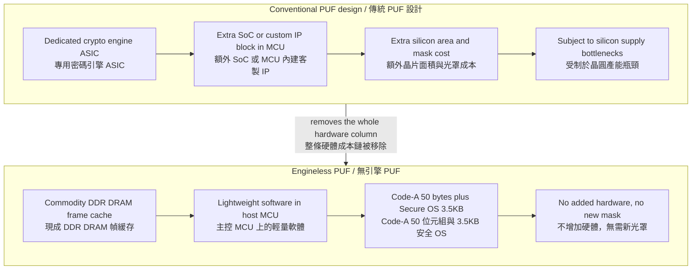
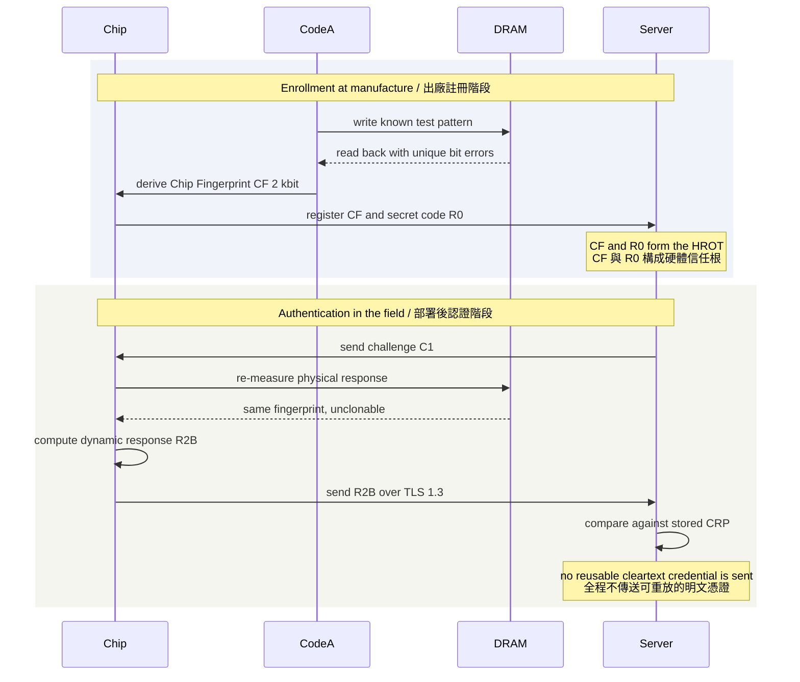
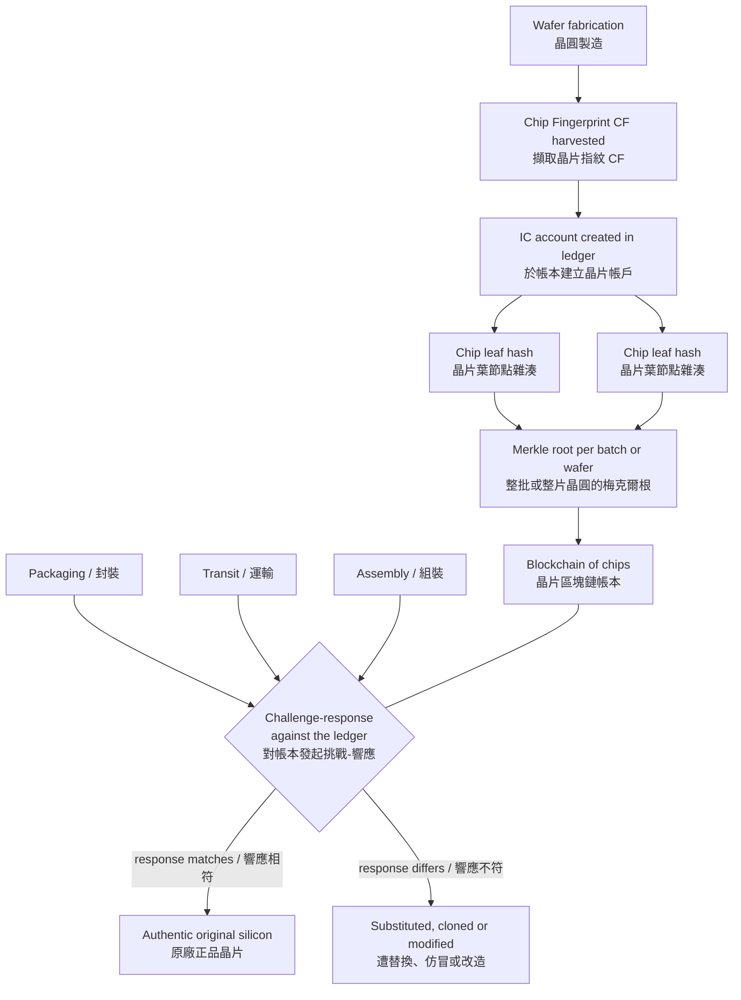

# Lecture 5: Physical Cyber Authentication (PCA)
# 第五講：物理網路認證技術 (PCA)

> **Note / 校訂：** Unlike the other lectures in this series, most of the attribution in these notes could **not** be confirmed against the public record. Four points need flagging.
>
> 1. **The Security of Data Transfer Council (SDC) is real and checks out.** It is 一般社団法人 伝送データセキュリティ評議会, a Japanese incorporated association headquartered in Toshima-ku, Tokyo, established in 2026 with nine founding member companies. Its own site lists **PCA (Physical Cyber Authentication)**, **PUF**, hash chains, blockchain, and PQC among its technical topics — so the lecture's framing of PCA as an SDC standardization effort is consistent with the organization's stated scope. Its representative director is **後藤 勝由 (Katsuyoshi Goto)**. No one named Watanabe appears among its listed officers.
> 2. **Speaker identity is probable, not confirmed.** The strongest match for "H. Watanabe" is **Prof. Hiroshi Watanabe**, Department of Electronics and Electrical Engineering, National Yang Ming Chiao Tung University (NYCU, formerly NCTU), Hsinchu, Taiwan — a Japanese researcher, formerly of Toshiba's ULSI Lab (1994–2010), whose published research covers exactly this material: PUF-based hardware roots of trust, the argument that existing PUFs are too expensive for low- and mid-end IoT, and blockchain accounts anchored to individual IC chips. That match is strong but **circumstantial**; no source directly ties him to this HITCON talk. Treat the identification as likely, not established.
> 3. **The "44 granted patents" figure is unverified and appears to conflict with the public record.** No patent database search returned a set of 44 PUF or PCA patents under any Watanabe. Separately, a conference biography for Prof. Hiroshi Watanabe claims "more than 170 patents worldwide (106 issued, 67 pending)" — a different number measuring something different. The claim is retained below as *reported in the talk*, not as verified fact.
> 4. **The talk is not on the published HITCON 2026 agenda.** The public agenda lists no session on PCA, PUF, or chip authentication, and no speaker named Watanabe. It may have been a late addition, a different track, or a session not reflected in the published listing.
>
> Additionally, several proper nouns in the Conclusion — **"ATPC / Association of Plastic Physical Cyber Network"**, **"NC"**, and **"SBC"** — return nothing at all and read as transcription artefacts. They are flagged in place rather than silently corrected.
>
> **校訂說明：** 與本系列其他講次不同，本篇筆記中的多數歸屬資訊**無法**經由公開紀錄查證，以下四點須特別標註。（1）**數據傳輸安全委員會（SDC）確實存在且與內容相符**：其正式名稱為「一般社団法人 伝送データセキュリティ評議会」，為 2026 年設立於東京都豐島區的日本一般社團法人，創始會員共九家企業；官方網站所列技術主題確實包含 **PCA（物理網路認證）**、**PUF**、雜湊鏈、區塊鏈與後量子密碼（PQC），故本演講將 PCA 定位為 SDC 標準化計畫一環的說法，與該組織自述範疇一致。其代表理事為 **後藤 勝由（Katsuyoshi Goto）**，公開幹部名單中並無姓「渡辺」者。（2）**講者身分為推定，非確認**：與「H. Watanabe」最相符者為國立陽明交通大學（NYCU，前身為交大）電子工程學系 **渡辺 弘（Hiroshi Watanabe）教授**——日籍研究者，1994 至 2010 年任職於東芝 ULSI 研究所，其已發表研究恰好涵蓋本演講主題：基於 PUF 的硬體信任根、現行 PUF 對中低階 IoT 而言成本過高之論述，以及將區塊鏈帳戶錨定於個別 IC 晶片的架構。此一比對雖高度吻合，但屬**間接推論**，並無任何來源直接將其與本場 HITCON 演講連結，請以「可能」而非「確定」看待。（3）**「44 項已授權專利」之數字未經查證，且與公開紀錄有出入**：各專利資料庫查詢均未返回任何以 Watanabe 為發明人、數量為 44 件的 PUF 或 PCA 專利集合；另一方面，渡辺弘教授的研討會簡歷則宣稱其擁有「全球逾 170 項專利（106 項已授權、67 項審查中）」——此為衡量標準不同的另一組數字。以下內文保留該說法，但僅作為**演講中所述之主張**，而非已查證事實。（4）**本演講未見於 HITCON 2026 公開議程**：公開議程中並無任何關於 PCA、PUF 或晶片認證的場次，亦無姓 Watanabe 之講者；可能屬後期加場、其他議程軌，或未反映於公開列表之場次。此外，結論段中的 **「ATPC / 塑料物理網路認證協會」**、**「NC」**、**「SBC」** 等專有名詞查無任何出處，研判為聽打訛誤，本文於原處加註標示而不逕行更動。

---

## 1. Speaker Information & Topic / 講者資訊與演講主題

### English
* **Speaker:** **H. Watanabe**
  * **Affiliations:** 
    * Distinguished security researcher and hardware systems architect.
    * Active contributor to the **Security of Data Transfer Council (SDC)**.
  * **Role & Background:** Watanabe-san is an expert in hardware security, specializing in physical unclonable functions (PUFs), low-cost cryptographic architectures, and trust anchors for resource-constrained IoT systems. He has over 10 years of experience designing and filing global patents for hardware-based secure identification — the talk states **44 patents granted across Japan, China, USA, Europe, and Taiwan** *(unverified — see the correction note at the top of this document; no patent-database search could confirm this figure)*.
  * **Probable identity *(unverified)*:** Most likely **Prof. Hiroshi Watanabe**, Dept. of Electronics and Electrical Engineering, National Yang Ming Chiao Tung University (NYCU), Hsinchu, Taiwan; previously Toshiba ULSI Lab, 1994–2010; PhD in Physics, University of Tsukuba. His published work on PUF-based roots of trust for low-end IoT and on anchoring blockchain accounts to IC chips matches this lecture closely, but no source directly confirms him as the speaker.
* **Topic:** **Physical Cyber Authentication (PCA): Engineless PUF and Blockchain of Chips** (物理網路認證技術：無引擎物理不可複製功能與晶片區塊鏈)
* **Lecture Duration:** 40-minute presentation at HITCON 2026.

### 繁體中文
* **講者：** **H. Watanabe**
  * **現職與機構：**
    * 傑出硬體安全專家與系統架構師。
    * **數據傳輸安全委員會 (SDC)** 的核心推動與標準化成員。
  * **專業背景：** Watanabe 先生是硬體安全領域的專家，專精於「物理不可複製功能」（PUF）、低成本密碼學架構以及資源受限型物聯網（IoT）系統的信任根。他在硬體安全識別領域深耕十餘年；演講中提及其在全球（日本、中國、美國、歐洲、台灣）**獲得 44 項專利授權** *（未經查證——參見本文開頭校訂說明；各專利資料庫查詢均無法證實此數字）*。
  * **推定身分 *(unverified)*：** 最可能為國立陽明交通大學（NYCU，新竹）電子工程學系 **渡辺 弘（Hiroshi Watanabe）教授**；1994 至 2010 年任職於東芝 ULSI 研究所；筑波大學物理學博士。其關於「面向低階 IoT 的 PUF 信任根」與「將區塊鏈帳戶錨定至 IC 晶片」之已發表研究與本演講高度吻合，惟並無來源可直接確認其為本場講者。
* **主題：** **物理網路認證技術 (Physical Cyber Authentication, PCA)：無引擎物理不可複製功能與晶片區塊鏈**
* **演講性質：** 於 HITCON 2026 發表之 40 分鐘技術研討與硬體實證演講。

---

## 2. Quick Summary / 內容簡要

### English
In this lecture, H. Watanabe addresses a foundational vulnerability of artificial intelligence (AI) systems: **input data integrity**. Since AI models fundamentally rely on the truthfulness of the data they consume, an attacker who manipulates IoT camera feeds or communication frames can easily deceive an AI model (e.g., hiding a pedestrian from autonomous driving algorithms or falsifying security footage). To resolve this at scale, Watanabe-san introduces **Physical Cyber Authentication (PCA)**, a revolutionary "engineless" hardware security scheme that provides a Root of Trust (RoT) for resource-constrained IoT devices without requiring expensive dedicated security microchips (such as TPMs or standard PUF cryptographic engines). By leveraging manufacturing variations in commodity DDR DRAM and frame caches already present in standard IoT communication modules, PCA extracts a unique "chip fingerprint" (CF) for less than **$0.005 USD per device** in software costs. The lecture details the cryptographic challenge-response protocols (CRP) managed by a decentralized three-server architecture (QM, CR, and SC Centrals) and outlines how PCA integrates with a "Blockchain of Chips" to secure global supply chains against counterfeit hardware.

### 繁體中文
本演講中，H. Watanabe 剖析了人工智慧（AI）系統在網路實體世界中面臨的核心安全瓶頸——**輸入數據完整性（Input Data Integrity）**。由於 AI 模型完全依賴其接收數據的真實性，攻擊者若在物聯網（IoT）攝影機或傳輸層篡改影像格（例如：在自動駕駛系統前抹除行人的存在，或偽造監控畫面），AI 將做出錯誤決策。為解決此問題，Watanabe 先生提出了**物理網路認證技術（PCA）**。這是一項顛覆性的「無引擎」（Engineless）硬體安全架構，旨在為資源受限的物聯網設備提供強韌的「信任根」（Root of Trust），而無需依賴昂貴且供應受限的專用安全晶片（如 TPM 或傳統含有專用密碼引擎的 PUF 晶片）。PCA 巧妙利用物聯網設備通訊模組或攝影機中現有的常規 DDR DRAM 與「幀緩存（Frame Cache）」在製造過程中產生的微小物理差異，來提取獨一無二的「晶片指紋（CF）」，將單一晶片的軟體整合授權成本壓縮至 **0.005 美元**。演講詳細剖析了由三端伺服器架構（QM、CR、SC）管理的挑戰-響應協議（CRP），並介紹了如何與「晶片區塊鏈」結合，徹底根治全球供應鏈中的仿冒晶片威脅。

---

## 3. Structured Lecture Context (Extremely Detailed) / 結構化演講內容（極致詳細）

### 3.1 The AI Integrity Bottleneck & The "Problem of Number" / 人工智慧完整性瓶頸與「數量安全難題」

#### English
* **The Vulnerability of AI Ingests:** Modern AI systems are heavily deployed in cyber-physical networks (e.g., autonomous vehicle cameras, automated smart cities, facility surveillance). However, AI possesses an inherent vulnerability: **it cannot autonomously verify the physical authenticity or integrity of its input data**. If an attacker performs session spoofing or intercepts communication frames (such as manipulating video stream packets on an IoT network), they can modify the raw images (e.g., removing a pedestrian or vehicle). The AI will process this spoofed input and draw dangerous, incorrect conclusions. Hence, secure data ingestion is an absolute prerequisite for AI reliability.
* **The "Problem of Number" in IoT Security:** In cyber-physical security, a system's security is defined by the formula:
  $$\text{Good security} = \text{Small number of unprotected devices} \times \text{Small unit price}$$
  If the majority of devices are insecure (a "minority" have high security, and a "majority" have low/no security), an attacker can easily locate an unprotected IoT node to pivot and execute session hijacking. 
* **The Cost-Availability Trade-Off:** Traditional high-end devices (e.g., secure enterprise servers, smart phones, specialized SSDs) can afford expensive hardware security modules (HSMs) or Trusted Platform Chips (TPMs). However, low-end IoT sensors, cameras, and embedded smart devices are highly price-sensitive ($30 to $33 USD total budget per System-in-Package/SiP) and require massive deployment scales. Implementing standard Hardware PUFs (Physical Unclonable Functions) is economically unfeasible because they require:
  1. An additional System-on-Chip (SoC) or dedicated cryptographic silicon real estate.
  2. Custom IP blocks embedded directly inside microcontrollers (MCUs), which face global silicon manufacturing supply bottlenecks.

#### 繁體中文
* **AI 輸入端漏洞：** 現代 AI 系統已被廣泛應用於網路實體世界（如：自駕車攝影機、智慧城市、基礎設施監控）。然而，AI 系統存在一個本質弱點：**它無法自主驗證輸入數據在物理傳輸過程中的真實性與完整性**。如果攻擊者實施會話欺騙（Session Spoofing）或攔截 IoT 傳輸格（Frames），便能輕易篡改原始圖像（如：抹除路上的行人）。AI 在接收假數據後會做出錯誤決策。因此，確保輸入數據的完整性是 AI 安全的前提。
* **物聯網「數量與安全」難題：** Watanabe 提出，物聯網安全體系的健全度遵循以下公式：
  $$\text{良好安全} = \text{未保護設備的極小數量} \times \text{極低單價}$$
  如果物聯網中「少數設備擁有高安全防禦，而多數設備毫無安全保障」，攻擊者便能輕易找到未受保護的節點作為突破口，繞過防火牆並發動會話劫持。
* **成本與供應鏈瓶頸：** 傳統高階設備（如：伺服器、智慧型手機、高階 SSD）能夠負擔昂貴的硬體加密晶片（如 TPM 或 HSM）。然而，中低階 IoT 感測器、鏡頭模組、智慧元件對成本極度敏感（整顆系統單封裝 SiP 晶片預算僅 30 至 33 美元），且出貨量極大。部署傳統「硬體型 PUF」存在巨大阻礙：
  1. 傳統 PUF 需要額外的安全單晶片（SoC）或專用晶片面積。
  2. 需要在微控制器（MCU）中加入專屬硬體 IP，這直接面臨製造供應鏈與晶片產能瓶頸。

---

### 3.2 The "Engineless PUF" Architecture (The $0.005 USD Trust Anchor) / 「無引擎物理不可複製功能」架構（0.005 美元的安全信任根）

#### English
* **DRAM Frame Cache as a Natural PUF:** To bypass the hardware cost barrier, PCA implements an **Engineless PUF** (Engine-less Physical Unclonable Function). Standard IoT modules and cameras already contain commodity DDR DRAM (typically 512KB Frame Caches or system memory) to buffer communication frames and raw pixels before packet transmission. Manufacturing tolerances in these standard silicon DRAM cells cause natural, unclonable physical variations in capacitor leakage rates and threshold voltages.
* **Eliminating the Cryptographic Coprocessor:** Instead of relying on a dedicated hardware cryptographic engine (an ASIC block) to generate PUF responses, the Engineless PUF uses a lightweight, patent-protected **software algorithm** running inside the host microcontroller (MCU). The software applies "flux" to write specific data patterns into the commodity frame cache. When read back, the unique, temperature-resilient bit errors are measured, yielding a highly stable, unique physical signature.
* **Transition of the Root of Trust (SROT/HROT):**
  1. **Before Shipment (Manufacturing Stage):** The device is loaded with a highly confidential, lightweight software module called **Code-A (50 bytes)** and a secure Operating System (Secure OS, 3.5KB).
  2. **At Shipment (Provisioning Stage):** Code-A executes to harvest the silicon physical signature from the DRAM frame cache. This signature is registered as a **Chip Fingerprint (CF, 2 Kilobits)**. A unique secret code **R0 (2 Kilobits)** is generated and tied to the CF for module supplier traceability. This combination forms the hardware **Hardware Root of Trust (HROT)**.
  3. **First-Usage Stage (Deployment):** Once deployed by the end user, a second, highly secure, and dynamic key **R1 (2 Kilobits)** is generated. The bundle—comprising the dynamic key R1, static secret code R0, physical Chip Fingerprint CF, and the lightweight Secure OS—defines the **Software Root of Trust (SROT)**.
  4. **The Cost Break:** Because this framework leverages commodity DRAM and eliminates dedicated cryptographic ASICs, the overall cost of integrating this robust hardware root of trust is compressed to **only $0.005 USD per chip** in software licensing fees.

#### 繁體中文
* **將 DRAM 幀緩存作為天然 PUF：** 為了打破硬體成本壁壘，PCA 引入了「無引擎 PUF」（Engineless PUF）技術。常規 IoT 攝影機和通訊模組內部都必須包含 DDR DRAM「幀緩存（Frame Cache，如 512KB）」或系統記憶體，以便在傳輸前暫存影像幀和數據格。DRAM 在生產製造中，矽晶圓電容的漏電率、晶體管閾值電壓等均存在微小的物理差異，這些物理特徵是完全不可複製的。
* **擺脫密碼協處理器的束縛：** 無引擎 PUF 不需要傳統 PUF 必需的專用硬體晶片電路（ASIC），而是透過主控制器（MCU）中運行的、獲得專利保護的「輕量化軟體演算法」，對現有 DRAM 幀緩存寫入特定測試數據流。讀回數據時，藉由檢測其在不同溫度下表現出的獨特位元錯誤率（Bit Error Rate），即可提取出高度穩定的物理指紋。
* **信任根演進脈絡（SROT/HROT）：**
  1. **出廠前（製造階段）：** 晶片中僅載入高度機密、極度輕量化的 **Code-A（50 軟體位元組）** 與安全作業系統（Secure OS，約 3.5KB）。
  2. **出廠時（初始化階段）：** 執行 Code-A 測量 DRAM 緩存，將測得的矽特徵註冊為 **晶片指紋（CF, 2 Kilobits）**。同時，由模組供應商生成用於追溯晶片生命週期的密鑰 **R0 (2 Kilobits)**。此階段的 CF 與 R0 共同構成了硬體安全基礎——**硬體信任根（HROT）**。
  3. **首次啟用（用戶部署階段）：** 用戶安裝並啟用設備後，系統會生成第二個動態密鑰 **R1 (2 Kilobits)**。此時，由 R1、R0、晶片指紋 CF 與 3.5KB Secure OS 共同組成了高度彈性且防護嚴密的**軟體信任根（SROT）**。
  4. **革命性成本效益：** 由於完全依賴常規 DRAM，不需要任何額外的晶片硬體製程，因此將該信任根導入物聯網晶片的軟體授權與集成成本，僅需驚人的 **0.005 美元**。

#### Diagram 1 — What "engineless" removes / 圖解一：「無引擎」架構省去了什麼



*Caption / 圖說: The core claim of "engineless" PUF — the fingerprint source moves from a dedicated crypto-engine ASIC to DRAM that the module already contains, so the silicon cost and the supply-chain dependency both disappear. Cost figures quoted in the talk (about USD 0.005 per chip) are the speaker's claim and were not independently verified. / 「無引擎」PUF 的核心主張：指紋來源由專用密碼引擎 ASIC 轉移到模組中本就存在的 DRAM，於是晶片面積成本與供應鏈依賴同時消失。演講中所引用的成本數字（每顆晶片約 0.005 美元）為講者主張，未經獨立查證。*

#### Diagram 2 — Enrollment vs. authentication / 圖解二：註冊階段與認證階段



Participants / 參與者： **Chip** = the IoT device / 物聯網裝置 · **CodeA** = the 50-byte provisioning routine / 50 位元組佈建常式 · **DRAM** = commodity frame cache / 現成幀緩存 · **Server** = QM, CR and SC centrals / QM、CR、SC 三端伺服器

*Caption / 圖說: PUF enrollment versus authentication. Enrollment happens once at manufacture and produces a stored challenge-response pair; authentication re-derives the same physical response on demand, so the secret is never stored in a form that can be copied off the device. / PUF 的註冊與認證流程對照。註冊僅在出廠時執行一次，產生並存放挑戰-響應對；認證則在需要時重新量測出相同的物理響應，因此機密從未以可被複製的形式存放於裝置上。*

---

### 3.3 Three-Server Decentralized Authentication Protocol / 三端去中心化認證協議

#### English
* **Mitigating Single-Point-of-Failure (SPOF):** Traditional authentication architectures rely on a single central server that stores device master keys. If that database is breached, the entire network is compromised. PCA mitigates this threat by deploying a **three-server decentralized trust architecture** where three independent servers independently manage state, challenges, and credentials:
  1. **QM Central (Quantity & Matrix Central):** Manages global device states ($I_B, I_C$, etc.) and distributes random challenge pools.
  2. **CR Central (Credential Central):** Manages Challenge-Response Pairs (CRP) and generates verification parameters (e.g., $C_2$, $C_{\text{FB}}$).
  3. **SC Central (Secret Codes Central):** Processes secret codes and cryptographic verification functions.
* **The Cryptographic Challenge-Response Loop (CRP):**
  * During session establishment, the device and the servers exchange random challenges.
  * The device runs the permutation and cryptographic challenge-response algorithms directly inside the SROT/HROT memory space, utilizing physical DRAM cache characteristics to compute the dynamic response key $R_{\text{2B}}$.
  * This $R_{\text{2B}}$ is then carried over **TLS 1.3** to authenticate the client automatically without transmitting any reusable cleartext credentials.
* **Instant, Global Key Revocation ("Hardware Firewall"):**
  * If a cryptographic leak is suspected, PCA can replace the secret keys of all deployed devices globally and simultaneously.
  * The central servers alter the input challenge from $C_1$ to a new challenge $C_1'$.
  * This instantly transitions the internal states of all target devices (e.g., shifting state from $I_A$ to $J_B$ or $J_C$) and regenerates the secret codes. The update is performed remotely, safely, and instantaneously, effectively acting as an active hardware-level firewall against large-scale network threats.

```text
       [ QM Central ]          [ CR Central ]          [ SC Central ]
       (Manages States)      (Manages Credentials)   (Manages Secret Codes)
              |                       |                       |
              |-- 1. Push State ------>                       |
              |<--------------------------------- 2. Sync ----|
              |                                               |
  Challenge C1|                                               | Challenge C2
              v                                               v
     +-----------------+                             +-----------------+
     |    Device A     | <======= SSL/TLS 1.3 ======> |    Device B     |
     | [SROT/HROT/CF]  |     Dynamic Response R2B    | [SROT/HROT/CF]  |
     +-----------------+                             +-----------------+
```

#### 繁體中文
* **擺脫單點失效（SPOF）風險：** 傳統認證系統將所有設備的金鑰存儲於單一中央數據庫，一旦該伺服器被侵入，整個網路的密鑰將全部洩漏。PCA 為了消除這一風險，設計了**三端去中心化信任架構**，由三個彼此獨立的伺服器共同進行狀態、認證與密鑰生成管理：
  1. **QM Central（數量與矩陣伺服器）：** 管理全球設備的內部狀態（如 $I_B, I_C$ 等），並分發隨機挑戰池。
  2. **CR Central（憑證伺服器）：** 管理挑戰-響應對（Challenge-Response Pairs, CRP），並生成驗證參數（如 $C_2, C_{\text{FB}}$）。
  3. **SC Central（秘密密鑰伺服器）：** 計算最終的秘密代碼與加密確認函數。
* **挑戰-響應密碼學閉環（CRP）：**
  * 當設備發起會話時，伺服器與設備端會交換隨機挑戰碼。
  * 設備端直接在 SROT/HROT 安全記憶體空間中運行置換與加密挑戰-響應演算法，結合 DRAM 幀緩存的物理特徵，計算出動態響應密鑰 $R_{\text{2B}}$。
  * 該密鑰 $R_{\text{2B}}$ 透過標準 **TLS 1.3** 通訊協定傳遞，無需在網路上傳輸任何可被重放的明文憑證，即可完成設備間的自動認證。
* **全球金鑰遠端「一鍵吊銷」機制：**
  * 若網路中出現密鑰洩漏威脅，PCA 支援對全球所有已部署設備進行瞬時、批量的密鑰吊銷與重構。
  * 伺服器端將輸入的挑戰值由 $C_1$ 修改為全新的 $C_1'$。
  * 這一變更會使所有設備的內部物理狀態瞬間發生轉移（例如：從狀態 $I_A$ 轉換至 $J_B$ 或 $J_C$），並自動重新生成整套秘密密鑰。整個更新過程完全在遠端完成，可被視為抵禦大規模會話劫持的主動「硬體防火牆」。

---

### 3.4 Supply Chain Protection & The "Blockchain of Chips" / 供應鏈安全與「晶片區塊鏈」

#### English
* **The Global Supply Chain Threat:** High-security sectors (including aerospace, military, critical transport infrastructure, and power grids) face catastrophic cyber-physical risks from counterfeit, modified, or backdoored silicon chips introduced during third-party manufacturing, packaging, or transit.
* **The "Blockchain of Chips" Solution:** PCA mitigates this by integrating the harvested physical Chip Fingerprints directly into a decentralized blockchain ledger:
  * Each physical silicon chip is assigned a unique cryptographic account in the ledger based on its physical DRAM fingerprint (CF).
  * The ledger organizes these fingerprints using a secure **Merkle Tree of Chips** (Merkle Tree of Chips) structure, where the root hash represents the verified cryptographic integrity of an entire production batch or wafer run.
  * In transit or during assembly, any technician or automated system can query the ledger, issue a challenge-response verification via PCA, and verify if the chip currently sitting in the socket is indeed the original, unmodified, and authentic silicon. This guarantees absolute end-to-end traceablity.

#### 繁體中文
* **全球供應鏈假冒晶片威脅：** 航空航太、軍事國防、交通控制、電網等高安全領域，面臨極大的供應鏈物理威脅：攻擊者可能在晶片代工、測試、封裝或運輸途中，用假冒、修改或內建硬體後門的惡意晶片進行替換。
* **「晶片區塊鏈」解決方案：** PCA 結合區塊鏈技術，將提取出的晶片指紋直接登記在去中心化帳本上：
  * 每一顆物理晶片都根據其物理 DRAM 指紋（CF）在區塊鏈帳本上創建一個獨一無二的「晶片帳戶（IC Account）」。
  * 帳本透過 **晶片梅克爾樹（Merkle Tree of Chips）** 結構組織這些指紋，其根哈希值代表一整批晶片或整片晶圓的完整性。
  * 在設備組裝或物流檢測時，檢測人員或自動化系統可隨時向帳本發起查詢，透過 PCA 進行挑戰-響應，驗證插座上的晶片是否為出廠時的原廠正品，保障了晶片生命週期的端到端物理可追溯性。

#### Diagram / 圖解



*Caption / 圖說: The "blockchain of chips" chain-of-trust ledger. Each chip's physical fingerprint becomes a leaf in a Merkle tree whose root commits an entire batch, so any point in the supply chain — packaging, transit, assembly — can re-challenge a chip and detect substitution without trusting the intermediate handlers. / 「晶片區塊鏈」信任鏈帳本。每顆晶片的物理指紋成為梅克爾樹的一個葉節點，其根雜湊承諾了整批晶片；因此供應鏈上的任一環節——封裝、運輸、組裝——都能重新對晶片發起挑戰以偵測替換，而無需信任中間經手方。*

---

## 4. Conclusion / 結論

### English
* **Input Integrity is Paramount:** H. Watanabe's lecture highlights that securing the cyber-physical boundary requires verifying the integrity of the data inputs to AI systems. If the data source itself is insecure, even the most advanced AI models will fail.
* **Coexistence with Traditional Security:** PCA does not seek to replace traditional security standards like TPM or hardware-based coprocessors in high-end devices. Instead, it coexists with them. On high-end hardware, PCA adds a redundant layer of protection, while on low-end, budget-constrained IoT devices, it serves as the primary, highly affordable security anchor.
* **Strong Standardization Momentum:** Backed by a claimed 44 granted global patents *(unverified)*, the PCA technology has established standardization momentum. SDC (Security of Data Transfer Council) has launched official standard initiatives for ISO submission, and "NC" is described as organizing the **"Association of Plastic Physical Cyber Network (ATPC)"** to align PCA with IETF, "SBC", and ISO frameworks.
  * *Transcription caveat / 聽打存疑:* The names **"ATPC"**, **"Association of Plastic Physical Cyber Network"**, **"NC"**, and **"SBC"** return no results in any public source and are most likely mishearings. The SDC's own standardization activity **is** confirmed; these four names are not.

### 繁體中文
* **輸入完整性是 AI 安全之本：** H. Watanabe 的演講深刻闡明，在網路實體邊界上，驗證 AI 輸入數據的完整性是最高優先級的安全工作。如果數據源頭本身不安全，再強大的 AI 也會失效。
* **與傳統安全防禦無縫共存：** PCA 技術並非旨在完全淘汰高階設備中如 TPM 等現有的專用硬體防禦，而是與其共存。在高階設備中，PCA 可提供多一層冗餘物理驗證；而在極度受限的中低階 IoT 設備中，PCA 則是唯一的、低成本的物理信任根。
* **雄厚的標準化進展：** 基於演講所稱之全球 44 項已授權專利 *(unverified)*，PCA 已取得標準化進展。數據傳輸安全委員會（SDC）已啟動針對 ISO 的標準化工作；演講另提及「NC」正積極籌建「塑料物理網路認證協會（ATPC）」，以推動將 PCA 納入 IETF、「SBC」與 ISO 技術標準。
  * *聽打存疑：* **「ATPC」**、**「塑料物理網路認證協會」**、**「NC」**、**「SBC」** 四個名稱在任何公開來源中均查無結果，極可能為聽打訛誤。SDC 本身的標準化活動**確實**已獲證實，但上述四個名稱並未獲證實。

---

## 5. Possible Implementation & Extension / 延伸實作與未來方向

### English
1. **Rust-Based Lightweight SROT Core:** Implement the SROT (Software Root of Trust) runtime core using Rust (`no_std`) for deployment on ultra-low-power ARM Cortex-M microcontrollers, guaranteeing complete memory safety during the extraction and permutation of the DRAM frame cache bit-arrays.
2. **GPU & HBM (High Bandwidth Memory) Anti-Tamper Shielding:** Extend the PCA physical verification scheme to secure high-performance computing clusters. By harvesting physical fingerprints from high-bandwidth memory (HBM) modules directly coupled with GPUs, data center operators can detect physical hardware swapping, side-channel probe insertion, or unauthorized data scraping at the physical memory level.
3. **Decentralized PKI Bridge for Smart Cities:** Build an open-source, lightweight bridge that interfaces PCA's three-server dynamic response ($R_{\text{2B}}$) with existing decentralized Public Key Infrastructures (dPKI). This would allow IoT smart meters to register themselves automatically into smart grid contracts on a blockchain without any human-in-the-loop key management.

### 繁體中文
1. **基於 Rust 的輕量化 SROT 核心：** 使用嵌入式 Rust（`no_std`）開發 SROT 軟體信任根的執行時核心，部署於 ARM Cortex-M 等微控制器上。利用 Rust 語言的記憶體安全特性，確保在讀寫 DRAM 幀緩存並進行位置置換時，數據不會發生緩衝區溢位或競爭條件漏洞。
2. **GPU 與 HBM（高頻寬記憶體）物理防篡改保護：** 將 PCA 物理驗證架構擴展至高效能計算與 AI 資料中心。透過對 GPU 晶片旁封裝的高頻寬記憶體（HBM）進行物理特徵提取，資料中心管理員可在實體層即時監測 GPU 模組是否被非法拆換、側通道探針插線，或物理級的數據抓取。
3. **智慧城市去中心化 PKI 橋接器：** 開發開源輕量化橋接程式，將 PCA 三端伺服器的動態響應密鑰 $R_{\text{2B}}$ 與現存的去中心化公鑰基礎建設（dPKI）對接。這將使智慧電表、環境感測器在通電後能自動在區塊鏈上註冊設備身分，實現完全免人工參與的智慧電網自動認證。

---

## 6. Bilingual Precise Transcript / 雙語對照逐字稿

### English / 繁體中文 對照

| English | 繁體中文 |
| :--- | :--- |
| First, let us make a brief introduction. Here is a practical example of autonomous driving: a person is walking in the street, and the vehicle's camera captures them. This data is transmitted over a device-to-device IoT network. | 首先，讓我做一個簡短的介紹。這裡有一個自駕車的實際範例：有一個人正在街上行走，車輛的攝影機會捕捉到他們的影像。這些數據會透過物聯網的設備對設備（D2D）網路進行傳輸。 |
| On the other hand, we have AI running in the cyber network. Usually, we assume that Device A, Account B, and Device C are securely linked. However, if they are not tightly coupled, session spoofing becomes possible. | 另一方面，我們在網路空間中運行 AI 系統。通常，我們假設設備 A、帳戶 B 與設備 C 之間是安全地鏈結在一起。然而，如果它們之間沒有緊密耦合，便會產生會話欺騙（Session Spoofing）的漏洞。 |
| In this scenario, an attacker can manipulate the image data. Once they modify the frame, the pedestrian disappears from the camera feed. The AI in the cloud is deceived, misunderstands the environment, and makes a catastrophic decision. | 在這種情況下，攻擊者可以對圖像數據進行篡改。一旦他們修改了幀緩存，行人就會從攝影機畫面中消失。雲端的 AI 將受到欺騙，誤判環境並做出災難性的決策。 |
| This highlights a fundamental problem: the integrity of input data to AI systems. This is an essential weak point of current AI architectures. Without data integrity assurance, AI cannot trust the camera feeds it relies on. | 這暴露出一個根本性的問題：AI 系統輸入數據的完整性。這是當前 AI 架構最核心的脆弱點。如果沒有數據完整性的保障，AI 就根本無法信任它所依賴的攝影機畫面。 |
| To address this target, we developed a new technology called Physical Cyber Authentication (PCA), which leverages a hardware-based Root of Trust on the devices. | 為了解決這個安全隱患，我們開發了一項名為「物理網路認證（PCA）」的新技術，它在設備端構建了基於硬體的信任根（Root of Trust）。 |
| However, there is a challenge. If securing devices requires a standard hardware Root of Trust, resource-constrained IoT devices will not have it. Standard OTP is not secure enough. As long as the majority of devices are insecure, attackers can easily find paths to compromise the target. | 然而，這面臨著一個挑戰。如果保障安全必須依賴標準的硬體信任根晶片，資源受限的低階物聯網設備便根本無法承受其成本。標準的一次性密碼（OTP）在此場景中並不安全。只要網路上多數設備缺乏防護，攻擊者就能輕易找到路徑滲透並破壞目標系統。 |
| For high-end devices like smart devices or expensive SSDs, unit costs are high, but deployment numbers are small. They have excellent security performance. But for low-end sensors, they represent the majority, and this cost barrier prevents stable, secure deployment. | 對於智慧型手機或昂貴 SSD 等高階設備，單價雖高但部署數量較少，它們擁有極佳的安全防護。但對於佔絕大多數的中低階感測器而言，高昂的硬體成本阻礙了安全機制的普及與穩定供應。 |
| To resolve this stable supply bottleneck, we came up with an 'engineless' PUF technology. There is no additional SoC required, meaning zero extra hardware engine costs. | 為了徹底解決這一供應與成本瓶頸，我們研發了「無引擎物理不可複製功能」（Engineless PUF）技術。它不需要額外的安全單晶片（SoC），這意味著硬體上的額外加密引擎成本降為零。 |
| Normal communication modules contain DDR DRAM frame caches to buffer data packets before sending. Since this memory must exist in the IO module anyway, we leverage its natural manufacturing tolerances. | 常規的通訊模組內部都必須配置 DDR DRAM 幀緩存，以便在發送前暫存數據包。既然這個記憶體本身就已經存在於物聯網通訊模組中，我們便可以直接利用其製造過程中產生的天然物理特徵。 |
| Instead of a custom hardware ASIC engine, we use lightweight software running inside the host MCU to apply specific patterns to the frame cache. We measure the temperature-resilient, unique bit errors to harvest a highly stable chip fingerprint (CF). | 我們無需定制硬體 ASIC 引擎，而是使用主控制器（MCU）中運行的輕量化軟體，對幀緩存寫入特定數據流。透過測量隨溫度變化的獨特位元錯誤率，來提取出高度穩定的晶片指紋（CF）。 |
| Our decentralized schema deploys three independent servers: QM Central to manage states, CR Central to manage credentials, and SC Central to manage secret codes. | 我們的去中心化認證架構部署了三個相互獨立的伺服器：管理設備物理狀態的 QM 伺服器、管理認證憑證的 CR 伺服器，以及管理秘密代碼的 SC 伺服器。 |
| During connection setup, the device uses physical DRAM properties to generate a dynamic verification key R2B. This is carried over TLS 1.3 to authenticate the device automatically without transferring cleartext credentials. | 在建立連線時，設備利用物理 DRAM 特徵生成動態驗證密鑰 R2B。該密鑰透過 TLS 1.3 協定傳輸，在不洩漏明文憑證的前提下實現設備的自動、安全認證。 |
| We can also combine PCA with a blockchain ledger, creating a 'Blockchain of Chips' to track and monitor chip fingerprints in global supply chains, securing critical infrastructure and aerospace hardware against counterfeits. | 我們還可以將 PCA 物理驗證與區塊鏈技術相結合，打造「晶片區塊鏈」來監測和追踪全球供應鏈中的晶片指紋，保護關鍵基礎設施和航太硬體免受假冒晶片的侵入。 |
| We have successfully demonstrated this technology through three physical PoCs, including FPGA-level verification, Wi-Fi transceiver testing under extreme temperatures (-40C to 105C), and standalone integration. The software licensing cost is only about 0.005 USD per chip, making it highly feasible for massive IoT deployment. | 我們已經透過三次物理原型（PoC）成功證實了這項技術，包括 FPGA 級驗證、在極端溫度（-40度至105度）下的 Wi-Fi 收發器晶片測試，以及獨立晶片集成。其單片軟體授權成本僅約 0.005 美元，在大規模物聯網部署中具有極高的可行性。 |

---

## Resources, Repositories & Contacts / 資源、程式碼庫與聯絡方式

> **Verification status / 查證狀態:** The organization (SDC) is confirmed. The speaker's identity is a **probable** match only, and the "44 patents" figure could not be confirmed at all. Items below are labelled accordingly; anything marked **(unverified)** is a search pointer or adjacent material, not a citation for a claim in the lecture. / **組織**（SDC）已獲證實；**講者身分**僅為**推定**相符；**「44 項專利」**完全無法查證。以下條目均據此標註，標示 **(unverified)** 者為查詢方向或相關參考資料，並非對演講內容之引用來源。

### Speaker & Contact / 講者與聯絡方式

**Security of Data Transfer Council (SDC) — confirmed / 已證實**

| Item / 項目 | Detail / 內容 |
| :--- | :--- |
| Official site / 官方網站 | https://sec-datatransfer.org/ |
| Formal name / 正式名稱 | 一般社団法人 伝送データセキュリティ評議会 |
| Representative Director / 代表理事 | 後藤 勝由 (Katsuyoshi Goto) |
| Location / 所在地 | Minami-Ikebukuro, Toshima-ku, Tokyo / 東京都豐島區南池袋 |
| Established / 設立 | 2026 (founding announcement / 設立公告: https://www.atpress.ne.jp/news/619591) |
| Listed technical topics / 所列技術主題 | PUF, **PCA (Physical Cyber Authentication)**, hash chain, blockchain, PQC |

Nine founding member companies are listed on the SDC site, including 株式会社シーズ (Sees), TDIプロダクトソリューション, リンテック (Lintec), NSW, 株式会社平山 (Hirayama), ディジタルメディアプロフェッショナル (DMP), ロジック・アンド・デザイン, ACCROSOR PTE. LTD., and Systory. / SDC 網站列出九家創始會員企業，包括株式会社シーズ、TDI プロダクトソリューション、リンテック、NSW、株式会社平山、ディジタルメディアプロフェッショナル、ロジック・アンド・デザイン、ACCROSOR PTE. LTD. 與 Systory。

**Prof. Hiroshi Watanabe — probable speaker *(unverified)* / 推定講者**

| Item / 項目 | Link / 連結 |
| :--- | :--- |
| NYCU Academic Hub profile / 學術檔案 | https://scholar.nycu.edu.tw/en/persons/hiroshi-watanabe/ |
| NYCU Institute of Electrical and Computer Engineering faculty page / 電機資訊學院師資頁 | https://iece.dee.nycu.edu.tw/teachers.php?pa=getItem&teacher_id=123&locale=en |
| SciProfiles author page / 作者頁 | https://sciprofiles.com/profile/609050 |

Background / 背景: Professor, Dept. of Electronics and Electrical Engineering, NYCU (Hsinchu, Taiwan); Toshiba ULSI Lab 1994–2010; PhD in Physics, University of Tsukuba. Stated research interests are theoretical physics, nano devices, and device simulation, with recent work on AIoT and blockchain. / 國立陽明交通大學（新竹）電子工程學系教授；1994–2010 年任職東芝 ULSI 研究所；筑波大學物理學博士。所列研究興趣為理論物理、奈米元件與元件模擬，近期研究涉及 AIoT 與區塊鏈。

**Why the match is only probable / 為何僅為推定:** his profile does not list PUF or PCA publications by title, and no source connects him to this HITCON session. What matches is the substance — his research argues that existing PUFs are built on expensive SoC designs unsuitable for low- and mid-end IoT, and describes anchoring a blockchain account to an IC chip inside a sensor to form a "blockchain of sensors". That is the lecture's thesis almost verbatim, but it is circumstantial evidence. / 其學術檔案並未逐篇列出 PUF 或 PCA 相關著作，亦無來源將其與本場 HITCON 演講連結。真正吻合的是研究內容本身——他主張現行 PUF 建構於昂貴的 SoC 設計之上，不適用於中低階 IoT，並描述將區塊鏈帳戶錨定至感測器內部的 IC 晶片以形成「感測器區塊鏈」。這幾乎就是本演講的論旨，但仍屬間接佐證。

*Institutional contact details appear on the faculty page linked above; they are not reproduced here.* / *機構聯絡方式請見上方師資頁連結，此處不予轉載。*

### Code & Repositories / 程式碼庫

**No public repository for PCA, the engineless PUF, or the blockchain-of-chips ledger could be located.** The technology is presented as patent-protected and commercially licensed, which is consistent with the absence of open source. / **查無 PCA、無引擎 PUF 或晶片區塊鏈帳本的任何公開程式碼庫。** 該技術以受專利保護、商業授權的形式呈現，與其無開源實作的情況相符。

Adjacent open work for anyone implementing the ideas / 相關可參考的公開研究 *(unverified — related material, not sources for this talk / 相關材料，非本演講之來源)*:

| Topic / 主題 | Link / 連結 |
| :--- | :--- |
| PUFchain — hardware-assisted blockchain for device and data security / 硬體輔助之區塊鏈架構 | https://arxiv.org/abs/1909.06496 |
| Securing blockchain-based IoT with PUFs and zero-knowledge proofs / 以 PUF 與零知識證明保護區塊鏈 IoT | https://arxiv.org/html/2405.12322v1 |
| Public-key authentication architecture for IoT devices using PUF / 基於 PUF 的 IoT 公鑰認證架構 | https://arxiv.org/abs/2002.01277 |
| FP-Rowhammer — DRAM-based device fingerprinting / 基於 DRAM 的裝置指紋辨識 | https://arxiv.org/pdf/2307.00143 |

### Papers, Patents & Standards / 論文、專利與標準

**Patents / 專利**

The "44 granted patents across JP/CN/US/EP/TW" figure is **(unverified)**. No search of Google Patents, Justia, or USPTO full-text returned such a portfolio under any Watanabe for PUF or PCA. To check it directly / 若需自行查證，可從以下入口著手:

* Google Patents: https://patents.google.com/
* J-PlatPat (Japan Platform for Patent Information) / 日本特許情報平台: https://www.j-platpat.inpit.go.jp/
* Justia Patents inventor search / 發明人檢索: https://patents.justia.com/

A conference biography for Prof. Hiroshi Watanabe separately claims "more than 170 patents worldwide (106 issued & 67 waiting)" — a different figure measuring a different thing, and itself dated. / 另有渡辺弘教授的研討會簡歷宣稱其擁有「全球逾 170 項專利（106 項已授權、67 項審查中）」——此為衡量對象不同的另一組數字，且該簡歷本身已有年份。

**PUF literature / PUF 文獻** *(background reading, not talk sources / 背景閱讀，非演講來源)*

* IEICE Japanese-language survey — 「Physically Unclonable Function（PUF）とその応用」: https://app.journal.ieice.org/trial/103_1/k103_1_57/index.html
* *A survey on physical unclonable function (PUF)-based security solutions for Internet of Things* (Computer Networks): https://www.sciencedirect.com/science/article/pii/S1389128620312275
* *Towards Implementation of Robust and Low-Cost Security Primitives for Resource-Constrained IoT Devices*: https://arxiv.org/pdf/1806.05332
* *Towards Trusted IoT Sensing Systems — Implementing PUF as Secure Key Generator for Root of Trust and MAC* (ACM): https://dl.acm.org/doi/fullHtml/10.1145/3505253.3505258
* Toshiba R&D note on PUF for IoT device authentication / 東芝 IoT 機器個體認證 PUF 技術: https://www.global.toshiba/jp/technology/corporate/rdc/rd/topics/18/1806-01.html
* SRAM PUF industry primer / 產業入門介紹: https://semiengineering.com/sram-puf-the-secure-silicon-fingerprint/
* Chip fingerprinting for traceability / 晶片指紋與可追溯性: https://semiengineering.com/fingerprinting-chips-for-traceability/

**Standards bodies referenced in the talk / 演講提及之標準組織**

* ISO: https://www.iso.org/
* IETF: https://www.ietf.org/
* SDC standardization activity / SDC 標準化活動: https://sec-datatransfer.org/

*The talk's references to "SBC" and to an "Association of Plastic Physical Cyber Network (ATPC)" could not be resolved to any real body.* / *演講中提及的「SBC」與「塑料物理網路認證協會（ATPC）」無法對應到任何實際存在的組織。*

### Talk & Slides / 演講資料

| Item / 項目 | Status / 狀態 |
| :--- | :--- |
| HITCON 2026 agenda / 議程 | https://hitcon.org/2026/en-US/agenda/ — **this session is not listed.** No PCA, PUF, or chip-authentication talk and no speaker named Watanabe appear on the published agenda. / **本場次未列於議程。** 公開議程中查無 PCA、PUF 或晶片認證相關演講，亦無姓 Watanabe 之講者。 |
| Slides / 簡報 | Not published as far as could be determined **(unverified)**. / 就查證所及未見公開發布 **(unverified)**。 |
| Recording / 錄影 | Not located **(unverified)**. / 未尋獲 **(unverified)**。 |

**Note / 注意:** `hitcon.org` returns HTTP 403 to most automated fetchers; the `r.jina.ai` text proxy retrieves it successfully. The absence from the agenda may reflect a late addition or an unlisted track rather than an error in these notes. / `hitcon.org` 對多數自動抓取工具回傳 HTTP 403，透過 `r.jina.ai` 文字代理則可正常取得。議程中的缺席可能反映後期加場或未公開列出的議程軌，未必代表本筆記有誤。

### Further Reading / 延伸閱讀

* **SDC founding press release / SDC 設立新聞稿** (Japanese / 日文) — TDI Product Solutions' announcement of joining the council, with the council's mission and member list: https://www.atpress.ne.jp/news/619591
* **METI on cyber-physical security / 日本經濟產業省網路實體安全政策文件** (Japanese / 日文) — policy context for Japan's cyber-physical security framework, the environment SDC's standardization effort sits in: https://www.meti.go.jp/shingikai/mono_info_service/sangyo_cyber/wg_seido/pdf/004_07_00.pdf
* **Matter and supply-chain device attestation** — for comparison with PCA's fabric-level trust claims, the Connectivity Standards Alliance specification request form: https://csa-iot.org/developer-resource/specifications-download-request/
* **DataSafe — copyright protection with PUF watermarking and blockchain tracking** — an academic treatment of the same PUF-plus-ledger pairing PCA proposes: https://arxiv.org/pdf/2405.19099

---
