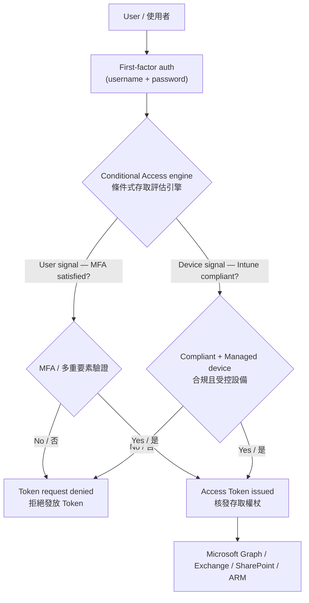
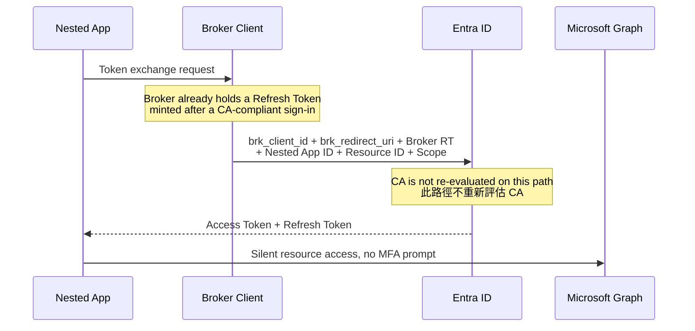
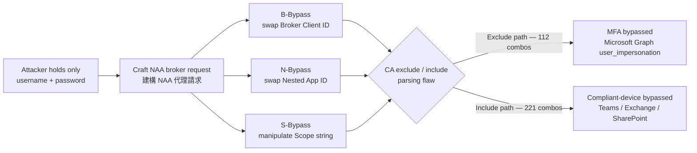
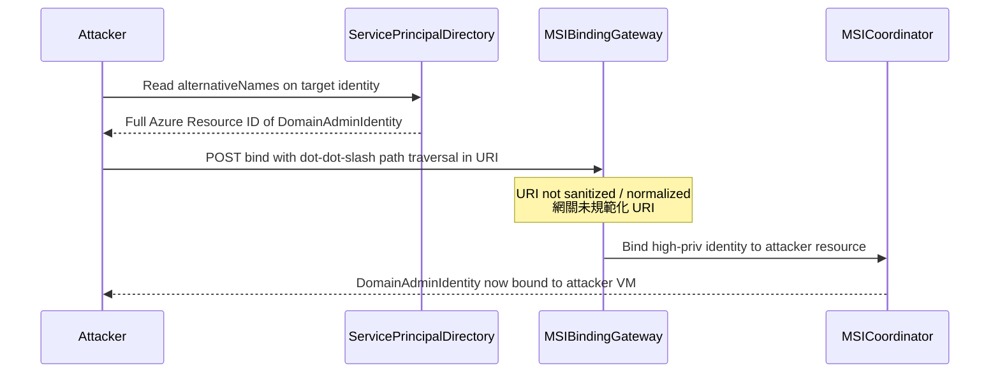

# Lecture 8: CA Bypass Model & Nested App Authentication (NAA)
# 第八講：Conditional Access (CA) 繞過模型與巢狀應用程式認證 (NAA) 全景實戰分析

> **Note / 校訂：** Two claims in the original notes could not be verified and are retained here only as *notes-as-heard*, clearly labelled. (1) **Speaker attribution — "DeCraft" could not be verified as a real research team.** No team of that name exists in public record for this subject; the popular guess that "DeCraft" is a mishearing of **DEVCORE** is **speculation only** and is not asserted here. No named individuals are attributed. (2) **Broker-app count — the notes say 7 broker applications; the only verified public research on this exact technique (Thomas Byrne / NetSPI) documents 3.** Both figures are presented side by side below. Likewise, the **112 / 221 Resource × Scope** figures, the "Fortune Cookie" path-traversal story, and the claim that this work was also presented at Black Hat USA 2026 / DEF CON 34 are **unverified**; the talk's presence on the public HITCON 2026 agenda could not be confirmed either.
>
> **校訂說明：** 原始筆記中有兩點無法查證，以下僅以「現場聽記」形式保留並明確標示。(1)**講者歸屬——「DeCraft」無法查證為真實研究團隊**：公開紀錄中並不存在此名稱的研究團隊；坊間推測「DeCraft」為 **DEVCORE** 的誤聽，**純屬臆測**，本文不予斷言，亦不歸屬於任何具名個人。(2)**Broker 應用程式數量——筆記記為 7 個，但此技術唯一可查證的公開研究（Thomas Byrne / NetSPI）記載為 3 個**；本文並陳兩者。同樣地，**112 / 221 組 Resource × Scope** 數字、「幸運餅乾」路徑走訪故事，以及本研究曾於 Black Hat USA 2026 / DEF CON 34 發表之說法皆**未經查證**；本場次是否列於 HITCON 2026 公開議程亦無法確認。

---

## 1. Speaker Information & Topic / 講者資訊與演講主題

### English
* **Speaker:** presented as **"DeCraft"** in the session notes *(unverified — see the correction note above; no named individuals are attributed)*.
  * **Described affiliation (as heard):** a cloud security research team specializing in enterprise Identity Providers (IdP), Microsoft Entra ID (Azure AD), and directory-level logic validation models.
  * **Described background (as heard):** vulnerability research on SaaS trust boundaries, OAuth delegation protocols, and Microsoft 365 / Azure directory security controls, focused on systemic logic bypasses in Microsoft's authorization and Conditional Access engines.
* **Topic:** **CA Bypass Model & Nested App Authentication (NAA)** (Conditional Access 條件式存取繞過模型與巢狀應用程式認證)
* **Lecture Duration:** 40-minute advanced cloud security session presented at HITCON 2026.
* **Grounded Source:** the complete presentation transcript of **新錄音 43.mp3** (intro) and **新錄音 46.mp3** (full technical session), plus the moderator's opening in **新錄音 45.mp3**.

### 繁體中文
* **講者：** 筆記中記為 **「DeCraft」**（*未經查證——參見上方校訂說明；本文不歸屬於任何具名個人*）。
  * **聽記之所屬機構：** 專精於企業級身分識別提供者（IdP）、Microsoft Entra ID（原 Azure AD）以及目錄級別邏輯驗證漏洞的雲端安全研究團隊。
  * **聽記之專業背景：** 從事 SaaS 信任邊界、OAuth 委派協定（Delegation Protocols）及 Microsoft 365／Azure 目錄安全控制研究，聚焦於微軟授權與條件式存取（CA）評估引擎中的系統性邏輯繞過。
* **主題：** **CA Bypass 威脅模型與巢狀應用程式認證 (NAA)** (CA Bypass Model & Nested App Authentication)
* **演講性質：** 於 HITCON 2026 發表之 40 分鐘高階雲端身分安全、條件式存取繞過與雲端委派攻擊實戰演講。
* **內容來源：** 錄音檔案 **新錄音 43.mp3**（開場引言）、**新錄音 46.mp3**（完整技術演講與問答），以及 **新錄音 45.mp3**（主持人開場）之 grounding 記錄。

---

## 2. Quick Summary / 內容簡要

### English
This technical lecture exposes systemic logical vulnerability patterns within Microsoft Entra ID's Conditional Access (CA) evaluation engine. While CA policy is designed to enforce zero-trust walls—verifying the **User** (via MFA) and the **Device** (via Intune compliance/management status) before granting resource access—the research demonstrates how these boundaries can be silently bypassed without user interaction. By abusing **Nested App Authentication (NAA)**, a framework designed to optimize user experience by embedding Single Page Applications (SPAs) inside primary "Broker Clients" (such as Microsoft Teams or Outlook), attackers can inherit parent trust contexts to silently retrieve high-privilege access tokens.

The session details **112 combinations of Resource × Scope bypasses** for Microsoft Graph and **221 combinations** targeting sensitive enterprise workloads (including Teams, Exchange Online, and SharePoint Online) *(figures as heard; unverified)*. Successful bypass grants un-MFA'd access to highly sensitive Microsoft endpoints — **Microsoft Graph**, **Azure AD Graph**, and **Azure Resource Manager (ARM)**. The talk also presents an Intune compliance device-enrollment bypass via Azure Managed Identities, and an arbitrary identity hijacking vulnerability using a **path traversal** logic flaw in User Assigned Identity binding APIs (reported to MSRC; nicknamed the "Fortune Cookie" case in the notes).

The corresponding *verified* public research for this exact technique is **Thomas Byrne (NetSPI)**, "Bypassing Microsoft Entra Conditional Access Policies via Nested App Authentication" — reported to MSRC **2026-03-17**, server-side fix **2026-06-08**, publicly disclosed **2026-06-22**, rated **medium severity with no CVE assigned**; blocked flows now return `AADSTS53003`.

### 繁體中文
本場技術演講揭露了 Microsoft Entra ID 條件式存取（Conditional Access, CA）評估引擎中一系列系統性的邏輯漏洞模式。雖然條件式存取原則的設計初衷是構建零信任防火牆——在授予資源存取權限之前，必須嚴格驗證**使用者**（透過多重要素驗證 MFA）和**設備**（透過 Intune 合規／受控狀態）；然而研究證實，攻擊者可以在完全不與使用者互動的情況下悄無聲息地繞過這些安全邊界。透過濫用「**巢狀應用程式認證（Nested App Authentication, NAA）**」——一項旨在透過將單頁應用程式（SPA）嵌入「代理客戶端（Broker Clients）」（如 Microsoft Teams 或 Outlook）來優化使用者體驗的框架——攻擊者可以繼承父容器的信任上下文，從而靜默獲取高權限的 Access Token。

演講剖析了針對 Microsoft Graph 的 **112 組資源與權限（Resource × Scope）繞過組合**，以及針對敏感企業工作負載（如 Teams、Exchange Online、SharePoint Online）的 **221 組繞過組合**（*數字為現場聽記，未經查證*）。成功繞過後，攻擊者可在無需 MFA 或合規設備的情況下存取極度敏感的微軟端點：**Microsoft Graph**、**Azure AD Graph** 與 **Azure Resource Manager（ARM）**。此外，講者亦展示了利用 Azure 託管身分（Managed Identities）繞過 Intune 合規設備註冊的機制，以及利用使用者指派身分（User Assigned Identity）綁定 API 中的**路徑走訪（Path Traversal）**邏輯缺陷進行任意身分劫持的漏洞（已向 MSRC 通報，筆記中稱為「幸運餅乾」案例）。

此技術目前唯一**可查證**的公開研究為 **Thomas Byrne（NetSPI）**〈Bypassing Microsoft Entra Conditional Access Policies via Nested App Authentication〉——於 **2026-03-17** 通報 MSRC、**2026-06-08** 完成伺服器端修補、**2026-06-22** 公開揭露，評級為**中度風險且未指派 CVE**；遭阻擋的流程現在會回傳 `AADSTS53003`。

---

## 3. Structured Lecture Context (Extremely Detailed) / 結構化演講內容（極致詳細）

### 3.1 Understanding the CA & NAA Architecture / 條件式存取與巢狀應用程式認證架構解析

#### English
* **The Normal Conditional Access Flow:**
  * To enforce robust security, Entra ID evaluates policies to decide whether a user session requires Multi-Factor Authentication (MFA), compliant devices, or secure locations.
  * If a standard user attempts to authenticate without completing MFA, the CA engine blocks the token request, denying access to the target corporate resources.
  * **Critical detail from Microsoft's own documentation:** Conditional Access is enforced **after first-factor authentication completes** — it is a second gate, not the front door. And per the Primary Refresh Token (PRT) documentation, **CA policies are not evaluated when PRTs are issued or renewed**. Both facts are load-bearing for everything that follows.
* **The Two Broad Threat Vector Families:**
  1. **Abusing built-in CA behaviours** — exploiting undocumented pathways where Microsoft allows built-in or legacy first-party services to sidestep standard evaluation logic.
  2. **Abusing Entra ID & Azure features** — misusing trust-delegation models where a secondary application inherits the security classification of its parent container.
* **The Paradigm Shift to Frictionless UX:**
  * To maximize corporate convenience, Microsoft introduced **Nested App Authentication (NAA)**, allowing sub-applications (Single Page Applications / SPAs written in React/Angular) embedded inside native M365 desktop or web containers to authenticate seamlessly without throwing up redundant user login windows or multi-factor prompts.
* **The Nested App Topology:**
  * **Broker Client (BC) [The Container]:** A highly trusted native application, such as **Microsoft Teams** or **Outlook**, running locally or on the web.
  * **Nested App (N-App) [The Guest]:** An HTML/JavaScript/SPA element running *inside* the Broker Client (e.g., a calendar component, a note-taking extension like OneNote, or M365 Copilot).
* **The Dynamic Token Exchange Protocol:**
  1. The nested application initiates a token exchange request, passing intent parameters to the underlying **Broker Client**.
  2. The Broker Client silently constructs a secure request to Entra ID, transmitting **5 critical parameters**:
     * **Broker Client ID:** The highly trusted Application ID of the parent (e.g., Microsoft Teams App ID). In the public NetSPI write-up this maps to the `brk_client_id` request parameter, paired with `brk_redirect_uri`.
     * **Broker Client Refresh Token (RT):** The parent's persistent cryptographic credential used to exchange for sub-tokens — already minted *after* the broker's own CA-compliant sign-in.
     * **Nested App ID:** The identifier of the inner SPA (e.g., OneNote).
     * **Resource ID:** The targeted cloud service API endpoint (e.g., `https://graph.microsoft.com`).
     * **Scope:** The requested API authorization level (e.g., `File.Read`).
  3. Entra ID validates the Broker Client's active trust state and issues an Access Token (AT) — and a Refresh Token (RT) — for the designated Resource ID and Scope directly to the Nested App, eliminating any human-in-the-loop MFA challenges. The nested app can then fetch resources silently, and use the RT to persist.
* **Impacted endpoints on success:** Microsoft Graph, Azure AD Graph (legacy), and Azure Resource Manager.



*Caption / 圖說:* The intended Conditional Access gate — CA runs **after** first-factor auth and requires both the user signal (MFA) and the device signal (Intune compliance) before a token is issued. / 條件式存取的預期防線——CA 在**第一因素驗證之後**執行，需同時滿足使用者訊號（MFA）與設備訊號（Intune 合規）才會核發 Token。



*Caption / 圖說:* The NAA broker path. The broker's existing refresh token carries the trust, so the nested app receives a fresh token for an arbitrary resource and scope without any new CA evaluation. / NAA 代理路徑：代理端既有的 Refresh Token 承載了信任，巢狀應用因而能取得任意資源與權限的新 Token，完全不觸發新的 CA 評估。

#### 繁體中文
* **條件式存取（CA）正常防禦機制：**
  * 為了實施零信任安全，Entra ID 會在使用者登入時評估條件式存取原則，以決定該會話是否需要完成多重要素驗證（MFA）、合規設備或受信任的網路邊界。
  * 如果一般使用者在未完成 MFA 的情況下嘗試存取敏感資源，CA 評估引擎將會拒絕發放 Access Token，並中斷存取行為。
  * **來自微軟官方文件的關鍵細節：** 條件式存取是在**第一因素驗證完成之後**才執行的第二道閘門，而非最前線；且依據 Primary Refresh Token（PRT）文件，**PRT 在核發或更新時並不會評估 CA 原則**。這兩點是本場演講所有後續論證的基礎。
* **兩大類威脅向量：**
  1. **濫用內建 CA 行為：** 利用微軟為內建或舊版第一方服務保留的、未公開的特殊路徑，繞過標準評估邏輯。
  2. **濫用 Entra ID 與 Azure 功能：** 惡意利用「信任委派（Trust Delegation）」模型，使次級應用程式直接繼承其父容器（Container）的安全評級。
* **無痛使用者體驗（Frictionless UX）的典範轉移：**
  * 微軟為了優化企業用戶的流暢度，推出了**巢狀應用程式認證（NAA）**機制。這使得嵌入在 M365 桌面端或網頁端容器（如 Teams 或 Outlook）內部的子應用程式（例如以 React 或 Angular 撰寫的單頁應用程式 SPA），能在不需要彈出重複的登入視窗或 MFA 驗證的情況下，靜默且無感地完成身分驗證。
* **巢狀應用程式（Nested App）的拓撲結構：**
  * **代理客戶端 (Broker Client, BC) [外層容器]：** 獲得高度信任的官方原生應用程式（如 **Microsoft Teams** 或 **Outlook**），運行於本地端或網頁瀏覽器中。
  * **巢狀應用程式 (Nested App, N-App) [內層 Guest]：** 嵌入在代理客戶端內部的 HTML/JS/SPA（例如：一個日曆小工具、OneNote 筆記擴充套件，或 M365 Copilot）。
* **動態 Token 交換協定流程：**
  1. 巢狀應用程式（如 OneNote）向底層的**代理客戶端**（如 Teams）傳送 Token 交換任務。
  2. 代理客戶端在後台向 Entra ID 發起靜默請求，傳送 **5 個關鍵參數**：
     * **代理客戶端 ID (Broker Client ID)：** 父容器的官方 App ID（如 Teams 的官方 ID）。對應 NetSPI 公開研究中的 `brk_client_id` 參數，並與 `brk_redirect_uri` 成對出現。
     * **代理客戶端重新整理 Token (Refresh Token, RT)：** 用於換取新 Token 的父級加密憑證，是代理端本身通過 CA 檢查登入後才取得的長效憑證。
     * **巢狀應用程式 ID (Nested App ID)：** 內層單頁應用程式的識別碼（如 OneNote ID）。
     * **資源 ID (Resource ID)：** 目標雲端服務的 API 端點（如 Microsoft Graph）。
     * **權限範圍 (Scope)：** 所需的授權層級（如 `File.Read`）。
  3. Entra ID 驗證代理客戶端的活躍信任狀態後，直接向該巢狀應用程式發放針對目標資源與權限的 Access Token（AT）與 Refresh Token（RT），過程中完全不觸發任何 MFA 驗證。巢狀應用可據此靜默存取資源，並以 RT 持續換發新的 AT。
* **成功繞過後受波及的端點：** Microsoft Graph、Azure AD Graph（舊版）與 Azure Resource Manager。

---

### 3.2 Systemic Logic Bypasses in the NAA Evaluation Engine / NAA 評估引擎之系統性邏輯繞過漏洞

#### English
* **Discovering Undocumented Brokers:**
  * While earlier security research suggested only Microsoft's primary Admin Portal served as a broker, the session claims **7 official, highly privileged Microsoft applications** are configured as Entra ID Broker Clients that can be manipulated to trigger this flow. **The verified public research documents 3.** Both lists follow.
  * **As heard in the session (7 apps — unverified; App IDs transcribed from slides and not independently confirmed):**

    | # | Application (as heard) | App ID (as transcribed) |
    | :--- | :--- | :--- |
    | 1 | Microsoft 365 Copilot | `0ec893e0-5785-4da6-89da-4ed124e5296c` |
    | 2 | Microsoft Teams | `1fec8e78-bce4-4aaf-ab1b-5451ce387264` |
    | 3 | Outlook Mobile | `27922004-5231-4030-b22d-81ea89a37ea4` |
    | 4 | Microsoft Outlook | `5df081950-3475-41cd-a2c3-d571a3162bc1` *(malformed GUID as transcribed — first group has 9 hex digits; do not use)* |
    | 5 | Microsoft Teams - TFL / T&L | `6ec1bc03-4bc8-4302-8bc8-b3c95000b232` |
    | 6 | Microsoft Teams Web Client | `8e050bc0-2b1f-4283-8d4b-75ee78787348` |
    | 7 | Microsoft Office / M365 Office | `d3000dd8-52b3-4102-ac6f-aad22d2ab01c` |

  * **Verified in the public NetSPI research (3 apps):**

    | Application | App ID |
    | :--- | :--- |
    | ADIbizaUX | `74658136-14ec-4630-ad9b-26e160ff0fc6` |
    | Microsoft Intune extensions | `f52f5287-0be2-4052-83e8-e69620aa67cc` |
    | Microsoft Intune extensions (second) | `5926fc8e-304e-4f59-8bed-58ca97cc39a4` |
    | Azure Portal | `c44b4083-3bb0-49c1-b47d-974e53cbdf3c` |

  * The two lists do not overlap, which is itself a flag: either the session covered a different (broader) sweep than the published research, or the transcription is unreliable. Treat the 7-app table as notes-as-heard only.
* **The Three Attack Vectors of NAA:**
  * **Broker Client Bypass (B-Bypass):** Swap the outer Broker Client ID to inherit the trust level of an alternative parent application, holding every other parameter fixed.
  * **Nested App Bypass (N-Bypass):** Forge or replace the internal Nested App ID to request scopes on behalf of an unauthorized SPA.
  * **Scope Bypass (S-Bypass):** Manipulate scope strings in transit to escalate privileges.
* **The Exclude Logic Bypass (112 combinations — as heard):**
  * Enterprises frequently configure CA rules that enforce strict MFA globally **except** for designated "low-risk" exclusions (such as Office 365 services, to avoid MFA fatigue).
  * The exclusion engine reportedly contains a structural parsing flaw: by requesting specific resource/scope parameters, an attacker holding only a victim's username and password can bypass MFA enforcement across **112 Resource × Scope combinations**.
  * This grants direct access to the **Microsoft Graph API** with `user_impersonation` rights. Among the exposed combinations, **5 high-severity administrative scopes** were called out:
    1. `user_impersonation` — full, active impersonation of the target user.
    2. `Application.ReadWrite.All` — create, delete, and modify application registrations in the tenant (plant backdoor apps or credential keys; repoint registered app domains at attacker-controlled hosts).
    3. `GroupMember.ReadWrite.All` — manipulate directory security and distribution groups, subverting RBAC.
    4. `Directory.Read.All` — dump the user directory, metadata, and org hierarchy.
    5. `Files.ReadWrite.All` — unrestricted read/write across corporate OneDrive and SharePoint document libraries.
* **The Include Logic Bypass (221 combinations — as heard):**
  * The mirror case: organizations configure CA to explicitly *include* critical resources (Teams, Exchange Online, SharePoint Online) and require a "Compliant Device".
  * **221 Resource × Scope combinations** reportedly bypass compliant-device evaluation completely, exposing **6 highly sensitive enterprise resources**. Attackers can execute site-wide SharePoint crawling, intercept Teams chats via user impersonation, or mass-download Exchange mailboxes from unmanaged, non-compliant devices. Named examples:
    * **Microsoft Teams Services** (`user_impersonation`) — silent chat-message injection, communication espionage, and lateral social engineering inside corporate Teams sessions.
    * **Office 365 Exchange Online** (`AdminApi.AccessAsUser.All`) — full mail harvesting, inbox modification, and forwarding-rule creation.
    * **Office 365 SharePoint Online** (`user_impersonation`) — complete document-library scanning and exfiltration.



*Caption / 圖說:* The three NAA bypass primitives (B/N/S) and the two policy-parsing paths — Exclude (112 combos → MFA bypass) and Include (221 combos → compliant-device bypass) — they exploit. / NAA 的三種繞過原語（B/N/S）與其濫用的兩條原則解析路徑——Exclude（112 組 → 繞過 MFA）與 Include（221 組 → 繞過合規設備）。

#### 繁體中文
* **發現隱藏的官方代理客戶端（Brokers）：**
  * 過往研究認為僅有微軟的 Azure Portal 充當代理；本場演講宣稱有 **7 款高度特權的微軟官方應用程式**被配置為 Entra ID Broker Clients，均可被惡意操縱以觸發此流程。**但可查證的公開研究僅記載 3 個。** 兩份清單並列於上方英文表格（7 個為現場聽記、未經查證，且第 4 筆 GUID 轉錄有誤；3 個為 NetSPI 公開研究所載）。兩份清單毫無交集，這本身即為警訊：可能演講涵蓋的範圍比公開研究更廣，或轉錄不可靠。請將 7 個的表格僅視為現場聽記。
* **NAA 的三種核心攻擊原語：**
  * **代理客戶端繞過 (B-Bypass)：** 更換外層 Broker Client ID 以繼承其他高權限父應用程式的信任上下文，其餘參數固定。
  * **巢狀應用程式繞過 (N-Bypass)：** 偽造或替換內層 Nested App ID，代表未授權的 SPA 申請敏感權限。
  * **權限範圍繞過 (S-Bypass)：** 篡改傳輸中的 Scope 字串以進行權限提升。
* **Exclude（排除）邏輯繞過（112 組——現場聽記）：**
  * 企業常設定「強制全球啟用 MFA，但排除特定低風險服務（如 Office 365）」的排除規則，以避免 MFA 疲勞。
  * 微軟的排除邏輯在語意解析上存在結構性漏洞：攻擊者僅持有帳號密碼，透過指定特定 Resource/Scope 組合，即可繞過 MFA，波及 **112 組 Resource × Scope 組合**。其中點名 **5 個高敏感管理權限**：`user_impersonation`、`Application.ReadWrite.All`、`GroupMember.ReadWrite.All`、`Directory.Read.All`、`Files.ReadWrite.All`。
* **Include（包含）邏輯繞過（221 組——現場聽記）：**
  * 鏡像情境：企業設定 CA 明確 *包含* 敏感資源（Teams、Exchange Online、SharePoint Online）且要求「合規設備」。
  * 據稱有 **221 組 Resource × Scope 組合**能完全繞過設備合規性評估，波及 **6 個高敏感資源**。攻擊者可用任何未受管、不合規的外部設備對 SharePoint 全站爬取、透過使用者模擬竊取 Teams 通訊，或打包下載 Exchange 信箱。點名範例：Microsoft Teams Services（`user_impersonation`）、Office 365 Exchange Online（`AdminApi.AccessAsUser.All`）、Office 365 SharePoint Online（`user_impersonation`）。

---

### 3.3 Infrastructure Escape: Auto-Enrolling "Compliant" Devices / 條件式存取基礎設施突圍：自動註冊「合規」設備

#### English
* **The Compliant Device Mirage:** To enforce device-level trust, organizations require endpoints to be enrolled in Microsoft Intune MDM. Under standard flows, this enrollment is tightly protected by MFA.
* **Managed Identities as the Backdoor:**
  * When an enterprise deploying an Azure Virtual Desktop (AVD) or virtual machine checks "Join to Entra ID", the system automatically creates a **Managed Identity** (System Assigned Identity).
  * Within the VM/server runtime, any process can query the local Instance Metadata Service (IMDS) at the link-local IP `169.254.169.254` to fetch the Managed Identity's OAuth token.
  * Because this token represents a *resource identity* rather than a *user identity*, **Conditional Access rules are entirely blind to its actions**.
  * Running the registration command line:

    ```bash
    dsregcmd.exe /join
    ```

    the local environment fetches the token from IMDS, queries Entra ID's Device Registration Service (DRS), and automatically registers/enrolls the system as a fully "Compliant" and "Managed" device in Intune — bypassing all MFA enrollment safeguards.
* **Omnipresent Cloud Exploitation:** Systematic testing showed this DRS token acquisition is not restricted to VMs. DRS tokens were retrieved and compliant devices enrolled from **every major Microsoft runtime that supports Managed Identities**, including *Azure Automation Runbooks*, *Azure App Services*, *Azure Container Apps*, and *API Management Gateways (APIM)*. By gaining code execution on a low-privilege Azure serverless function, an attacker can silently mint "Compliant Device" identities to bypass downstream Zero-Trust boundaries.

#### 繁體中文
* **設備合規性的防禦盲區：** 為了實施設備級信任，企業要求終端設備必須向 Microsoft Intune MDM 註冊。常規流程中，此註冊受 MFA 嚴格保護。
* **託管身分（Managed Identities）成為後門通道：**
  * 當企業部署 Azure 虛擬桌面（AVD）或 VM 時勾選「加入至 Entra ID」，系統會自動建立一個**託管身分**（System Assigned Identity）。
  * 在 VM 執行環境內，任何行程都可向本地端 Link-Local IP `169.254.169.254`（IMDS 服務）查詢，靜默取得該託管身分的 OAuth Token。
  * 由於此 Token 代表「資源身分」而非「使用者身分」，**條件式存取引擎對其所有行為完全不予評估**。
  * 執行設備註冊命令 `dsregcmd.exe /join` 後，環境會向 IMDS 請求 Token，並以此向 Entra ID 的「設備註冊服務（DRS）」驗證，隨後自動註冊並被 Intune 標記為完全「合規」與「受控」，徹底繞過所有 MFA 攔截點。
* **無處不在的雲端特權提取：** 系統性測試證實此能力不限於 VM。在**所有支援託管身分的微軟主流執行時服務**中皆成功提取 DRS 註冊 Token 並完成合規設備註冊，包括 *Azure Automation Runbooks*、*Azure App Services*、*Azure Container Apps* 與 *API Management Gateways（APIM）*。攻擊者只需在任何低特權 Serverless 函數取得程式碼執行權，即可在背景「鑄造」受信任的合規設備身分，繞過下游所有零信任防禦。

---

### 3.4 Arbitrary Identity Hijacking via Path Traversal (MSRC-Reported) / 透過路徑走訪進行任意身分劫持 (MSRC 實戰案例)

#### English
* **The "Fortune Cookie" Discovery:** In March, after attending an industry conference, a researcher opened a fortune cookie reading *"Everyone has a pass"*. Prompted by the riddle, they audited the User Assigned Managed Identity binding API gateway and found a critical path-traversal logic vulnerability (internally nicknamed "Pass Traversal").
* **The Path Traversal Primitives:**
  * Binding a User Assigned Managed Identity to an Azure resource (a VM, an Automation Runbook) triggers a POST to Microsoft's underlying resource-manager gateway.
  * Standard flows require matching ownership verification, but the gateway fails to sanitize/normalize the identity resource URI string.
  * By injecting directory-traversal characters (`../`) into the request body, an attacker bypasses their local environment's ownership checks, forcing Microsoft's **Managed Service Identity** coordinator to bind a high-privilege User Assigned Identity belonging to *another* unrelated department or subscription onto an attacker-controlled resource.
* **Finding the Target's Identity ID (the `alternativeNames` leak):**
  * The traversal needs the exact Azure Resource ID of the target identity, which should be confidential.
  * In Entra ID, every User Assigned Managed Identity maps to a Service Principal. The **`alternativeNames`** field on that Service Principal explicitly leaks the full Azure Resource ID string.
  * Because that property is readable by **all standard Entra ID users in the directory by default**, any compromised account can enumerate the directory, locate the resource IDs of high-privilege Managed Identities, and hijack them via path traversal.

```http
POST /subscriptions/{MySub}/resourceGroups/{MyRG}/providers/Microsoft.Compute/virtualMachines/{MyVM}
Content-Type: application/json

{
  "identity": {
    "type": "UserAssigned",
    "userAssignedIdentities": {
      "../../targetSubscription/resourceGroups/targetRG/providers/Microsoft.ManagedIdentity/userAssignedIdentities/DomainAdminIdentity": {}
    }
  }
}
```



*Caption / 圖說:* The path-traversal identity-binding flaw. The public `alternativeNames` leak supplies the target Resource ID; the unsanitized `../` in the bind request coerces the MSI coordinator into attaching another tenant's high-privilege identity to the attacker's resource. / 路徑走訪身分綁定漏洞：公開的 `alternativeNames` 提供目標 Resource ID，綁定請求中未過濾的 `../` 迫使 MSI 協調服務將他人的高權限身分掛載到攻擊者資源上。

#### 繁體中文
* **「幸運餅乾」漏洞發現史：** 3 月參加一場安全會議後，研究員打開幸運餅乾，紙條寫著 *「每個人都持有一張通行證（Everyone has a pass）」*。受此啟發，研究員審計 Azure「使用者指派託管身分」綁定 API，發現致命的路徑走訪邏輯漏洞（內部命名「Pass Traversal」）。
* **路徑走訪漏洞原理：**
  * 將「使用者指派託管身分」綁定至 Azure 資源時，瀏覽器會向微軟底層資源管理器網關發送 POST 請求。
  * 常規流程需驗證發起者同時擁有資源與身分的控制權，但網關在校驗身分 URI 字串時未進行任何無害化與規範化過濾。
  * 透過在請求體注入 `../`，攻擊者可繞過本機環境的擁有權檢查，迫使微軟 **Managed Service Identity** 協調服務將屬於*其他*不相關部門或跨訂閱的高特權身分綁定到攻擊者可控的資源上。
* **定位目標身分 ID（`alternativeNames` 資訊洩漏）：**
  * 走訪需精確提供目標身分的 Azure Resource ID（本應保密）。
  * 在 Entra ID 中，每個使用者指派託管身分都對應一個服務主體（Service Principal），其 **`alternativeNames`** 欄位會直接暴露完整的 Azure Resource ID 字串。
  * 由於**該屬性預設對目錄中所有標準使用者公開可讀**，任何被入侵的一般帳號都能檢索目錄、找出高特權託管身分的資源 ID，並透過路徑走訪將其劫持。

---

## 4. Conclusion / 結論

### English
* **The Fragility of Cloud Logic Boundaries:** Modern cloud platform security is highly sensitive to features combined without strict boundary checking. When NAA interacts with Conditional Access, it creates blind spots that standard zero-trust tooling cannot catch.
* **Remediations & Continued Vulnerabilities (as heard):**
  * The notes claim Microsoft initially deemed the NAA bypasses "by design", then scheduled a patch, and that even with an `enable enforcement` toggle turned on, some bypass paths remained operational. **These specifics are notes-as-heard.**
  * The **verified** public timeline (NetSPI) is: reported to MSRC **2026-03-17**, server-side fix **2026-06-08**, disclosed **2026-06-22**, **medium severity, no CVE**; blocked flows now return `AADSTS53003`.
* **Defense in depth:** A single Conditional Access rule is no longer sufficient. Require multiple independent trust signals with strict AND logic and token validation.

### 繁體中文
* **雲端邏輯邊界的脆弱性：** 現代雲端平台安全在多項功能未經嚴格邊界檢查而整合時極易崩塌。當 NAA 與 CA 交織，會產生常規零信任工具無法感知的盲區。
* **修補進度與殘留漏洞（現場聽記）：**
  * 筆記稱微軟最初認為 NAA 繞過屬「符合設計（By design）」，隨後排定修補，且即使開啟 `enable enforcement` 開關，部分繞過路徑仍暢通。**以上細節為現場聽記。**
  * **可查證**的公開時間軸（NetSPI）為：**2026-03-17** 通報 MSRC、**2026-06-08** 伺服器端修補、**2026-06-22** 揭露，**中度風險、無 CVE**；遭阻流程回傳 `AADSTS53003`。
* **縱深防禦：** 單一條件式存取規則已不足。應以嚴格的 AND 邏輯要求多個獨立信任訊號並強化 Token 驗證。

---

## 5. Possible Implementation Directions & Defensive Countermeasures / 延伸防禦與資安實作

### English
1. **AND-logic Conditional Access design:** Do not rely on single signals in isolation. Redesign policies as `Session Access = MFA AND Compliant Device AND Token Protection` to block nested brokers sliding through exclusion gaps.
2. **Managed Identity entitlement auditing:** Build Microsoft Sentinel KQL hunts over device-registration patterns; alert whenever a DRS token request comes from non-VM serverless resources (Automation Runbooks, Container Apps) registering temporary devices under unapproved domains.
3. **M365 marketplace & add-in restrictions:** Enforce administrative-consent requirements globally for all Nested App marketplace items in Teams and Outlook, preventing users from granting permissions to untrusted SPAs.
4. **Audit `alternativeNames` exposure:** Review whether standard directory users can read Service Principal `alternativeNames`, and restrict Managed Identity resource-ID disclosure.

### 繁體中文
1. **條件式存取的 AND 邏輯原則：** 切勿單獨依賴單一指標。將策略改為 `會話存取 = MFA 且 合規設備 且 Token Protection`，防止巢狀 Broker 在排除名單中鑽漏洞。
2. **託管身分特權與註冊行為審計：** 在 Microsoft Sentinel 撰寫 KQL 威脅狩獵，監控 DRS 註冊軌跡；當非 VM 的 Serverless 資源（Runbook、Container Apps）向 DRS 發起 Token 請求並註冊臨時設備時立即告警。
3. **M365 應用程式商城與增益集管控：** 對 Teams 與 Outlook 內所有巢狀應用商城組件全租戶強制「管理員同意」，禁止一般使用者自行授權未受信任的 SPA。
4. **稽核 `alternativeNames` 曝險：** 檢視標準目錄使用者是否可讀取服務主體的 `alternativeNames`，並限制託管身分資源 ID 的揭露。

---

## 6. Precise Bilingual Transcript / 精確雙語對照逐字稿

> **Moderator's opening (新錄音 45.mp3) / 主持人開場：** captured only the welcome remarks and title announcement; the technical portion of this parallel write-up was delivered largely through slides and live console demos. / 僅錄到開場致詞與主題介紹；此平行版本的技術段落主要以投影片與現場主控台展示完成。

| English | 繁體中文 |
| :--- | :--- |
| The assistant moderator spent nearly an hour practicing just to pronounce this title correctly. Alright, now the next session... | 那個助理主持為了唸好這個標題，他們花了快一個小時練這個這個。好，那下一場... |
| ...was presented just two weeks ago at USA, and the speaker has a small request. | ...是由我們的這場兩個禮拜前在 USA 上面發表，然後那個講者有一個小要求。 |
| He said since there are resource police present, the entire room should be even more... so everyone, let's welcome him with a round of applause. | 他說竟然有資源警察，那現在那整場就更...那大家可以，那我們就掌聲歡迎。 |

### Main technical session (新錄音 46.mp3) / 主技術段落

| English | 繁體中文 |
| :--- | :--- |
| Wow, what a smooth user experience. However, as is well known, great power often comes with risks, and smooth experiences are usually the same. | 哇，真是濕華（流暢）的使用者體驗。然而眾所周知，強大的力量往往伴隨著風險，司法的體驗也通常也是旅（伴隨風險的）。 |
| What problems will occur? It is that Conditional Access might be bypassed completely. | 會發生什麼問題呢？就是 Conditional Access 可能會被 P（繞過）死。 |
| Let's first look at what a normal Conditional Access situation looks like. A user performs login verification and requests a token, but there is no MFA, so they cannot pass. | 那我們先來看一個 Conditional Access 正常的狀況是什麼？使用者進行登入驗證，要求 Token 可是沒有 MFA，它沒有辦法通過。 |
| The condition is not met, so the Conditional Access side will refuse this token request. | 條件不通過，那 Conditional Access 那一端就會拒絕這個 Token 的請求。 |
| However, what is the situation with a Conditional Access bypass? The same login verification is performed and passes, even though there is no MFA. | 然而 Conditional Access bypass（條件式存取繞過）是什麼情況呢？同樣地進行登錄驗證要求通過，可是沒有 MFA。 |
| Conditional Access is bypassed anyway, and the issued Access Token is used to access those resources protected by MFA. | 就還是把 Conditional Access 繞過了，那最後拿這個 Access Token 去存取那些被 MFA 所保護的那些資源。 |
| In the past, when searching for this type of bypass vulnerability, the flaws in F or C conversions have already been completely found. | 那在過去在找這種類型 bypass 的漏洞的時候呢，我剛剛說的 F 或者 C 轉換的漏洞已經被找完了。 |
| For example, in the past, some bypasses to evade compliant devices could be found on the Microsoft Authenticator app. | 像過去有在 Microsoft Authenticator app 的這個 APP 上面哦，它可能會找到一些可以繞過合規裝置的 bypass。 |
| There are also some bypasses that can still be used now, which Microsoft probably doesn't want to fix, that can arbitrarily read anyone's email. | 也可能呢可以找到一些現在還可以用的，然後微軟大概沒有要修的 bypass，可以去任意讀取一個人的 email 之類的。 |
| And there is another type that can bypass MFA, which can obtain impersonation rights on relatively low-sensitivity tracking apps. | 那還有一種呢可能是可以 bypass MFA 的，可以在這個相對低敏感度的 tracking（追蹤）的 app 上面拿到 impersonation（模擬）的權限。 |
| Since these past conversion things have already been completely discovered by previous researchers. | 那既然這些過往轉換的東西，其實已經被過去的研究者們都找完了。 |
| For a new researcher like me, is there still some place left to continue exploring and hacking? | 那對於我這種新來的研究者來說，那這個禮物（指漏洞）還有沒有些可以繼續去探索，繼續打的地方？ |
| Yes, indeed, there still is. So I locked my eyes on Microsoft's new feature. | 沒錯，還是有的。所以我把目光鎖定在微軟新的特色。 |
| Just like optimizing user experience, Microsoft felt that optimizing user experience wasn't enough, so they created a new identity verification feature called Nested App Authentication (NAA). | 就像優化使用者體驗一樣嘛，那微軟覺得可能優化學的使用者體驗還不夠多，所以他們又創造了一種新的身分驗證的特性叫做 Nested App Authentication（巢狀應用程式認證）。 |
| We discovered that there are actually 7 distinct Nested App Brokers shipped by Microsoft, as listed above. | 就是我們發現說其實被微軟啟起來的 Nested App 的 Broker 還存在七個，就是上面這七個。 |
| We found new bypass techniques in NAA: Broker Client Bypass, Nested App Bypass, and Scope Bypass. | 並且我們在 NAA 裡面找到了新的繞過手法：Broker Client Bypass、Nested App Bypass，還有 Scope Bypass。 |
| We found that MFA can be completely bypassed by the NAA flow; compliant device controls can also be bypassed; and even Token Protection can be bypassed. | 我們發現 MFA 可以被 NAA 的流程 bypass 掉，合規裝置也可以被 bypass，連 Token Protection 也可以被 bypass。 |
| The exclude logic is flawed: it results in 112 groups of Resource × Scope bypasses; an attacker holding only the username and password can bypass MFA to access 112 resources. | 它的排除邏輯會造成 112 組 Resource × Scope 組合的 Bypass；攻擊者可以在拿到你帳號密碼的情況底下，繞過 MFA 得到 112 組的 Resource 存取。 |
| We reported these vulnerabilities. Microsoft initially claimed they were "by design", then later said they would patch on May 13, 2026, introducing an "enable enforcement" setting disabled by default. | 我們回報這些漏洞，Microsoft 一開始認為是 By design，後來說 2026 年 5 月 13 號會修，推出一個預設關閉的 `enable enforcement` 設定。 |
| We re-tested all the previous bypass scenarios and found they all remained fully functional. After all, it's Microsoft. | 我們把過去所有找到的 Bypass 重新測了一遍，發現全部都還是一樣。畢竟已經是微軟嘛。 |

---

## Resources, Repositories & Contacts / 資源、程式碼庫與聯絡方式

> Only links that were fetched or confirmed in verification are listed as verified. Items that could not be tied to this specific talk are labelled **(unverified)** and framed as related/adjacent material.

### Speaker & Contact / 講者與聯絡方式
* The session's presented team name **"DeCraft" is unverified** (see the correction note at the top). No named individuals are attributed, and no personal contact details are published here.
* Verified public research on this exact technique: **Thomas Byrne — NetSPI.** Company blog: https://www.netspi.com/blog/technical-blog/cloud-pentesting/bypassing-microsoft-entra-conditional-access-policies-via-nested-app-authentication/

### Code & Repositories / 程式碼庫
* ROADtools (Entra ID recon) — https://github.com/dirkjanm/ROADtools
* AADInternals — https://github.com/Gerenios/AADInternals
* TokenTactics — https://github.com/rvrsh3ll/TokenTactics
* TokenTacticsV2 — https://github.com/f-bader/TokenTacticsV2
* GraphRunner — https://github.com/dafthack/GraphRunner
* Untitled Goose Tool (CISA) — https://github.com/cisagov/untitledgoosetool
* microsoft-info (first-party app ID reference) — https://github.com/merill/microsoft-info
* family-of-client-ids-research (FOCI) — https://github.com/secureworks/family-of-client-ids-research

### Papers, Advisories & CVEs / 論文、公告與 CVE
* NetSPI advisory (as above): reported to MSRC **2026-03-17**, server-side fix **2026-06-08**, disclosed **2026-06-22**, **medium severity, no CVE assigned**; blocked flows return `AADSTS53003`.
* Microsoft — Conditional Access overview (notes CA is enforced *after first-factor authentication*): https://learn.microsoft.com/en-us/entra/identity/conditional-access/overview
* Microsoft — Filter for applications: https://learn.microsoft.com/en-us/entra/identity/conditional-access/concept-filter-for-applications
* Microsoft — Continuous Access Evaluation: https://learn.microsoft.com/en-us/entra/identity/conditional-access/concept-continuous-access-evaluation
* Microsoft — Token Protection: https://learn.microsoft.com/en-us/entra/identity/conditional-access/concept-token-protection
* Microsoft — Primary Refresh Token (states CA policies **aren't evaluated when PRTs are issued or renewed** — load-bearing): https://learn.microsoft.com/en-us/entra/identity/devices/concept-primary-refresh-token
* Microsoft — Verify first-party apps sign-in: https://learn.microsoft.com/en-us/troubleshoot/entra/entra-id/governance/verify-first-party-apps-sign-in
* Microsoft Graph permissions reference: https://learn.microsoft.com/en-us/graph/permissions-reference

### Talk & Slides / 演講資料
* No public slide deck or recording for this specific "DeCraft" session could be verified. A Black Hat USA 2026 / DEF CON 34 presentation and the HITCON agenda listing are **(unverified)**.
* NAA official docs (corrected live URLs): enable NAA in your add-in — https://learn.microsoft.com/en-us/office/dev/add-ins/develop/enable-nested-app-authentication-in-your-add-in ; NAA / legacy tokens FAQ — https://learn.microsoft.com/en-us/office/dev/add-ins/outlook/faq-nested-app-auth-outlook-legacy-tokens

### Further Reading / 延伸閱讀
* Dirk-jan Mollema — Bypassing Conditional Access with resource exclusion: https://dirkjanm.io/bypassing-conditional-access-with-resource-exclusion/
* Dirk-jan Mollema — talks: https://dirkjanm.io/talks/
* Secureworks — Family of Client IDs research (FOCI): https://github.com/secureworks/family-of-client-ids-research

---