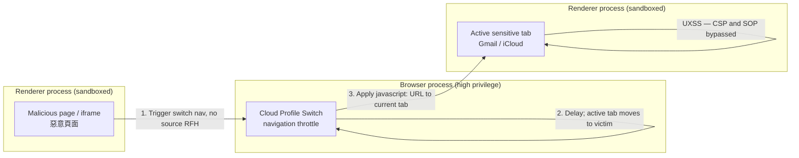
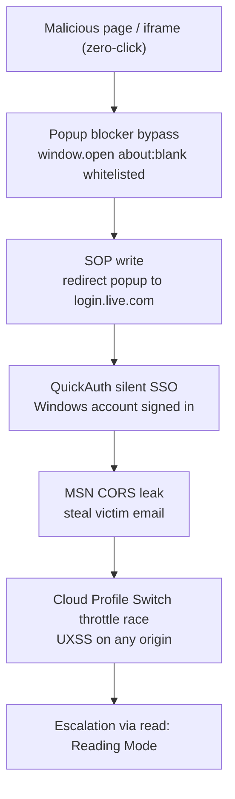
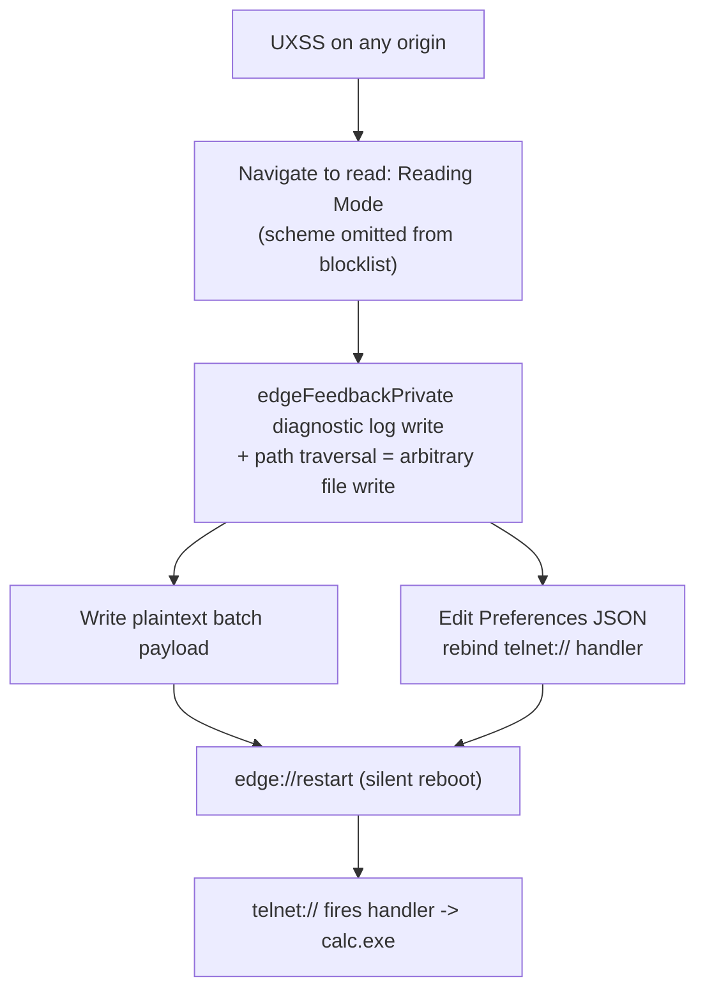

# Lecture 9: Old-School Bug Hunting — A Pure-Logic, Zero-Click Microsoft Edge Sandbox Escape Chain
# 第九講：↖乂古法挖洞乂↘ ～～ 純邏輯 Microsoft Edge 零點擊沙箱逃逸鏈 ～～

---

> **Note / 校訂：** This write-up corrects three errors carried in the original notes. (1) **Title.** The talk is **not** "One Click to Rule Them All: Handcrafted Microsoft Edge Browser RCE". The real HITCON 2026 title is **「↖乂古法挖洞乂↘ ～～ 純邏輯 Microsoft Edge 零點擊沙箱逃逸鏈 ～～」** — a **zero-click (零點擊)**, **pure-logic sandbox escape chain**, not "one-click" and not framed as generic "RCE". (2) **Venue.** There was **no Black Hat USA 2026 briefing**; the work was demonstrated at **Pwn2Own Berlin 2026 (May 13–14)** and presented at **HITCON 2026**. (3) **Attack surfaces.** DARKNAVY's patch-diff reconstruction identifies Edge-proprietary surfaces — **navigation throttles, the QuickAuth module, and the `edgeFeedbackPrivate` API's diagnostic log-file writing** — **not** Chromium Mojo IPC. Where the notes leaned on a Mojo/WebUI story, it has been corrected. Per ZDI, Orange Tsai **chained 4 logic bugs to achieve a sandbox escape on Microsoft Edge, earning $175,000 and 17.5 Master of Pwn points** — the only successful browser entry, and the first Chromium full-chain success at Pwn2Own in ten years. He won the **2026 Pwnie "Epic Achievement"** and **Master of Pwn**; Microsoft patched within 24 hours.
>
> **校訂：** 本文更正原始筆記的三項錯誤。(1)**標題**：本演講並非「One Click to Rule Them All: Handcrafted Microsoft Edge Browser RCE」，真正的 HITCON 2026 標題為 **「↖乂古法挖洞乂↘ ～～ 純邏輯 Microsoft Edge 零點擊沙箱逃逸鏈 ～～」**——是**零點擊（zero-click）**的**純邏輯沙箱逃逸鏈**，並非「一鍵」，亦非泛稱的「RCE」。(2)**場合**：**並無 Black Hat USA 2026 議程**；此研究於 **Pwn2Own Berlin 2026（5 月 13–14 日）**實測，並於 **HITCON 2026** 發表。(3)**攻擊面**：DARKNAVY 的補丁比對重建指出真正的攻擊面是 Edge 專有元件——**navigation throttles（導航節流器）、QuickAuth 模組，以及 `edgeFeedbackPrivate` API 的診斷日誌檔寫入**——**並非** Chromium Mojo IPC。原筆記倚賴的 Mojo/WebUI 敘事已更正。據 ZDI，Orange Tsai **串聯 4 個邏輯漏洞完成 Microsoft Edge 沙箱逃逸，獲得 $175,000 美元與 17.5 Master of Pwn 積分**——為當屆唯一成功的瀏覽器項目，也是 Pwn2Own 十年來首次 Chromium 完整鏈成功。他贏得 **2026 Pwnie「Epic Achievement」**與 **Master of Pwn**；微軟於 24 小時內修補。

---

## 1. Speaker Information & Topic / 講者資訊與演講主題

### English
* **Speaker:** **Orange Tsai (蔡政達)**
  * **Affiliations:** Principal Security Researcher at **DEVCORE (戴夫寇爾)**; member of the CHROOT security group.
  * **Role & Background:** A world-renowned white-hat hacker known for logic-driven exploit chains against major infrastructure — mail servers (ProxyLogon/Exchange), SSL VPNs, and enterprise ecosystems. Winner of the **2026 Pwnie "Epic Achievement"** for the Microsoft Edge full chain, and **Master of Pwn** at Pwn2Own Berlin 2026.
* **Topic:** **A Pure-Logic, Zero-Click Microsoft Edge Sandbox Escape Chain** (純邏輯 Microsoft Edge 零點擊沙箱逃逸鏈)
* **Venue & Provenance:** The chain was demonstrated at **Pwn2Own Berlin 2026 (May 13–14)** and presented at **HITCON 2026** (40-minute talk). No memory corruption, no AI/LLM — pure logic bugs on Edge-proprietary surfaces.

### 繁體中文
* **講者：** **Orange Tsai (蔡政達)**
  * **現職與機構：** **DEVCORE（戴夫寇爾）** 首席資安研究員；CHROOT 資安團隊成員。
  * **專業背景：** 全球知名白帽駭客，擅長以邏輯推理串聯漏洞鏈擊穿主流基礎設施——郵件伺服器（ProxyLogon/Exchange）、SSL VPN 與跨國企業生態系。以 Microsoft Edge 完整鏈獲得 **2026 Pwnie「Epic Achievement」**，並於 Pwn2Own Berlin 2026 奪得 **Master of Pwn**。
* **主題：** **純邏輯 Microsoft Edge 零點擊沙箱逃逸鏈**（A Pure-Logic, Zero-Click Microsoft Edge Sandbox Escape Chain）
* **場合與來源：** 此漏洞鏈於 **Pwn2Own Berlin 2026（5 月 13–14 日）**實測，並於 **HITCON 2026** 發表（40 分鐘演講）。無記憶體破壞、無 AI/LLM——為 Edge 專有攻擊面上的純邏輯漏洞。

---

## 2. Quick Summary / 內容簡要

### English
Orange Tsai walks through a complete, **zero-click sandbox escape chain** against Microsoft Edge, built entirely from **logic bugs** in Edge-proprietary surfaces — not memory corruption, and not Chromium's Mojo IPC. In an era where LLMs auto-scan and patch thousands of memory-safety bugs, Orange argues that multi-layer *logic* chains remain a uniquely human frontier because they have no universal crash signature and require reasoning across a codebase far larger than any current model's context window.

The chain begins with a **navigation-throttle race condition** in Edge's custom **Cloud Profile Switch** logic: when the high-privilege Browser Process processes an asynchronous navigation without an explicit source renderer, it applies the destination URL — including a `javascript:` URI — to the **currently active tab**, yielding a CSP-bypassing **Universal XSS (UXSS)** primitive. Four supporting logic bugs (a Same-Origin-Policy cross-window write, a popup-blocker `about:blank` whitelist, Edge's **QuickAuth** silent Windows SSO sign-in, and an MSN CORS credential leak) make delivery require no user interaction. Privilege then escalates through Edge's custom **Reading Mode (`read:` scheme)**, whose WebUI was omitted from Chromium's privileged-scheme blocklist; inside it, the **`edgeFeedbackPrivate`** binding's **diagnostic log-file writing** function is coerced (via path traversal) into an **arbitrary file write**. Finally, Orange defeats the API's JSON/UTF-8 constraint by writing a plaintext payload, rebinding a custom URL-protocol handler in Edge's `Preferences`, and triggering **`edge://restart`** to spawn `calc.exe` silently. Per ZDI this was **4 chained logic bugs**, worth **$175,000 / 17.5 Master of Pwn points**, the first Chromium full-chain at Pwn2Own in a decade; Microsoft shipped fixes in Edge **148.0.3967.70 on 2026-05-15**, within 24 hours of the demo.

### 繁體中文
Orange Tsai 完整重現了一條針對 Microsoft Edge、完全由 Edge 專有攻擊面上的**邏輯漏洞**構成的**零點擊沙箱逃逸鏈**——非記憶體破壞，亦非 Chromium 的 Mojo IPC。在 LLM 大規模自動掃描並修補數千個記憶體安全漏洞的時代，Orange 主張多層*邏輯*漏洞鏈仍是人類專屬疆域：它們沒有統一的崩潰特徵，且需跨越遠超當前模型上下文窗口的龐大程式碼進行推理。

漏洞鏈始於 Edge 自訂 **Cloud Profile Switch** 邏輯中的 **navigation throttle（導航節流器）競態條件**：當高特權的 Browser Process 在未標記來源 Renderer 的情況下處理異步導航時，會將目的地網址——包括 `javascript:` 偽協議——套用至**當前活動分頁**，孕育出能無視 CSP 的 **Universal XSS（UXSS）** 原語。四個支援性邏輯漏洞（SOP 跨視窗寫入、Popup Blocker 的 `about:blank` 白名單、Edge 的 **QuickAuth** 靜默 Windows SSO 登入、MSN 的 CORS 憑證洩漏）使投遞完全無需使用者互動。權限提升則透過 Edge 自訂的**閱讀模式（`read:` scheme）**：其 WebUI 被遺漏於 Chromium 特權 scheme 阻擋清單之外，而其中 **`edgeFeedbackPrivate`** 綁定的**診斷日誌檔寫入**功能被（透過路徑走訪）迫使成為**任意檔案寫入**。最後，Orange 以純文字酬載繞過該 API 的 JSON/UTF-8 限制，改寫 Edge `Preferences` 中的自訂 URL 協議處理器，並觸發 **`edge://restart`** 靜默彈出 `calc.exe`。據 ZDI，此為 **4 個串聯的邏輯漏洞**，價值 **$175,000 美元／17.5 Master of Pwn 積分**，為 Pwn2Own 十年來首次 Chromium 完整鏈；微軟於 **2026-05-15** 以 Edge **148.0.3967.70** 修補，距離示範不到 24 小時。

---

## 3. Structured Lecture Context (Extremely Detailed) / 結構化演講內容（極致詳細）

### 3.1 AI vs. Human: Why Logic Bugs Are the New Frontier / AI 對決人類：為何邏輯漏洞是新疆域

#### English
* **The rise of LLM bug hunting:** By early 2026, vendors leaned on AI agents for bulk bug detection. Google used its own models to identify and repair **over 1,000 CVEs** in Chromium/V8 within a single month. Teams increasingly automate the fuzz-to-patch pipeline.
* **The exploitability bottleneck (V8 Sandbox):** Finding memory-corruption bugs is cheap for AI, but exploiting them is not. The **V8 Sandbox** confines corruption to a restricted virtual memory pool — arbitrary read/write inside the cage does little on its own.
* **The sandbox-escape constraint — and where this talk deliberately does *not* go:** Getting code execution in a renderer is "only an entry ticket". The classical escape then attacks the high-privilege **Browser Process** across **Mojo IPC** from the sandboxed renderer — a small, hardened, 20-year-old attack surface. **Orange's chain avoids this path entirely.** Instead of memory corruption over Mojo, it crosses **Edge-proprietary logic surfaces** (navigation throttles, QuickAuth, the Reading-Mode WebUI, and `edgeFeedbackPrivate`), which is why the whole chain is pure logic.
* **Why logic bugs evade AI:** Memory-safety bugs have clear, universal crash patterns; **logic bugs have none.** They require deep, cross-module contextual reasoning over a codebase approaching **~1 billion tokens** — beyond current LLM context windows — placing multi-layer logic chains in the domain of human intuition.
* **Scope of the navigation surface (carried from the parallel write-up):** Over five years Chromium fixed roughly **3,000 CVEs**, but **fewer than 20** touched the navigation module — a rarely-audited, high-value surface, which is exactly where Bug 1 lives.

#### 繁體中文
* **LLM 挖洞的崛起：** 到 2026 年初，各廠商全面導入 AI Agent 進行大規模漏洞偵測。Google 以自家模型在單月內定位並修補 Chromium/V8 中**超過 1,000 個 CVE**；許多團隊將 fuzz-to-patch 流程自動化。
* **利用鏈的瓶頸（V8 Sandbox）：** AI 能輕易找到記憶體破壞漏洞，但「利用」不然。**V8 Sandbox** 將破壞限制在受限的虛擬記憶體池內，即便在其中拿到任意讀寫，單靠自身也難有作為。
* **沙箱逃逸的限制——以及本演講刻意*不走*的路：** 在 Renderer 拿到程式碼執行只是「一張入場券」。傳統逃逸接著要從沙箱化的 Renderer 透過 **Mojo IPC** 攻擊高特權的 **Browser Process**——一個發展近 20 年、極小且強化的攻擊面。**Orange 的漏洞鏈完全避開此路。** 它不走 Mojo 上的記憶體破壞，而是跨越 **Edge 專有的邏輯攻擊面**（navigation throttles、QuickAuth、閱讀模式 WebUI、`edgeFeedbackPrivate`），這正是整條鏈「純邏輯」的原因。
* **為何邏輯漏洞是 AI 盲區：** 記憶體安全漏洞有明確且統一的崩潰特徵；**邏輯漏洞則沒有。** 它們需要對接近 **~10 億個 Token** 的程式碼進行跨模組深度語義推理——超出當前 LLM 上下文窗口——使多層邏輯漏洞鏈成為人類直覺的疆域。
* **導航攻擊面的稀有性（取自平行版本）：** 五年間 Chromium 修補約 **3,000 個 CVE**，但其中觸及導航模組的**不到 20 個**——一個罕被審計的高價值攻擊面，而 Bug 1 正藏於此。

---

### 3.2 Bug 1: The Navigation-Throttle "Current Tab" Race / 第一重漏洞：導航節流器與「當前分頁」的競態

#### English
* **Navigation throttles (the correct term):** When a user navigates, the **Browser Process** drives the request while **navigation throttles** intercept it at various stages (Safe Browsing checks, HTTPS upgrades, redirects). *(The original notes transcribed this as "Sortal"; the correct Edge/Chromium concept is a navigation throttle.)*
* **Edge's custom Cloud Profile Switch throttle:** Microsoft added a proprietary throttle to manage seamless profile switching when users hit Microsoft identity portals.
* **The logic flaw:** The throttle intercepts navigations starting from a trusted Microsoft identity domain (e.g., `login.live.com`), then reads a "switch profile" destination URL from context and re-issues a navigation via standard Chromium interfaces — **without stripping unsafe URI schemes such as `javascript:`, and with a fully user-controlled destination.**
* **The breakthrough — the "current tab" race:** Investigating how the Browser Process maps a navigation back to its initiating renderer, Orange found that **if the navigation command specifies no source renderer, the Browser Process defaults to applying the destination URL to the currently active, focused tab.**
* **Constructing the UXSS primitive (zero-click):**
  1. A malicious page (deliverable inside an iframe, no click needed) triggers a Cloud-Profile-Switch-style navigation.
  2. A delay is injected into the async execution.
  3. During the delay the browser's active tab is moved to a sensitive site (e.g., Google, Gmail, iCloud) — this can be driven programmatically rather than by a manual user click.
  4. When the delay expires, the Browser Process evaluates the `javascript:` URL **inside the now-active sensitive tab**.
  5. Because the instruction is issued by the high-privilege Browser Process, it **completely bypasses Content Security Policy (CSP) and the Same-Origin Policy (SOP)** — an unmitigated Universal XSS.

#### 繁體中文
* **navigation throttle（正確術語）：** 使用者導航時由 **Browser Process** 調度，**navigation throttles（導航節流器）** 在各階段攔截判定（Safe Browsing、HTTPS 升級、重導向）。*（原筆記將此誤記為「Sortal」；正確的 Edge/Chromium 概念是 navigation throttle。）*
* **Edge 自訂 Cloud Profile Switch 節流器：** 微軟加入專有節流器，用以在使用者存取微軟身分入口時無縫切換設定檔。
* **邏輯缺陷：** 該節流器攔截來自受信任微軟身分域名（如 `login.live.com`）的導航後，讀取上下文中的「switch profile」目的地網址並以標準 Chromium 介面重新發起導航——**未過濾 `javascript:` 等不安全 scheme，且目的地完全由使用者可控。**
* **突破——「當前分頁」競態：** Orange 研究 Browser Process 如何將導航對應回發起的 Renderer，發現**若導航指令未指定來源 Renderer，Browser Process 會預設將目的地網址套用至當前活動、獲得焦點的分頁。**
* **構建 UXSS 原語（零點擊）：**
  1. 惡意頁面（可置於 iframe 內投遞，無需點擊）觸發模擬 Cloud Profile Switch 的導航。
  2. 在異步執行中注入延遲。
  3. 延遲期間將瀏覽器活動分頁移至敏感網站（如 Google、Gmail、iCloud）——此步可由程式驅動，而非仰賴使用者手動點擊。
  4. 延遲結束時，Browser Process 在**當前活動的敏感分頁內**執行該 `javascript:` 網址。
  5. 由於指令由高特權的 Browser Process 下發，故**完全繞過內容安全策略（CSP）與同源策略（SOP）**——一個無法被緩解的 Universal XSS。

*Caption / 圖說:* Bug 1 crosses the Renderer to Browser-Process trust boundary in reverse — the Browser Process, lacking a source-renderer binding, injects a `javascript:` URL into whichever tab is active. / Bug 1 反向跨越 Renderer 至 Browser Process 的信任邊界——Browser Process 因缺少來源 Renderer 綁定，將 `javascript:` 網址注入當前活動的任一分頁。

---

### 3.3 Bugs 2–4: Chaining Logic Flaws for Zero-Interaction Delivery / 第二至四重漏洞：達成零互動投遞的邏輯繞過鏈

#### English
To weaponize the UXSS with **no user interaction and regardless of login state**, Orange chained several supporting logic bypasses. Per ZDI the headline count is **4 chained logic bugs**; the notes enumerate the following primitives (some are steps of the same headline bug):

1. **SOP cross-window write (origin spoof):** The throttle only fires for navigations from a trusted Microsoft domain. Orange used `window.open` to spawn a popup at `login.live.com`; while SOP blocks *reading* a cross-origin window, it **allows writing that window's location/URL**. Writing the crafted navigation into the popup simulates a navigation originating from the trusted domain.
2. **Popup-blocker `about:blank` whitelist:** Browsers block auto-popups without a user gesture. Edge's customized popup blocker whitelists popups whose initial target is **`about:blank`**; the script opens `about:blank`, then silently redirects it to `login.live.com`.
3. **QuickAuth silent Windows SSO:** If no Microsoft profile is signed in, the flow would prompt a login. Edge's **QuickAuth** module transparently reads the active local Windows account and completes sign-in to `login.live.com` in the background — no prompt.
4. **MSN CORS credential leak:** The throttle validates that the target email matches the signed-in profile, so the attacker must learn the victim's email. An official **MSN subdomain** printed the logged-in user's email and served it with a misconfigured CORS policy (credentialed cross-origin reads allowed); a background `fetch` with credentials exfiltrates it.

#### 繁體中文
為在**無使用者互動、且無視登入狀態**下武器化 UXSS，Orange 串聯了數個支援性邏輯繞過。據 ZDI，頭條計數為 **4 個串聯邏輯漏洞**；筆記列舉下列原語（部分為同一頭條漏洞的步驟）：

1. **SOP 跨視窗寫入（起源偽造）：** 節流器僅對來自受信任微軟域名的導航觸發。Orange 以 `window.open` 開出指向 `login.live.com` 的彈窗；SOP 雖阻止*讀取*跨域視窗，卻**允許寫入該視窗的 location/網址**。將構造好的導航寫入彈窗即模擬了由受信任域名發起的導航。
2. **Popup Blocker 的 `about:blank` 白名單：** 瀏覽器會攔截無使用者手勢的自動彈窗。Edge 客製的彈窗攔截器將初始目標為 **`about:blank`** 的彈窗列入白名單；腳本先開 `about:blank`，再靜默重導向至 `login.live.com`。
3. **QuickAuth 靜默 Windows SSO：** 若未登入微軟設定檔，流程會要求登入。Edge 的 **QuickAuth** 模組會透明讀取當前本機 Windows 帳戶，並在背景完成 `login.live.com` 登入——無任何提示。
4. **MSN CORS 憑證洩漏：** 節流器會比對目標 Email 是否與登入設定檔一致，故攻擊者須先得知受害者 Email。一個官方 **MSN 子域名**會印出登入使用者的 Email，且其 CORS 配置錯誤（允許攜帶憑證的跨域讀取）；背景 `fetch` 攜帶憑證即可竊得。

*Caption / 圖說:* The zero-click delivery chain — four supporting logic bypasses satisfy the throttle's preconditions (trusted origin, no gesture, signed-in profile, matching email) before the UXSS fires. / 零點擊投遞鏈——四個支援性邏輯繞過滿足節流器的前置條件（受信任起源、無手勢、已登入設定檔、Email 相符）後觸發 UXSS。

---

### 3.4 Privilege Escalation via Edge's Custom Reading Mode (`read:` scheme) / 權限提升：擊穿 Edge 專屬「閱讀模式」特權域

#### English
* **The WebUI boundary:** UXSS controls ordinary web origins, but Chromium isolates privileged WebUIs (`chrome://…`) and blocks `javascript:` injection into them.
* **The `read:` omission:** Edge built a heavily customized **Reading Mode** (real-time translation, text-to-speech, Copilot integration) served under a proprietary **`read:`** scheme. Microsoft **omitted `read:` from Chromium's hardcoded privileged-scheme blocklist**, so the UXSS redirect can drive a tab into this privileged container and run JavaScript there.
* **`edgeFeedbackPrivate` diagnostic log-file writing → arbitrary file write:** Inside Reading Mode, Edge exposes the privileged C++ binding **`edgeFeedbackPrivate`** to JavaScript. Its intended job is writing **diagnostic feedback log files**. Orange coerced that log-file-writing function — via relative **path traversal** (CWE-35) that defeats the extension-appending restriction — into an **arbitrary file write** anywhere on disk. *(This path-traversal file write corresponds to the verified **CVE-2026-45495**, Edge RCE, CVSS 8.8.)*

#### 繁體中文
* **WebUI 邊界：** UXSS 能控制一般網頁起源，但 Chromium 將特權 WebUI（`chrome://…`）隔離並阻擋 `javascript:` 注入。
* **`read:` 的遺漏：** Edge 打造了大幅客製的**閱讀模式**（即時翻譯、語音朗讀、Copilot 整合），以專有的 **`read:`** scheme 加載。微軟**遺漏將 `read:` 加入 Chromium 硬編碼的特權 scheme 阻擋清單**，故 UXSS 重導向可將分頁導入此特權容器並執行 JavaScript。
* **`edgeFeedbackPrivate` 診斷日誌檔寫入 → 任意檔案寫入：** 在閱讀模式中，Edge 將特權 C++ 綁定 **`edgeFeedbackPrivate`** 暴露給 JavaScript，其本意是寫入**診斷回饋日誌檔**。Orange 透過相對**路徑走訪**（CWE-35，繞過附加副檔名的限制）將該日誌寫入功能迫使成為磁碟上任意位置的**任意檔案寫入**。*（此路徑走訪檔案寫入對應到已查證的 **CVE-2026-45495**，Edge RCE，CVSS 8.8。）*

---

### 3.5 Defeating the UTF-8 Constraint for Zero-Interaction Execution / 繞過 UTF-8 限制達成零互動執行

#### English
* **The JSON/UTF-8 hurdle:** `edgeFeedbackPrivate` serializes data through JSON, so it **only accepts valid UTF-8 strings**. A 64-bit DLL's PE header carries non-UTF-8 bytes (e.g., the `0x8664` machine field), so a raw binary write corrupts or fails.
* **The pure-logic workaround — custom protocol hijack:**
  1. Instead of a binary, Orange writes a tiny **plaintext batch payload** (all ASCII) — trivially valid UTF-8 — to a writable directory.
  2. Using the arbitrary write, he edits Edge's plaintext **`Preferences`** JSON.
  3. He rebinds a **custom URL-protocol handler** (e.g., `telnet://`) to point at the batch payload.
  4. He navigates to **`edge://restart`** via the redirect primitive, silently rebooting Edge to load the modified `Preferences`.
  5. On restart, a `telnet://` navigation launches the hijacked handler, executing the batch payload and spawning **`calc.exe`** with zero interaction. The whole exploit is famously **under 100 lines**.
* **The parallel write-up's variant:** an earlier retelling framed the payload as a renamed `telnet.exe` in a writable directory reached by the same protocol-handler trick; the mechanism (plaintext-only payload + protocol handler + `edge://restart`) is identical.

#### 繁體中文
* **JSON/UTF-8 屏障：** `edgeFeedbackPrivate` 經 JSON 序列化，故**僅接受合法 UTF-8 字串**。64 位元 DLL 的 PE 檔頭含非 UTF-8 位元組（如 `0x8664` 機器欄位），直接寫入二進位會損毀或失敗。
* **純邏輯迂迴——自訂協議劫持：**
  1. Orange 不寫二進位，改寫一個微小的**純文字批次酬載**（全 ASCII，天生合法 UTF-8）至可寫目錄。
  2. 以任意寫入改寫 Edge 的純文字 **`Preferences`** JSON。
  3. 將**自訂 URL 協議處理器**（如 `telnet://`）重新綁定至該批次酬載。
  4. 透過重導向原語導航至 **`edge://restart`**，靜默重啟 Edge 以載入改後的 `Preferences`。
  5. 重啟後，一個 `telnet://` 導航調用被劫持的處理器，執行批次酬載並零互動彈出 **`calc.exe`**。整條 Exploit 據稱**不到 100 行**。
* **平行版本的變體：** 較早的一種敘述將酬載描述為放在可寫目錄、以同一協議處理器技巧觸發的改名 `telnet.exe`；其機制（純文字酬載＋協議處理器＋`edge://restart`）完全相同。

*Caption / 圖說:* The escalation and execution stages, each defeating one mitigation: WebUI isolation (via the `read:` omission), the API's UTF-8/JSON constraint (via a plaintext payload), and the need for a reboot (via `edge://restart`). / 提權與執行階段，各自擊破一道緩解：WebUI 隔離（靠 `read:` 遺漏）、API 的 UTF-8/JSON 限制（靠純文字酬載）、以及需要重啟（靠 `edge://restart`）。

---

## 4. Conclusion / 結論

### English
* **A triumph of human logic:** With memory corruption boxed in by V8 Sandbox, site isolation, and hardened Mojo IPC, **cross-feature logic discrepancies remain a devastating, uniquely human attack vector** — exactly what a pure-logic, zero-click chain demonstrates.
* **The Onsen Hackathon:** Orange credits an impromptu all-night "hackathon" at a Japanese hot spring with **Jaron Bradley (Lecture 4)** and **Nicolas (Lecture 3)** for resolving the final exploitation blockers.
* **A historic result:** At **Pwn2Own Berlin 2026** this was the **only successful browser entry** and the **first Chromium full-chain in ten years** — **4 chained logic bugs**, **$175,000**, **17.5 Master of Pwn points**, the **2026 Pwnie "Epic Achievement"**, and **Master of Pwn**. Microsoft patched within 24 hours (Edge 148.0.3967.70, 2026-05-15).

### 繁體中文
* **人類邏輯的勝利：** 當記憶體破壞被 V8 Sandbox、Site Isolation 與強化的 Mojo IPC 封鎖時，**跨功能的邏輯落差仍是毀滅性且人類專屬的攻擊向量**——這正是純邏輯、零點擊漏洞鏈所證明的。
* **溫泉黑客松：** Orange 將攻克最後利用瓶頸歸功於在日本溫泉與 **Jaron Bradley（第四講）** 及 **Nicolas（第三講）** 通宵的即興「黑客松」。
* **歷史性成果：** 在 **Pwn2Own Berlin 2026**，此為當屆**唯一成功的瀏覽器項目**、**十年來首次 Chromium 完整鏈**——**4 個串聯邏輯漏洞**、**$175,000 美元**、**17.5 Master of Pwn 積分**、**2026 Pwnie「Epic Achievement」**與 **Master of Pwn**。微軟於 24 小時內修補（Edge 148.0.3967.70，2026-05-15）。

---

## 5. Possible Implementation & Extension / 延伸防禦與資安實作

### English
1. **Bind navigation to its source renderer:** Navigation throttles must cryptographically bind every queued navigation to its initiating renderer/origin; never fall back to "current active tab" when the source is unspecified.
2. **Isolate custom schemes:** Vendor schemes like `read:` must be enrolled in the privileged-scheme blocklist and run in a low-privilege, isolated process, never exposing native bindings like `edgeFeedbackPrivate` to injectable content.
3. **Protect local config integrity:** Enforce ACLs / File Integrity Monitoring on JSON `Preferences` so script engines cannot rebind custom URL-protocol handlers.
4. **Constrain diagnostic writers:** Diagnostic log-file writers should write only to a fixed, non-traversable path with a fixed extension.

### 繁體中文
1. **將導航綁定至來源 Renderer：** 導航節流器必須以密碼學方式將每個排入佇列的導航綁定至發起的 Renderer/Origin；來源未指定時，絕不可退回「當前活動分頁」。
2. **隔離自訂 scheme：** 如 `read:` 的廠商自訂 scheme 必須納入特權 scheme 阻擋清單，並運行於低特權隔離進程，絕不將 `edgeFeedbackPrivate` 等原生綁定暴露給可注入內容。
3. **保護本地設定完整性：** 對 JSON `Preferences` 施行 ACL／檔案完整性監控（FIM），使腳本引擎無法重新綁定自訂 URL 協議處理器。
4. **限制診斷寫入器：** 診斷日誌寫入器應僅能寫入固定、不可走訪的路徑與固定副檔名。

---

## 6. Bilingual Precise Transcript / 雙語對照逐字稿

> Terminology note: where the speaker said "current tab" and the notes wrote "Sortal", the correct concept is the Cloud-Profile-Switch **navigation throttle**. / 術語備註：講者所說的「current tab」與筆記中的「Sortal」，正確概念為 Cloud Profile Switch 的 **navigation throttle**。

| English | 繁體中文 |
| :--- | :--- |
| First, can AI independently discover vulnerabilities in the browser? Today, nobody doubts this. | 首先，現在能夠獨立在瀏覽器上面發現漏洞嗎？那這一點，我想現今沒有人會懷疑。 |
| Since the beginning of the year, researchers used LLMs to find hundreds of vulnerabilities, mocking that finding bugs is just a matter of scaling. | 那從年初開始，就有人用 LLM 找幾百個漏洞，甚至發文嗆說現在對他們來說就只是規模問題，是找得完的。 |
| In June, Google used its own AI to patch over 1,000 CVEs in Chrome. At finding bugs, AI is faster and better than humans. | 到今年 6 月，Google 用自己的 AI 一個月修了超過 1000 個 CVE。在找漏洞這件事上，AI 做得比人類研究員更快更好。 |
| But finding a bug does not mean it is exploitable. Chrome deployed the V8 Sandbox years ago to mitigate renderer memory corruption. | 但找漏洞不代表這些漏洞可以被利用。Chrome 好幾年前就部署了 V8 Sandbox 來緩解 renderer 上的記憶體漏洞。 |
| Even if you corrupt memory, you cannot easily escape. | 所以就算你在記憶體中搞事，實際上也做不了什麼。 |
| Even if you compromise the renderer, you only hold an entry ticket. To break the model you must remotely attack the browser process. | 就算你拿到 renderer 的 code execution，也只是拿到一張入場券。要打破整個安全模型，還要遠端攻擊 browser process。 |
| Chrome's sandbox has been developed for nearly 20 years; Google even rebuilt Mojo IPC for safe cross-process communication. | 整個 Chrome Sandbox 發展了快 20 年，Google 甚至為了安全地跨進程溝通重建了一套 Mojo IPC。 |
| It is so hard that many researchers skip sandbox mitigations and hunt logic bugs instead — attackers jump to the weakest plank. | 這難度高到大家乾脆跳過 sandbox mitigation，改打邏輯漏洞——攻擊者會跳到最脆弱的短板。 |
| Our first bug is in Microsoft Edge's customized navigation implementation, designed for its Cloud profile switching. | 我們的第一個漏洞在 Microsoft Edge 客製化的 navigation 實作上，這是 Edge 專為自己的 Cloud 設定檔切換設計的。 |
| It reads the current URL, checks it against a whitelist of trusted Microsoft domains, then issues a new navigation. The destination URL is fully user-controlled. | 它取出當前網址，比對受信任的 Microsoft 域名白名單，再發起新的導航。而目的地網址是使用者完全可控的。 |
| You'd itch to inject a `javascript:` URL — but you first need JavaScript execution on `login.live.com`, which is basically self-XSS. | 你一定手癢想注入 `javascript:` 網址——但前提是要先在 `login.live.com` 拿到 JS 執行，這跟 self-XSS 差不多。 |
| Then came the most exquisite turning point. The term "current tab" felt out of place in Chromium's architecture. | 接著就是最精妙的轉折。「current tab」這個詞在 Chromium 架構下顯得很突兀。 |
| Navigation is processed in the browser process, but we triggered the throttle from JavaScript in the renderer. How does the browser process know which renderer initiated it? | 導航在 browser process 處理，但我們是在 renderer 的 JavaScript 觸發的。browser process 到底怎麼知道是哪個 renderer 發起的？ |
| We found that if a navigation specifies no source renderer, the browser process applies the destination to the currently active tab. | 我們發現，如果導航沒有指定來源 renderer，browser process 會把目的地套用到當前 active 的分頁。 |
| So we add a 10-second delay, switch the active tab to Google during it, and the `javascript:` URL runs there — a Universal XSS that ignores CSP! | 所以我們加一個 10 秒延遲，期間把 active 分頁切到 Google，`javascript:` 就在那裡執行——一個無視 CSP 的 Universal XSS！ |
| We had four constraints: originate from Microsoft's whitelist, avoid manual tab switching, bypass login state, and learn the victim's email. | 我們有四個限制：起源要在微軟白名單、避免手動切頁、繞過登入狀態、預先得知受害者 Email。 |
| We bypassed origin using `window.open` (SOP allows writing cross-origin locations), the popup blocker via the `about:blank` whitelist, and login via Windows SSO. | 我們用 `window.open` 繞過起源（SOP 允許寫入跨域網址）、用 `about:blank` 白名單繞過彈窗攔截、用 Windows SSO 繞過登入。 |
| We leaked the email via a CORS misconfiguration on an official MSN page, chaining four logic bugs into a single-shot, zero-click trigger. | 我們用官方 MSN 網頁的 CORS 配置錯誤洩漏 Email，串聯四個邏輯漏洞成為一次性、零點擊的觸發。 |
| Next we escalated using Edge's custom Reading Mode (`read:` scheme), missing from Chromium's blocklist, and invoked `edgeFeedbackPrivate`. | 接著用 Edge 專屬的閱讀模式（`read:` scheme，遺漏於 Chromium 黑名單），調用 `edgeFeedbackPrivate`。 |
| Its diagnostic log-write function, abused with path traversal, gave arbitrary file write — but JSON serialization only accepts UTF-8, blocking a 64-bit DLL. | 它的診斷日誌寫入函數配合路徑走訪給了任意檔案寫入——但 JSON 序列化只接受 UTF-8，擋住了 64 位元 DLL。 |
| So we wrote a plaintext batch file, rebound the `telnet://` handler inside Preferences, and used `edge://restart` to reboot and pop calc. The whole exploit is under 100 lines. | 我們改寫純文字批次檔，在 Preferences 內重綁 `telnet://` 處理器，再用 `edge://restart` 重啟彈出計算機。整條 Exploit 不到 100 行。 |
| Why deliberately avoid AI? Repetitive labor is now cheap, but opening a new attack surface and pure logical leaps belong to human ingenuity. | 為什麼刻意不用 AI？重複性勞作已經廉價，但開闢全新攻擊面與純邏輯的躍進，屬於人類的巧思。 |
| This chain was refined during an 'Onsen Hackathon' in Japan with JB (Jaron Bradley, Lecture 4) and L (Nicolas, Lecture 3), soaking in hot springs and reading code all night. Thank you all! | 這條鏈是在日本泡溫泉度假時，和 JB（Jaron Bradley，第四講）、L（Nicolas，第三講）泡完溫泉通宵看程式碼完成的。謝謝大家！ |

---

## Resources, Repositories & Contacts / 資源、程式碼庫與聯絡方式

> Only links that were fetched or confirmed in verification are listed. Items that could not be tied to this specific chain are labelled **(unverified)** and framed as related/adjacent material.

### Speaker & Contact / 講者與聯絡方式
* Blog — https://blog.orange.tw/ · about/bio — https://blog.orange.tw/about/ (confirms Principal Security Researcher at DEVCORE, CHROOT member, 2026 Pwnie "Epic Achievement" for the Microsoft Edge full chain, Pwn2Own Berlin Master of Pwn).
* GitHub — https://github.com/orangetw · presentation slides — https://github.com/orangetw/My-Presentation-Slides (stops at 2024; no Edge slides published yet).
* X/Twitter — https://x.com/orange_8361 · YouTube — https://www.youtube.com/c/OrangeTsai-tw
* **No LinkedIn:** Orange Tsai's own about page lists none — do not assume one exists. He publishes `orange@chroot.org` on that page; the blog/GitHub links above are preferred.
* DEVCORE — blog https://devco.re/blog/ · English blog https://devco.re/en/blog/ · author archive https://devco.re/en/blog/author/orange/ · GitHub https://github.com/d3vc0r3 (note: `github.com/devcore-tw` is 404). No DEVCORE post on this chain exists yet.

### Code & Repositories / 程式碼庫
* No public exploit/PoC repository for this chain has been released (slides and video unpublished as of 2026-08-23).
* Watch for a 2026 folder at https://github.com/orangetw/My-Presentation-Slides **(unverified — not yet present)**.

### Papers, Advisories & CVEs / 論文、公告與 CVE
All CVEs below are acknowledged (MSRC + NVD) to *"Orange Tsai (@orange_8361) of DEVCORE Research Team (@d3vc0r3) working with TrendAI Zero Day Initiative"* and shipped in Edge **148.0.3967.70 on 2026-05-15** (the day after the demo — substantiating "patched within 24 hours").
* **CVE-2026-45495** — Edge RCE, CWE-35 path traversal, CVSS **8.8** — https://msrc.microsoft.com/update-guide/vulnerability/CVE-2026-45495 (the arbitrary-file-write bug; named by DARKNAVY).
* **CVE-2026-45494** — Edge spoofing, CWE-79, CVSS **5.4** (tab-splitting UI shows only the domain prefix; exploitable via malicious iframe).
* **CVE-2026-45492** — Edge security-feature bypass, CWE-20, CVSS **5.4**.
* **CVE-2026-56646** (2026-07-03) — also credited to Orange Tsai, but **no evidence it belongs to this chain**; noted for completeness only.
* **The 4th logic bug has no identifiable CVE — not guessed here.**
* **Caveat:** no MSRC advisory text says "Pwn2Own" or "chain"; the linkage is inference from identical acknowledgement + ship date + DARKNAVY naming CVE-2026-45495.

### Talk & Slides / 演講資料
* HITCON 2026 agenda (verified) — https://hitcon.org/2026/en-US/agenda/be346aed-1480-488e-bd86-e055adbbb5cf/ (abstract confirms: sandbox-escape chain from Pwn2Own Berlin 2026, no AI/LLM, no memory corruption, pure logic bugs).
* Slides and video: **not published as of 2026-08-23.**

### Further Reading / 延伸閱讀
* ZDI — Pwn2Own Berlin 2026 Day One results — https://www.zerodayinitiative.com/blog/2026/5/13/pwn2own-berlin-2026-day-one-results
* DARKNAVY — patch-diff reconstruction of the Edge sandbox escape — http://www.darknavy.org/blog/patch_in_exploit_out_how_deepsec_reconstructed_the_pwn2own_microsoft_edge_sandbox_escape/
* BleepingComputer — Windows 11 and Microsoft Edge hacked on day one of Pwn2Own Berlin 2026 — https://www.bleepingcomputer.com/news/security/windows-11-and-microsoft-edge-hacked-on-first-day-of-pwn2own-berlin-2026/
* Chromium — sandbox design — https://chromium.googlesource.com/chromium/src/+/main/docs/design/sandbox.md · sandbox FAQ — https://chromium.googlesource.com/chromium/src/+/main/docs/design/sandbox_faq.md
* Chromium — Site Isolation — https://www.chromium.org/Home/chromium-security/site-isolation/
* Chromium — compromised renderers (most relevant) — https://chromium.googlesource.com/chromium/src/+/main/docs/security/compromised-renderers.md
* Chromium — Mojo security — https://chromium.googlesource.com/chromium/src/+/main/docs/security/mojo.md · Mojo & services — https://chromium.googlesource.com/chromium/src/+/main/docs/mojo_and_services.md · Mojo README — https://chromium.googlesource.com/chromium/src/+/main/mojo/README.md
* Chromium — Rule of 2 — https://chromium.googlesource.com/chromium/src/+/main/docs/security/rule-of-2.md · memory safety — https://www.chromium.org/Home/chromium-security/memory-safety/

---
