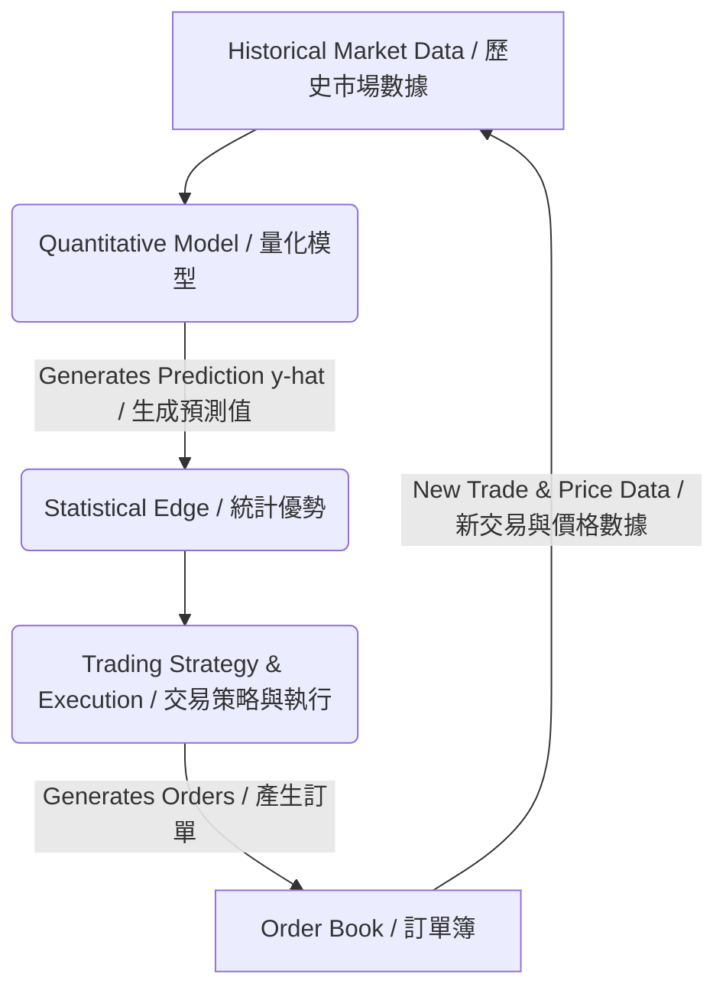
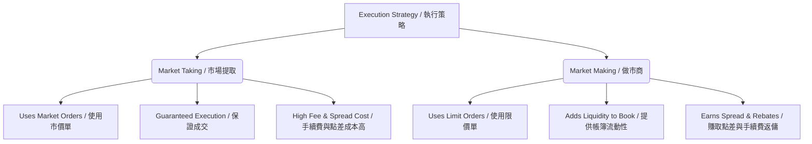
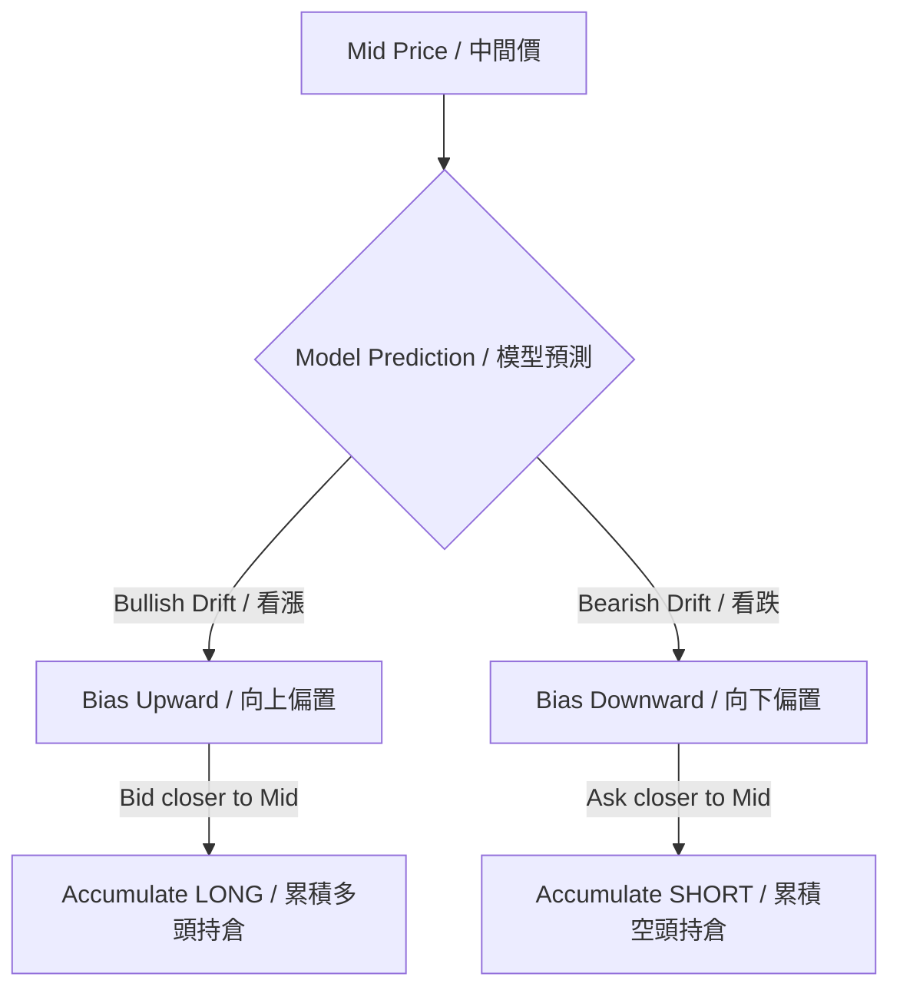

# Foundations of Quantitative Trading: Models, Strategies, and Execution
# 量化交易基礎：模型、策略與執行

---

## Table of Contents / 目錄
1. [Introduction & Defining Quantitative Trading / 引言與量化交易定義](#1-introduction--defining-quantitative-trading--引言與量化交易定義)
2. [The Quantitative Model (Inputs & Outputs) / 量化模型：輸入與輸出](#2-the-quantitative-model-inputs--outputs--量化模型輸入與輸出)
3. [Model Complexity & Overfitting (Occam's Razor) / 模型複雜度與過擬合奧卡姆剃刀](#3-model-complexity--overfitting-occams-razor--模型複雜度與過擬合奧卡姆剃刀)
4. [Time Series Data Input / 時間序列數據輸入](#4-time-series-data-input--時間序列數據輸入)
5. [The Separation of Model and Strategy (Execution) / 模型與策略的分離執行](#5-the-separation-of-model-and-strategy-execution--模型與策略的分離執行)
6. [Core Skills 1: Econometrics / 核心技能一：計量經濟學](#6-core-skills-1-econometrics--核心技能一計量經濟學)
7. [Core Skills 2: Machine Learning / 核心技能二：機器學習](#7-core-skills-2-machine-learning--核心技能二機器學習)
8. [Core Skills 3: Programming & Systems Reliability / 核心技能三：程式設計與系統可靠性](#8-core-skills-3-programming--systems-reliability--核心技能三程式設計與系統可靠性)
9. [Core Skills 4: Mathematics / 核心技能四：數學](#9-core-skills-4-mathematics--核心技能四數學)
10. [Quantifying the Statistical Edge (Expected Value - EV) / 量化統計優勢：期望值](#10-quantifying-the-statistical-edge-expected-value---ev--量化統計優勢期望值)
11. [Quantifying Risk-Adjusted Returns (The Sharpe Ratio) / 量化風險調整收益：夏普比率](#11-quantifying-risk-adjusted-returns-the-sharpe-ratio--量化風險調整收益夏普比率)
12. [Simple Returns vs. Log Returns / 簡單收益率與對數收益率](#12-simple-returns-vs-log-returns--簡單收益率與對數收益率)
13. [Time Series Types: Regular vs. Irregular / 時間序列類型：規則與不規則](#13-time-series-types-regular-vs-irregular--時間序列類型規則與不規則)
14. [Auto-Regression (The AR(1) Model) / 自回歸：AR(1) 模型](#14-auto-regression-the-ar1-model--自回歸ar1-模型)
15. [Modeling Mean Reversion (Negative Weights) / 均值回歸建模：負權重](#15-modeling-mean-reversion-negative-weights--均值回歸建模負權重)
16. [Modeling Momentum (Positive Weights) / 動量趨勢建模：正權重](#16-modeling-momentum-positive-weights--動量趨勢建模正權重)
17. [Mathematical Optimization: Closed-Form vs. Gradient Descent / 數學優化：解析解與梯度下降](#17-mathematical-optimization-closed-form-vs-gradient-descent--數學優化解析解與梯度下降)
18. [Order Book Fundamentals & Market Microstructure / 訂單簿基礎與市場微觀結構](#18-order-book-fundamentals--market-microstructure--訂單簿基礎與市場微觀結構)
19. [Trading Execution Strategies: Market Taking vs. Market Making / 交易執行策略：市場提取者與做市商](#19-trading-execution-strategies-market-taking-vs-market-making--交易執行策略市場提取者與做市商)

---

## 1. Introduction & Defining Quantitative Trading / 引言與量化交易定義

### English
Quantitative trading is the systematic process of creating a mathematical or statistical edge and executing it with high discipline to generate risk-adjusted returns [1]. At its core, it requires a dual-focus system: finding an "edge" (alpha generation) and executing that edge flawlessly in the marketplace. While the statistical edge can be derived from classical mathematical and statistical models, modern quantitative trading heavily leverages machine learning to discover patterns within historical market data. It must be emphasized that strategy execution is equally as important as the model itself; an incredible mathematical edge can easily be rendered unprofitable by poor execution, latency, or improper risk controls [1].

### 繁體中文
量化交易是一個系統化的過程，旨在建立數學或統計學優勢（Edge），並以高度紀律執行該優勢，以產生風險調整後的收益（Risk-adjusted returns）[1]。其核心系統包含雙重焦點：尋找「優勢」（阿爾法生成）以及在市場中完美無瑕地執行該優勢。雖然統計優勢可以源自傳統的數學和統計模型，但現代量化交易高度利用機器學習來發現歷史市場數據中的模式。必須強調的是，策略執行與模型本身同樣重要；即使擁有極佳的數學優勢，也可能因糟糕的執行、延遲或不當的風險控制而導致虧損 [1]。



---

## 2. The Quantitative Model (Inputs & Outputs) / 量化模型：輸入與輸出

### English
At the heart of any quantitative trading system lies the quantitative model (often powered by machine learning) [1]. This model acts as a function taking inputs to predict outputs:
* **Input ($x$)**: Denoted as features, representing the current and historical information available to the model (such as lagged returns, volume, order book imbalance, or macro indicators) [2].
* **Output ($\hat{y}$)**: Denoted as the target, representing the prediction of a future financial quantity [2].

Quant models are broadly divided into two types:
1. **Regression Models**: These models predict a continuous, real-valued number [2]. Common targets include:
   - **Future price** or **price difference (price delta, $\Delta P$)** [2].
   - **Future returns ($R_t$)**: Returns are preferred over raw price because they are percentage-based and unitless, allowing quants to easily compare and generalize models across multiple different assets [2].
2. **Classification Models**: These models classify predictions into distinct discrete categories (e.g., predicting whether the price will go "Up" or "Down" over a specified horizon) [2]. They typically output the class along with an associated probability (e.g., predicting a $75\%$ probability of an upward movement) [2].

### 繁體中文
任何量化交易系統的核心都是量化模型（通常由機器學習驅動）[1]。此模型扮演一個函數，接收輸入並預測輸出：
* **輸入 ($x$)**：被稱為特徵（Features），代表模型可獲得的當前和歷史資訊（例如滯後收益率、交易量、訂單簿失衡或宏觀指標）[2]。
* **輸出 ($\hat{y}$)**：被稱為目標（Target），代表對未來金融數值的預測 [2]。

量化模型大致分為兩類：
1. **回歸模型（Regression Models）**：預測連續的實數值 [2]。常見的目標 include：
   - **未來價格**或**價格變動（價格差，$\Delta P$）** [2]。
   - **未來收益率 ($R_t$)**：收益率比原始價格更受青睞，因為它們是基於百分比且無單位的（Unitless），這使量化分析師能夠輕鬆地在多個不同資產之間比較和推廣模型 [2]。
2. **分類模型（Classification Models）**：將預測分類為不同的離散類別（例如，預測價格在特定時間窗口內將「上漲」還是「下跌」）[2]。它們通常會輸出類別及相關的機率值（例如，預測上漲機率為 $75\%$）[2]。

---

## 3. Model Complexity & Overfitting (Occam's Razor) / 模型複雜度與過擬合：奧卡姆剃刀

### English
When building models, we face a fundamental trade-off regarding feature selection. Adding more features into the model increases complexity, which introduces a severe risk of **overfitting to noise** [3]. Overfit models look outstanding on historical training data but fail to generalize to live, unseen market environments. 
Under **Occam's Razor**, quants prefer simpler models with fewer parameters over complex ones [3]. For example:
* **Univariate Models**: Models utilizing only one input feature [2]. They are simple, robust, highly interpretable, and less prone to overfitting noise [3].
* **Neural Networks (Multi-Output Models)**: Neural networks are highly flexible and can capture non-linearities and generate multiple outputs (e.g., predicting returns across multiple horizons or instruments simultaneously) [3]. However, they are like "driving a Ferrari"—extremely powerful but incredibly easy to crash if handled without deep expertise [3]. They easily overfit to market noise unless meticulously regularized and managed [3].

### 繁體中文
在建立模型時，我們在特徵選擇上面臨著根本性的權衡。向模型中添加更多特徵會增加複雜性，從而引入**對雜訊過擬合**（Overfitting to noise）的嚴重風險 [3]。過擬合的模型在歷史訓練數據上表現出色，但無法推廣到未知的實盤市場環境中。
根據**奧卡姆剃刀**（Occam's Razor）原則，量化分析師更傾向於選擇參數較少、簡單的模型，而非複雜的模型 [3]。例如：
* **單變量模型（Univariate Models）**：僅使用一個輸入特徵的模型 [2]。它們簡單、健壯、具備高度可解釋性，且不易對雜訊產生過擬合 [3]。
* **神經網絡（多輸出模型）**：神經網絡高度靈活，可以捕捉非線性關係並生成多個輸出（例如同時預測多個時間視角或多個交易工具的收益率）[3]。然而，它們就像「駕駛法拉利」——極其強大，但如果缺乏深厚專業知識，則極易發生車禍（崩潰）[3]。除非經過極其細緻的正規化和管理，否則它們極易對市場雜訊產生過擬合 [3]。

---

## 4. Time Series Data Input / 時間序列數據輸入

### English
The inputs to a quantitative trading model are typically structured as time series data—a collection of values ordered chronologically over time [4]. The core assumption is that past values of a time series hold predictive information about its future values. 
A time series model uses historical data points (denoted as lags) to forecast a future point (denoted by $\hat{y}$) [4, 15]. Depending on design, a model might look back at $n$ historical periods ($x_{t-1}, x_{t-2}, \dots, x_{t-n}$) or focus exclusively on the most recent known lag ($x_{t-1}$) to keep parameter complexity minimized and robustness maximized [4].

### 繁體中文
量化交易模型的輸入通常結構化為時間序列數據（Time series data）——即按時間先後順序排列的數值集合 [4]。其核心假設是：時間序列的過去數值包含對其未來數值的預測資訊。
時間序列模型使用歷史數據點（在計量經濟學中稱為滯後項 Lags）來預測未來數據點（記為 $\hat{y}$）[4, 15]。根據設計，模型可以回溯 $n$ 個歷史時期（$x_{t-1}, x_{t-2}, \dots, x_{t-n}$），或僅專注於最近的一個已知滯後項（$x_{t-1}$），以將參數複雜度降至最低並將健壯性最大化 [4]。

---

## 5. The Separation of Model and Strategy (Execution) / 模型與策略的分離：執行

### English
A critical structural paradigm in quant trading is the separation of the **Model** and the **Strategy**:
* **The Model**: Generates the statistical edge (prediction $\hat{y}$) [4]. It does not make money on its own; it simply outputs raw forecasts [4].
* **The Strategy**: Executes the edge [4]. It takes the model's predictions and translates them into actual market orders [4].

A useful analogy is **card counting in Blackjack** [4]. A card counting system gives you a statistical edge over the casino [4]. However, if you execute poorly—such as betting your entire bankroll on the very first hand and losing—you will go bankrupt [4]. The edge was real, but poor execution wiped it out [4]. 
In trading, execution details are vital [4]. This includes minimizing latency to secure better order book queue positions, avoiding trading on stale prices, and managing transaction costs [4].

### 繁體中文
量化交易中一個關鍵的結構性範式是**模型**（Model）與**策略**（Strategy）的分離：
* **模型**：生成統計優勢（預測值 $\hat{y}$）[4]。它本身不賺錢，只是輸出原始的預測值 [4]。
* **策略**：執行該優勢 [4]。它接收模型的預測並將其轉化為實際的市場訂單 [4]。

一個有用的類比是**21點（Blackjack）中的算牌** [4]。算牌系統能提供相對於賭場的統計優勢 [4]。然而，如果你執行不當——例如在第一手牌就押上全部資金並輸掉——你就會破產 [4]。優勢是真實存在的，但糟糕的執行摧毀了一切 [4]。
在交易中，執行細節至關重要 [4]。這包括將延遲降至最低以獲得更好的訂單簿排隊位置、避免基於過時價格進行交易以及管理交易成本 [4]。

---

## 6. Core Skills 1: Econometrics / 核心技能一：計量經濟學

### English
Econometrics provides a foundational mathematical and statistical framework for analyzing time-varying financial data [5]. It helps practitioners identify underlying trends, seasonal patterns, and structural relationships in time series data [5]. Key econometric concepts include:
* **Auto-regression (AR)**: How past values of a time series influence and predict future values [5].
* **Non-stationarity**: Financial time series typically exhibit changing means and variances over time, meaning they are non-stationary and difficult to model using stationary assumptions [5].
* **Co-integration**: Explores how two or more non-stationary time series (e.g., pairs of correlated stocks) move together in a stable, long-term predictable relationship [5].

*Limitation*: While classical econometrics offers rich vocabulary and rigorous statistical testing, its models often scale poorly to massive datasets and rely on rigid linear assumptions about the data [6].

### 繁體中文
計量經濟學（Econometrics）為分析隨時間變化的金融數據提供了基礎的數學和統計學框架 [5]。它幫助從業者識別時間序列數據中的潛在趨勢、季節性模式和結構性關係 [5]。關鍵的計量經濟學概念包括：
* **自回歸（Auto-regression, AR）**：時間序列的過去數值如何影響和預測未來數值 [5]。
* **非平穩性（Non-stationarity）**：金融時間序列的均值和方差通常隨時間而變化，這意味著它們是非平穩的，難以用平穩性假設進行建模 [5]。
* **協整（Co-integration）**：探討兩個或多個非平穩時間序列（例如一對相關的股票）如何以穩定、長期的可預測關係共同移動 [5]。

*局限性*：雖然經典計量經濟學提供了豐富的詞彙和嚴格的統計檢驗，但其模型通常難以擴展至海量數據集，並且高度依賴對數據的嚴格線性假設 [6]。

---

## 7. Core Skills 2: Machine Learning / 核心技能二：機器學習

### English
Machine learning (ML) has revolutionized quantitative trading by learning statistical patterns directly from historical data without requiring modelers to write explicit, complex hand-coded mathematical formulas [6]. For analogy, traditional weather forecasting relied on intricate thermodynamic equations, whereas modern systems use machine learning to discover superior predictive patterns directly from historical climate data [6].
Machine learning offers two major advantages:
1. **Scalability**: ML algorithms scale efficiently to huge, high-frequency datasets, such as sub-second limit order book data [6].
2. **Flexibility**: ML models make few or no rigid assumptions about the underlying distribution of data [6]. They allow modelers to easily tweak parameters, swap feature sets, and optimize for custom performance metrics [6].

### 繁體中文
機器學習（Machine Learning, ML）徹底改變了量化交易，它直接從歷史數據中學習統計模式，而無需建模者編寫顯式、複雜的人工數學公式 [6]。類比來說，傳統天氣預報依賴於複雜的熱力學方程，而現代系統則使用機器學習直接從歷史氣候數據中發現更優的預測規律 [6]。
機器學習提供了兩個主要優勢：
1. **可擴展性（Scalability）**：機器學習算法能高效擴展至龐大的高頻數據集，例如微秒級的限價訂單簿（Limit Order Book）數據 [6]。
2. **靈活性（Flexibility）**：機器學習模型對數據的底層分佈幾乎不作僵化的假設 [6]。它們允許建模者輕鬆調整參數、更換特徵集，並針對自定義性能指標進行優化 [6]。

---

## 8. Core Skills 3: Programming & Systems Reliability / 核心技能三：程式設計與系統可靠性

### English
Writing robust code is a key competitive advantage in quantitative trading, granting quants complete control over backtesting, execution, and strategy deployment [7]. 
* **Latency-Sensitive Programming**: Operating at millisecond or microsecond horizons requires deep knowledge of machine code, CPU caching, memory allocation, operating systems, and networking stacks (TCP/IP, UDP) [7].
* **24/7 Systems Reliability**: In production, systems must run automatically 24/7 [7]. They must handle hardware failures, exchange connectivity disconnects, API changes, and unexpected exceptions without performance degradation or critical state loss [7]. Reliability is just as critical as raw execution speed [7].
* **Scalable Research API**: To avoid duplicating code for every new strategy, quants develop standardized, scalable APIs to streamline backtesting, parameter optimization, and live deployment [7].

### 繁體中文
編寫健壯的程式碼是量化交易中的一項關鍵競爭優勢，使量化分析師能夠完全控制回測、執行和策略部署 [7]。
* **延遲敏感型程式設計（Latency-Sensitive Programming）**：在毫秒或微秒級的時間尺度上運行，需要對機器碼、CPU 緩存、內存分配、操作系統和網絡協議棧（TCP/IP、UDP）有深入的瞭解 [7]。
* **24/7 系統可靠性**：在實盤生產環境中，系統必須 24 小時不間斷地自動運行 [7]。它們必須能夠在不降低性能或丟失關鍵狀態的情況下，處理硬件故障、交易所連接中斷、API 變更和未預期的異常 [7]。系統可靠性與原始執行速度同樣重要 [7]。
* **可擴展的研究 API**：為了避免為每個新策略重複編寫程式碼，量化分析師會開發標準化、可擴展的 API，以簡化回測、參數優化和實盤部署流程 [7]。

---

## 9. Core Skills 4: Mathematics / 核心技能四：數學

### English
Success as a quant trader does not require winning math olympiads, but it demands strong **mathematical reasoning** [7, 8]. Mathematical reasoning enables quants to think logically about markets, debug algorithmic edge cases, and interpret model parameters [8]. Under the hood, three core mathematical disciplines form the bedrock:
1. **Linear Algebra**: Matrix operations, eigenvectors, and dimensionality reduction, critical for multi-asset modeling and linear solvers [8].
2. **Multivariable Calculus**: Partial derivatives and gradient calculations, which are the engine of mathematical optimization and parameter fitting [8].
3. **Probability & Statistics**: Probability distributions, hypothesis testing, correlation, variance, and expected value calculations, which are used to measure uncertainty and manage risk [8].

### 繁體中文
成為成功的量化交易員不需要贏得數學奧林匹克競賽，但它需要強大的**數學推理能力**（Mathematical reasoning）[7, 8]。數學推理能力使量化分析師能夠邏輯性地思考市場、偵錯算法的極端情況並理解模型參數 [8]。在底層，有三門核心數學學科構成了基石：
1. **線性代數（Linear Algebra）**：矩陣運算、特徵向量和降維，這對於多資產建模和線性求解器至關重要 [8]。
2. **多元微積分（Multivariable Calculus）**：偏導數和梯度計算，這是數學優化和參數擬合的引擎 [8]。
3. **機率與統計（Probability & Statistics）**：機率分佈、假設檢驗、相關性、方差和期望值計算，用於衡量不確定性和管理風險 [8]。

---

## 10. Quantifying the Statistical Edge (Expected Value - EV) / 量化統計優勢：期望值

### English
To evaluate if a trading strategy is mathematically viable, we calculate its **Expected Value ($EV$)** [8]. The Expected Value tells us, on average, how much net P&L we can expect per trade over the long run [8]. Net P&L represents profit after deducting all transaction costs, execution slippage, and borrow fees [8].
The formula for Expected Value is:

$$EV = E[X] = \sum_{i} P(x_i) \cdot x_i$$

Where $P(x_i)$ is the probability of outcome $i$, and $x_i$ is the P&L value of outcome $i$ [8, 9].

#### Coin-Toss Game 1 (High Win Rate, Negative Expected Value) [9, 10]
* Win Probability ($P_{\text{win}}$): $55\%$ ($0.55$)
* Win Reward ($x_{\text{win}}$): $+\$1.00$
* Loss Probability ($P_{\text{loss}}$): $45\%$ ($0.45$)
* Loss Penalty ($x_{\text{loss}}$): $-\$1.25$

$$EV = (0.55 \times \$1.00) + (0.45 \times -\$1.25)$$
$$EV = \$0.55 - \$0.5625 = -\$0.0125 \text{ (or } -1.25\text{ cents)}$$

*Lesson*: Even though the win rate is high ($55\%$), the expected value is negative [9, 10]. Over time, playing this game will cause you to bleed money [10]. Do not focus solely on win rate [10].

#### Coin-Toss Game 2 (Low Win Rate, Positive Expected Value) [10, 11]
* Win Probability ($P_{\text{win}}$): $25\%$ ($0.25$)
* Win Reward ($x_{\text{win}}$): $+\$3.50$
* Loss Probability ($P_{\text{loss}}$): $75\%$ ($0.75$)
* Loss Penalty ($x_{\text{loss}}$): $-\$1.00$

$$EV = (0.25 \times \$3.50) + (0.75 \times -\$1.00)$$
$$EV = \$0.875 - \$0.75 = +\$0.125 \text{ (or } +12.5\text{ cents)}$$

*Lesson*: This game has a low win rate ($25\%$) but a positive expected value [10, 11]. This is highly indicative of trend-following quant strategies: a tiny positive edge processed over a high volume of trades yields significant, stable compound returns [11].

### 繁體中文
為了評估交易策略在數學上是否可行，我們計算其**期望值（Expected Value, EV）** [8]。期望值告訴我們，長期來看，平均每筆交易可以期望獲得多少淨損益（Net P&L）[8]。淨損益是指扣除所有交易手續費、執行滑點和融資成本後的利潤 [8]。
期望值公式為：

$$EV = E[X] = \sum_{i} P(x_i) \cdot x_i$$

其中 $P(x_i)$ 是結果 $i$ 出現的機率，$x_i$ 是結果 $i$ 的損益值 [8, 9]。

#### 硬幣遊戲一（高勝率，負期望值）[9, 10]
* 獲勝機率 ($P_{\text{win}}$)：$55\%$ ($0.55$)
* 獲勝收益 ($x_{\text{win}}$)：$+\$1.00$
* 失敗機率 ($P_{\text{loss}}$)：$45\%$ ($0.45$)
* 失敗懲罰 ($x_{\text{loss}}$)：$-\$1.25$

$$EV = (0.55 \times \$1.00) + (0.45 \times -\$1.25)$$
$$EV = \$0.55 - \$0.5625 = -\$0.0125 \text{（即 } -1.25 \text{ 美分）}$$

*啟示*：即使勝率很高（$55\%$），期望值卻是負的 [9, 10]。隨著時間推移，玩這個遊戲會讓你持續失血（虧損）[10]。千萬不要只關注勝率 [10]。

#### 硬幣遊戲二（低勝率，正期望值）[10, 11]
* 獲勝機率 ($P_{\text{win}}$)：$25\%$ ($0.25$)
* 獲勝收益 ($x_{\text{win}}$)：$+\$3.50$
* 失敗機率 ($P_{\text{loss}}$)：$75\%$ ($0.75$)
* 失敗懲罰 ($x_{\text{loss}}$)：$-\$1.00$

$$EV = (0.25 \times \$3.50) + (0.75 \times -\$1.00)$$
$$EV = \$0.875 - \$0.75 = +\$0.125 \text{（即 } +12.5 \text> 美分）}$$

*啟示*：該遊戲勝率較低（$25\%$），但具有正期望值 [10, 11]。這非常符合趨勢跟踪等量化策略的特點：通過大量交易來執行微小但具有正期望值的優勢，能產生可觀且穩定的複利收益 [11]。

---

## 11. Quantifying Risk-Adjusted Returns (The Sharpe Ratio) / 量化風險調整收益：夏普比率

### English
To measure the quality of our expected returns relative to the fluctuations we experience, we look at risk-adjusted returns [11]. Returns are trivial to measure, but risk is quantified using the **standard deviation of returns ($\sigma$)**, which measures the variance and stability of the strategy's P&L curve [11]. High stability of returns minimizes the severity and probability of large drawdowns [11].
The standard **Sharpe Ratio** is defined as:

$$\text{Sharpe Ratio} = \frac{E[R_p] - R_f}{\sigma_p}$$

Where $E[R_p]$ is expected portfolio returns, $R_f$ is the risk-free rate, and $\sigma_p$ is the standard deviation of portfolio returns.
However, because most quantitative trading strategies are **intraday** (holding positions for minutes or hours), the risk-free rate ($R_f$) term is omitted since positions are not held long enough to factor in interest accruals [12]. Thus, the intraday formula simplifies to:

$$\text{Intraday Sharpe} = \frac{E[R_p]}{\sigma_p}$$

#### Why Quants Prioritize High Sharpe Ratios:
1. **Leverage Safety**: Leverage multiplies both profits and losses [12]. With a low Sharpe ratio, using leverage easily leads to liquidations or catastrophic drawdowns during volatile periods [12]. A high Sharpe ratio indicates highly stable returns, allowing quants to safely apply leverage to scale up raw profits [12, 13].
2. **Smooth Equity Curve**: As the Sharpe ratio increases, the cumulative equity curve smooths out [12]. At double-digit Sharpe ratios (common in elite HFT intraday systems), the equity curve visually approaches a straight line [12, 13].

### 繁體中文
為了解衡期望收益相對於策略波動的品質，我們著眼於風險調整後的收益 [11]。衡量收益非常簡單，但風險通常使用**收益率的標準差（$\sigma$）**來量化，標準差衡量了策略損益曲線的變動幅度和穩定性 [11]。收益的高度穩定性能夠最大程度地降低重大資金回撤（Drawdowns）的幅度和機率 [11]。
標準的**夏普比率（Sharpe Ratio）**定義為：

$$\text{Sharpe Ratio} = \frac{E[R_p] - R_f}{\sigma_p}$$

其中 $E[R_p]$ 是組合預期收益率，$R_f$ 是無風險利率，$\sigma_p$ 是組合收益率的標準差。
然而，由於大多數量化交易策略都是**日內交易**（持倉時間僅數分鐘或數小時），無風險利率（$R_f$）項通常會被省略，因為持倉時間太短，無法實質產生利息計息 [12]。因此，日內夏普比率簡化為：

$$\text{日內夏普比率} = \frac{E[R_p]}{\sigma_p}$$

#### 為什麼量化分析師優先考慮高夏普比率：
1. **槓桿安全性**：槓桿會成倍放大收益與虧損 [12]。在夏普比率較低的情況下，使用槓桿極易在市場波動期導致強制平倉（爆倉）或災難性的資金回撤 [12]。高夏普比率代表收益高度穩定，使量化分析師能夠安全地使用槓桿來放大原始利潤 [12, 13]。
2. **平滑的權益曲線（Equity Curve）**：隨著夏普比率的提高，累計損益曲線會變得越來越平滑 [12]。在雙位數夏普比率下（這在頂尖的高頻日內交易系統中很常見），權益曲線在視覺上幾乎呈現一條直線 [12, 13]。

---

## 12. Simple Returns vs. Log Returns / 簡單收益率與對數收益率

### English
Quant models rely heavily on statistical symmetry and mathematical tractability.
* **Simple Returns**: Calculated as:
  
  $$R_{\text{simple}} = \frac{P_t - P_{t-1}}{P_{t-1}}$$

  *Limitation*: Simple returns are **asymmetric** [13, 14]. For example, if an asset increases by $\$20$ (from $\$100$ to $\$120$), the simple return is $+20\%$ [14]. If it then drops by $\$20$ (from $\$120$ to $\$100$), the simple return is $-16.67\%$ [14]. This asymmetry creates distortions when fed into machine learning models.
* **Log Returns**: Calculated as the natural logarithm of the price ratio:
  
  $$r_t = \ln\left(\frac{P_t}{P_{t-1}}\right) = \ln(P_t) - \ln(P_{t-1})$$

  *Advantages*:
  1. **Symmetry**: In our example, an increase from $\$100$ to $\$120$ yields a log return of $+18.23\%$, while a decrease from $\$120$ to $\$100$ yields exactly $-18.23\%$ [14].
  2. **Time Additivity**: Compound log returns over $N$ periods can be calculated by simply summing the individual single-period log returns [14]:
     
     $$\sum_{t=1}^N \ln\left(\frac{P_t}{P_{t-1}}\right) = \ln\left(\frac{P_N}{P_0}\right)$$

### 繁體中文
量化模型高度依賴統計對稱性和數學易處理性。
* **簡單收益率（Simple Returns）**：計算公式為：
  
  $$R_{\text{simple}} = \frac{P_t - P_{t-1}}{P_{t-1}}$$

  *局限性*：簡單收益率具有**不對稱性** [13, 14]。例如，如果資產價格上漲 $\$20$（從 $\$100$ 漲到 $\$120$），簡單收益率為 $+20\%$ [14]。若價格隨後下跌 $\$20$（從 $\$120$ 跌回 $\$100$），簡單收益率卻是 $-16.67\%$ [14]。這種不對稱性在輸入給機器學習模型時會造成扭曲。
* **對數收益率（Log Returns）**：計算公式為價格比例的自然對數：
  
  $$r_t = \ln\left(\frac{P_t}{P_{t-1}}\right) = \ln(P_t) - \ln(P_{t-1})$$

  *優勢*：
  1. **對稱性**：在上述例子中，價格從 $\$100$ 上漲到 $\$120$ 的對數收益率為 $+18.23\%$，而從 $\$120$ 下跌到 $\$100$ 的對數收益率剛好也是 $-18.23\%$ [14]。這與機器學習模型非常契合，且更容易進行邏輯推理 [14]。
  2. **時間可加性（Time Additivity）**：可以通過簡單地將各個單期的對數收益率相加，來計算多個時期的複合對數收益率 [14]：
     
     $$\sum_{t=1}^N \ln\left(\frac{P_t}{P_{t-1}}\right) = \ln\left(\frac{P_N}{P_0}\right)$$

---

## 13. Time Series Types: Regular vs. Irregular / 時間序列類型：規則與不規則

### English
Time series in financial markets are categorized into two structural forms:
1. **Regular Time Series**: Data points are sampled at fixed, evenly spaced intervals (fixed time delta, $\Delta t$), such as hourly or daily bars [15]. Predicting the next data point means predicting the value at the very next scheduled time step [15].
2. **Irregular Time Series**: In high-frequency trading (HFT), market events (trades, order updates) arrive at irregular, arbitrary time intervals [15]. Instead of hourly blocks, the data is processed event-by-event, known as **tick-by-tick** data [15]. Here, the model aims to predict the future state at the next "tick" rather than at a fixed calendar duration [15].

### 繁體中文
金融市場中的時間序列可分為兩種結構形式：
1. **規則時間序列（Regular Time Series）**：在固定且均勻的時間間隔（固定時間增量 $\Delta t$）內採樣的數據點，例如每小時或每日的 K 線 [15]。預測下一個數據點意味著預測下一個固定時間步長的值 [15]。
2. **不規則時間序列（Irregular Time Series）**：在高頻交易（HFT）中，市場事件（交易、訂單更新）是在不規則且任意的時間間隔內到達的 [15]。數據不再按小時區塊處理，而是按事件逐個處理，稱為**逐筆（Tick-by-tick）**數據 [15]。在這種設定下，模型的預測目標是「下一個 Tick（數據點）」的未來狀態，而非固定的日曆時間長度 [15]。

---

## 14. Auto-Regression (The AR(1) Model) / 自回歸：AR(1) 模型

### English
**Auto-regression** is the modeling technique of predicting future values of a time series based on its own past historical values, which are called **lags** in econometrics [15, 16]. 
An intuitive analogy is **Large Language Models (like ChatGPT)** [15, 16]. LLMs are essentially massive auto-regressive models that predict the "next word" by looking back at the sequence of previous words they have already generated [15, 16]. 
In financial modeling, the simplest auto-regressive setup is the **AR(1) model**, which predicts the next return using only the single most recent known lag ($x_{t-1}$) as the feature [16, 17]:

$$\hat{y}_t = w \cdot x_{t-1} + b$$

Where $w$ is the model parameter weight and $b$ is the bias [16]. Due to its simplicity (only two parameters), the AR(1) model is highly interpretable, generalizes exceptionally well in noisy trading environments, and can execute predictions in a mere 3 to 5 CPU cycles, which is highly advantageous for low-latency execution [16, 17].

### 繁體中文
**自回歸（Auto-regression）**是一種建模技術，利用時間序列自身的歷史過去數值（在計量經濟學中稱為滯後項 Lags）來預測未來的數值 [15, 16]。
一個直觀的類比是**大型語言模型（如 ChatGPT）** [15, 16]。LLM 本質上是龐大的自回歸模型，它們通過回溯已生成的先前單詞序列，來預測「下一個單詞」[15, 16]。
在金融建模中，最簡單的自回歸設定是 **AR(1) 模型**，它僅使用最近的一個已知滯後項 ($x_{t-1}$) 作為特徵來預測下一個收益率 [16, 17]：

$$\hat{y}_t = w \cdot x_{t-1} + b$$

其中 $w$ 是模型的權重參數，$b$ 是偏置 [16]。由於其極度簡潔（僅兩個參數），AR(1) 模型具備極高的可解釋性、在充滿雜訊的交易環境中泛化能力極佳，並且僅需 3 到 5 個 CPU 週期即可完成一次預測，這對於低延遲交易非常有利 [16, 17]。

---

## 15. Modeling Mean Reversion (Negative Weights) / 均值回歸建模：負權重

### English
**Mean Reversion** is the statistical phenomenon where asset prices tend to fluctuate and pull back toward a central average or baseline over time (often summarized as "what goes up must come down, and what goes down must come up") [17]. It is highly prevalent at very short time horizons like seconds and minutes [18].
In our AR(1) linear model:

$$\hat{y}_t = w \cdot x_{t-1} + b$$

To capture mean reversion, the optimized weight must be **negative ($w < 0$)** [18]. 
* If the previous return $x_{t-1}$ is positive, multiplying by a negative $w$ generates a negative prediction ($\hat{y}_t$), indicating an expected downward reversal [18].
* If the previous return $x_{t-1}$ is negative, the negative weight flips the sign to generate a positive prediction ($\hat{y}_t$), indicating an expected upward bounce [18].

The negative weight acts like a **rubber band**; as price stretches away from the mean, the negative weight pulls it back [19].

### 繁體中文
**均值回歸（Mean Reversion）**是指資產價格隨時間推移傾向於圍繞某一中心均值或基準線波動並向其拉回的統計現象（通常概括為「漲多必跌，跌多必漲」） [17]。這在極短的時間尺度（如秒級和分鐘級）上非常普遍 [18]。
在我們的 AR(1) 線性模型中：

$$\hat{y}_t = w \cdot x_{t-1} + b$$

要捕捉均值回歸行為，經優化後的權重必須是**負數 ($w < 0$)** [18].
* 如果前一次的收益率 $x_{t-1}$ 為正，乘以負權重 $w$ 將生成負的預測值 ($\hat{y}_t$)，表明預期會向下回調 [18]。
* 如果前一次的收益率 $x_{t-1}$ 為負，負權重會將符號反轉，生成正的預測值 ($\hat{y}_t$)，表明預期會向上反彈 [18]。

負權重的作用就像一根**橡皮筋**；當價格遠離均值時，負權重會將其拉回均值 [19]。

---

## 16. Modeling Momentum (Positive Weights) / 動量趨勢建模：正權重

### English
**Momentum** (or trend following) is the financial phenomenon where asset prices exhibit directional persistence (often summarized as "what goes up stays up, and what goes down stays down") [19]. Momentum is highly prevalent at medium to longer-term time horizons and is heavily studied in academic and institutional research [20].
In our AR(1) linear model:

$$\hat{y}_t = w \cdot x_{t-1} + b$$

To capture momentum, the optimized weight must be **positive ($w > 0$)** [20].
* If the current return $x_{t-1}$ is positive, multiplying by a positive weight maintains the positive sign, predicting continuation of the upward trend [20].
* If the current return $x_{t-1}$ is negative, the positive weight maintains the negative sign, predicting continuation of the downward trend [20].

Thus, a positive weight reinforces and follows the existing direction [20].

### 繁體中文
**動量（Momentum，或稱趨勢跟踪）**是指資產價格表現出方向持續性的金融現象（通常概括為「上漲的會持續上漲，下跌的會持續下跌」） [19]。動量在中等至較長的時間跨度上非常普遍，是學術和機構研究最廣泛的課題之一 [20]。
在我們的 AR(1) 線性模型中：

$$\hat{y}_t = w \cdot x_{t-1} + b$$

要捕捉動量行為，經優化後的權重必須是**正數 ($w > 0$)** [20]。
* 如果當前收益率 $x_{t-1}$ 為正，乘以正權重將保持正號，預測上漲趨勢將會延續 [20]。
* 如果當前收益率 $x_{t-1}$ 為負，正權重會保持負號，預測下跌趨勢將會延續 [20]。

因此，正權重起到了強化並順應現有方向的作用 [20]。

---

## 17. Mathematical Optimization: Closed-Form vs. Gradient Descent / 數學優化：解析解與梯度下降

### English
To identify the optimal parameters ($w$ and $b$) that capture mean reversion or momentum, we apply mathematical optimization [21]. There are two primary paradigms:

#### 1. Closed-Form Analytical Solution (Ordinary Least Squares - OLS) [21, 22]
This approach solves for the parameters mathematically in a single, exact algebraic step [21]. It is the default solver behind classical econometrics and Python packages like `scikit-learn`'s `LinearRegression` [21, 22].
* *Pros*: Quick, exact, and calculated in one line of code [21, 22].
* *Cons*: **Does not scale well to massive high-frequency datasets** [22]. When dealing with daily gigabytes or terabytes of tick data, storing and performing massive matrix inversions ($(X^T X)^{-1}$) becomes computationally prohibitive and memory inefficient [22].

$$\hat{\beta} = (X^T X)^{-1} X^T Y$$

#### 2. Gradient Descent (Iterative Optimization) [21, 23]
An iterative machine learning approach that processes data in small, manageable batches over multiple loops, progressively shifting the weights toward the optimal parameters [21, 23].
At each step, we update the weights using the update rule:

$$w \leftarrow w - \eta \cdot \frac{\partial L}{\partial w}$$

Where $L$ represents the loss function (e.g., Mean Squared Error - MSE), $\frac{\partial L}{\partial w}$ is the partial derivative of the loss with respect to the weight (gradient/slope), and $\eta$ is the **learning rate** hyperparameter controlling step size [23, 24].
* **Convex Loss Functions**: Functions with a single global minimum (like MSE) [24]. Gradient descent calculates the slope and steps in the opposite direction, reliably converging to the unique optimal solution [24].
* **Non-Convex Loss Functions**: Custom loss functions used in proprietary trading models often contain multiple local minima and saddle points [24]. While finding the absolute global minimum is mathematically impossible, algorithms like Stochastic Gradient Descent (SGD) or momentum help escape poor local minima to find highly generalized parameters [24].

### 繁體中文
為了找出最能捕捉均值回歸或動量特徵的最佳參數 ($w$ 和 $b$)，我們需要進行數學優化 [21]。主要有兩種方法：

#### 1. 解析解（Closed-Form Solution，又稱普通最小二乘法 - OLS）[21, 22]
該方法在單個、精確的代數步驟中直接求解出最佳參數 [21]。它是經典計量經濟學以及 Python 工具庫（如 `scikit-learn` 的 `LinearRegression`）底層默認的求解方式 [21, 22]。
* *優點*：快速、精確，只需一行程式碼即可求解 [21, 22]。
* *缺點*：**無法有效擴展至海量高頻數據集** [22]。當面對每日數十 GB 或 TB 級別的逐筆數據時，在內存中加載並執行龐大的矩陣求逆運算 ($(X^T X)^{-1}$) 在計算上會變得極其昂貴且低效 [22]。

$$\hat{\beta} = (X^T X)^{-1} X^T Y$$

#### 2. 梯度下降（Gradient Descent，迭代優化）[21, 23]
這是一種迭代式的機器學習方法，通過多個循環（Epochs）分批次處理數據，逐步將權重調整至最佳參數狀態 [21, 23]。
在每一步中，我們使用以下更新規則：

$$w \leftarrow w - \eta \cdot \frac{\partial L}{\partial w}$$

其中 $L$ 代表損失函數（例如均方誤差 - MSE），$\frac{\partial L}{\partial w}$ 是損失函數對權重的偏導數（即梯度/斜率），$\eta$ 是控制步長的超參數**學習率（Learning rate）** [23, 24]。
* **凸損失函數（Convex Loss Functions）**：具有唯一全局最小值（例如 MSE）的函數 [24]。梯度下降算法計算斜率並向相反方向邁出一步，從而穩定收斂到唯一的最佳解 [24]。
* **非凸損失函數（Non-Convex Loss Functions）**：私募量化模型中使用的自定義損失函數通常包含多個局部最小值（Local minima）和鞍點（Saddle points） [24]。雖然在數學上不可能找到絕對的全局最小值，但隨機梯度下降（SGD）或動量法（Momentum）等技術有助於擺脫糟糕的局部最小值，以找到泛化能力強的參數 [24]。

---

## 18. Order Book Fundamentals & Market Microstructure / 訂單簿基礎與市場微觀結構

### English
The **Order Book** is the live matching engine representing the real-time supply and demand for an asset [26]. 
* **Structure**: Composed of two sides: **Bids** (buy orders, green) and **Asks** (sell/offer orders, red) organized by price levels [26]. Level 1 represents the Best Bid (highest price a buyer will pay) and the Best Ask (lowest price a seller will accept) [26].
* **The Spread**: The gap between the Best Ask and the Best Bid [27]:
  
  $$\text{Spread} = \text{Best Ask} - \text{Best Bid}$$

  Less liquid markets have wider spreads; highly liquid markets have narrow spreads [27]. The spread represents a major transaction cost for market-taking strategies [27].
* **Mid Price**: The average of Best Bid and Best Ask [28]:
  
  $$\text{Mid Price} = \frac{\text{Best Ask} + \text{Best Bid}}{2}$$

  Quants model the Mid Price because using raw "Last Trade Prices" introduces artificial variance known as the **bid-ask bounce** (where trades jump back and forth between bid and ask levels) [28, 29].
* **Slippage & Walking the Book**: When a market order exceeds the size available at Level 1, the remaining portion of the order is matched against deeper price levels, incurring "slippage" and physically shifting the Mid Price [29, 30].

```
ASK LEVEL 2: $116 (7 contracts)
ASK LEVEL 1: $115 (3 contracts)  <-- Best Ask
================================ SPREAD: $2.00 (Mid Price: $114)
BID LEVEL 1: $113 (5 contracts)  <-- Best Bid
BID LEVEL 2: $112 (8 contracts)
```

### 繁體中文
**訂單簿（Order Book）**是代表資產即時供需關係的撮合引擎 [26]。
* **結構**：由兩側組成：**買單（Bids，綠色）**與**賣單（Asks，紅色）**，按價格檔位（Levels）組織 [26]。第一檔（Level 1）代表最佳買價（Best Bid，買方願意支付的最高價格）和最佳賣價（Best Ask，賣方願意接受的最低價格） [26]。
* **點差（Spread，或稱價差）**：最佳賣價與最佳買價之間的差值 [27]：
  
  $$\text{Spread} = \text{Best Ask} - \text{Best Bid}$$

  流動性較差的市場點差較寬；流動性極佳的市場點差極窄 [27]。點差構成了市場提取者策略的主要交易成本 [27]。
* **中間價（Mid Price）**：最佳買價與最佳賣價的平均值 [28]：
  
  $$\text{Mid Price} = \frac{\text{Best Ask} + \text{Best Bid}}{2}$$

  量化分析師更偏好對中間價進行建模，因為使用原始的「最新成交價（Last Trade Prices）」會引入名為**買賣價跳動（Bid-ask bounce）**的虛假方差（成交價在買入價和賣出價之間來回跳動） [28, 29]。
* **滑點與掃簿（Slippage & Walking the Book）**：當市價單的數量超過了 Level 1 可用的數量時，訂單剩餘部分將被迫在更深價格檔位成交，這會產生「滑點」並在物理上推動中間價發生移動 [29, 30]。

---

## 19. Trading Execution Strategies: Market Taking vs. Market Making / 交易執行策略：市場提取者與做市商

### English
Quant execution is divided into two primary execution methodologies:



#### 1. Market Taking (Liquidity Taker) [25, 26, 30]
Uses market orders to aggressively cross the spread for guaranteed fill [26, 30]. Due to paying the spread and higher taker fees, this strategy is rarely viable at second or minute horizons and is typically deployed for multi-hour, daily, or weekly holding periods [25, 26, 30].
Quants design market taking across two vectors:
* **Timing**:
  - *Time-based Timing*: Opening and closing trades on fixed intervals (e.g., hourly), aligning with regular time series [31]. Frequency scaling allows quants to make multiple overlapping bets to exploit small edges [32, 33].
  - *Predicate-based Timing*: Trading only when specific conditional thresholds (predicates) are met (e.g., only going long if predicted return $\ge 1\%$, or classifier probability $\ge 60\%$), filtering out noise to boost Expected Value [31, 34].
* **Sizing**:
  - *Constant Sizing*: Trading a fixed capital amount on every signal [35].
  - *Piecewise Linear (Hard Tanh)*: Sizing scaled proportionally to prediction strength, clipped at absolute upper and lower limits to manage risk [36].
    
    $$\text{Size} = \text{Max Size} \times \text{hard\_tanh}(\hat{y})$$
    
  - *Nonlinear Sizing (Tanh)*: Uses hyperbolic tangent to achieve smooth, differentiable scaling of size based on prediction confidence [37].
    
    $$\text{Size} = \text{Max Size} \times \tanh(\hat{y})$$

#### 2. Market Making (Liquidity Provider) [25, 26, 38]
Adds limit orders on both sides of the book, aiming to buy at the Best Bid and sell at the Best Ask, pocketing the spread as profit [26, 38]. They benefit from extremely low fees or maker rebates but face **adverse selection** (getting filled on the bid just as prices collapse) [25, 38, 39].
To combat adverse selection, market makers use **Quote Biasing (Skewing)** [39]:
* If the model predicts the mid price will rise, the quants **bias quotes upward** [39, 40]. The bid is shifted closer to the mid price (increasing probability of a long fill) and the ask is placed further away, aligning inventory with the upward drift [39, 40].
* If the model predicts the mid price will fall, they **bias quotes downward**, skewing fills toward the short side [40].



### 繁體中文
量化執行主要分為兩種執行方法學：

#### 1. 市場提取者（Market Taking，流動性提取者）[25, 26, 30]
使用市價單主動跨越點差以保證成交 [26, 30]。由於需要支付點差和較高的提取者手續費（Taker fees），這種策略在秒級或分鐘級的極短時間尺度上很少能盈利，通常部署在數小時、每日或每週的持倉週期上 [25, 26, 30]。
量化分析師在兩個維度上設計提取者策略：
* **定時（Timing）**：
  - *基於時間的定時（Time-based Timing）*：在固定間隔（如每小時）開倉和平倉，這與規則時間序列自然匹配 [31]。頻率縮放（Frequency scaling）允許量化分析師進行多個重疊的下注，以充分利用微小的優勢 [32, 33]。
  - *基於謂詞的定時（Predicate-based Timing）*：僅在滿足特定條件閾值（謂詞）時才進行交易（例如，僅在預測回報率 $\ge 1\%$ 或分類器機率 $\ge 60\%$ 時才做多），過濾掉弱信號雜訊以提高期望值 [31, 34]。
* **倉位調整（Sizing）**：
  - *常數倉位（Constant Sizing）*：對每個信號都交易固定的資金量 [35]。
  - *分段線性（Hard Tanh）*：交易規模與預測強度成比例縮放，但在絕對上限和下限處截斷，以控制風險 [36]。
    
    $$\text{倉位} = \text{最大倉位} \times \text{hard\_tanh}(\hat{y})$$
    
  - *非線性倉位（Tanh）*：使用雙曲正切函數，根據預測信心實現平滑、可微的倉位縮放 [37]。
    
    $$\text{倉位} = \text{最大倉位} \times \tanh(\hat{y})$$

#### 2. 做市商（Market Making，流動性提供者）[25, 26, 38]
在訂單簿兩側掛上限價單，旨在最佳買價買入並在最佳賣價賣出，將點差作為利潤收入囊中 [26, 38]。做市商受益於極低的手續費或掛單返傭（Maker rebates），但面臨著**逆向選擇（Adverse selection）**風險（例如在價格即將崩盤時被成交買單） [25, 38, 39]。
為對抗逆向選擇，做市商使用**報價偏置/偏斜（Quote Biasing / Skewing）** [39]：
* 如果模型預測中間價將上漲，量化分析師會**向上偏置報價** [39, 40]。買單掛價會被移近中間價（增加多頭成交機率），賣單掛價會被移遠，從而使庫存暴露與預期的上漲趨勢相匹配 [39, 40]。
* 如果模型預測中間價將下跌，他們會**向下偏置報價**，使成交傾向於空頭一側 [40]。
